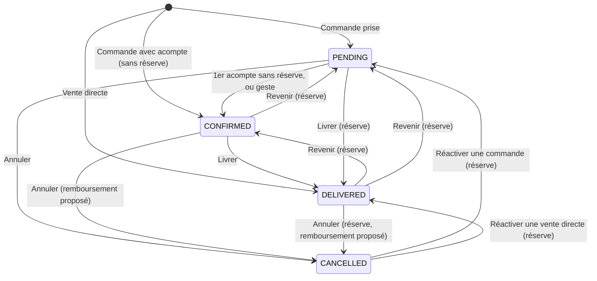
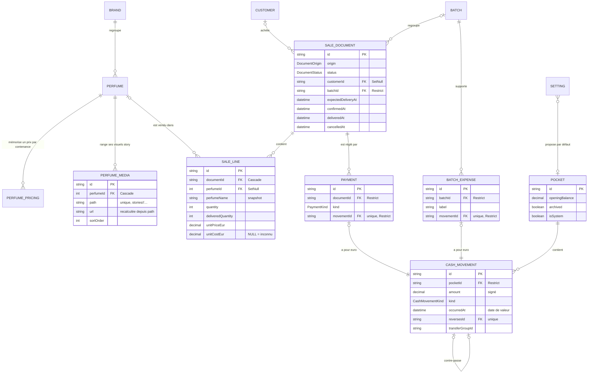

# 03 — Modèle de données

**Date : 17 septembre 2026.**

**But du document.** Arbitrer le modèle de données de la refonte de « Nuréa Gestion » (PWA admin iOS de Nuréa Parfums) entre trois propositions concurrentes, puis le décrire entièrement : MCD (entités, relations, cardinalités), MLD (le `schema.prisma` cible complet), règles d'intégrité et d'écriture, définitions canoniques des chiffres en SQL, compatibilité avec la vitrine, stratégie de migration des données réelles et liste de ce qui disparaît. Ce document est autoportant : un exécutant qui n'a jamais vu ce repo peut implémenter le schéma, les contraintes et le script de reprise sans autre source.

**Docs amont** : `docs/refonte/00-README.md` (cadre, invariants), `docs/refonte/01-AUDIT-EXISTANT.md` (carte fonctionnelle §3, bugs §4, modèle §4.8, calculs §4.9, contrat vitrine §5), `docs/refonte/02-VISION-PRODUIT.md` (décision structurante §4, périmètre v1, nouveautés N1–N11 §5, vocabulaire §6), `prisma/schema.prisma` (schéma actuel).
**Docs aval** : `04-ARCHITECTURE.md` (modules d'écriture, transactions, garde), `06-ECRANS-PARCOURS.md` (gestes qui s'appuient sur ce modèle), `07-PLAN-EXECUTION.md` (jalons de bascule, exécution du script de reprise).

**Écart intégré le 17/09/2026.** Ce document a d'abord été écrit sur l'ancien `main` local (`47aaad4`) ; la production tournait déjà sur `origin/main` (`9e0b5d8`), qui porte trois migrations de plus, appliquées en production le 10/09/2026 : `20260910120000_real_volumes_10_50_80` (contenances réelles **10 / 50 / 80 ml**, 30 → 10 et 100 → 80 traduits, défaut 80 ; rattrapage de `Order.deliveredAt`), `20260910140000_perfume_media` (table **`PerfumeMedia`** des visuels story) et `20260910160000_fix_delivered_at_backfill` (la date rattrapée était la date PRÉVUE). Elles sont intégrées : dossiers ajoutés avant l'expand, `PerfumeMedia` au MCD (§2) et au MLD (§3), règle de contenance 10/50/80 partout (§3, §4.9, §7.7), `PerfumeMedia` conservée en place à la reprise (§7.4, V5 et V11 de §7.8), date de livraison reprise sans jamais lire la date prévue (§7.7). Inventaire complet de l'écart : 01 §3.11.

**Directive qui gouverne l'arbitrage** : la priorité n°1 du client est la **praticité** — le modèle doit rendre l'app simple à utiliser *et* simple à faire évoluer, pas élégant sur le papier ; la migration des données réelles doit être sûre. La sécurité est secondaire (02 §7).

**Conventions de lecture.** Les noms d'entités et de colonnes sont en anglais (comme l'existant et le code) ; les libellés d'écran sont en français (fixés en 06). Les chiffres s'écrivent **Encaissé / À encaisser / Marge nette / Trésorerie**, sans synonyme.

---

## 1. Décision et justification

### 1.1 La décision

> **Retenu : une synthèse « un document, un euro ».**
> 1. **Un seul document de vente** (`SaleDocument`) et une seule table de lignes (`SaleLine`) — commande et vente directe sont le même objet à des moments différents (décision structurante de 02 §4, reprise de la proposition 1).
> 2. **L'euro n'est écrit qu'une fois, dans `CashMovement`** (montant signé, date de valeur, poche). Un paiement client (`Payment`) et une dépense de lot (`BatchExpense`) sont des **pièces** reliées 1–1 à leur mouvement : elles disent *pourquoi* l'argent a bougé, jamais *combien* ni *quand* (idée centrale de la proposition 2, sans sa table polymorphe).
> 3. **Rien de ce qui a touché une poche ne se modifie ni ne se supprime** : on contre-passe (`reversesId`). Garanti en base par trigger, pas par discipline.
> 4. **Aucun montant dérivable n'est stocké** : total, coût, payé, dû, « soldé » se lisent dans une vue SQL unique (`DocumentBalance`).
> 5. **Migration en place, pas en copie** : trois tables neuves (`SaleDocument`, `SaleLine`, `Payment`) plus `Setting` ; tout le reste (`Brand`, `Perfume`, `Customer`, `Batch`, `Pocket`, `CashMovement`, `BatchExpense`…) est modifié sur place avec ses identifiants (méthode de la proposition 3). Les soldes de poches et les dûs affichés au gérant la veille sont **identiques au centime** le lendemain, vérifié par assertions bloquantes.

### 1.2 Tableau comparatif des trois angles

| Critère | P1 « Unification » | P2 « Ledger central » | P3 « Évolution minimale » | **Synthèse retenue** |
|---|---|---|---|---|
| **Simplicité d'usage** (ce que le modèle permet à l'écran) | Très bonne : un document, « Reçu maintenant », lot et client conservés de bout en bout. Mais aucune trace de l'origine (vente directe vs commande livrée) : les listes doivent la deviner. | Bonne : mêmes gains que P1. Corriger un paiement coûte deux gestes ; commandes et ventes sont des filtres à définir sans marqueur. | Moyenne : la finalisation commande → vente (une copie) demeure, deux listes, deux fiches, deux formulaires qui se ressemblent. | **Très bonne** : P1 + origine explicite du document + gestes « Annuler / Corriger » en une transaction + coût inconnu signalé au lieu d'un 0 trompeur. |
| **Robustesse argent** | Bonne : 1 paiement ⇔ 1 mouvement. Faiblesses : montant et date écrits **deux fois** (paiement et mouvement) ; suppression en cascade document → paiements → mouvements (l'historique d'argent peut disparaître) ; statut `SETTLED` stocké (dérivée matérialisée). | Très bonne sur le principe (une ligne = un euro, append-only, `Restrict`). Faiblesse : une table polymorphe à 7 natures dont les règles vivent en CHECK par type ; toute nouvelle nature d'argent alourdit la table centrale. | Moyenne : paiements sans mouvement tolérés (reprise), paiements « re-parentés » d'un document à l'autre, garde anti-double-comptage `sale: null` toujours nécessaire partout. | **Très bonne** : montant/date/poche écrits une seule fois ; pièces typées ; écriture seule garantie par trigger ; cohérence pièce ↔ mouvement vérifiée au COMMIT ; suppression physique impossible dès qu'un euro existe. |
| **Coût de migration** | Élevé : toutes les tables gestion recréées, fusion des paires commande+vente. | **Le plus élevé** : tout renommé et reconstruit (Poche, Lot, Client…) — un modèle très proche de la « gestion v2 » abandonnée (`20260831210000_gestion_v2` : Ecriture, Ligne, Commande, Lot, Poche, DepenseLot). | Faible : colonnes ajoutées, liens posés, rien de recopié en masse. | **Moyen** : 3 tables neuves alimentées depuis 5 anciennes ; le reste en place, identifiants conservés (les FK existantes restent valides), une seule transaction de reprise. |
| **Évolutivité** | Bonne. | Moyenne : table centrale polymorphe, noms français et anglais mêlés au code existant. | Faible : chaque évolution d'un « document » se fait deux fois (Order et Sale). | **Bonne** : ajouter une nouvelle raison de bouger de l'argent = une nouvelle pièce 1–1 sur `CashMovement`, sans toucher aux autres ; les chiffres ne changent pas de formule. |

### 1.3 Ce que la synthèse prend et refuse à chaque proposition

**De P1 (Unification) — pris** : le document unique et sa machine d'états (philosophie `canTransition` de l'existant : « on n'interdit que ce qui casse les données, le reste se confirme ») ; la vente directe « née livrée » ; le ledger de paiements à natures `DEPOSIT / BALANCE / REFUND` ; les FK dures ; le principe « la Trésorerie affichée la veille est la référence du gérant ». **Refusé** : `SETTLED` stocké (le « soldé » se dérive : dû = 0) ; la cascade `Document → Payment → CashMovement` (elle efface de l'argent) ; le double enregistrement du montant et de la date ; le nom de modèle `Document`, qui masque le type global `Document` du DOM dans tout fichier TypeScript qui l'importe (d'où `SaleDocument`).

**De P2 (Ledger central) — pris** : « un euro qui bouge = une ligne » ; l'écriture seule ; `Restrict` qui fait refuser par Postgres la suppression d'un document payé ; les assertions bloquantes de fin de migration ; la ventilation des preuves de Trésorerie document par document ; « stock 0 → non suivi » à la reprise. **Refusé** : la table polymorphe unique ; le renommage de tout le modèle ; l'écriture d'ouverture qui remplacerait `Pocket.openingBalance` (02 §6 définit la Trésorerie par « solde d'ouverture + mouvements ») ; la disparition de la pièce « dépense ».

**De P3 (Évolution minimale) — pris** : la migration en place avec identifiants conservés ; la requalification des mouvements orphelins en `ADJUSTMENT` qui **laisse l'argent dans sa poche** ; l'adoption du drift `SaleItem.note` ; la relation explicite remboursement → paiement annulé. **Refusé** : la dualité `Order`/`Sale` (contraire à 02 §4) ; la finalisation par copie ; les paiements sans mouvement ; les snapshots en `Json`.

### 1.4 Ce que le modèle rend simple à l'écran

| Tâche terrain (02 §2) | Ce que le modèle apporte |
|---|---|
| Vendre et encaisser (n°1) | Un document né `DELIVERED` + ses paiements « Reçu maintenant » (N1) dans la même transaction ; poche proposée par `Setting.defaultPocketId` (N2) ; nature du paiement fixée par le serveur, jamais demandée. |
| Encaisser une créance (n°2) | Un seul dû, une seule vue (`DocumentBalance`), un seul geste pour tout document. |
| Prendre une commande (n°3), payer une commande (n°5) | Même formulaire, même ligne, même paiement que la vente ; le lot se choisit dès la création (N9) et ne se perd plus. |
| Suivre une livraison (n°4) | `deliveredQuantity` par ligne, modifiée en place (plus jamais remise à zéro) ; le stock suit le delta. |
| Consulter le dû d'un client (n°6) | FK client toujours propagée ; ardoise = même vue filtrée par client (N5, N6). |
| Suivre un lot (n°8) | Rattachement conservé à travers les états ; dépenses datables ; montants identiques partout. |
| Faire le bilan (n°9) | Récap de journée (N4) entièrement dérivé : Encaissé du jour, documents du jour, livraisons de demain, créances. |
| Corriger une erreur | « Annuler ce paiement », « Corriger », « Supprimer la dépense », « Annuler le transfert » : une contre-passation datée comme l'original, la période redevient juste. |

### 1.5 Pourquoi ce modèle réussira là où la « gestion v2 » a échoué

La v2 (01 §4.8) créait six tables françaises alimentées par **copie** sur une branche jamais fusionnée, sans plan de bascule ni vérification — puis a été retirée (`20260901120000_retire_gestion_v2`). Ici : trois tables neuves seulement ; tout le reste évolue en place ; la reprise est **une transaction unique** qui se termine par des assertions bloquantes (ROLLBACK intégral au moindre écart) ; elle est répétée à blanc sur une copie de la base et son rapport est relu avec le gérant avant la vraie bascule ; les anciennes tables sont conservées 30 jours dans un schéma `legacy` ; la vitrine n'est exposée à aucune fenêtre de rupture (§6.3).

---

## 2. MCD — entités, relations, cardinalités

### 2.1 Entités

**Catalogue — partagé avec la vitrine (contrat 01 §5)**

| Entité | Rôle |
|---|---|
| `Brand` | Marque : mode « Sélection » (`CURATED`) ou « Gamme complète » (`COMPLETE`), statut de publication, logo bi-thème, `slug` public stable. |
| `Perfume` | Parfum du catalogue : visuel bi-thème, mise en avant, statut, stock (`NULL` = non suivi). |
| `PerfumePricing` | Mémoire de saisie par (parfum, contenance 10 / 50 / 80 ml) : prix, coût DZD, taux. Pré-remplit les lignes. |
| `PerfumeMedia` | Visuel story d'un parfum (planche 9:16 prête à publier) : chemin dans le bucket (décidé par le serveur), URL, dimensions, poids, ordre. Rangé sur la fiche parfum, **jamais lu par la vitrine** ; `Perfume.image` reste seul juge de la publication. Table née en production le 10/09/2026, conservée telle quelle. |

**Gestion**

| Entité | Rôle |
|---|---|
| `Customer` | Fiche client (téléphone E.164 unique, Snapchat, WhatsApp, adresse, notes). |
| `SaleDocument` | **Le** document de vente : commande (née `PENDING`, ou `CONFIRMED` avec acompte) ou vente directe (née `DELIVERED`). Aucun montant stocké. |
| `SaleLine` | Ligne d'un document, avec snapshot typé complet (nom, marque, image, volume, prix, coût DZD, taux, coût €, don) et quantité livrée. |
| `Payment` | Pièce d'un paiement client (nature, moyen, note) pour un document. Son euro est son mouvement. |
| `Batch` | Lot fournisseur (envoi) : regroupe documents et dépenses. |
| `BatchExpense` | Pièce d'une dépense de lot (libellé, notes). Son euro est son mouvement. |
| `Pocket` | Poche de Trésorerie (espèces, banque, avance fournisseur, « Non attribué »). Solde jamais stocké. |
| `CashMovement` | **L'euro** : tout argent qui entre, sort ou change de poche. Montant signé, date de valeur, poche, contre-passation éventuelle. Écriture seule. |
| `Setting` | Réglages (singleton) : taux DZD par défaut, poche proposée par défaut. |
| `AdminUser` | Compte de connexion (mono-opérateur, sans rôle), compteur d'échecs persistant. |

**Vue SQL (pas une table)** : `DocumentBalance` — total, coût, payé, dû de chaque document (§5.1).

### 2.2 Relations, cardinalités et suppression

| Relation | Cardinalité | `onDelete` | Pourquoi |
|---|---|---|---|
| `Brand` → `Perfume` | 1 — 0..N | Cascade | Règle métier existante conservée (02 §4.5) ; l'historique est protégé par les snapshots des lignes. |
| `Perfume` → `PerfumePricing` | 1 — 0..3 | Cascade | Mémoire de saisie, sans valeur historique. |
| `Perfume` → `PerfumeMedia` | 1 — 0..24 | Cascade | Un visuel story n'a pas de sens sans son parfum. Les **objets du bucket** ne suivent pas la cascade : le module catalogue lit leurs chemins avant la suppression et les retire **après le commit** (04 §12). Plafond de 24 par parfum : règle serveur. |
| `Perfume` → `SaleLine` | 0..1 — 0..N | SetNull | La ligne garde son snapshot : supprimer un parfum ne rend plus l'historique illisible. |
| `Customer` → `SaleDocument` | 0..1 — 0..N | SetNull | L'historique survit à la fiche ; le nom reste en snapshot. |
| `Batch` → `SaleDocument` | 0..1 — 0..N | **Restrict** | Un lot qui porte des documents ne disparaît pas (02 §4.4). |
| `Batch` → `BatchExpense` | 1 — 0..N | **Restrict** | Idem avec les dépenses. |
| `SaleDocument` → `SaleLine` | 1 — 0..N | Cascade | Ne joue que pour un document sans aucun paiement (seul supprimable). Un document peut n'avoir aucune ligne (réserve « aucun article » du domaine). |
| `SaleDocument` → `Payment` | 1 — 0..N | **Restrict** | Un document payé ne se supprime pas : il s'annule. |
| `Payment` → `CashMovement` | 1 — 1 (un mouvement porte 0..1 paiement) | **Restrict** | L'euro d'un paiement, obligatoire et unique. |
| `BatchExpense` → `CashMovement` | 1 — 1 (un mouvement porte 0..1 dépense) | **Restrict** | L'euro d'une dépense, obligatoire et unique. |
| `Pocket` → `CashMovement` | 1 — 0..N | **Restrict** | L'argent n'est jamais détruit ; une poche utilisée s'archive (à solde nul). |
| `CashMovement` → `CashMovement` (`reverses`) | 0..1 — 0..1 | Restrict | Un mouvement se contre-passe au plus une fois. |
| `Setting` → `Pocket` (`defaultPocket`) | 0..N — 0..1 | SetNull | Poche proposée ; à défaut, « Non attribué ». |
| `AdminUser` | isolée | — | Plus de lien d'attribution (mono-opérateur). |

### 2.3 Cycle de vie d'un document



Règles (le domaine pur `canTransition` de l'existant est conservé, états renommés `READY → CONFIRMED`) :

- **Toutes** les transitions du diagramme sont permises, et elles seules ; certaines portent une réserve à confirmer. Une transition automatique (confirmation au premier acompte) ne s'applique que sur un verdict **sans** réserve. Pour une commande, les six transitions entre `PENDING`, `CONFIRMED` et `DELIVERED` sont toutes ouvertes (dont `DELIVERED → PENDING`, que le contrôle segmenté « En attente · Confirmée · Livrée » de 06 S01 rend accessible d'un tap) ; depuis `CANCELLED`, la seule sortie est « Réactiver », vers `PENDING` pour une commande. Implémentation : `src/domain/document-status.ts` (`canTransition`, `assertTransition`, `timestampsAfter`).
- **Une vente directe (`DIRECT_SALE`) ne connaît que `DELIVERED` et `CANCELLED`** : annulée, elle se réactive **directement en `DELIVERED`** (réserve) — `deliveredQuantity := quantity`, stock re-décrémenté (avec la réserve de stock du §4.7), `confirmedAt` et `deliveredAt` reposés à l'instant de la réactivation, `cancelledAt` effacé. `CANCELLED → PENDING` est réservé aux commandes (`ORDER`). Raison : une vente directe n'apparaît pas dans « Commandes » et n'a pas de contrôle de statut (06 S01) ; en `PENDING`, elle serait hors de tous les chiffres et hors de tout écran capable de la faire avancer.
- **« Soldé » n'est pas un statut** : c'est `due = 0` dans `DocumentBalance`. Un remboursement ne fait donc jamais « reculer » un statut.
- **Entrer en `DELIVERED`** complète les quantités livrées de chaque ligne (`deliveredQuantity := quantity`) ; en sortir ne touche pas aux quantités.
- **Défaire un changement d'état** (filet « Annuler » de 5 s qui suit un geste, 06 §4.3) n'est pas une transition « Revenir » : c'est l'écriture T4b (§4.3), sans réserve, qui rétablit **exactement** l'état d'avant le geste — statut, `confirmedAt`, `deliveredAt`, quantités livrées de chaque ligne (donc le stock) — et, si le geste avait encaissé, contre-passe ses paiements (T8). Sans elle, défaire une livraison laisserait « Livré 3/3 » et le stock décrémenté sur une commande revenue « Confirmée ».
- **Annuler** remet les quantités livrées à 0 (stock restitué) et propose le remboursement des paiements nets ; le document reste consultable, replié.
- **Origine** : `ORDER` ⇒ né `PENDING` ou `CONFIRMED` ; `DIRECT_SALE` ⇒ né `DELIVERED`. L'origine ne change jamais et n'entre dans **aucun** calcul d'argent : elle ne sert qu'aux listes (« Commandes » n'affiche pas les ventes directes), aux libellés et aux transitions permises (règle ci-dessus). C'est ce qui évite de deviner l'origine sans réintroduire deux modèles.
- **Horodatages d'événement**, posés par les seules fonctions de transition (T1, T4, T4b, T5), cohérents avec le statut par CHECK : `confirmedAt` (engagement), `deliveredAt`, `cancelledAt`.

### 2.4 Diagramme



---

## 3. MLD — `schema.prisma` cible complet

Ce fichier remplace intégralement `prisma/schema.prisma` à la fin de la bascule (§7). Il cible Prisma 6.19 et PostgreSQL ≥ 15 (Supabase).

```prisma
// ─────────────────────────────────────────────────────────────────────────────
// Nuréa Parfums — schéma cible de la refonte « Nuréa Gestion »
// Référence : docs/refonte/03-MODELE-DONNEES.md (17 septembre 2026)
//
// Ce que Prisma ne sait pas exprimer vit dans les migrations SQL écrites à la main
// (doc 03 §4.9, §4.10, §5.1) :
//   - les CHECK (signes, bornes, volumes, cohérence statut/horodatages) ;
//   - l'index unique partiel de la poche système ;
//   - les triggers « écriture seule » et « pièce ↔ mouvement » ;
//   - la vue DocumentBalance et les fonctions de période Europe/Paris.
// Argent : Decimal(10,2) (euros et dinars) ; taux : Decimal(10,4) ; dates : timestamptz.
// ─────────────────────────────────────────────────────────────────────────────

generator client {
  provider = "prisma-client-js"
}

datasource db {
  provider  = "postgresql"
  url       = env("DATABASE_URL")
  directUrl = env("DIRECT_URL")
}

// ═════════════════════════════ Catalogue (lu par la vitrine) ═════════════════

/// Statut de publication vitrine, commun à Brand et Perfume (un seul enum).
enum PublicationStatus {
  /// Masqué : jamais lu par la vitrine.
  DRAFT
  /// Visible sur la vitrine (si les autres règles de visibilité le permettent).
  PUBLISHED
}

/// Mode d'une marque sur la vitrine.
enum BrandCatalogMode {
  /// Sélection : seuls ses parfums publiés apparaissent.
  CURATED
  /// Gamme complète : une carte unique synthétisée depuis le logo de la marque.
  COMPLETE
}

model Brand {
  id          String            @id @default(cuid())
  name        String            @unique
  /// Valeur publique du filtre vitrine `?maison=`. Fixée à la création, JAMAIS régénérée au renommage.
  slug        String            @unique
  catalogMode BrandCatalogMode  @default(CURATED)
  /// CHECK brand_complete_logo_ck : une marque COMPLETE ne peut être PUBLISHED sans logo.
  status      PublicationStatus @default(PUBLISHED)
  /// Logo principal (thème sombre, WebP, proportions d'origine).
  image       String?
  /// Variante du logo pour le thème clair (optionnelle).
  imageLight  String?
  createdAt   DateTime          @default(now()) @db.Timestamptz(3)
  updatedAt   DateTime          @updatedAt @db.Timestamptz(3)
  perfumes    Perfume[]

  @@index([status])
}

model Perfume {
  /// Identifiant entier lu par la vitrine. Séquence Postgres (plus jamais max(id)+1).
  id         Int               @id @default(autoincrement())
  brandId    String
  brand      Brand             @relation(fields: [brandId], references: [id], onDelete: Cascade)
  name       String
  /// Visuel principal (thème sombre, WebP). Chaîne vide = sans visuel ⇒ CHECK : status = DRAFT.
  image      String
  /// Variante du visuel pour le thème clair (optionnelle).
  imageLight String?
  /// Mise en avant vitrine : 2 au plus, et seulement un parfum PUBLISHED (règle serveur du module catalogue).
  isFeatured Boolean           @default(false)
  /// Unités en stock, tous volumes confondus. NULL = non suivi (jamais d'alerte) ; 0 = rupture. CHECK >= 0.
  /// Deux écritures seulement : réglage absolu (geste dédié) et delta des quantités livrées (§4.7).
  stock      Int?
  status     PublicationStatus @default(PUBLISHED)
  createdAt  DateTime          @default(now()) @db.Timestamptz(3)
  updatedAt  DateTime          @updatedAt @db.Timestamptz(3)
  lines      SaleLine[]
  pricings   PerfumePricing[]
  /// Visuels story (galerie de la fiche parfum), distincts de image / imageLight.
  media      PerfumeMedia[]

  @@unique([brandId, name])
  @@index([status])
  @@index([brandId])
  @@index([status, brandId])
}

/// Mémoire de saisie par (parfum, volume) : pré-remplit prix, coût et taux d'une nouvelle ligne.
/// Préférence, jamais source d'un chiffre. Apprend à chaque ligne non offerte (N8) et depuis la fiche parfum.
model PerfumePricing {
  perfumeId           Int
  /// Contenance du flacon en ml. CHECK ∈ (10, 50, 80) — contenances réelles (30 → 10 et 100 → 80 traduits en production le 10/09/2026).
  volumeMl            Int
  /// Dernier prix de vente retenu (€).
  defaultUnitPriceEur Decimal  @db.Decimal(10, 2)
  /// Dernier coût d'achat unitaire retenu (DZD).
  defaultUnitCostDzd  Decimal? @db.Decimal(10, 2)
  /// Dernier taux DZD par euro retenu.
  defaultExchangeRate Decimal? @db.Decimal(10, 4)
  updatedAt           DateTime @updatedAt @db.Timestamptz(3)
  perfume             Perfume  @relation(fields: [perfumeId], references: [id], onDelete: Cascade)

  @@id([perfumeId, volumeMl])
}

/// Visuel story d'un parfum (planche 9:16 prête à publier) : rangé sur la fiche parfum, récupéré par le partage natif.
/// Jamais lu par la vitrine ; `Perfume.image` reste seul juge de la publication. Né en production le 10/09/2026
/// (`20260910140000_perfume_media`), conservé tel quel par la refonte (reste dans `public`, jamais dans `legacy`).
model PerfumeMedia {
  id        String   @id @default(cuid())
  perfumeId Int
  /// Cascade : les lignes suivent le parfum ; les objets du bucket sont retirés par le module catalogue APRÈS le commit.
  perfume   Perfume  @relation(fields: [perfumeId], references: [id], onDelete: Cascade)
  /// Chemin DANS le bucket, décidé par le serveur : exactement `stories/<perfumeId>/<horodatage>-<aléa>.<ext>`.
  /// Seule clé de suppression de l'objet : jamais reçu tel quel du client.
  path      String   @unique
  /// URL publique, recalculée par le serveur depuis `path` (jamais reçue du client).
  url       String
  /// Libellé libre (« Story 9:16 », « Fond clair »…). Optionnel.
  label     String?
  /// Dimensions en pixels et poids en octets du fichier déposé (plafonné à 1920 px, jamais recadré).
  width     Int
  height    Int
  bytes     Int
  /// Ordre dans la galerie, le plus petit d'abord ; calculé par le serveur (jamais reçu du client).
  sortOrder Int      @default(0)
  createdAt DateTime @default(now()) @db.Timestamptz(3)

  @@index([perfumeId, sortOrder])
}

// ═════════════════════════════ Clients ═══════════════════════════════════════

model Customer {
  id           String         @id @default(cuid())
  fullName     String
  /// Téléphone E.164 (+33612345678), normalisé à la saisie depuis les formats français. Unique.
  phoneE164    String?        @unique
  snapchat     String?
  /// WhatsApp E.164 (contact sortant du gérant ; cherché comme le téléphone).
  whatsappE164 String?
  address      String?
  notes        String?
  createdAt    DateTime       @default(now()) @db.Timestamptz(3)
  updatedAt    DateTime       @updatedAt @db.Timestamptz(3)
  documents    SaleDocument[]

  @@index([fullName])
}

// ═════════════════════════════ Documents de vente ════════════════════════════

/// Comment un document est né. Fixé à la création, jamais modifié, jamais lu par un calcul d'argent.
enum DocumentOrigin {
  /// Pris depuis les Commandes : naît PENDING (ou CONFIRMED avec un acompte sans réserve).
  ORDER
  /// Saisi depuis Vendre : naît DELIVERED.
  DIRECT_SALE
}

/// Cycle de vie d'un document. « Soldé » n'est PAS un statut : c'est due = 0 dans la vue DocumentBalance.
enum DocumentStatus {
  /// En attente : commande notée sans engagement. Ni créance, ni coût compté.
  PENDING
  /// Confirmée (libellé d'écran fixé en 06) : engagée — son coût et son dû comptent.
  CONFIRMED
  /// Livrée : tout a été remis au client.
  DELIVERED
  /// Annulée : hors de tous les chiffres, sauf ses paiements qui restent dans l'Encaissé.
  CANCELLED
}

/// LE document de vente : une commande ou une vente directe, du premier geste au dernier encaissement.
/// Ne stocke AUCUN montant : total, coût, payé et dû se lisent dans la vue SQL DocumentBalance (§5.1).
model SaleDocument {
  /// Identifiant texte fourni par le client à la création (UUID v4, 04 §3.6) : un double tap renvoie le même id
  /// (idempotence). `@default(cuid())` ne sert qu'aux créations serveur (reprise, scripts).
  id                 String         @id @default(cuid())
  origin             DocumentOrigin
  status             DocumentStatus @default(PENDING)
  /// Fiche client liée ; SetNull : l'historique survit à la suppression de la fiche.
  customerId         String?
  customer           Customer?      @relation(fields: [customerId], references: [id], onDelete: SetNull)
  /// Snapshot du nom : copié de Customer.fullName au moment du lien, ou saisi pour un client de passage.
  /// Affichage : customer.fullName ?? customerName ?? libellé « client de passage » (06).
  customerName       String?
  /// Contact libre d'un client de passage (téléphone, Snapchat…).
  customerContact    String?
  /// Lot fournisseur ; Restrict. Rattachement refusé par le serveur si le lot est CLOSED.
  batchId            String?
  batch              Batch?         @relation(fields: [batchId], references: [id], onDelete: Restrict)
  /// Date du document : prise de commande, ou moment de la vente directe.
  orderedAt          DateTime       @default(now()) @db.Timestamptz(3)
  /// Livraison prévue. Base de « en retard » (§5.6). Sans heure fixée : 00:00 Europe/Paris du jour prévu.
  expectedDeliveryAt DateTime?      @db.Timestamptz(3)
  /// Vrai si une heure a été choisie : distingue « pas d'heure » de « 00:00 » à l'affichage (06 E10, E11).
  /// Sans effet sur « en retard ». Faux à la reprise (l'existant ne saisit qu'une date, 01 §3.1).
  expectedDeliveryHasTime Boolean   @default(false)
  /// Engagement : posé à l'entrée en CONFIRMED ou DELIVERED, effacé au retour en PENDING ou à l'annulation.
  /// Rattache le coût du document à une période (§5.4). CHECK : non nul ⇔ status ∈ (CONFIRMED, DELIVERED).
  confirmedAt        DateTime?      @db.Timestamptz(3)
  /// Livraison réelle. CHECK : non nul ⇔ status = DELIVERED.
  deliveredAt        DateTime?      @db.Timestamptz(3)
  /// Annulation. CHECK : non nul ⇔ status = CANCELLED.
  cancelledAt        DateTime?      @db.Timestamptz(3)
  notes              String?
  createdAt          DateTime       @default(now()) @db.Timestamptz(3)
  updatedAt          DateTime       @updatedAt @db.Timestamptz(3)
  lines              SaleLine[]
  payments           Payment[]

  @@index([status, expectedDeliveryAt])
  @@index([status, confirmedAt])
  @@index([deliveredAt])
  @@index([orderedAt])
  @@index([customerId])
  @@index([batchId])
}

/// Ligne d'un document. Snapshot TYPÉ et complet, écrit à la saisie : lisible même si le parfum disparaît.
/// Modifiée EN PLACE (jamais supprimée puis recréée) : la quantité livrée survit à toute édition.
model SaleLine {
  id                String       @id @default(cuid())
  documentId        String
  document          SaleDocument @relation(fields: [documentId], references: [id], onDelete: Cascade)
  /// Ordre d'affichage stable des lignes dans le document.
  position          Int          @default(0)
  /// Parfum du catalogue ; NULL = hors catalogue, ou parfum supprimé depuis (seul `isOffCatalog` les distingue).
  perfumeId         Int?
  perfume           Perfume?     @relation(fields: [perfumeId], references: [id], onDelete: SetNull)
  /// Ligne saisie hors catalogue, fixé à la saisie et jamais modifié : seul critère du libellé « Hors catalogue »
  /// (un parfum supprimé depuis n'est pas « hors catalogue »). CHECK : vrai ⇒ perfumeId NULL.
  /// Reprise : vrai si perfumeId est NULL (l'existant affichait déjà « Hors catalogue » pour ces lignes, §7.7).
  isOffCatalog      Boolean      @default(false)
  /// Snapshot du nom du parfum (toujours rempli ; « Hors catalogue » pour une ligne historique sans nom).
  perfumeName       String
  /// Snapshot du nom de la marque.
  brandName         String?
  /// Snapshot de l'URL du visuel.
  imageUrl          String?
  /// Contenance du flacon en ml. CHECK ∈ (10, 50, 80) pour toute écriture ; défaut de saisie 80 (règle serveur,
  /// `DEFAULT_VOLUME_ML`). NULL, ou une contenance héritée 30/100 non traduite, toléré sur des lignes reprises.
  volumeMl          Int?
  /// CHECK >= 1.
  quantity          Int          @default(1)
  /// Unités remises au client. CHECK 0..quantity. Le stock suivi bouge du DELTA de ce champ (§4.7).
  deliveredQuantity Int          @default(0)
  /// Prix unitaire de vente (€). CHECK >= 0 ; CHECK isGift ⇒ 0.
  unitPriceEur      Decimal      @db.Decimal(10, 2)
  /// Offert : prix 0, coût d'achat compté dans la Marge nette.
  isGift            Boolean      @default(false)
  /// Coût d'achat unitaire saisi en dinars.
  unitCostDzd       Decimal?     @db.Decimal(10, 2)
  /// Taux DZD pour 1 € utilisé pour cette ligne. CHECK > 0 si unitCostDzd est renseigné.
  exchangeRate      Decimal?     @db.Decimal(10, 4)
  /// Coût unitaire en euros, figé à l'écriture = arrondi(unitCostDzd / exchangeRate, 2) par LA fonction de conversion.
  /// NULL = coût inconnu : compté 0 dans la Marge nette et signalé « coût à compléter ».
  unitCostEur       Decimal?     @db.Decimal(10, 2)
  note              String?
  createdAt         DateTime     @default(now()) @db.Timestamptz(3)
  updatedAt         DateTime     @updatedAt @db.Timestamptz(3)

  @@index([documentId])
  @@index([perfumeId])
}

/// Nature d'un paiement client. Le sens est porté par la nature : DEPOSIT et BALANCE entrent, REFUND sort.
/// Fixée par le serveur selon l'état du document au moment de l'écriture — jamais demandée à l'utilisateur.
enum PaymentKind {
  /// Acompte : encaissé alors que le document n'est pas livré.
  DEPOSIT
  /// Solde : encaissé sur un document livré (dont « Reçu maintenant » d'une vente directe).
  BALANCE
  /// Remboursement, ou annulation d'un paiement (mouvement négatif).
  REFUND
}

/// Pièce d'un paiement client : pour QUEL document, de QUELLE nature, par QUEL moyen.
/// Montant signé, date de valeur et poche vivent UNE fois, dans le mouvement lié.
/// Écriture seule (trigger) : ni suppression, ni modification hors `method` et `note`.
model Payment {
  /// Pour un paiement repris de l'existant : identifiant du PaymentTransaction d'origine.
  id         String       @id @default(cuid())
  /// Restrict : un document qui a des paiements ne se supprime pas, il s'annule.
  documentId String
  document   SaleDocument @relation(fields: [documentId], references: [id], onDelete: Restrict)
  kind       PaymentKind
  /// Mouvement de nature PAYMENT, créé dans la même transaction. Signe cohérent avec `kind` (trigger).
  movementId String       @unique
  movement   CashMovement @relation(fields: [movementId], references: [id], onDelete: Restrict)
  /// Moyen de paiement libre (espèces, virement…), informatif.
  method     String?
  note       String?
  createdAt  DateTime     @default(now()) @db.Timestamptz(3)

  @@index([documentId])
}

// ═════════════════════════════ Lots ══════════════════════════════════════════

/// État d'un lot fournisseur.
enum BatchStatus {
  /// Ouvert : on peut y rattacher des documents.
  OPEN
  /// Clos : plus aucun rattachement (verrou serveur) ; les dépenses tardives restent possibles.
  CLOSED
}

model Batch {
  id         String         @id @default(cuid())
  /// Nom libre (« Commande de mars »).
  name       String
  /// Arrivée prévue de l'envoi (information éditoriale).
  expectedAt DateTime?      @db.Timestamptz(3)
  status     BatchStatus    @default(OPEN)
  notes      String?
  createdAt  DateTime       @default(now()) @db.Timestamptz(3)
  updatedAt  DateTime       @updatedAt @db.Timestamptz(3)
  documents  SaleDocument[]
  expenses   BatchExpense[]

  @@index([status])
  @@index([createdAt])
}

/// Pièce d'une dépense de lot (transport, douane, billet…). Montant et date : dans le mouvement lié.
/// « Supprimer la dépense » = contre-passer son mouvement ; elle est alors annulée (dérivé, non stocké).
/// Écriture seule (trigger) : seuls `label` et `notes` sont modifiables.
model BatchExpense {
  id         String       @id @default(cuid())
  /// Restrict : un lot qui a des dépenses ne se supprime pas.
  batchId    String
  batch      Batch        @relation(fields: [batchId], references: [id], onDelete: Restrict)
  label      String
  notes      String?
  /// Mouvement de nature EXPENSE, négatif, créé dans la même transaction (trigger).
  movementId String       @unique
  movement   CashMovement @relation(fields: [movementId], references: [id], onDelete: Restrict)
  createdAt  DateTime     @default(now()) @db.Timestamptz(3)

  @@index([batchId])
}

// ═════════════════════════════ Trésorerie ════════════════════════════════════

/// Nature d'une poche.
enum PocketKind {
  CASH
  BANK
  /// Avance chez un fournisseur.
  SUPPLIER
  OTHER
  /// Réservé à la poche système « Non attribué ».
  UNASSIGNED
}

model Pocket {
  id                String         @id @default(cuid())
  name              String
  kind              PocketKind     @default(OTHER)
  /// Solde d'ouverture saisi à la création. Solde = openingBalance + Σ mouvements (jamais stocké).
  openingBalance    Decimal        @default(0) @db.Decimal(10, 2)
  /// Archivable seulement à solde nul (son argent ne peut pas sortir du total) ; ne reçoit plus de mouvement.
  archived          Boolean        @default(false)
  /// Poche système « Non attribué » : une seule (index unique partiel), kind UNASSIGNED, ni renommable ni archivable.
  isSystem          Boolean        @default(false)
  sortOrder         Int            @default(0)
  createdAt         DateTime       @default(now()) @db.Timestamptz(3)
  updatedAt         DateTime       @updatedAt @db.Timestamptz(3)
  movements         CashMovement[]
  defaultInSettings Setting[]

  @@index([archived])
}

/// Nature d'un mouvement. Le montant est SIGNÉ : + l'argent entre dans la poche, − il en sort.
enum CashMovementKind {
  /// Paiement client : porté par exactement un Payment (+ pour DEPOSIT/BALANCE, − pour REFUND).
  PAYMENT
  /// Dépense de lot : porté par exactement une BatchExpense (−), ou contre-passation d'une dépense (+).
  EXPENSE
  /// Paiement fournisseur (−), ou sa contre-passation (+). Ne touche pas la Marge nette.
  SUPPLIER
  /// Jambe d'un transfert entre poches, appariée par transferGroupId (dont « Répartir le non attribué »).
  TRANSFER
  /// Ajustement manuel signé (dont les écritures « Reprise migration »).
  ADJUSTMENT
}

/// L'EURO : tout argent qui entre, sort ou change de poche est une ligne ici, et nulle part ailleurs.
/// Écriture seule (trigger) : on ne modifie ni ne supprime ; on contre-passe (même nature, même poche,
/// même date de valeur, montant opposé).
model CashMovement {
  id              String           @id @default(cuid())
  /// Restrict : une poche qui a des mouvements ne se supprime pas.
  pocketId        String
  pocket          Pocket           @relation(fields: [pocketId], references: [id], onDelete: Restrict)
  /// Montant SIGNÉ en euros. CHECK <> 0 ; signe imposé par la nature (§4.9) et par la pièce (§4.10).
  amount          Decimal          @db.Decimal(10, 2)
  kind            CashMovementKind
  /// Date de valeur : périodise l'Encaissé, les dépenses et la Trésorerie. Rétrodatable à la saisie seulement.
  occurredAt      DateTime         @default(now()) @db.Timestamptz(3)
  /// Libellé libre — seule colonne modifiable après écriture.
  label           String?
  /// Mouvement contre-passé par celui-ci. Unique : un mouvement s'annule au plus une fois.
  reversesId      String?          @unique
  reverses        CashMovement?    @relation("Reversal", fields: [reversesId], references: [id], onDelete: Restrict, onUpdate: Restrict)
  reversedBy      CashMovement?    @relation("Reversal")
  /// Apparie les deux jambes d'un transfert. CHECK : non nul ⇔ kind = TRANSFER.
  transferGroupId String?
  createdAt       DateTime         @default(now()) @db.Timestamptz(3)
  /// Pièce éventuelle (relations inverses 1–1).
  payment         Payment?
  expense         BatchExpense?

  @@index([pocketId, occurredAt])
  @@index([kind, occurredAt])
  @@index([transferGroupId])
}

// ═════════════════════════════ Réglages & accès ══════════════════════════════

/// Réglages de l'app : UNE ligne (CHECK id = 1). Préférences de saisie, jamais source d'un chiffre.
model Setting {
  id                  Int      @id @default(1)
  /// Taux DZD pour 1 € proposé sur une nouvelle ligne sans mémoire de prix (remplace les « 277 » en dur).
  defaultExchangeRate Decimal  @default(277) @db.Decimal(10, 4)
  /// Poche proposée partout (vente, acompte, encaissement, dépense) ; mise à jour quand l'utilisateur
  /// en choisit une autre (N2), modifiable dans Réglages. NULL ⇒ « Non attribué ».
  defaultPocketId     String?
  defaultPocket       Pocket?  @relation(fields: [defaultPocketId], references: [id], onDelete: SetNull)
  updatedAt           DateTime @updatedAt @db.Timestamptz(3)
}

/// Compte de connexion, créé par CLI. Mono-opérateur : aucun rôle.
model AdminUser {
  id               String    @id @default(cuid())
  username         String    @unique
  passwordHash     String
  /// Échecs de connexion consécutifs (backoff persistant, remis à 0 au succès).
  failedLoginCount Int       @default(0)
  /// Connexion refusée jusqu'à cet instant après trop d'échecs.
  lockedUntil      DateTime? @db.Timestamptz(3)
  createdAt        DateTime  @default(now()) @db.Timestamptz(3)
  updatedAt        DateTime  @updatedAt @db.Timestamptz(3)
}
```

**Notes de lecture du schéma.**

- **Pas de colonne d'argent dérivable** : ni `total`, ni `paid`, ni `remainingDue`, ni `lineRevenue`. Les seuls montants stockés sont des faits : prix et coûts saisis (lignes), mouvements (argent), soldes d'ouverture (poches), préférences (tarifs, réglages).
- **La vue `DocumentBalance` n'est pas déclarée** dans `schema.prisma` (les vues Prisma sont en préversion en 6.19) : elle est créée par migration SQL et lue par `$queryRaw` typé dans le module de calcul unique (§5.7).
- **Identifiants** : texte partout sauf `Perfume.id` (entier lu par la vitrine). Les créations sensibles au double tap (document, paiement, dépense) reçoivent un **identifiant texte fourni par le client (UUID v4, `crypto.randomUUID()`, 04 §3.6)** ; une seconde soumission retrouve la ligne ou échoue sur la clé primaire et est traitée comme un succès. `@default(cuid())` ne sert qu'aux créations serveur (reprise, scripts, lignes créées par un writer).
- **Migrations uniquement** : `prisma db push` n'est plus jamais utilisé sur la base de production (il ignorerait CHECK, triggers et vue et a déjà produit un drift — 01 §4.8).
- **Contenances** : l'offre réelle est **10 / 50 / 80 ml** (`SaleLine.volumeMl`, `PerfumePricing.volumeMl`, CHECK §4.9) ; la contenance proposée par défaut à la saisie est **80 ml** (`DEFAULT_VOLUME_ML`, `src/domain/sale-line.ts`, appliquée par le contrat de saisie d'une ligne neuve). Aucune valeur par défaut **en base** : un INSERT sans contenance qui contournerait le contrat est refusé par `line_volume_ck`, et une ligne existante n'est jamais réécrite à 80 en silence. Les anciennes valeurs 30 et 100 désignaient les mêmes flacons ; la production les a traduites le 10/09/2026 (`20260910120000_real_volumes_10_50_80`). Une valeur héritée qui subsisterait n'est **pas** retraduite par la reprise : elle est listée (R4) et demandée au premier geste (§4.3, §7.7).
- **`PerfumeMedia`** : pas de contrainte SQL propre au-delà de la clé primaire, de l'unicité de `path` et de la FK ; la forme du chemin (`stories/<perfumeId>/…`), l'URL recalculée, l'ordre calculé et le plafond de 24 visuels sont des règles serveur du module catalogue (04 §12). Pas de `updatedAt` : un visuel ne se modifie pas, il se remplace (retrait puis dépôt) ; seul son rang change.

---

## 4. Règles d'intégrité et invariants d'écriture

### 4.1 Les règles d'or

1. **L'euro s'écrit une fois.** Un montant qui bouge n'existe que dans `CashMovement`. Une pièce (`Payment`, `BatchExpense`) ne porte jamais de montant ni de date.
2. **Ce qui a touché une poche ne se modifie ni ne se supprime.** On contre-passe. C'est garanti par trigger (§4.10), pas par convention.
3. **Une donnée dérivable se calcule.** Les seules valeurs « qui pourraient se recalculer » encore stockées sont justifiées une par une (§4.6).
4. **Une table n'a qu'un point d'INSERT/UPDATE dans le code.** Les modules se composent en se passant le client transactionnel ; aucun ne touche la table d'un autre.
5. **Une écriture multi-tables est une transaction** (§4.3). Une lecture (GET, page RSC) n'écrit jamais rien.

### 4.2 Qui écrit quoi

Emplacements indicatifs selon la convention du repo `src/server/<domaine>/` ; l'arborescence définitive est fixée par `04-ARCHITECTURE.md`.

| Donnée | Unique écrivain | Gestes servis |
|---|---|---|
| `SaleDocument`, `SaleLine` ; deltas de `Perfume.stock` ; apprentissage `PerfumePricing` | module **documents** | créer (commande, vente directe, réassort), modifier les lignes, pointer une livraison, changer de statut, défaire un changement d'état (T4b), annuler, supprimer un document sans paiement, rattacher client et lot |
| `Payment` + son `CashMovement` ; `Setting.defaultPocketId` au choix d'une autre poche | module **encaissements** | encaisser (acompte, solde, « Reçu maintenant »), rembourser, annuler ou corriger un paiement |
| `BatchExpense` + son `CashMovement` ; contre-passation d'une dépense ; `Batch` | module **lots** | créer, renommer, clôturer, rouvrir, supprimer un lot vide ; ajouter ou supprimer une dépense |
| `CashMovement` de nature `TRANSFER`, `ADJUSTMENT`, `SUPPLIER` et leurs contre-passations ; `Pocket` | module **trésorerie** | créer, renommer, archiver une poche ; supprimer une poche sans mouvement ; transfert ; répartir le non attribué ; ajustement ; paiement fournisseur ; annuler un mouvement manuel |
| L'INSERT physique dans `CashMovement` | une seule fonction bas niveau du module **trésorerie**, appelée par les trois modules ci-dessus avec la nature qui leur appartient | — |
| `Brand`, `Perfume` (hors deltas de stock), réglage absolu du stock, `PerfumePricing` depuis la fiche, `PerfumeMedia` (et les objets du bucket qu'elle référence) | module **catalogue** | CRUD, visibilité, mise en avant, tarifs, stock ; visuels story : déposer, réordonner, retirer |
| `Customer` | module **clients** | créer (dont inline), modifier, supprimer |
| `Setting` (taux, poche par défaut) | module **réglages** | écran Réglages |
| `AdminUser` | module **auth** | connexion, backoff |

### 4.3 Écritures multi-tables : transactions Prisma obligatoires

Chaque ligne ci-dessous est **une** `prisma.$transaction(async (tx) => …)` interactive. Les verrous sont pris en tête de transaction, toujours dans l'ordre document → poche(s) → parfum(s) par id croissant (pas d'interblocage). `SELECT … FOR UPDATE` se fait par `tx.$queryRaw`.

| # | Écriture | Tables écrites dans la même transaction | Verrou / garde |
|---|---|---|---|
| T1 | Créer un document, avec acompte ou « Reçu maintenant » éventuels | `SaleDocument` (statut + horodatages), `SaleLine` ×n, (`CashMovement` + `Payment`) ×n, `Perfume.stock` (si né `DELIVERED`), `PerfumePricing` (lignes non offertes), `Setting.defaultPocketId` | `Perfume` ; Σ paiements ≤ total |
| T2 | Modifier les lignes d'un document (en place : mise à jour, ajout, retrait) | `SaleLine`, `Perfume.stock` (delta livré), `PerfumePricing` | `SaleDocument FOR UPDATE`, `Perfume` |
| T3 | Pointer une livraison sur une ligne | `SaleLine.deliveredQuantity`, `Perfume.stock` | `SaleDocument FOR UPDATE` ; bornage 0..quantity |
| T4 | Changer de statut (livrer, revenir, confirmer, réactiver — une vente directe réactivée entre en `DELIVERED`, §2.3) | `SaleDocument` (statut, `confirmedAt`, `deliveredAt`, `cancelledAt`), `SaleLine.deliveredQuantity` (entrée en `DELIVERED`), `Perfume.stock` | `SaleDocument FOR UPDATE` |
| T4b | Défaire un changement d'état (filet « Annuler » du toast, 5 s) : livrer, « Livrer et encaisser », changer de statut, encaisser un acompte qui a confirmé la commande | `SaleDocument` (statut et horodatages d'avant), `SaleLine.deliveredQuantity` (valeurs d'avant), `Perfume.stock` (delta), et pour un geste qui a encaissé : contre-passation de ses paiements (T8 « annuler », même transaction) | `SaleDocument FOR UPDATE` ; **sans réserve de transition**. Le geste (T4, T7, action composée « Livrer et encaisser ») renvoie un jeton d'annulation lu sous verrou : état d'avant, état qu'il a écrit, identifiants des paiements créés. Refus `CONFLICT` si l'état courant diffère de l'état écrit par le geste (le document a changé depuis). Le retour en `PENDING` d'une commande confirmée par un acompte exige un payé net nul après contre-passation ; sinon le statut reste et le toast le dit. Stock : delta borné à 0 comme une réserve confirmée (§4.7) |
| T5 | Annuler un document | `SaleDocument`, `SaleLine.deliveredQuantity := 0`, `Perfume.stock`, (`CashMovement` + `Payment` REFUND) ×n si remboursement choisi | `SaleDocument FOR UPDATE` ; remboursement ≤ payé ; `Pocket FOR UPDATE` des poches de sortie : « Non attribué » jamais négatif |
| T6 | Supprimer un document sans paiement | `SaleDocument` (DELETE, lignes en cascade), `Perfume.stock` (restitution du livré) | FK `Restrict` refuse s'il existe un paiement |
| T7 | Encaisser (acompte ou solde) | `CashMovement`, `Payment`, `SaleDocument` (confirmation automatique sans réserve + `confirmedAt`), `Setting.defaultPocketId` | `SaleDocument FOR UPDATE` ; montant ≤ dû (plafond systématique) |
| T8 | Annuler, corriger ou rembourser un paiement | Annuler une entrée (DEPOSIT, BALANCE) : `CashMovement` (contre-passation, négative) + `Payment` REFUND. Annuler un remboursement (REFUND) : `CashMovement` (contre-passation, positive) + `Payment` d'entrée, DEPOSIT si le document n'est pas livré, BALANCE sinon (§4.4). Corriger : annuler + nouveau (`CashMovement` + `Payment`). Rembourser : `CashMovement` négatif daté du jour + `Payment` REFUND. **Annuler ne change jamais le statut** (seul T4b, dans la fenêtre du toast, rétablit l'état d'avant) | `SaleDocument FOR UPDATE` ; unicité `reversesId` ; `Pocket FOR UPDATE` des poches de sortie : « Non attribué » jamais négatif ; pas de plafond au dû pour l'annulation d'un remboursement (elle rétablit l'état d'avant celui-ci) |
| T9 | Ajouter une dépense de lot | `CashMovement` (EXPENSE, négatif), `BatchExpense`, `Setting.defaultPocketId` | poche non archivée |
| T10 | Supprimer une dépense (contre-passation) | `CashMovement` (EXPENSE, positif, `reversesId`) | unicité `reversesId` |
| T11 | Transfert, ou « Répartir le non attribué » | `CashMovement` ×2 (`createMany`, même `transferGroupId`) | `Pocket FOR UPDATE` source ; « Non attribué » jamais négatif ; autre poche négative = réserve confirmée |
| T12 | Annuler un mouvement manuel (dont un transfert : les deux jambes) | `CashMovement` ×1 ou ×2 | unicité `reversesId` |
| T13 | Rattacher des documents à un lot (unitaire ou en masse) | `SaleDocument.batchId` ×n | `Batch FOR SHARE` ; lot `OPEN` exigé |
| T14 | Masquer une marque ou la passer en gamme complète (cascade) | `Brand`, `Perfume` (`updateMany` → `DRAFT`) | — |
| T15 | Archiver une poche | `Pocket.archived` | `Pocket FOR UPDATE` ; solde nul exigé, poche non système |

Les écritures d'une seule ligne (ajustement, paiement fournisseur, création ou suppression d'une poche sans mouvement, création de lot, de client, réglages) sont atomiques par nature. Les invalidations de cache (tags) partent **après** le commit.

**Lignes reprises hors des règles de ligne.** Une contrainte restée `NOT VALID` (§4.9) est quand même vérifiée par PostgreSQL à **chaque mise à jour** de la ligne, quelle que soit la colonne modifiée. Une ligne reprise au volume nul ou hors 10/50/80 (dont une contenance héritée 30 ou 100 restée non traduite), un don à prix non nul, un coût DZD sans taux ferait donc échouer T2, T3, T4, T4b et T5 au moment d'écrire `deliveredQuantity`. Règle : **toute transaction qui met à jour une `SaleLine` confronte d'abord chaque ligne touchée aux règles de ligne** (même fonction pure que les CHECK, `src/domain`) et, sur une ligne reprise fautive, lève `VALIDATION` **avant toute écriture**, en nommant la donnée à compléter et la ligne (« Choisis le volume de Sauvage (ligne reprise sans volume) pour continuer. », « Mets le prix de la ligne offerte à 0 € ou décoche Offert. », « Indique le taux de la ligne Sauvage. ») ; l'écran ouvre la fiche document en édition sur cette ligne (06 S01), et le geste passe une fois la ligne corrigée (T2). Ces lignes sont listées en R4 (§7.8) pour être corrigées d'avance.

### 4.4 Supprimer, annuler, contre-passer

| Donnée | Geste à l'écran | Effet en base |
|---|---|---|
| Document **sans aucun paiement** | Supprimer (confirmation + undo 5 s) | DELETE du document, lignes en cascade, stock restitué (T6). Aucune trace d'argent n'existe, rien n'est perdu en Trésorerie. |
| Document **avec paiements** | Annuler | Statut `CANCELLED`, quantités livrées à 0, remboursements proposés (REFUND datés du jour, dans la poche choisie). Le document reste consultable, replié. La FK `Restrict` rend la suppression physique impossible. |
| Paiement saisi par erreur | Annuler ce paiement | REFUND dont le mouvement **contre-passe** l'original (même poche, **même date de valeur**, montant opposé) : la période concernée redevient juste, les deux lignes restent au journal (repliées). **Remboursement saisi par erreur** : la contre-passation est positive, elle est donc portée par un paiement d'entrée — DEPOSIT si le document n'est pas livré, BALANCE sinon — et non par un REFUND (le trigger de cohérence exige REFUND ⇔ montant négatif, §4.10). Le statut du document ne change pas : sur un document engagé, la confirmation dit ce qui restera à encaisser (06 S18). |
| Paiement erroné (montant, date, poche) | Corriger | Annuler + nouveau paiement, une transaction (T8). Une erreur de **poche seule** se corrige aussi par un transfert. |
| Argent rendu au client | Rembourser | REFUND daté du jour, sans contre-passation : c'est un vrai événement d'argent. |
| Dépense de lot | Supprimer (confirmation) | Contre-passation du mouvement (T10). La dépense est « annulée » (son mouvement a un `reversedBy`), exclue des listes et de la Marge nette. |
| Mouvement manuel (transfert, ajustement, paiement fournisseur) | Annuler | Contre-passation (les deux jambes d'un transfert, nouveau `transferGroupId`). |
| Poche | Supprimer si non système et sans aucun mouvement (poche créée par erreur ; son solde d'ouverture sort alors de la Trésorerie, la confirmation le dit) ; sinon Archiver | DELETE (`deletePocketAction`, 04 §3.4) ; FK `Restrict` dès qu'un mouvement existe ; `Setting.defaultPocketId` repasse à NULL (`SetNull`) ; archivage à solde nul (T15). |
| Lot | Supprimer si aucun document rattaché et aucune dépense **n'a jamais été saisie** (une dépense supprimée garde sa pièce contre-passée) ; sinon Clôturer | FK `Restrict` (02 §4.4). |
| Client | Supprimer (refus si un document `PENDING` ou `CONFIRMED` lui est lié) | `SetNull` sur les documents ; leur snapshot de nom reprend d'abord le **dernier** nom de la fiche (renommée après le lien, elle resterait sinon affichée sous l'ancien), dans la même transaction. |
| Parfum, marque | Supprimer (règle métier existante) | Lignes en `SetNull` avec snapshot ; tarifs et visuels story en cascade ; chemins des visuels lus **avant** le DELETE, objets retirés du bucket **après** le commit (un échec de stockage ne rétablit rien : l'objet orphelin est journalisé) ; invalidation vitrine. |
| Visuel story | Retirer (confirmation) | DELETE de la ligne `PerfumeMedia`, puis, après le commit, suppression de l'objet à son `path` (jamais à un chemin reçu du client). |
| **Toute lecture** | — | N'écrit jamais rien. La purge « éphémère » n'existe plus sous aucune forme. |

### 4.5 Liens durs : fin des liens souples relevés par l'audit

| Lien souple de l'existant (01) | Lien cible |
|---|---|
| `CashMovement.refType/refId` = `PaymentTransaction` | `Payment.movementId` (FK unique, `Restrict`) |
| `CashMovement.refType/refId` = `Sale` (encaissements de vente) | `Payment.movementId` : les encaissements de vente deviennent des paiements du document |
| `CashMovement.refType/refId` = `BatchExpense` | `BatchExpense.movementId` (FK unique, `Restrict`) |
| `CashMovement.refType/refId` = `Batch` (paiement fournisseur, jamais émis par l'UI) | Supprimé : aucun lecteur |
| REFUND ↔ paiement annulé (texte « Annulation paiement <id> » dans `note`) | `CashMovement.reversesId` (FK unique) |
| `Sale.orderId` (pont commande → vente) | Disparu : un seul document |
| `perfumeSnapshot Json` (trois formes en base) | Colonnes typées `perfumeName`, `brandName`, `imageUrl` |
| `AuditLog.actorId`, `PaymentTransaction.recordedById`, `CashMovement.createdById` | Supprimés (mono-opérateur) |
| `AppSetting` clé/valeur texte jamais lue | `Setting` typé, `defaultPocketId` en FK `SetNull` |
| Poche système unique « par convention » | Index unique partiel en base |

### 4.6 Plus aucun cache à écrivains multiples

Disparaissent : `Order.depositPaid`/`depositAmount` (trois écrivains), `Sale.remainingDue`, `Sale.totalRevenue/totalCost/totalMargin`, `SaleItem.lineRevenue/lineCost/lineMargin`, le statut `SETTLED` des propositions. Restent stockées, avec leur justification :

| Donnée stockée | Nature | Écrivain(s) | Pourquoi ce n'est pas un cache |
|---|---|---|---|
| `SaleDocument.confirmedAt`, `deliveredAt`, `cancelledAt` | Horodatages d'événements | La fonction de transition (T1, T4, T4b, T5) | Un instant passé ne se recalcule pas ; cohérence avec le statut garantie par CHECK. |
| `Perfume.stock` | Compteur physique | Réglage absolu (geste dédié du catalogue) ; deltas relatifs du module documents | L'inventaire réel n'est dérivable d'aucune table. Un delta se lit et s'écrit **sous verrou `FOR UPDATE` de la ligne `Perfume`** (rang 4 de l'ordre canonique, 04 §4.2 et §11) : jamais « lire puis réécrire » hors verrou ; le formulaire de fiche n'envoie **jamais** le stock (fin de l'écrasement par l'auto-save, 01 §4.5). |
| `SaleLine.unitCostEur` | Valeur figée à la saisie | Module documents | Snapshot historique au taux du jour de saisie ; le SQL ne re-dérive jamais DZD → EUR. |
| `customerName`, `perfumeName`, `brandName`, `imageUrl` | Snapshots | Module documents, au moment du lien | Histoire immuable par définition. |
| `PerfumePricing`, `Setting.defaultPocketId`, `Setting.defaultExchangeRate` | Préférences de saisie | Deux écrivains assumés (apprentissage et écran) | Ne servent qu'à pré-remplir ; aucun chiffre n'en dépend ; « le dernier choix gagne » est le comportement voulu. |

### 4.7 Stock

1. `NULL` = **non suivi** : aucune écriture automatique, aucune alerte, aucun badge.
2. Le stock suivi bouge **uniquement du delta de `deliveredQuantity`** d'une ligne rattachée à un parfum : T1 (document né livré), T2, T3, T4 (entrée en `DELIVERED`), T4b (retour aux quantités d'avant le geste), T5 (remise à 0), T6 (restitution).
3. Jamais négatif en silence : `CHECK (stock IS NULL OR stock >= 0)`. Si le delta dépasse le stock, le verdict porte une réserve (« Stock à 1 : la fiche passera à 0 ») ; confirmée, l'écriture borne à 0.
4. Toute écriture de stock déclenche `revalidateAdminCatalogue()` après commit (contrat 01 §5.2).

### 4.8 Arithmétique monétaire

- Base : `Decimal(10,2)` pour les euros et les dinars, `Decimal(10,4)` pour les taux (précision unifiée — fin du 10,2 vs 8,4).
- Application : **une seule** bibliothèque décimale (choix fixé en 04 ; `Prisma.Decimal` évite toute conversion depuis la base), montants transportés en chaînes vers le client, aucun `Number()` sur de l'argent.
- Conversion DZD → EUR : **une** fonction, appelée à l'écriture d'une ligne : `unitCostEur = round_half_up(unitCostDzd / exchangeRate, 2)`. Coût d'une ligne = `unitCostEur × quantity` (fin de l'écart d'un centime entre commande et vente, 01 §4.9).
- Plus d'epsilon `0,005` : toutes les valeurs sont des décimaux exacts à deux décimales, les comparaisons sont exactes.
- Les agrégats SQL somment des colonnes stockées ; ils ne recalculent jamais une conversion.

### 4.9 Contraintes SQL (CHECK et index partiel)

Créées dans la migration de contrat (§7.3), **`NOT VALID` puis `VALIDATE CONSTRAINT`**. Une contrainte dont la validation échoue à cause de lignes historiques reste `NOT VALID` — elle protège quand même toute nouvelle écriture et toute mise à jour (d'où la garde des lignes reprises, §4.3) — et ses lignes fautives sont listées au rapport de migration. **La migration de contrat s'exécute en une seule transaction** (07 §2.2) : un `VALIDATE` en échec non rattrapé l'annulerait entière. Chaque validation est donc isolée dans un bloc `DO … EXCEPTION WHEN check_violation` (point de sauvegarde implicite de PL/pgSQL), modèle en fin de bloc ci-dessous ; les contraintes restées `NOT VALID` sont retrouvées par V8 (§7.8) dans `pg_constraint`.

```sql
-- ── Catalogue ────────────────────────────────────────────────────────────────
ALTER TABLE "Brand" ADD CONSTRAINT brand_complete_logo_ck
  CHECK (status = 'DRAFT' OR "catalogMode" = 'CURATED' OR COALESCE(btrim(image), '') <> '') NOT VALID;
ALTER TABLE "Perfume" ADD CONSTRAINT perfume_publish_image_ck
  CHECK (status = 'DRAFT' OR btrim(image) <> '') NOT VALID;
ALTER TABLE "Perfume" ADD CONSTRAINT perfume_stock_ck
  CHECK (stock IS NULL OR stock >= 0) NOT VALID;
-- Contenances réelles 10 / 50 / 80 ml (30 → 10 et 100 → 80 traduits en production le 10/09/2026).
ALTER TABLE "PerfumePricing" ADD CONSTRAINT pricing_volume_ck
  CHECK ("volumeMl" IN (10, 50, 80)) NOT VALID;
ALTER TABLE "PerfumePricing" ADD CONSTRAINT pricing_amounts_ck
  CHECK ("defaultUnitPriceEur" >= 0
     AND ("defaultUnitCostDzd"  IS NULL OR "defaultUnitCostDzd"  >= 0)
     AND ("defaultExchangeRate" IS NULL OR "defaultExchangeRate" >  0)) NOT VALID;

-- ── Documents ────────────────────────────────────────────────────────────────
ALTER TABLE "SaleDocument" ADD CONSTRAINT doc_confirmed_at_ck
  CHECK ((status IN ('CONFIRMED', 'DELIVERED')) = ("confirmedAt" IS NOT NULL)) NOT VALID;
ALTER TABLE "SaleDocument" ADD CONSTRAINT doc_delivered_at_ck
  CHECK ((status = 'DELIVERED') = ("deliveredAt" IS NOT NULL)) NOT VALID;
ALTER TABLE "SaleDocument" ADD CONSTRAINT doc_cancelled_at_ck
  CHECK ((status = 'CANCELLED') = ("cancelledAt" IS NOT NULL)) NOT VALID;

ALTER TABLE "SaleLine" ADD CONSTRAINT line_quantity_ck  CHECK (quantity >= 1) NOT VALID;
ALTER TABLE "SaleLine" ADD CONSTRAINT line_delivered_ck CHECK ("deliveredQuantity" BETWEEN 0 AND quantity) NOT VALID;
ALTER TABLE "SaleLine" ADD CONSTRAINT line_price_ck     CHECK ("unitPriceEur" >= 0) NOT VALID;
ALTER TABLE "SaleLine" ADD CONSTRAINT line_gift_ck      CHECK (NOT "isGift" OR "unitPriceEur" = 0) NOT VALID;
-- Toute écriture exige une contenance réelle ; les lignes reprises sans volume, ou à une contenance héritée
-- 30/100 non traduite, restent lisibles (contrainte NOT VALID, listées en R4).
ALTER TABLE "SaleLine" ADD CONSTRAINT line_volume_ck
  CHECK ("volumeMl" IS NOT NULL AND "volumeMl" IN (10, 50, 80)) NOT VALID;
-- "exchangeRate" IS NOT NULL explicite : un CHECK évalué à NULL est satisfait, et
-- `"exchangeRate" > 0` vaut NULL quand le taux manque (coût DZD sans taux accepté sinon).
ALTER TABLE "SaleLine" ADD CONSTRAINT line_cost_ck
  CHECK (("unitCostEur" IS NULL OR "unitCostEur" >= 0)
     AND ("unitCostDzd" IS NULL OR ("unitCostDzd" >= 0 AND "exchangeRate" IS NOT NULL AND "exchangeRate" > 0
                                    AND "unitCostEur" IS NOT NULL))) NOT VALID;
ALTER TABLE "SaleLine" ADD CONSTRAINT line_name_ck CHECK (btrim("perfumeName") <> '') NOT VALID;
ALTER TABLE "SaleLine" ADD CONSTRAINT line_off_catalog_ck CHECK (NOT "isOffCatalog" OR "perfumeId" IS NULL) NOT VALID;

-- ── Trésorerie ───────────────────────────────────────────────────────────────
CREATE UNIQUE INDEX pocket_single_system_uq ON "Pocket" ("isSystem") WHERE "isSystem";
ALTER TABLE "Pocket" ADD CONSTRAINT pocket_system_ck
  CHECK (NOT "isSystem" OR (kind = 'UNASSIGNED' AND NOT archived)) NOT VALID;

ALTER TABLE "CashMovement" ADD CONSTRAINT movement_nonzero_ck CHECK (amount <> 0) NOT VALID;
ALTER TABLE "CashMovement" ADD CONSTRAINT movement_transfer_ck
  CHECK ((kind = 'TRANSFER') = ("transferGroupId" IS NOT NULL)) NOT VALID;
-- Dépense et paiement fournisseur sortent (−) ; leur contre-passation seule rentre (+).
ALTER TABLE "CashMovement" ADD CONSTRAINT movement_outflow_sign_ck
  CHECK (kind NOT IN ('EXPENSE', 'SUPPLIER') OR (("reversesId" IS NULL) = (amount < 0))) NOT VALID;
ALTER TABLE "CashMovement" ADD CONSTRAINT movement_not_self_ck
  CHECK ("reversesId" IS NULL OR "reversesId" <> id) NOT VALID;

-- ── Réglages ─────────────────────────────────────────────────────────────────
ALTER TABLE "Setting" ADD CONSTRAINT setting_singleton_ck CHECK (id = 1) NOT VALID;
ALTER TABLE "Setting" ADD CONSTRAINT setting_rate_ck CHECK ("defaultExchangeRate" > 0) NOT VALID;

-- ── Validation ───────────────────────────────────────────────────────────────
-- Puis, pour CHAQUE contrainte ci-dessus, un bloc de ce modèle. Le bloc EXCEPTION pose un point de sauvegarde :
-- une validation qui échoue sur des lignes historiques est annulée seule, la migration continue et la
-- contrainte reste NOT VALID (elle protège quand même toute écriture et toute mise à jour).
DO $$
BEGIN
  ALTER TABLE "SaleLine" VALIDATE CONSTRAINT line_volume_ck;
EXCEPTION WHEN check_violation THEN
  RAISE NOTICE 'Nuréa : line_volume_ck reste NOT VALID (lignes historiques, voir V8).';
END $$;
-- … un bloc par contrainte. V8 (§7.8) les retrouve sans dépendre des NOTICE :
--   SELECT conrelid::regclass AS "table", conname FROM pg_constraint WHERE contype = 'c' AND NOT convalidated;
```

Restent des règles de service (non exprimables en CHECK), couvertes par les tests du module qui les porte : plafond d'encaissement au dû, plafond de remboursement au payé, « Non attribué » jamais négatif, archivage à solde nul, lot `OPEN` pour tout rattachement, 2 mises en avant au plus et seulement `PUBLISHED`, parfum publiable seulement si sa marque est `PUBLISHED` et `CURATED`, aucun mouvement vers une poche archivée.

### 4.10 Triggers : écriture seule et cohérence pièce ↔ mouvement

```sql
-- 1. Écriture seule : ni DELETE, ni UPDATE hors des colonnes descriptives passées en argument.
CREATE OR REPLACE FUNCTION nurea_append_only() RETURNS trigger
LANGUAGE plpgsql AS $$
BEGIN
  IF TG_OP = 'DELETE' THEN
    RAISE EXCEPTION 'Nuréa : % est en écriture seule — contre-passer, ne pas supprimer.', TG_TABLE_NAME;
  END IF;
  IF (to_jsonb(NEW) - TG_ARGV) IS DISTINCT FROM (to_jsonb(OLD) - TG_ARGV) THEN
    RAISE EXCEPTION 'Nuréa : % est en écriture seule — seules les colonnes % sont modifiables.',
      TG_TABLE_NAME, array_to_string(TG_ARGV, ', ');
  END IF;
  RETURN NEW;
END $$;

CREATE TRIGGER cash_movement_append_only BEFORE UPDATE OR DELETE ON "CashMovement"
  FOR EACH ROW EXECUTE FUNCTION nurea_append_only('label');
CREATE TRIGGER payment_append_only BEFORE UPDATE OR DELETE ON "Payment"
  FOR EACH ROW EXECUTE FUNCTION nurea_append_only('method', 'note');
CREATE TRIGGER batch_expense_append_only BEFORE UPDATE OR DELETE ON "BatchExpense"
  FOR EACH ROW EXECUTE FUNCTION nurea_append_only('label', 'notes');

-- 2. Un mouvement PAYMENT ou EXPENSE a sa pièce ; une contre-passation reprend nature, poche et date
--    de l'original au montant opposé. Vérifié au COMMIT (la pièce est créée dans la même transaction).
CREATE OR REPLACE FUNCTION nurea_movement_consistency() RETURNS trigger
LANGUAGE plpgsql AS $$
DECLARE
  orig "CashMovement"%ROWTYPE;
BEGIN
  IF NEW.kind = 'PAYMENT' AND NOT EXISTS (SELECT 1 FROM "Payment" WHERE "movementId" = NEW.id) THEN
    RAISE EXCEPTION 'Nuréa : mouvement PAYMENT % sans paiement.', NEW.id;
  END IF;
  IF NEW.kind = 'EXPENSE' AND NEW."reversesId" IS NULL
     AND NOT EXISTS (SELECT 1 FROM "BatchExpense" WHERE "movementId" = NEW.id) THEN
    RAISE EXCEPTION 'Nuréa : mouvement EXPENSE % sans dépense.', NEW.id;
  END IF;
  IF NEW."reversesId" IS NOT NULL THEN
    SELECT * INTO orig FROM "CashMovement" WHERE id = NEW."reversesId";
    IF orig.kind <> NEW.kind OR orig."pocketId" <> NEW."pocketId"
       OR orig.amount <> -NEW.amount OR orig."occurredAt" <> NEW."occurredAt" THEN
      RAISE EXCEPTION 'Nuréa : la contre-passation % doit reprendre nature, poche et date de %, au montant opposé.',
        NEW.id, NEW."reversesId";
    END IF;
  END IF;
  RETURN NULL;
END $$;

CREATE CONSTRAINT TRIGGER cash_movement_consistency
  AFTER INSERT ON "CashMovement" DEFERRABLE INITIALLY DEFERRED
  FOR EACH ROW EXECUTE FUNCTION nurea_movement_consistency();

-- 3. Une pièce pointe un mouvement de la bonne nature et du bon signe.
CREATE OR REPLACE FUNCTION nurea_payment_consistency() RETURNS trigger
LANGUAGE plpgsql AS $$
DECLARE
  mv "CashMovement"%ROWTYPE;
BEGIN
  SELECT * INTO mv FROM "CashMovement" WHERE id = NEW."movementId";
  IF mv.kind <> 'PAYMENT' OR (NEW.kind = 'REFUND') <> (mv.amount < 0) THEN
    RAISE EXCEPTION 'Nuréa : le paiement % (%) exige un mouvement PAYMENT de signe cohérent.', NEW.id, NEW.kind;
  END IF;
  RETURN NULL;
END $$;

CREATE OR REPLACE FUNCTION nurea_expense_consistency() RETURNS trigger
LANGUAGE plpgsql AS $$
DECLARE
  mv "CashMovement"%ROWTYPE;
BEGIN
  SELECT * INTO mv FROM "CashMovement" WHERE id = NEW."movementId";
  IF mv.kind <> 'EXPENSE' OR mv."reversesId" IS NOT NULL OR mv.amount >= 0 THEN
    RAISE EXCEPTION 'Nuréa : la dépense % exige un mouvement EXPENSE négatif.', NEW.id;
  END IF;
  RETURN NULL;
END $$;

CREATE CONSTRAINT TRIGGER payment_consistency
  AFTER INSERT ON "Payment" DEFERRABLE INITIALLY DEFERRED
  FOR EACH ROW EXECUTE FUNCTION nurea_payment_consistency();
CREATE CONSTRAINT TRIGGER batch_expense_consistency
  AFTER INSERT ON "BatchExpense" DEFERRABLE INITIALLY DEFERRED
  FOR EACH ROW EXECUTE FUNCTION nurea_expense_consistency();
```

Ce que ces triggers rendent **impossible**, même par un code fautif : un paiement sans mouvement (bug haute 01 §4.9 « acompte initial sans poche ») ; un mouvement d'encaissement ou de dépense sans origine (orphelins, 01 §2.3 n°6) ; la suppression d'un paiement ou d'un mouvement (argent fantôme) ; l'édition silencieuse d'un montant ; une annulation qui ampute autre chose que ce qu'elle annule (01 §2.3 n°8). Les tests d'intégration exécutent ces triggers : `TRUNCATE` (qui ne les déclenche pas) sert à réinitialiser la base de test.

---

## 5. Définitions canoniques

Ce sont les définitions de 02 §6, écrites une fois en SQL. Chaque chiffre est servi par **une** fonction serveur qui exécute ce SQL ; dashboard, compta, lots, fiche client, Encaisser et export CSV l'appellent. Paramètres notés `:from`, `:to` (bornes `timestamptz`, intervalle `[from, to[`, `'-infinity'` et `'infinity'` pour « depuis toujours »), `:batchId`, `:customerId` (NULL = sans filtre).

### 5.1 Socle : bornes de période et vue `DocumentBalance`

```sql
-- Bornes calendaires en Europe/Paris (PostgreSQL ≥ 12). La semaine commence le lundi.
-- unit ∈ ('day', 'week', 'month', 'year').
CREATE OR REPLACE FUNCTION nurea_period_start(unit text, ref timestamptz DEFAULT now())
RETURNS timestamptz LANGUAGE sql STABLE AS $$
  SELECT date_trunc(unit, ref, 'Europe/Paris')
$$;

CREATE OR REPLACE FUNCTION nurea_period_end(unit text, ref timestamptz DEFAULT now())
RETURNS timestamptz LANGUAGE sql STABLE AS $$
  SELECT ((date_trunc(unit, ref, 'Europe/Paris') AT TIME ZONE 'Europe/Paris')
          + ('1 ' || unit)::interval) AT TIME ZONE 'Europe/Paris'
$$;

-- Total, coût, payé et dû de chaque document. LA seule définition de ces quatre nombres.
CREATE OR REPLACE VIEW "DocumentBalance" AS
WITH line_totals AS (
  SELECT l."documentId",
         SUM(l.quantity * l."unitPriceEur")                AS total,
         SUM(l.quantity * COALESCE(l."unitCostEur", 0))    AS cost,
         BOOL_OR(l."unitCostEur" IS NULL)                  AS "hasUnknownCost"
  FROM "SaleLine" l
  GROUP BY l."documentId"
), paid AS (
  SELECT p."documentId", SUM(m.amount) AS paid
  FROM "Payment" p
  JOIN "CashMovement" m ON m.id = p."movementId"
  GROUP BY p."documentId"
)
SELECT d.id                                                        AS "documentId",
       d.status, d.origin, d."customerId", d."batchId", d."confirmedAt", d."deliveredAt",
       COALESCE(lt.total, 0)::numeric(12,2)                        AS total,
       COALESCE(lt.cost, 0)::numeric(12,2)                         AS cost,
       COALESCE(pd.paid, 0)::numeric(12,2)                         AS paid,
       GREATEST(COALESCE(lt.total, 0) - COALESCE(pd.paid, 0), 0)::numeric(12,2) AS due,
       COALESCE(lt."hasUnknownCost", false)                        AS "hasUnknownCost"
FROM "SaleDocument" d
LEFT JOIN line_totals lt ON lt."documentId" = d.id
LEFT JOIN paid        pd ON pd."documentId" = d.id;
```

- **Total d'un document** = Σ `quantity × unitPriceEur`.
- **Payé d'un document** = Σ des mouvements de ses paiements (entrées moins remboursements).
- **Dû d'un document** = `max(0 ; total − payé)`, **plafonné par document**. « Soldé » ⇔ `due = 0`.
- Un trop-perçu (`paid > total`) reste dans l'Encaissé et la Trésorerie ; il ne compense jamais la dette d'un autre document.

### 5.2 Encaissé

> Somme des paiements enregistrés (entrées moins remboursements), **à la date du paiement**.

```sql
SELECT COALESCE(SUM(m.amount), 0)::numeric(12,2) AS "encaisse"
FROM "CashMovement" m
JOIN "Payment"      p ON p."movementId" = m.id
JOIN "SaleDocument" d ON d.id = p."documentId"
WHERE m.kind = 'PAYMENT'
  AND m."occurredAt" >= :from AND m."occurredAt" < :to
  AND (:batchId::text    IS NULL OR d."batchId"    = :batchId)
  AND (:customerId::text IS NULL OR d."customerId" = :customerId);
```

Tous les documents comptent, quel que soit leur statut : un acompte conservé sur une commande annulée est de l'argent réellement encaissé. Encaissé du mois courant (« Encaissé · septembre », chiffre dominant de l'Accueil) = `:from = nurea_period_start('month')`, `:to = nurea_period_end('month')` ; « Encaissé par semaine » = même requête par semaine calendaire. **Invariant structurel** : l'Encaissé d'une période *est* la somme des mouvements `PAYMENT` de la période — les mêmes lignes que les entrées clients de la Trésorerie, pas deux totaux à réconcilier.

### 5.3 À encaisser

> Somme, sur chaque document engagé (confirmé ou livré, non annulé — une vente directe est livrée), de `max(0 ; total − paiements nets)`, plafonné par document.

```sql
SELECT COALESCE(SUM(b.due), 0)::numeric(12,2) AS "aEncaisser"
FROM "DocumentBalance" b
WHERE b.status IN ('CONFIRMED', 'DELIVERED')
  AND (:batchId::text    IS NULL OR b."batchId"    = :batchId)
  AND (:customerId::text IS NULL OR b."customerId" = :customerId);
```

Une commande `PENDING` n'est pas une créance (02 §6). La liste de l'écran Encaisser est la même requête sans `SUM`, `due > 0`. La fiche client, le dashboard, la compta et les lots appellent la même fonction.

### 5.4 Marge nette

> Encaissé − coûts d'achat des documents engagés − dépenses de lot. Toujours après dépenses, à toutes les échelles.

« Lignes correspondantes » (02 §6) est précisé ainsi : le coût d'un document compte **dès qu'il est engagé** (`CONFIRMED` ou `DELIVERED`) et est rattaché à une période par sa date d'engagement `confirmedAt`. C'est la sémantique de l'existant (coûts des ventes et des commandes confirmées comptés en entier, « coût sunk » : un acompte reçu, le parfum est commandé au fournisseur — 01 §4.9), rendue datable. Les dépenses sont datées par leur mouvement ; une dépense supprimée est contre-passée à la même date et disparaît de sa période.

```sql
WITH encaisse AS (
  -- Exactement la requête du §5.2 (même fonction côté serveur), sans filtre client.
  SELECT COALESCE(SUM(m.amount), 0) AS v
  FROM "CashMovement" m
  JOIN "Payment"      p ON p."movementId" = m.id
  JOIN "SaleDocument" d ON d.id = p."documentId"
  WHERE m.kind = 'PAYMENT'
    AND m."occurredAt" >= :from AND m."occurredAt" < :to
    AND (:batchId::text IS NULL OR d."batchId" = :batchId)
), couts AS (
  SELECT COALESCE(SUM(b.cost), 0) AS v
  FROM "DocumentBalance" b
  WHERE b.status IN ('CONFIRMED', 'DELIVERED')
    AND b."confirmedAt" >= :from AND b."confirmedAt" < :to
    AND (:batchId::text IS NULL OR b."batchId" = :batchId)
), depenses AS (
  -- Une contre-passation rejoint sa dépense par reversesId.
  SELECT COALESCE(-SUM(m.amount), 0) AS v
  FROM "CashMovement" m
  JOIN "BatchExpense" e ON e."movementId" = COALESCE(m."reversesId", m.id)
  WHERE m.kind = 'EXPENSE'
    AND m."occurredAt" >= :from AND m."occurredAt" < :to
    AND (:batchId::text IS NULL OR e."batchId" = :batchId)
)
SELECT (encaisse.v - couts.v - depenses.v)::numeric(12,2) AS "margeNette"
FROM encaisse, couts, depenses;
```

Échelles : globale (sans filtre, depuis toujours), lot (`:batchId`), période (`:from`, `:to`), lot × période. Pas d'échelle client (les dépenses de lot ne s'attribuent pas à un client). Le pourcentage affiché = Marge nette ÷ Encaissé **du même périmètre** (non affiché si l'Encaissé est nul). Le paiement fournisseur (`SUPPLIER`) sort de la Trésorerie sans toucher la Marge nette : le coût des parfums est déjà porté par les lignes. Limite assumée du cash-basis : sur une période courte, un document engagé peu encaissé rend la marge négative ; elle se rattrape à l'encaissement.

### 5.5 Trésorerie

> Somme des soldes des poches actives ; solde = solde d'ouverture + mouvements signés.

```sql
SELECT p.id, p.name, p.kind, p."isSystem",
       (p."openingBalance" + COALESCE(SUM(m.amount), 0))::numeric(12,2) AS solde
FROM "Pocket" p
LEFT JOIN "CashMovement" m ON m."pocketId" = p.id
WHERE NOT p.archived
GROUP BY p.id
ORDER BY p."sortOrder", p.name;
-- Trésorerie = Σ solde. « X € non attribués » = solde de la poche isSystem.
```

Une poche ne s'archive qu'à solde nul et ne reçoit plus de mouvement ensuite : la somme des poches actives est donc exactement la somme de toutes les poches — aucun argent ne sort du total par archivage (bug latent 01 §4.3 fermé).

### 5.6 « En retard »

> Un document à livrer est en retard dès que sa livraison prévue est antérieure au début du jour courant (00:00, Europe/Paris) et qu'il n'est ni livré ni annulé.

```sql
SELECT d.id
FROM "SaleDocument" d
WHERE d.status IN ('PENDING', 'CONFIRMED')
  AND d."expectedDeliveryAt" < nurea_period_start('day');
```

La liste Commandes (groupe « En retard »), l'alerte du dashboard et le compteur du pipeline utilisent cette requête ; le lien de l'alerte ouvre exactement cet ensemble.

### 5.7 Règles d'usage des définitions

- **Une fonction serveur par chiffre** (`encaisse`, `aEncaisser`, `margeNette`, `tresorerie`, `enRetard`, `creancesAnciennes` (§5.8), plus `documentBalance` pour un document), dans un module unique dont l'emplacement est fixé par 04. Aucun écran ne recompose un chiffre.
- **Jumeau TypeScript unique** : le calcul d'un document **en mémoire** (aperçu du formulaire, plafond d'encaissement avant écriture) vit dans une seule fonction pure du domaine. Un test la confronte à `DocumentBalance` sur des jeux de données ; tout écart fait échouer la CI.
- **Invariants vérifiables en une requête** (exécutés par les tests d'intégration et après la migration) : Σ `paid` de tous les documents = Σ des mouvements `PAYMENT` ; chaque groupe de transfert compte deux jambes de somme nulle ; toute poche archivée a un solde nul.

### 5.8 « Créance ancienne »

> Une créance est ancienne quand le document engagé qui la porte (`due > 0`) a été engagé il y a **plus de 30 jours** : sa date d'engagement `confirmedAt` est antérieure au début du jour courant (00:00, Europe/Paris) moins 30 jours calendaires.

```sql
-- Arithmétique en heure locale de Paris, puis retour en timestamptz : indépendante du fuseau de session.
SELECT b."documentId", b."customerId", b.due, b."confirmedAt"
FROM "DocumentBalance" b
WHERE b.status IN ('CONFIRMED', 'DELIVERED')
  AND b.due > 0
  AND b."confirmedAt" < ((nurea_period_start('day') AT TIME ZONE 'Europe/Paris') - interval '30 days')
                         AT TIME ZONE 'Europe/Paris';
```

- **Date de référence** : `confirmedAt` — pour une vente directe, l'instant de la vente ; pour une commande, son engagement (c'est depuis lui que la somme est due, §5.3).
- **Borne** : « depuis N j » affiche N = nombre de jours calendaires Europe/Paris entre la date de `confirmedAt` et aujourd'hui ; la créance est ancienne ⇔ N > 30 (exactement la requête ci-dessus).
- **Un client à relancer** est un client qui porte au moins une créance ancienne, avec la clé de regroupement de l'écran À encaisser (fiche liée, sinon nom saisi du client de passage).
- Servie par **une** fonction serveur, `creancesAnciennes()` : alerte « clients à relancer » de l'Accueil, bloc « À relancer » du récap du jour, filtre « Plus de 30 jours » et ton `danger` de l'écran À encaisser (06 E01, E02, E13). Le lien de l'alerte ouvre exactement l'ensemble compté.

---

## 6. Compatibilité vitrine

La vitrine (`app/(shop)`) ne lit la base qu'à travers `src/lib/catalogue-service.ts` (01 §5.1, vérifié : aucun autre accès Prisma côté vitrine). Le contrat est honoré champ par champ.

### 6.1 Champ par champ

| Table.champ | Lu par la vitrine | Cible | Effet vitrine |
|---|---|---|---|
| `Perfume.id` | Oui (clé, tri, ids synthétiques des cartes gamme `maxId + idx`) | Inchangé ; séquence Postgres recalée sur `MAX(id)` | Aucun |
| `Perfume.name` | Oui (filtre `name <> ''`) | Inchangé | Aucun |
| `Perfume.slug` | Sélectionné, jamais utilisé | **Supprimé** | Retirer `slug: true` du `select` public (`catalogue-service.ts`). Oubli = erreur de compilation TypeScript : échec sûr. |
| `Perfume.image` | Oui (filtre `image <> ''`, rendu dark) | Inchangé + CHECK « publié ⇒ visuel » | Aucun ; défense en profondeur renforcée côté écriture |
| `Perfume.imageLight` | Oui | Inchangé | Aucun |
| `Perfume.isFeatured` | Oui (2 bandeaux) | Inchangé ; règle serveur : `PUBLISHED` exigé | Plus d'emplacement occupé par un parfum invisible |
| `Perfume.status` | Oui | Inchangé (`PublicationStatus`) | Aucun |
| `Perfume.brandId` / `brand` | Oui (jointure) | Inchangé (`Cascade`) | Aucun |
| `Perfume.stock` | Jamais | `Int?` | Aucun |
| `Perfume.isPrivate` | Jamais (bug confirmé 01 §5.3) | **Supprimé** | La fuite latente disparaît avec le champ |
| `Perfume.createdAt/updatedAt` | Jamais | `timestamptz` | Aucun |
| `Brand.id`, `name`, `catalogMode`, `image`, `imageLight` | Oui | Inchangés (+ CHECK logo pour une gamme complète publiée) | Aucun |
| `Brand.slug` | Oui (`?maison=`, seul identifiant exposé dans les URL) | Inchangé, **jamais régénéré** au renommage | Les liens partagés survivent au renommage d'une marque |
| `Brand.status` | Oui (filtre `PUBLISHED`) | Type `BrandVisibilityStatus` → `PublicationStatus`, valeurs identiques | Aucun sur les données (les littéraux `"PUBLISHED"` compilent) ; précaution de bascule en §6.3 |
| `Brand.perfumes` (relation) | Oui (comptage du panneau Explorer) | Inchangé | Aucun |
| `PerfumePricing`, documents, paiements, clients, lots, poches, réglages | Jamais | — | Invisibles du public, comme aujourd'hui |
| `PerfumeMedia` (visuels story) | Jamais (la vitrine ne lit que `image` / `imageLight`) | Conservée en place ; `createdAt` en `timestamptz` | Aucun. Un parfum sans `image` reste `DRAFT` même s'il porte des visuels story. Ses objets vivent dans le même bucket `catalog`, sous `stories/<parfum>/`, séparés des visuels du catalogue (`perfumes/…`) |

Filtres de visibilité inchangés (`status = PUBLISHED`, marque `PUBLISHED`, nom et visuel non vides, re-filtre JS des visuels legacy). Plafond de mise en avant à 2 inchangé.

### 6.2 Lecture et invalidation

- **Un point de lecture** (`getCachedCatalogue`, cache `public-catalogue`) et **un point d'invalidation** (`revalidateAdminCatalogue()` : tags `public-catalogue` + `admin-catalogue`) : reconduits tels quels.
- Déclencheurs : toute mutation `Brand` / `Perfume` / `PerfumePricing` (module catalogue) **et** toute écriture qui modifie `Perfume.stock` (T1–T6), équivalent exact des créations/suppressions de vente d'aujourd'hui (01 §5.2). Déposer, réordonner ou retirer un visuel story (`PerfumeMedia`) n'invalide que les lectures de la gestion (fiche parfum, pastille de la liste du catalogue) : la vitrine ne lit pas cette table.
- Les triggers d'écriture seule ne portent que sur `Payment`, `BatchExpense`, `CashMovement` : aucune table lue par la vitrine n'en porte.

### 6.3 Précautions de bascule côté vitrine

1. **Avant la bascule** (release indépendante, compatible avec l'ancien schéma) : retirer `slug` du `select` public. La vitrine ne dépend plus d'aucune colonne supprimée.
2. **Pendant la fenêtre** : Prisma transtype les filtres d'enum vers le **nom** du type ; entre la conversion de `Brand.status` et la mise en ligne du nouveau code, une lecture en base échouerait. Le catalogue public est servi par `unstable_cache` **sans durée d'expiration** : tant qu'aucune invalidation n'a lieu (gestion en maintenance), la vitrine ne lit pas la base. On déploie une build **préconstruite** et on la promeut immédiatement après la migration de contrat.
3. **Piège documenté** : en cas d'erreur de lecture, `loadPublicCatalogFromDb` renvoie le repli vide, **et ce repli est mis en cache**. D'où, obligatoirement après la promotion : `revalidateAdminCatalogue()` puis la vérification V9 (§7.8) — même nombre de parfums publiés, de cartes gamme et de marques Explorer qu'avant.

---

## 7. Stratégie de migration des données existantes

### 7.1 Principes

1. **Le gérant retrouve ses chiffres de travail à l'identique** : solde de chaque poche au centime, dû de chaque document, total À encaisser. Tout écart historique devient une ligne **visible, datée et libellée**, jamais une correction silencieuse.
2. **On ne migre pas un bug, on le montre** : le double comptage de finalisation, les acomptes sans mouvement, les orphelins deviennent des « écarts historiques » identifiés au journal et au rapport ; le gérant tranche ensuite en un geste (annuler l'écart ou le garder).
3. **En place plutôt qu'en copie** ; identifiants conservés (`Order.id`, `Sale.id`, `OrderItem.id`, `SaleItem.id`, `PaymentTransaction.id`, `CashMovement.id`).
4. **Tout ou rien** : la reprise des données est **une seule transaction** (volume d'un commerce individuel : quelques milliers de lignes) terminée par des assertions bloquantes ; un échec = ROLLBACK, base inchangée.
5. **Répétée avant d'être jouée** : exécution à blanc (ROLLBACK final) sur une copie restaurée de la production, rapport relu avec le gérant, puis exécution réelle.
6. **Réversible 30 jours** : les anciennes tables vont dans un schéma `legacy` avant d'être supprimées.

### 7.2 Référence figée avant bascule

Calculée sur la base gelée (gestion en maintenance, `pg_dump` pris) avec les **anciennes** règles, enregistrée dans une table `legacy."MigrationReference"` et dans le rapport :

```sql
-- Solde de chaque poche (archivées comprises), tel que l'app l'affichait.
SELECT p.id, p."openingBalance" + COALESCE(SUM(m.amount), 0) AS solde
FROM "Pocket" p LEFT JOIN "CashMovement" m ON m."pocketId" = p.id
GROUP BY p.id;

-- Dû de chaque vente, tel que la compta l'affichait.
SELECT id, "totalRevenue", LEAST(GREATEST("remainingDue", 0), "totalRevenue") AS du
FROM "Sale";

-- Total et payé net de chaque commande ; dû = max(0, total − payé net).
SELECT o.id, o.status,
       (SELECT COALESCE(SUM(i."unitPrice" * i.quantity), 0) FROM "OrderItem" i WHERE i."orderId" = o.id) AS total,
       (SELECT COALESCE(SUM(CASE WHEN t.type = 'REFUND' THEN -t.amount ELSE t.amount END), 0)
          FROM "PaymentTransaction" t WHERE t."orderId" = o.id) AS paye_net,
       EXISTS (SELECT 1 FROM "Sale" s WHERE s."orderId" = o.id) AS a_une_vente
FROM "Order" o;
```

S'y ajoutent : ancien Encaissé global (formule de `revenueSummary`), ancien À encaisser (formule de `listOutstanding`), comptages par table (`PerfumeMedia` comprise), les trois comptages de la vitrine (parfums publiés, cartes gamme, marques Explorer) par les requêtes exactes de `catalogue-service.ts`, et le **nombre et l'empreinte des visuels story** (md5 de toutes les colonnes de `PerfumeMedia`, date en millisecondes, lignes triées par id : `scripts/migration/lib/visuels.ts`), recalculés après le contract (V11).

### 7.3 Ordre des étapes

| Étape | Quoi | Garde-fou |
|---|---|---|
| **0. Préalable** (jours avant) | Release vitrine sans `Perfume.slug` (§6.3). Répétition complète des étapes 2 à 4 sur une copie restaurée ; rapport relu avec le gérant. | Aucun écart bloquant sur la copie. |
| **1. Gel** | Gestion en maintenance (vitrine en ligne) ; `pg_dump` ; référence §7.2. | Dump restaurable vérifié. |
| **2. Migration `expand`** (additive) | Crée schéma `legacy`, enums et tables neuves (`SaleDocument`, `SaleLine`, `Payment`, `Setting`), colonnes nouvelles **nullables** sur les tables en place (`CashMovement.kindV2` — enum `CashMovementKindV2`, renommé `CashMovementKind` au contract —, `CashMovement.reversesId`, `BatchExpense.movementId`, `AdminUser.failedLoginCount`, `AdminUser.lockedUntil`), table `legacy."MigrationMap"` (ancienne table, ancien id, nouvelle table, nouvel id, note ; noms de colonnes en 07 §2.2), table `legacy."MigrationReference"` (une ligne par référence insérée : `computedAt`, `host`, `reference` en `jsonb`). **Vue `DocumentBalance` et fonctions `nurea_period_start/end` (§5.1)**, créées dès l'expand pour que les assertions de la reprise (3i) lisent la définition canonique : la vue ne lit que les tables neuves et `CashMovement.id`/`amount`, que le contract ne modifie pas (PostgreSQL refuserait un `ALTER COLUMN … TYPE` sur une colonne lue par une vue — règle à tenir si le contract évolue). Ne touche aucune colonne lue par la vitrine. | Migration jouée à la main (`npm run migration:sql -- refonte_expand` : `prisma db execute` puis `prisma migrate resolve`, 07 §2.2) — jamais par `prisma migrate deploy`, qui enchaînerait `expand` et `contract` sans la reprise entre les deux ; la garde du build l'interdit (07 §2.3). |
| **3. Reprise** (une transaction) | 3a poche système unique · 3b réglages · 3c documents et lignes (§7.4) · 3d paiements et mouvements (§7.5) · 3e dépenses (§7.6) · 3f mouvements manuels et écarts historiques (§7.6) · 3g compensation par poche (§7.6) · 3h stock · 3i **assertions bloquantes** (§7.8, forme « dans la transaction » : nature des mouvements lue dans `kindV2`) → COMMIT, sinon ROLLBACK. | Refuse de démarrer si `SaleDocument` n'est pas vide (rejouabilité sans doublon). |
| **4. Migration `contract`** | `CashMovement` : `kindV2` remplace `kind` (ancien enum supprimé, `CashMovementKindV2` renommé `CashMovementKind`) ; copie `id, refType, refId, createdById` dans `legacy."CashMovementRef"` puis suppression de ces colonnes ; FK `Pocket` `Cascade → Restrict`. `BatchExpense` : copie `id, amount, occurredAt, countInCompta` dans `legacy."BatchExpenseRef"`, suppression, `movementId` NOT NULL, FK `Cascade → Restrict`. `AdminUser.role` supprimé. Catalogue : `Perfume.slug`, `Perfume.isPrivate` (+ index) supprimés, `stock` nullable, `Brand.status` en `PublicationStatus`, `BrandVisibilityStatus` supprimé, reliquats `Brand.assortment`/`positioning` et leurs enums supprimés s'ils existent (migration `20260326120000_brand_taxonomy`), `defaultExchangeRate` en `Decimal(10,4)`, séquence `Perfume.id` recalée ; `PerfumeMedia` **laissée en place dans `public`** (seul `createdAt` converti) ; CHECK de contenance sur 10 / 50 / 80. Toutes les dates en `timestamptz(3)` (`USING col AT TIME ZONE 'UTC'`), colonnes `updatedAt` sans valeur par défaut. CHECK (§4.9), triggers (§4.10) ; la vue et les fonctions (§5.1) existent depuis l'expand. Tables `Order`, `OrderItem`, `Sale`, `SaleItem`, `PaymentTransaction`, `AuditLog`, `ExternalImportSuggestion`, `AppSetting` : clés étrangères vers les tables restées dans `public` supprimées (`legacy` reste figé, `public` n'en dépend pas ; les clés internes à `legacy` sont gardées), colonnes enum castées en texte, déplacées dans `legacy` ; enums `OrderStatus`, `PaymentType`, `AdminRole` supprimés. | Refuse de s'exécuter si la reprise n'a pas eu lieu (mouvement sans `kindV2`, dépense sans `movementId`, `Order` ou `Sale` non vides avec `SaleDocument` vide). Une seule transaction ; chaque `VALIDATE CONSTRAINT` isolé dans son bloc `DO … EXCEPTION` (§4.9) : un échec laisse la contrainte `NOT VALID` sans annuler le contract ; échecs listés par V8, jamais masqués. |
| **5. Mise en ligne** | Promotion de la build préconstruite ; `revalidateAdminCatalogue()` ; V9 vitrine ; `npm run test:layout` ; parcours de fumée (V10) ; revue du gérant ; fin de maintenance. | Échec ⇒ retour arrière §7.9. |
| **6. J+30** | Migration de nettoyage : `DROP SCHEMA legacy CASCADE`. | Aucune requête de l'app ne lit `legacy` (vérifiable par recherche dans le code). |

### 7.4 Mapping table par table

| Source | Cible | Règle |
|---|---|---|
| `Brand` | `Brand` (en place) | Enum de statut converti (valeurs identiques) ; `slug` inchangé. |
| `Perfume` | `Perfume` (en place) | `slug`, `isPrivate` supprimés ; stock : §7.7 ; séquence recalée. |
| `PerfumePricing` | en place | Taux élargi en `Decimal(10,4)`, sans perte. Contenances déjà traduites en production (10 / 50 / 80) ; une contenance hors règle restante laisserait `pricing_volume_ck` `NOT VALID`, **non admise** par V8 : la répétition s'arrête et le gérant tranche (07 §2.6). |
| `PerfumeMedia` | en place, **dans `public`** | Aucune ligne lue ni écrite par la reprise ; jamais déplacée dans `legacy` ; `createdAt` en `timestamptz`. Comptée par V5, nombre et empreinte vérifiés après le contract (V11). |
| `Customer`, `Batch` | en place | Dates en `timestamptz`. |
| `Pocket` | en place | Doublons de poche système fusionnés (§7.7). |
| `AppSetting` | `Setting` (id 1) | `exchangeRateDzdEur` → `defaultExchangeRate` (277 si absent ou illisible) ; `defaultPocketId` NULL. |
| `AdminUser` | en place | `role` supprimé ; compteur d'échecs à 0. |
| `Order` sans vente liée | `SaleDocument` : `id = Order.id`, `origin = ORDER` | `PENDING → PENDING`, `READY → CONFIRMED`, `DELIVERED → DELIVERED`, `CANCELLED → CANCELLED`. `orderedAt`, `expectedDeliveryAt = deliveryAt` (`expectedDeliveryHasTime = false` : l'existant ne saisit qu'une date), client (id, nom, contact), lot, notes repris. Horodatages : §7.7. Ledger : cas B (§7.5). |
| `Sale` dont la commande existe encore (**paire**) | **un** `SaleDocument` : `id = Order.id`, `origin = ORDER`, `DELIVERED` | `deliveredAt = soldAt` ; `customerId = Sale.customerId ?? Order.customerId` (récupère le lien perdu par le pont) ; `customerName = Sale.customerName ?? Order.customerName` ; `customerContact` idem ; `batchId = Sale.batchId ?? Order.batchId` (récupère le lot perdu à la finalisation) ; notes concaténées si différentes. `Sale.id` → `MigrationMap`. Ledger : cas C. Statut de commande ≠ `DELIVERED` : signalé. |
| `Sale` sans commande (vente directe, ou commande purgée depuis) | `SaleDocument` : `id = Sale.id`, `origin = DIRECT_SALE`, `DELIVERED` | `orderedAt = deliveredAt = confirmedAt = soldAt`. Ledger : cas A. |
| `OrderItem` (commandes sans vente) | `SaleLine` (`id` conservé) | Snapshot : jointure `Perfume` (nom, marque, visuel) sinon `perfumeSnapshot` sinon « Hors catalogue » ; `isOffCatalog = (perfumeId IS NULL)` ; `deliveredQuantity` conservée ; coût : §7.7 ; `position` = ordre d'id. |
| `SaleItem` | `SaleLine` (`id` conservé) | Snapshot : `perfumeSnapshot->>'name'`, `->>'brandName'`, `->>'image'` (les trois formes historiques ont ces clés), sinon jointure `Perfume`, sinon « Hors catalogue » ; `isOffCatalog = (perfumeId IS NULL)` ; `deliveredQuantity = quantity` ; `note` lue en SQL brut (colonne présente en base, absente du schéma) ; coût : §7.7, enrichi pour les paires. |
| `OrderItem` d'une paire | — | Non migrées comme lignes (la vente fait foi) ; servent seulement à enrichir les coûts perdus. |
| `PaymentTransaction` | `Payment` (`id` conservé) | Nature identique ; mouvement lié ou créé (§7.5). |
| `CashMovement` | en place | Lié à une pièce, requalifié en écart, ou conservé comme mouvement manuel (§7.6). |
| `BatchExpense` | en place | `movementId` lié ou créé (§7.6). |
| `AuditLog`, `ExternalImportSuggestion` | — | Non migrées ; conservées 30 jours dans `legacy`. |

### 7.5 Reconstruction du ledger document par document (`remainingDue` → ledger)

**La cible « payé » `T` de chaque document** :

- document issu d'une vente (paire ou non) : `T = clamp(Sale.totalRevenue − Sale.remainingDue, 0, totalRevenue)` — l'Encaissé que la compta affichait ; son dû reste donc `remainingDue` ;
- commande sans vente : `T` = payé net de son ledger (le dû affiché en découlait déjà : aucun écart possible).

**Algorithme** (pour chaque document, en ordre chronologique des pièces) :

```text
1. Paiements de la commande (cas B et C), par paidAt :
     Payment(id = pt.id, kind = pt.type, method, note)
     mouvement = CashMovement historique (refType 'PaymentTransaction', refId = pt.id) — le premier ;
                 les suivants deviennent des écarts « doublon de mouvement » (§7.6)
       sinon  → CRÉÉ en « Non attribué », occurredAt = pt.paidAt, montant signé, « Reprise migration »
                (cas des acomptes saisis à la création, jamais passés en Trésorerie)
     REFUND dont la note commence par « Annulation paiement <id> », <id> repris,
     et SANS mouvement historique propre (cas de l'ancien geste « annuler », qui supprimait le
     mouvement d'origine sans en créer) :
       son mouvement est CRÉÉ comme contre-passation de celui de <id>
       (même poche, même date de valeur, montant opposé).
     Un REFUND qui a son propre mouvement historique (REFUND_OUT) est lié tel quel :
       remboursement ordinaire, sans contre-passation.
     Mouvement en kindV2 = PAYMENT.

2. R := T − (payé net après l'étape 1)

3. Si le document vient d'une vente : preuves = CashMovement historiques (refType 'Sale', refId = Sale.id),
   par occurredAt puis createdAt :
     si R ≤ 0              → la preuve devient un écart historique (§7.6)
     si preuve.amount ≤ R  → Payment(kind BALANCE) sur ce mouvement ; R := R − preuve.amount
     sinon (preuve > R > 0)→ la preuve est SCINDÉE : le mouvement garde R (Payment BALANCE) ;
                             un ADJUSTMENT « écart historique » de (preuve − R) est créé
                             dans la même poche, à la même date ; R := 0

4. Si R > 0 → Payment BALANCE créé : mouvement +R en « Non attribué », date soldAt,
              « Reprise migration — encaissement sans trace en Trésorerie »
   Si R < 0 → Payment REFUND créé : mouvement R (négatif) en « Non attribué », date soldAt,
              « Reprise migration — écart à arbitrer » ; document listé au rapport
```

Ce que produit l'algorithme sur les cas réels :

- **Cas A — vente sans commande** (dont les ventes orphelines après purge J+1) : les `SALE_IN` de la vente (ventilation par poche, reliquat « Non attribué », import d'historique) et ses `BALANCE_IN` (encaissements, baisses de reste dû) deviennent ses paiements, dans leurs poches. Une ventilation qui dépassait l'encaissé (bug 01 §4.2) laisse son excédent en écart. Une vente antérieure à la Trésorerie reçoit un paiement de reprise.
- **Cas B — commande sans vente** (tous statuts) : son ledger est repris tel quel, avec ses mouvements. Les caches `depositPaid`/`depositAmount` sont ignorés (écarts > 0,01 € listés pour information).
- **Cas C — paire commande + vente** : les acomptes de la commande sont attachés d'abord ; le `SALE_IN` de finalisation n'est attaché que pour le reliquat réellement dû à ce moment. **L'excédent — exactement le double comptage n°2 de l'audit — devient un écart historique dans la poche où il avait été compté**, visible au journal. `R < 0` ne survient que si le reste dû avait été remonté à la main après coup : cas à arbitrer.

**Précisions arrêtées à J2** (cas que l'algorithme ne tranchait pas ; principe appliqué : la pièce fait foi, l'argent reste dans sa poche, aucun euro ne se crée ni ne disparaît ; code : `scripts/migration/reprise/3d-paiements.ts`, cas couverts par `tests/db/reprise.test.ts`) :

- **Plusieurs mouvements pour une même pièce** : est lié le premier mouvement (par `occurredAt`, `createdAt`, `id`) dont le montant **est celui de la pièce** (signé), et non le premier tout court ; les autres deviennent des écarts « doublon de mouvement » (même montant) ou « montant de paiement divergent » (07 §2.2). Aucun mouvement conforme ⇒ un mouvement est créé en « Non attribué ». Ainsi un doublon divergent suivi d'un mouvement conforme ne crée rien d'inutile. Même règle pour les dépenses (§7.6).
- **« Annulation paiement <id> »** n'est traitée en contre-passation que si `<id>` est un DEPOSIT ou un BALANCE **de la même commande**, **du même montant**, et pas déjà contre-passé ; le REFUND est traité après les autres paiements de la commande. Sinon (annulation d'un remboursement, montant différent, double annulation), il suit la règle générale : mouvement lié s'il en a un, sinon créé en « Non attribué ».
- **Preuve de vente de montant nul ou négatif** : écart historique « mouvement de vente négatif ou nul » (jamais un paiement BALANCE négatif, que le trigger refuserait).
- **Identifiants des lignes créées** : déterministes (`mig-pay-<pièce>`, `mig-vente-<mouvement>`, `mig-scission-<mouvement>`, `mig-reprise-<vente>`, `mig-dep-<dépense>`, `mig-compensation-<poche>`), `refType = 'Reprise'` et `refId` = l'origine : deux reprises des mêmes données produisent le même rapport (07 §1.6 B6).

### 7.6 Mouvements : liés, requalifiés, créés, compensés

Chaque `CashMovement` historique finit dans **exactement une** des catégories suivantes :

| Catégorie | Critère | Traitement | Effet sur le solde de la poche |
|---|---|---|---|
| **Lié à un paiement** | Retenu par §7.5 | `kindV2 = PAYMENT` ; montant, poche, date inchangés (sauf scission §7.5 étape 3, somme conservée) | Nul |
| **Lié à une dépense** | `refType = 'BatchExpense'`, dépense existante, montant = −`amount` de la dépense ; le premier seulement | `kindV2 = EXPENSE` ; `BatchExpense.movementId` posé | Nul |
| **Manuel** | `TRANSFER` d'un groupe à 2 jambes de somme nulle ; `ADJUSTMENT` ; `SUPPLIER_OUT` ; `OPENING` | `TRANSFER`, `ADJUSTMENT`, `SUPPLIER`, `ADJUSTMENT` (« Ouverture ») ; `refType = 'Batch'` abandonné | Nul |
| **Écart historique** | Origine introuvable (commande purgée, lot supprimé), doublon de mouvement, excédent d'une vente (§7.5), transfert incomplet, montant de dépense divergent | `kindV2 = ADJUSTMENT`, `transferGroupId` à NULL, libellé « Écart historique — <motif> — <ancien libellé> » ; montant, poche, date **inchangés** | Nul : l'argent reste où l'app le montrait |

Sont **créés** : les mouvements des paiements qui n'en avaient pas (étape 1), les contre-passations d'annulations historiques, les paiements de reprise (étape 4), les mouvements des dépenses qui n'en avaient pas (en « Non attribué », à la date de la dépense), les remplacements des mouvements de dépense divergents (la pièce fait foi). Ils modifient les soldes : c'est l'objet de la compensation.

**Compensation (étape 3g)** : pour chaque poche, `Δ = solde recalculé − solde de référence`. Si `Δ ≠ 0`, un `ADJUSTMENT` de `−Δ`, libellé « Reprise migration — compensation (voir rapport) », daté de l'instant de bascule. **Précision J2** : le montant écrit est `−(Σ des créations de la poche)`, décomposé par motif — égal à `−Δ` quand la référence décrit la base. S'il reste une différence (référence prise sur une autre base, écriture depuis le gel, erreur de la reprise), elle n'est **pas** absorbée : V1 échoue et la transaction est annulée. Sans cette règle, V1 serait vrai par construction. Comme toutes les créations non appariées vont en « Non attribué », seule cette poche reçoit en pratique une compensation. Le rapport la décompose (acomptes jamais passés en Trésorerie, ventes antérieures à la Trésorerie, dépenses sans mouvement…). Si le comptage réel de la caisse du gérant contredit la compensation, il l'annule en un geste (contre-passation) après la bascule.

### 7.7 Autres cas particuliers

- **Ventes sans client** : ni `customerId` ni `customerName` → document sans client (« client de passage » à l'écran). Aucune fiche n'est rattachée par ressemblance de nom : un lien inventé serait pire qu'un lien absent.
- **Horodatages reconstitués** (règle écrite, listée au rapport) : `confirmedAt` d'une commande `READY`/`DELIVERED` **sans vente** = premier `paidAt` d'un DEPOSIT ou BALANCE, sinon `orderedAt` ; `confirmedAt` d'une **paire** (document né `DELIVERED`, **quel que soit le statut de la commande**, y compris `PENDING` ou `CANCELLED`) = premier `paidAt` d'un DEPOSIT ou BALANCE de la commande s'il précède `Sale.soldAt`, sinon `Sale.soldAt` (l'engagement ne peut pas suivre la livraison) ; `confirmedAt` d'une vente sans commande = `soldAt` (§7.4) ; `deliveredAt` d'une commande `DELIVERED` sans vente = `Order.deliveredAt` sinon `updatedAt` — **jamais `deliveryAt`**, qui est la livraison **prévue** : une commande livrée en avance serait datée dans le futur (erreur commise puis corrigée en production : `20260910120000_real_volumes_10_50_80` avait rempli `deliveredAt` depuis `deliveryAt`, `20260910160000_fix_delivered_at_backfill` a remis `updatedAt` sur ces lignes ; depuis le 10/09/2026 l'ancienne app écrit `deliveredAt` sur les trois chemins qui livrent) ; `cancelledAt` = `updatedAt`. **Précision J2** : pour une commande `DELIVERED` sans vente, `confirmedAt` est borné par son `deliveredAt` (une commande soldée après livraison est engagée au plus tard à la livraison) — même principe que pour les paires.
- **Lignes sans nom** (lignes catalogue d'une commande dont le parfum a été supprimé, sans snapshot — bug 01 §4.5) : `perfumeName = « Hors catalogue »`, le libellé que l'app affichait déjà ; listées.
- **Volumes** : la production a traduit ses contenances le 10/09/2026 (30 → 10, 100 → 80) ; les lignes à 10, 50 ou 80 ml sont conformes. `SaleItem.volumeMl` NULL et contenances hors 10/50/80 — dont une contenance héritée 30 ou 100 qui aurait échappé à la traduction (réécrite depuis par un repli `?? 100` de l'ancienne app, ou restaurée d'une sauvegarde) — sont conservés tels quels (la contrainte reste `NOT VALID`, §4.9) ; listés. Aucun volume n'est deviné, ni retraduit par la reprise. PostgreSQL vérifiant la contrainte à chaque mise à jour de la ligne, **tout geste qui la touche** — modifier (T2), pointer (T3), livrer (T4), défaire (T4b), **annuler (T5)** — est d'abord refusé en `VALIDATION` par la garde des lignes reprises (§4.3), qui demande le volume ; le geste passe une fois le volume choisi.
- **Coûts inconnus** : `unitCost = 0` et `unitCostDzd` NULL → `unitCostEur = NULL` (« coût à compléter »), au lieu d'un 0 qui gonfle la Marge nette. **Paires** : si la ligne de vente a perdu son coût au pont (01 §2.3 n°7), il est repris de l'`OrderItem` apparié (même `perfumeId`, même volume, première ligne non encore appariée) avec son coût DZD et son taux ; chaque enrichissement est listé. **Précision J2** : « perdu » = `unitCost = 0` et `unitCostDzd` NULL ; l'appariement se fait rang pour rang dans l'ordre des identifiants (toutes les lignes de vente de même parfum et volume sont appariées, pas seulement celles au coût perdu) ; l'enrichissement n'a lieu que si la ligne de commande a elle-même un coût ; une ligne hors catalogue (`perfumeId` NULL) n'est jamais appariée, faute de critère sûr (elle reste « coût à compléter »).
- **Dons à prix non nul** (`isGift` avec prix > 0, accepté par les anciennes routes) : conservés (les normaliser changerait le total et le dû de référence, V2 et V4) ; `line_gift_ck` reste `NOT VALID` ; listés pour décision du gérant. Même garde que les volumes (§4.3) : un geste qui touche la ligne demande d'abord de mettre le prix à 0 € ou de décocher « Offert ». Idem pour une ligne au coût DZD sans taux (`line_cost_ck`) : le taux est demandé.
- **Stock** : `stock > 0` conservé ; `stock ≤ 0` → NULL (« non suivi ») — l'audit montre que 0 signifiait le plus souvent « non suivi » (fausses alertes massives) et un négatif ne peut être qu'une dérive. Perte assumée : une vraie rupture devient « non suivi » ; la liste est au rapport, le gérant remet 0 en un geste sur les quelques références qu'il suit réellement. **Précision J2** : l'expand ne rend pas `Perfume.stock` nullable ; l'étape 3h lève donc elle-même `NOT NULL` dans sa transaction (le `DROP NOT NULL` du contract devient sans effet). La conversion doit précéder le contract, sinon `perfume_stock_ck` resterait `NOT VALID` à cause des stocks négatifs. La vitrine ne lit jamais `stock` (§6.1).
- **Poches système en double** (création concurrente possible, 01 §4.3) : la plus ancienne est gardée, les mouvements des autres y sont rattachés, leurs soldes d'ouverture additionnés, les doublons supprimés ; la référence de solde est fusionnée de même.
- **Mouvements de vente postérieurs à une suppression de vente** : impossibles (la suppression les retirait) ; s'il en existe, écart historique « origine supprimée ».
- **Lignes d'une vente ≠ `totalRevenue`** : assertion bloquante V4 ; tout cas stoppe la reprise pour investigation (aucun n'est attendu : les totaux étaient recalculés depuis les lignes).

### 7.8 Vérifications post-migration

**Bloquantes** (exécutées dans la transaction de reprise ; un échec ⇒ ROLLBACK) :

**Forme « dans la transaction ».** La reprise tourne **entre** l'expand et le contract. La vue `DocumentBalance` et les fonctions de période existent déjà (créées par l'expand, §7.3) : V2, V3 et les contrôles C1–C5 de 07 §2.5 les lisent telles quelles. En revanche `CashMovement.kind` porte encore l'**ancien** enum, sans valeur `PAYMENT` ni `EXPENSE` : dans la transaction, toute condition sur la nature d'un mouvement s'écrit sur `kindV2` (`m."kindV2" = 'PAYMENT'`, dont V6 et C3). Le script de vérification post-contract (`migration:verify`, 07 §2.2) rejoue C1–C5 et les invariants de §5.7 dans leur forme finale (`m.kind`).

| # | Vérification |
|---|---|
| V1 | Solde recalculé de chaque poche = référence, au centime. |
| V2 | Pour chaque document issu d'une vente : `due` (vue) = dû de référence de la vente. |
| V3 | Pour chaque commande sans vente : `due` = `max(0, total − payé net)` de référence ; À encaisser global (nouvelle définition) = À encaisser de référence. |
| V4 | Σ lignes de chaque document = total de référence (`totalRevenue` pour une vente, Σ `OrderItem` pour une commande). |
| V5 | Comptages : documents = commandes + ventes − paires ; lignes = `OrderItem` hors paires + `SaleItem` ; chaque `PaymentTransaction` a son `Payment` ; chaque `CashMovement` historique est dans exactement une catégorie (§7.6) ; tables en place (`Customer`, `Batch`, `Brand`, `Perfume`, `PerfumePricing`, `PerfumeMedia`…) = référence. |
| V6 | Intégrité du ledger (mêmes règles que les triggers, appliquées aux lignes reprises) : chaque paiement a un mouvement `PAYMENT` de signe cohérent ; aucun mouvement `PAYMENT` ou `EXPENSE` sans pièce ; contre-passations cohérentes ; groupes de transfert à 2 jambes de somme nulle ; aucune poche archivée à solde non nul. |
| V7 | Cohérence statut / horodatages (règles des CHECK `doc_*_ck`). |

**Informatives** (rapport, relu avec le gérant) :

| # | Contenu |
|---|---|
| R1 | Encaissé global : ancienne définition vs nouvelle ; écart **entièrement décomposé** (paiements sur commandes en attente ou annulées, trop-perçus, reprises). Un résidu non expliqué est traité comme bloquant. |
| R2 | Marge nette globale ancienne vs nouvelle (coûts inconnus, enrichissements, arrondi unitaire des coûts). |
| R3 | Écarts historiques par poche (motif, montant, date, origine) ; décomposition de la compensation. |
| R4 | Listes d'arbitrage : documents « écart à arbitrer », lignes « Hors catalogue » reconstituées, contenances hors 10/50/80 (absentes, atypiques ou héritées 30/100), dons à prix non nul, coûts DZD sans taux (ces trois listes : lignes qu'un geste obligera à compléter, §4.3), paires dont la commande n'était pas livrée (horodatages reconstitués, §7.7), coûts enrichis, coûts inconnus, stocks passés à NULL, liens client et lot récupérés, caches d'acompte divergents, contraintes restées `NOT VALID`. |

**Après la migration de contrat et la mise en ligne** :

| # | Vérification |
|---|---|
| V8 | Toutes les contraintes validées, ou listées en R4 avec leurs lignes : `SELECT conrelid::regclass, conname FROM pg_constraint WHERE contype = 'c' AND NOT convalidated` ne renvoie que des contraintes dont les lignes fautives figurent en R4 (volumes, dons à prix non nul, coûts sans taux). |
| V9 | Vitrine : après `revalidateAdminCatalogue()`, mêmes nombres de parfums publiés, de cartes gamme et de marques Explorer que la référence. |
| V11 | Visuels story : `PerfumeMedia` toujours dans `public` (absente de `legacy`), même nombre et même empreinte (toutes colonnes, date en millisecondes) que la référence §7.2. Exécutée par `migration:verify`, avec V8 et V9. |
| V10 | `npm run test:layout` vert ; parcours de fumée sur la base migrée : vente directe avec « Reçu maintenant », commande avec acompte, livraison partielle puis complète, encaissement d'une créance, annulation d'un paiement, dépense de lot puis suppression, transfert — chiffres des écrans égaux aux requêtes §5. |

### 7.9 Retour arrière

- **Échec pendant la reprise** : ROLLBACK automatique ; seule la migration `expand` (additive) reste, sans effet sur l'ancienne app — on rouvre l'ancienne version.
- **Échec après `contract`, avant la fin de maintenance** : restauration du `pg_dump` de l'étape 1 (la gestion était gelée : rien n'est perdu) et redéploiement de la release précédente ; la vitrine continue sur son cache, puis revalidation et V9. La restauration commence par retirer **tous** les objets créés par l'expand et le contract (tables, vue, fonctions, triggers, types, schéma `legacy`) : un `pg_restore --clean` seul ne supprime que les objets du dump et buterait sur leurs clés étrangères. Procédure exacte : 07 §1.7.
- **Après réouverture** : pas de migration inverse ; les correctifs se font vers l'avant. Le schéma `legacy` (anciennes tables, références de mouvements, référence §7.2) reste disponible 30 jours pour toute investigation.

---

## 8. Ce qui disparaît

Aligné sur 02 §4.8. « Déplacé » signifie que la donnée survit ailleurs, sous une seule forme.

**Tables**

| Élément | Décision 02 | Devenir |
|---|---|---|
| `Order`, `OrderItem` | Fusionner | → `SaleDocument`, `SaleLine` |
| `Sale`, `SaleItem` | Fusionner | → `SaleDocument`, `SaleLine` |
| `PaymentTransaction` | Garder (généralisé) | → `Payment` (même id), montant et date déplacés dans le mouvement |
| `AuditLog` | Abandonner | Supprimée (la traçabilité est portée par le ledger et le journal, visibles et en écriture seule) |
| `ExternalImportSuggestion` | Abandonner | Supprimée |
| `AppSetting` | Abandonner | → `Setting` typé, réellement lu |

**Champs**

| Élément | Décision 02 | Devenir |
|---|---|---|
| `Sale.remainingDue` | Abandonner | Dérivé : `DocumentBalance.due` |
| `Order.depositPaid`, `Order.depositAmount` (+ index `depositPaid`) | Abandonner | Dérivés du ledger |
| `Order.deliveredAt` (+ index `status, deliveredAt`) | Abandonner | Remplacé par `SaleDocument.deliveredAt`, réellement écrit par la transition |
| `Sale.totalRevenue`, `totalCost`, `totalMargin` ; `SaleItem.lineRevenue`, `lineCost`, `lineMargin` | Simplifier (une définition) | Dérivés : `DocumentBalance` |
| `OrderItem/SaleItem.perfumeSnapshot` (Json) | Fusionner | → colonnes `perfumeName`, `brandName`, `imageUrl` |
| `OrderItem/SaleItem.unitCost` | — | → `SaleLine.unitCostEur` (NULL = inconnu) |
| `OrderItem.volumeMl @default(80)` (défaut en base, 100 avant le 10/09/2026) | — | → `SaleLine.volumeMl` sans défaut en base ; contenance proposée à la saisie : `DEFAULT_VOLUME_ML` = 80 (`src/domain/sale-line.ts`) |
| `Order.deliveryAt` | — | Renommé `SaleDocument.expectedDeliveryAt` |
| `Sale.orderId` | Fusionner | Sans objet |
| `PaymentTransaction.recordedById` | Abandonner | Supprimé |
| `PaymentTransaction.amount`, `paidAt` | — | Déplacés : `CashMovement.amount` (signé), `occurredAt` |
| `BatchExpense.countInCompta` | Abandonner | Supprimé |
| `BatchExpense.amount`, `occurredAt` | — | Déplacés : `CashMovement.amount` (négatif), `occurredAt` |
| `CashMovement.refType`, `refId` (+ index) | Simplifier | → FK `Payment.movementId`, `BatchExpense.movementId`, `CashMovement.reversesId` |
| `CashMovement.createdById` | Abandonner | Supprimé |
| `Perfume.isPrivate` (+ index) | Abandonner | Supprimé |
| `Perfume.slug` | Abandonner | Supprimé |
| `AdminUser.role` | Abandonner | Supprimé |

**Enums et valeurs**

| Élément | Devenir |
|---|---|
| `BrandVisibilityStatus` | Fusionné dans `PublicationStatus` |
| `AdminRole` | Supprimé |
| `OrderStatus` | → `DocumentStatus` (`READY` devient `CONFIRMED`) |
| `PaymentType` | → `PaymentKind` (mêmes valeurs) |
| `CashMovementKind` : `SALE_IN`, `DEPOSIT_IN`, `BALANCE_IN`, `REFUND_OUT` | → `PAYMENT` (le sens est porté par le signe et la pièce) |
| `CashMovementKind` : `EXPENSE_OUT`, `SUPPLIER_OUT` | → `EXPENSE`, `SUPPLIER` |
| `CashMovementKind.OPENING` (jamais émis) | Supprimé (le solde d'ouverture reste `Pocket.openingBalance`) |
| Statut `SETTLED` (propositions 1) | Jamais créé : « soldé » est dérivé |

**Comportements du modèle qui disparaissent**

| Élément | Remplacé par |
|---|---|
| Purge « éphémère » (`orderPurge.ts`, suppression J+1 sur GET — déjà retirée de l'ancienne app le 10/09/2026, `3291428`, au profit d'une fenêtre de 48 h) | Rien ne s'efface ; documents soldés et annulés repliés |
| Pont `?fromOrder` et re-création d'une vente | Transition d'état + encaissement sur le même document |
| Suppression des mouvements « pour contre-passer » (`reverseMovementsFor`) | Contre-passation par mouvement opposé (`reversesId`) |
| Import d'historique permanent (`backfillTreasuryAction`) | Script de reprise one-shot (§7) |
| Recalcul de cache `refreshOrderCache` | Rien à recalculer |
| Garde anti-double-comptage `sale: null` répliquée dans chaque agrégat | Sans objet : un seul document |
| Code mort lié au modèle (`src/server/sales/actions.ts`, `src/domain/money.ts`, `pipelineCounts.dueAmount`) | Non reconduit (02 §4.2, §4.3) ; une seule conversion DZD → EUR, une seule définition du dû |

---

*Fin du document 03. Le document suivant, `04-ARCHITECTURE.md`, place les modules d'écriture du §4.2, les transactions du §4.3 et les fonctions de calcul du §5 dans l'arborescence et les couches de l'application ; `07-PLAN-EXECUTION.md` ordonnance la bascule du §7.3 en jalons vérifiables.*
