# 06 — Écrans et parcours

**Date : 17 septembre 2026.**

**But du document.** Fixer l'expérience complète de la refonte de « Nuréa Gestion » (PWA admin iOS de Nuréa Parfums) : architecture d'information et navigation, parcours clés chronométrés, spécification de **chaque** écran et de chaque sheet (contenu, action principale, gestes, états vide / chargement / erreur, composants, données), gestes transverses, place des nouveautés, traçabilité du périmètre v1 et réponse à chaque friction UX de l'audit. Il arbitre trois propositions concurrentes (angles « vitesse terrain », « clarté », « iOS natif ») avec un juge de paix unique : **la directive du client — prise en main, facilité, aspect pratique**. Ce document est autoportant : un exécutant qui n'a jamais vu ce repo peut construire tous les écrans avec la seule série `docs/refonte/`.

**Docs amont** :
- `docs/refonte/00-README.md` — cadre, invariants non négociables.
- `docs/refonte/01-AUDIT-EXISTANT.md` — carte fonctionnelle §3 (non-régression), frictions UX §4.x, contrat vitrine §5.
- `docs/refonte/02-VISION-PRODUIT.md` — tâches et objectifs de vitesse §2, principes §3, périmètre v1 §4, nouveautés N1–N11 §5, vocabulaire §6.
- `docs/refonte/03-MODELE-DONNEES.md` — document unique `SaleDocument`, cycle de vie §2.3, transactions T1–T15 §4.3, gestes d'annulation §4.4, définitions canoniques §5.
- `docs/refonte/05-DESIGN-SYSTEM.md` — tokens, briques `src/ui/*` §3, gestes §4, règles d'écran §5.
- `docs/refonte/04-ARCHITECTURE.md` — écrit en parallèle : adresses des routes §2.3, actions §3.4, règles d'état client §3.7, sheets pilotées par l'URL §13.1, hors ligne §14. Ce document s'y aligne et lui transmet ses compléments (§8.1).

**Docs aval** :
- `docs/refonte/04-ARCHITECTURE.md` — reçoit les compléments marqués **→ 04** (route du journal, présentation en sheet des fiches document, mémoire d'onglet, actions composées « Livrer et encaisser » et « Tout encaisser », requêtes des écrans), récapitulés en §8.1.
- `docs/refonte/05-DESIGN-SYSTEM.md` — reçoit les amendements marqués **→ 05** (récapitulés en §8).
- `docs/refonte/07-PLAN-EXECUTION.md` — reprend les objectifs chronométrés du §2 comme critères d'acceptation et l'inventaire des routes du §1.2 pour `npm run test:layout`.

**Écart intégré le 17/09/2026** (01 §3.11). La production (`9e0b5d8`) a gagné des capacités après l'ancien `main` sur lequel ce document a été écrit ; elles ont désormais leur place : **galerie de visuels story** sur la fiche parfum (E16 zone 7, pastille sur la ligne de E15, parcours PC-13) avec son **geste de partage** vers Snapchat ou Photos ; **« À rattacher »**, ce qui n'appartient à aucun lot, en tête de E05 (PC-08, variante) ; **recherche étendue** au contact, aux notes, au lot, à la marque et aux articles hors catalogue (E03, E10, E05) ; **contenances 10 / 50 / 80 ml**, défaut 80 (E11, E16, E19, S01). Traçabilité : §5.2 (A20–A22), §6.1, §6.3, §6.4, §6.5.

**Invariants tenus** (00, 05 §1.1) : registre `product` (bordeaux `#7B0B1D` sur neutres iOS `#F2F2F7`, police SF, thème clair uniquement, rail 430 px) ; **cinq onglets, sans menu « Plus »** ; vocabulaire des chiffres **Encaissé / À encaisser / Marge nette / Trésorerie**, sans synonyme, une définition chacun (02 §6, 03 §5) ; cibles tactiles ≥ 44 px ; tout composant client qui lit `useSearchParams()` est rendu sous `<Suspense>` ; `npm run test:layout` couvre toutes les routes et les sheets adressables (§1.8) ; feuilles de style vitrine et admin disjointes (rien ici ne touche `app/(shop)`) ; contrat de lecture vitrine (01 §5, 03 §6) honoré par les écrans catalogue (§3, E15–E17, E19) ; français partout.

---

## Conventions de lecture

- **Identifiants.** Écrans `E01`…`E21` (E09 est une page statique, les autres des routes), sheets et dialogues `S01`…`S21`, parcours `PC-01`…`PC-12`, frictions `F-4.1-01`… (numéro de section de l'audit + rang dans sa liste « Frictions UX »).
- **Compter les taps.** Tous les comptes partent de **l'app ouverte sur l'Accueil**, mémoires pré-remplies (02 §2). Un *tap* est un toucher qui déclenche quelque chose. Un **glissement de ligne compte 1** et le tap sur l'action qu'il révèle compte 1 de plus (aucune action ne s'exécute au seul glissement, §4.2). Une *saisie* (clavier) est notée « + saisie » et comptée en secondes, pas en taps.
- **Chronométrer.** Hypothèses fixes, pour que 07 puisse mesurer : tap sur une cible connue ≈ 1,2 s ; tap après lecture d'une liste ou d'une grille ≈ 2 s ; saisie de 3–4 lettres ou d'un montant ≈ 3 s ; écriture serveur perçue ≈ 1 s (l'écran se met à jour sans attendre, 05 §5.2) ; import d'une photo ≈ 5 s. Les chiffres « avant » viennent des parcours décrits par l'audit (01 §4.x) : ce sont des **estimations**, pas des mesures.
- **Libellés.** Entre « guillemets » : texte exact affiché. Le tutoiement de l'existant est conservé (« Rends d'abord la marque visible »).
- **Données.** Les noms d'entités et de fonctions sont ceux de 03 : `SaleDocument`, `SaleLine`, `Payment`, `CashMovement`, `Pocket`, `Batch`, `BatchExpense`, `Customer`, `Perfume`, `Brand`, `PerfumePricing`, `Setting`, `AdminUser`, la vue `DocumentBalance` et les fonctions canoniques `encaisse`, `aEncaisser`, `margeNette`, `tresorerie`, `enRetard` (03 §5.7).

---

## Synthèse de l'arbitrage

Les trois propositions s'accordaient sur l'essentiel (document unique ouvert en sheet, composeur unique, mémoires de saisie, sheet d'encaissement pré-remplie). Elles divergeaient sur dix-huit points ; voici la décision retenue pour chacun et sa raison, jugée à l'aune de la directive.

| # | Sujet | Décision retenue | Source | Écarté, et pourquoi |
|---|---|---|---|---|
| 1 | Les cinq onglets | **Accueil · Commandes · Vendre · Clients · Catalogue** | Vitesse | « Onglets inchangés, Clients en segment de Commandes » (iOS) : garder le mot « Compta » évitait un réapprentissage, mais laissait les clients à 2 taps et mélangeait deux listes sans rapport sous un même onglet. Le réapprentissage est unique (un seul opérateur) et couvert par la carte « Nouveautés » (E01). |
| 2 | Où vit la compta | Compta, Journal, Lots, Récap, Statistiques, Réglages rattachés à l'**Accueil** ; on y entre **par le chiffre** qui les résume (tuile Encaissé → Compta, tuile Trésorerie → Trésorerie, ligne de lot → lot) | Vitesse | Onglet Compta dédié : la compta se **lit** le soir et ses chiffres sont déjà sur l'Accueil ; un onglet pour une lecture mensuelle coûtait la place d'une tâche hebdomadaire (clients). |
| 3 | Où vit « À encaisser » | Écran `/admin/encaisser` (adresse de 04) rattaché à l'**onglet Clients**, **groupé par client** (plus anciennes créances d'abord), atteint en 1 tap depuis la tuile de l'Accueil et depuis une rangée en tête de la liste Clients | Vitesse, retravaillé | Vue segmentée dans la liste Clients (vitesse) : elle obligeait à choisir un segment par défaut et coûtait un tap de plus pour ouvrir une fiche client (objectif 02 : 2 taps). Vue de la Compta (iOS) : on relance et on encaisse **chez le client**, pas dans un registre. |
| 4 | Ouvrir un objet | **Document = sheet `?doc=<id>`** au-dessus de l'écran courant, partout ; client, parfum, marque, lot = **routes** de leur onglet | Vitesse + iOS | « Tout objet est une carte empilable » (iOS) : cohérent sur le papier, mais trois couches (carte, carte, sheet d'action, dialogue), clavier iOS dans des sheets imbriquées et tests d'affichage plus fragiles ; la fiche client et la fiche lot sont des lieux riches (historique, actions) qui méritent une page. Fiche document en page (clarté ; adresses de 04 §2.3) : on perdait la liste en dessous et la fermeture au pouce — les adresses de 04 sont conservées et ouvrent la sheet (§1.2). |
| 5 | Vente ou commande | **Un seul composeur** `/admin/vendre`, bascule « Vente \| Commande » qui conserve lignes et client ; « Nouvelle commande » (liste Commandes, fiche client) ouvre `/admin/vendre?mode=commande` | Vitesse + iOS | Page `/admin/commandes/nouvelle` distincte (vitesse, 04) : deux écrans pour la même saisie, et une bascule Vente/Commande qui changerait d'onglet en cours de saisie ; l'adresse de 04 est conservée et redirige vers le composeur. |
| 6 | Après une écriture | On **reste** sur le composeur, vidé, avec une **carte de confirmation** (Voir · Reçu · Annuler) | Vitesse | Ouvrir la fiche créée (iOS) : interrompt l'enchaînement des ventes. |
| 7 | Livrer | Glisser « Livrer » sur la ligne ; s'il reste de l'argent dû, la sheet **Livrer** propose « Encaisser 60 € et livrer » | Les trois | — |
| 8 | Gestes | Glissement **borné à deux listes** (Commandes, À encaisser), jamais d'écriture d'argent sans sheet visible ; **ni appui long, ni menu contextuel** | Clarté + 05 §4.2 | Appui long et menus contextuels (iOS) : indécouvrables, en conflit avec iOS dans une PWA, contraires à 05. Encaissement direct au glissé (vitesse) : même nombre de taps que le bouton-montant, sans voir la poche. |
| 9 | Bouton d'action | Le CTA **dit l'effet complet** (« Encaisser 120 € · Espèces ») et, tant que la saisie est incomplète, **dit ce qui manque** et y mène (« Choisir le client ») | Vitesse + iOS | Bouton désactivé + message d'erreur : force l'utilisateur à chercher pourquoi. |
| 10 | Mémoire de navigation | **Chaque onglet se souvient** de son dernier écran, filtres et défilement (comme iOS) ; retaper l'onglet actif ferme / remonte / réinitialise | Vitesse + iOS | — |
| 11 | Interruption | **Brouillon persistant** du composeur, point sur l'icône Vendre, renvoi sans doublon (identifiant généré côté client) | Vitesse + iOS | File d'écritures hors ligne : contraire à « données toujours en direct » (02 §4.7), coût d'architecture disproportionné. |
| 12 | Vocabulaire | « Confirmée » (ex-« À traiter ») ; « **Marge avant dépenses** » pour la marge d'un document ; chiffres toujours **datés** (« Encaissé · septembre ») ; « Hors catalogue » | iOS + clarté | « marge » seul (vitesse), « Marge estimée » (clarté) : moins explicites sur ce qui manque au chiffre. |
| 13 | Chiffre dominant de l'Accueil | « **Encaissé · septembre** » + « Marge nette · septembre » ; tuiles « À encaisser » et « Trésorerie » | Clarté | Encaissé « depuis toujours » + tuile « Ce mois » : deux « Encaissé » voisins à deux périmètres ; le total historique reste dans Compta › période « Tout ». |
| 14 | Relance et récap client | **Un seul bouton** : « Relancer » quand il y a une créance, « Partager le récap » sinon | Clarté | Deux boutons pour le même partage d'ardoise. |
| 15 | Accélérateurs | « Tout encaisser », « Revendre » + « Achète souvent », rendu monnaie par billets, libellés de dépense récents, republication des parfums d'une marque, « Dupliquer » un parfum | Vitesse + iOS | Raccourci d'icône « appui long sur Vendre » (iOS) : indécouvrable. |
| 16 | Comprendre un chiffre | Tap sur la Marge nette → sheet **Détail de la Marge nette** (Encaissé − coûts − dépenses) | Clarté | — |
| 17 | Réglages | **Rangée « Réglages » en bas de l'Accueil** | iOS | Icône engrenage dans le header de l'Accueil seulement (vitesse) : le header deviendrait variable d'un onglet à l'autre, et l'icône est hors de portée du pouce. |
| 18 | Transitions | Changement d'écran instantané ; seules les sheets s'animent (vaul, 05 §2.6) | Existant | Grand titre repliable et glissement de page via View Transitions (iOS) : non nécessaires à une tâche, coût de mise au point sur PWA iOS. |

---

## 1. Architecture d'information

### 1.1 Les cinq onglets

| Pos. | Onglet | Icône Lucide | Racine | Question terrain | Écrans rattachés |
|---|---|---|---|---|---|
| 1 | **Accueil** | `Home` | `/admin` | « Qu'est-ce qui m'attend ? Où en est l'argent ? » | E01 Accueil, E02 Récap du jour, E03 Compta (Ventes / Trésorerie), E04 Journal, E05 Lots, E06 Fiche lot, E07 Statistiques, E08 Réglages, E21 Nouveau lot |
| 2 | **Commandes** | `ClipboardList` | `/admin/commandes` | « Quoi livrer, à qui, quand ? » | E10 Commandes |
| 3 | **Vendre** (accentué) | `PlusCircle` | `/admin/vendre` | « Je vends ou je note une commande, là, maintenant. » | E11 Composeur |
| 4 | **Clients** | `Users` | `/admin/clients` | « Qui me doit quoi, et comment le joindre ? » | E12 Clients, E13 À encaisser, E14 Fiche client, E20 Formulaire client |
| 5 | **Catalogue** | `Package` | `/admin/catalogue` | « Qu'est-ce que je propose sur la vitrine ? » | E15 Catalogue, E16 Fiche parfum, E19 Formulaire parfum, E17 Formulaire marque |

Hors shell : E18 Connexion (`/admin/login`). Hors routes : E09, page hors ligne statique.

Deux éléments transverses ne sont **ni des onglets ni des routes** : la **recherche globale** (S17, loupe du header, présente sur tous les écrans du shell) et les **sheets** (S01–S21), qui s'ouvrent par-dessus l'écran courant **sans jamais changer d'onglet**.

### 1.2 Inventaire des routes

Les adresses sont celles fixées par `docs/refonte/04-ARCHITECTURE.md` §2.1 et §2.3 : pages sous le groupe `app/admin/(gestion)/` (garde de session + shell), URL construites uniquement par `src/app-shell/routes.ts`. Ce document les **rattache aux onglets**, décide leur **présentation** (page ou sheet, 04 §18) et ajoute une seule route (E04). Les paramètres d'URL listés sont les seuls reconnus ; ils sont lus par la page (props) ou, côté client, par `useUrlState` **sous `<Suspense>`** (04 §3.7).

| ID | Route | Fichier (`app/admin/`) | Onglet | Retour (parent) | Paramètres d'URL | Entrées visibles |
|---|---|---|---|---|---|---|
| E01 | `/admin` | `(gestion)/page.tsx` | Accueil | — (racine) | `doc` | onglet |
| E02 | `/admin/journee` | `(gestion)/journee/page.tsx` | Accueil | `/admin` « Accueil » | `jour=AAAA-MM-JJ` (défaut : aujourd'hui, Europe/Paris), `doc` | bloc « Aujourd'hui » de E01 |
| E03 | `/admin/compta` | `(gestion)/compta/page.tsx` | Accueil | `/admin` « Accueil » | `vue=ventes\|tresorerie` (défaut `ventes`), `periode=jour\|semaine\|mois\|annee\|tout` (défaut `mois`), `ref=AAAA-MM-JJ`, `q`, `filtre=cout-a-completer`, `doc`, `edition=1` | tuiles « Encaissé · <mois> » et « Trésorerie », alertes « non attribués » et « coût à compléter » de E01 |
| E04 | `/admin/compta/journal` | `(gestion)/compta/journal/page.tsx` — **ajout à 04 §2.1** | Accueil | `/admin/compta?vue=tresorerie` « Trésorerie » | `mois=AAAA-MM`, `poche=<id>`, `doc` | lien « Tout le journal » de E03, « Voir tout » de S14 |
| E05 | `/admin/lots` | `(gestion)/lots/page.tsx` | Accueil | `/admin` « Accueil » | — | lien « Tous les lots » de E01 |
| E06 | `/admin/lots/[id]` | `(gestion)/lots/[id]/page.tsx` | Accueil | `/admin/lots` « Lots » | `assigner=1` (ouvre S13, 04 §2.1), `doc` | ligne de lot (E01, E05), en-tête de section lot (E03), rangée « Lot » de S01, création (E21) |
| E07 | `/admin/statistiques` | `(gestion)/statistiques/page.tsx` | Accueil | `/admin` « Accueil » | `periode`, `ref` | lien « Tout le classement » de E01 |
| E08 | `/admin/reglages` | `(gestion)/reglages/page.tsx` | Accueil | `/admin` « Accueil » | — | rangée « Réglages » de E01 |
| E09 | *(pas de route)* | `public/admin-offline.html` (04 §14.4) | — | — | — | service worker, quand une navigation échoue |
| E10 | `/admin/commandes` | `(gestion)/commandes/page.tsx` | Commandes | — (racine) | `vue=a-livrer\|livrees\|annulees` (défaut `a-livrer`), `filtre=retard\|aujourdhui\|demain\|en-attente\|confirmees`, `q`, `doc`, `edition=1` | onglet ; alertes et tuiles de E01 |
| E11 | `/admin/vendre` | `(gestion)/vendre/page.tsx` | Vendre | — (racine) | `mode=vente\|commande` (défaut `vente`), `client=<id>`, `parfum=<id>`, `depuis=<documentId>` | onglet ; « Nouvelle commande » (E10, E14) ; « Vendre à … » (E14) ; « Revendre » (E14) ; « Refaire » (S01) ; « Vendre » (E16, S17) |
| E12 | `/admin/clients` | `(gestion)/clients/page.tsx` | Clients | — (racine) | `q` | onglet |
| E13 | `/admin/encaisser` | `(gestion)/encaisser/page.tsx` | **Clients** | `/admin/clients` « Clients » | `anciennete=30`, `q`, `doc` | tuile « À encaisser » et alerte « à relancer » de E01 ; rangée de tête de E12 ; bandeau de E03 ; raccourci du manifeste |
| E14 | `/admin/clients/[id]` | `(gestion)/clients/[id]/page.tsx` | Clients | `/admin/clients` « Clients » | `doc` | ligne de E12, en-tête de groupe de E13, nom du client dans S01, recherche |
| E15 | `/admin/catalogue` | `(gestion)/catalogue/page.tsx` | Catalogue | — (racine) | `tab=parfums\|marques\|en-avant` (défaut `parfums`), `q`, `stock=bas\|rupture`, `visibilite=masques` | onglet ; alerte stock de E01 |
| E16 | `/admin/catalogue/parfums/[id]` | `(gestion)/catalogue/parfums/[id]/page.tsx` | Catalogue | `/admin/catalogue?tab=parfums` « Catalogue » | — | ligne de E15, recherche (fiche **en consultation**, 02 §4.6) |
| E17 | `/admin/catalogue/marques/[id]/modifier` et `/admin/catalogue/marques/nouvelle` | `(gestion)/catalogue/marques/…` | Catalogue | `/admin/catalogue?tab=marques` « Marques » | — | ligne de E15 (onglet Marques), « + Marque » |
| E18 | `/admin/login` | `login/page.tsx` | hors shell | — | `retour=<chemin /admin/…>` | garde de session (04 §8.5) |
| E19 | `/admin/catalogue/parfums/[id]/modifier` et `/admin/catalogue/parfums/nouveau` | `(gestion)/catalogue/parfums/…` | Catalogue | modifier → `/admin/catalogue/parfums/[id]` « Parfum » ; nouveau → `/admin/catalogue?tab=parfums` « Catalogue » | `dupliquer=<id>` (sur `nouveau`) | « Modifier » de E16, « + Parfum » de E15, « Dupliquer » de E16, « Ajouter un parfum » (E01, E11) |
| E20 | `/admin/clients/[id]/modifier` et `/admin/clients/nouveau` | `(gestion)/clients/…` | Clients | modifier → `/admin/clients/[id]` « Fiche client » ; nouveau → `/admin/clients` « Clients » | `nom=` (pré-remplissage, sur `nouveau`) | « Modifier » ou « Compléter la fiche » de E14 (l'un ou l'autre, jamais les deux), « Nouveau » de E12, « Compléter » du toast de S10 |
| E21 | `/admin/lots/nouveau` | `(gestion)/lots/nouveau/page.tsx` | Accueil | `/admin/lots` « Lots » | — | « Nouveau lot » de E05, « Créer un lot » de E01 |

**Adresses de 04 présentées en sheet** (redirection côté serveur **→ 04**, le constructeur `routes.document({ id, origin })` renvoie directement la forme de droite) :

| Adresse fixée par 04 §2.3 | Présentation retenue |
|---|---|
| `/admin/commandes/[id]` (origine `ORDER`) | `/admin/commandes?doc=[id]` : S01 au-dessus de la liste Commandes |
| `/admin/commandes/[id]/modifier` | `/admin/commandes?doc=[id]&edition=1` : S01 ouverte en mode édition |
| `/admin/compta/ventes/[id]` (origine `DIRECT_SALE`) | `/admin/compta?doc=[id]` : S01 au-dessus de la Compta |
| `/admin/compta/ventes/[id]/modifier` | `/admin/compta?doc=[id]&edition=1` |
| `/admin/commandes/nouvelle` | `/admin/vendre?mode=commande` : le composeur unique (arbitrage n°5) |

`doc` (et `edition=1`) sont acceptés sur **toute** route du shell (§1.3) ; le tableau ne les cite que là où un lien les produit.

**Règle d'unicité.** Chaque écran a **une** adresse de travail ; une même destination n'a jamais deux boutons visibles sur un même écran (05 §5.3).

### 1.3 Sheets : la fiche document adressable, les autres transitoires

- **La fiche document est une sheet adressable : `?doc=<SaleDocument.id>`, acceptée sur toute route du shell.** Raisons : c'est l'objet ouvert depuis le plus d'endroits (Commandes, À encaisser, fiche client, fiche lot, Compta, Journée, Journal, recherche) ; l'ouvrir au-dessus de l'écran courant garde la liste, ses filtres et son défilement, se ferme d'un glissement du pouce et **ne change jamais d'onglet**.
- Conforme à la règle de 04 §2.3 et §13.1 (« une sheet qui a besoin de données serveur est pilotée par l'URL et alimentée par un bloc de la page ») : chaque page du shell monte le bloc partagé `DocumentSheetBlock` (fiche, lignes, paiements, `documentBalance([id])`) à partir de son `searchParams.doc` ; le composant client de la sheet lit l'URL par `useUrlState` sous `<Suspense>`. Le mécanisme de montage commun (bloc passé par `PageScaffold`, ou slot parallèle `@sheet` du layout `(gestion)`) est fixé par **→ 04**.
- **Ouvrir** = `router.push(<url courante avec doc>, { scroll: false })`. **Fermer** (« ✕ », glisser vers le bas) = retour d'historique si la sheet a été ouverte dans l'app, sinon `router.replace` sans `doc` ni `edition`.
- **Deuxième sheet adressable, locale à sa page** : S13 « Rattacher des documents » par `?assigner=1` sur E06 (04 §2.1).
- **Toutes les autres sheets sont transitoires** (état local du composant qui les ouvre ; données déjà passées en props par la page, ou routes de lecture `GET /api/admin/search` et `GET /api/admin/picker` de 04 §3.5) : S02 Encaisser, S05–S07 sélecteurs, S08–S12, S14–S21. Elles ne changent pas l'URL, ne changent jamais d'onglet et se ferment au glissement tant qu'aucune saisie n'a été modifiée.
- **Profondeur maximale** : écran → S01 → une sheet d'action imbriquée (S02, S03, S04, S05…) → un `ConfirmDialog`. Jamais une deuxième fiche document par-dessus la première : ouvrir un autre document **remplace** `doc`.
- Ouvrir un **client, un parfum ou un lot** depuis une sheet est une **navigation** vers sa route : la sheet se ferme, l'onglet change (ex. : nom du client dans S01 → E14, onglet Clients). La mémoire d'onglet (§1.5) rend le retour à la liste d'origine immédiat : un tap sur l'onglet d'origine.

### 1.4 `src/app-shell/navigation.ts` cible (pseudo-code)

Le fichier reste **la source de vérité unique** de l'architecture d'information (force de l'existant, 01 §4.6) et reste testé par `navigation.test.ts` (04 §16.2).

```ts
// src/app-shell/navigation.ts — cible (pseudo-code TypeScript)
import { Home, ClipboardList, PlusCircle, Users, Package } from "lucide-react";

export type TabId = "accueil" | "commandes" | "vendre" | "clients" | "catalogue";

const under = (p: string, ...prefixes: string[]) =>
  prefixes.some((x) => p === x || p.startsWith(x + "/"));

export const ADMIN_TABS = [
  { id: "accueil", href: "/admin", label: "Accueil", icon: Home,
    match: (p) => p === "/admin" ||
      under(p, "/admin/journee", "/admin/compta", "/admin/lots",
               "/admin/statistiques", "/admin/reglages") },
  { id: "commandes", href: "/admin/commandes", label: "Commandes", icon: ClipboardList,
    match: (p) => under(p, "/admin/commandes") },
  { id: "vendre", href: "/admin/vendre", label: "Vendre", icon: PlusCircle, emphasis: true,
    match: (p) => under(p, "/admin/vendre") },
  { id: "clients", href: "/admin/clients", label: "Clients", icon: Users,
    match: (p) => under(p, "/admin/clients", "/admin/encaisser") },
  { id: "catalogue", href: "/admin/catalogue", label: "Catalogue", icon: Package,
    match: (p) => under(p, "/admin/catalogue") },
] as const;

// Première règle qui correspond gagne : motifs statiques (nouveau, modifier) avant « :id ».
const PARENTS: readonly ParentRule[] = [
  { pattern: "/admin/compta/journal",                  href: "/admin/compta?vue=tresorerie",  label: "Trésorerie" },
  { pattern: "/admin/compta",                          href: "/admin",                        label: "Accueil" },
  { pattern: "/admin/lots/nouveau",                    href: "/admin/lots",                   label: "Lots" },
  { pattern: "/admin/lots/:id",                        href: "/admin/lots",                   label: "Lots" },
  { pattern: "/admin/lots",                            href: "/admin",                        label: "Accueil" },
  { pattern: "/admin/journee",                         href: "/admin",                        label: "Accueil" },
  { pattern: "/admin/statistiques",                    href: "/admin",                        label: "Accueil" },
  { pattern: "/admin/reglages",                        href: "/admin",                        label: "Accueil" },
  { pattern: "/admin/encaisser",                       href: "/admin/clients",                label: "Clients" },
  { pattern: "/admin/clients/nouveau",                 href: "/admin/clients",                label: "Clients" },
  { pattern: "/admin/clients/:id/modifier",            href: "/admin/clients/:id",            label: "Fiche client" },
  { pattern: "/admin/clients/:id",                     href: "/admin/clients",                label: "Clients" },
  { pattern: "/admin/catalogue/parfums/nouveau",       href: "/admin/catalogue?tab=parfums",  label: "Catalogue" },
  { pattern: "/admin/catalogue/parfums/:id/modifier",  href: "/admin/catalogue/parfums/:id",  label: "Parfum" },
  { pattern: "/admin/catalogue/parfums/:id",           href: "/admin/catalogue?tab=parfums",  label: "Catalogue" },
  { pattern: "/admin/catalogue/marques/*",             href: "/admin/catalogue?tab=marques",  label: "Marques" },
];

/** Paramètres qui ouvrent une sheet : ils ne comptent jamais pour l'onglet, le retour ni la mémoire d'onglet. */
export const SHEET_PARAMS = ["doc", "edition", "assigner"] as const;

export function tabOf(pathname: string): TabId;                        // via ADMIN_TABS.match
export function getParentScreen(pathname: string): AdminParent | null; // inchangée : null sur une racine

// ── Mémoire d'onglet (session, en mémoire du shell, jamais persistée) ─────────
/** Mémorise, à chaque navigation, l'URL (sans SHEET_PARAMS) et le défilement de l'onglet courant. */
export function rememberTabLocation(tab: TabId, url: string, scrollTop: number): void;

/** Ce que fait un tap sur un onglet (§1.5). */
export function onTabPress(tab: TabId, ctx: {
  activeTab: TabId; sheetOpen: boolean; isRoot: boolean; scrollTop: number; rootHasFilters: boolean;
}): { kind: "restore"; url: string; scrollTop: number }   // onglet inactif
  | { kind: "closeSheet" } | { kind: "goRoot" } | { kind: "scrollTop" } | { kind: "resetFilters" } | { kind: "none" };
```

**Tests exigés** (`navigation.test.ts`) :
1. Exactement cinq onglets, dans l'ordre du §1.1.
2. Chaque route de l'inventaire §1.2 appartient à **exactement un** onglet ; chaque constructeur de `src/app-shell/routes.ts` aussi.
3. **Règle du même trajet** : pour toute route qui a un parent, `tabOf(parent) === tabOf(route)` (corrige 01 §4.6 : Lots et Encaisser racontaient deux trajets).
4. Aucune racine n'a de parent ; toute route non racine du shell en a un (E18 est hors shell) ; aucune route n'est son propre parent.
5. Ajouter `?doc=<id>`, `&edition=1` ou `?assigner=1` à n'importe quelle route ne change ni `tabOf` ni `getParentScreen`.
6. Chaque redirection (§1.2, §1.6) aboutit à une route de l'inventaire.
7. `onTabPress` : table de vérité complète du §1.5.

*Mise en œuvre J4 (`src/app-shell/navigation.ts`, `routes.ts`, `__tests__/navigation.test.ts`).* Le pseudo-code ci-dessus est tenu, avec quatre précisions :
- `tabOf` rend `TabId | null` : E18 (`/admin/login`) n'appartient à aucun onglet (test 2 et 4). `tabOf` et `getParentScreen` acceptent un chemin **ou** une URL avec query, ce qui rend le test 5 effectif.
- `goRoot` porte `url` et `scrollTop` (la racine avec ses filtres mémorisés), `resetFilters` porte `url` (la racine nue) : la fonction est pure et décide seule de la destination.
- Chaque onglet déclare ses `filterParams` (règle 4 du §1.5) : Commandes `vue`, `filtre`, `q` ; Clients `q` ; Catalogue `tab`, `q`, `stock`, `visibilite` ; Accueil et Vendre aucun — `mode`, `client`, `parfum`, `depuis` pré-remplissent le composeur, ils ne filtrent rien et un tap sur Vendre ne les efface pas. `hasActiveFilters(tab, search)` les lit.
- La mémoire (`createTabMemory`, instance de session `tabMemory`) retient par onglet le dernier écran **et**, pour chaque chemin visité, son URL et son défilement : c'est ce qui permet au retour de restituer le parent (`resolveBack`, §1.5), pas seulement au tap d'onglet. `allowsPullToRefresh(pathname)` y vit aussi (routes de lecture, §3 règles communes).

### 1.5 Règle du retour et mémoire d'onglet

- **Retour** : rendu par `AppHeader` à partir de `getParentScreen` (chevron + libellé du parent), jamais par une page, jamais dérivé de l'historique. Une racine d'onglet n'a pas de retour. Une sheet n'a **pas** de bouton retour : elle a « ✕ » et le glissement vers le bas.
- **Le parent restitue son contexte** : si l'URL du parent figure dans la mémoire de l'onglet (même chemin), le retour la reprend **avec sa query et son défilement** (ex. : E06 → retour vers E05 à la même position). **→ 04** Précision J4 : seulement si la query mémorisée garde les valeurs que le parent fixe lui-même — le retour « Marques » (`?tab=marques`) reprend `?tab=marques&q=dior`, jamais `?tab=parfums` ; le libellé du chevron ne ment pas.
- **Tap sur un onglet inactif** : restaure le dernier écran de cet onglet (URL sans paramètres de sheet, défilement) — comme une app iOS. Première visite de la session : la racine.
- **Tap sur l'onglet actif**, dans cet ordre, la première condition vraie s'applique :
  1. une sheet est ouverte → elle se ferme (si elle n'a pas de saisie modifiée ; sinon `ConfirmDialog` « Abandonner la saisie ? ») ;
  2. l'écran n'est pas la racine → navigation vers la racine (avec ses filtres mémorisés) ;
  3. la racine est défilée → retour en haut (animation 260 ms, neutralisée par `prefers-reduced-motion`) ;
  4. la racine a des filtres ou une recherche actifs → ils sont effacés ;
  5. sinon, rien.
- **Point de brouillon** : l'icône de l'onglet Vendre porte un point accent de 8 px quand le composeur contient un brouillon non vide (§3, E11) ; libellé accessible « Vendre, brouillon en cours ». **→ 05** (prop `badge` du `TabBar`).

### 1.6 Redirections des anciennes URL

Signets, raccourcis du manifeste et liens partagés de l'existant continuent de fonctionner. La table de base est celle de 04 §2.3 (`redirects()` de `next.config.mjs`) : `/admin/ordres/…` → `/admin/commandes/…`, `/admin/perfumes/new` → `/admin/catalogue/parfums/nouveau`, `/admin/perfumes/:id/edit` → `/admin/catalogue/parfums/:id/modifier`, `/admin/brands/…` → `/admin/catalogue/marques/…`, `/admin/clients/new` → `/admin/clients/nouveau`, `/admin/clients/:id/edit` → `/admin/clients/:id/modifier`, `/admin/lots/new` → `/admin/lots/nouveau`, `/admin/stats/top-parfums` → `/admin/statistiques`, `/admin/offline` → `/admin`. Elle se chaîne avec les présentations du §1.2 (une ancienne fiche commande `/admin/ordres/[id]` aboutit à `/admin/commandes?doc=[id]`).

Compléments décidés ici (**→ 04**) :

| Ancienne URL | Nouvelle URL |
|---|---|
| `/admin/ordres?filter=ready` / `pending` / `delivered` | `/admin/commandes?filtre=confirmees` / `?filtre=en-attente` / `?vue=livrees` |
| `/admin/vendre?fromOrder=[id]` | `/admin/commandes?doc=[id]` |
| `/admin/catalogue?tab=brands`, `?tab=featured`, `?stock=low` | `?tab=marques`, `?tab=en-avant`, `?stock=bas` |
| `/admin/compta?sale=[id]` | `/admin/compta` (paramètre non repris, 04 §2.3) |

Raccourcis du manifeste PWA (04 §14.1) : « Vendre » → `/admin/vendre`, « Nouvelle commande » → `/admin/commandes/nouvelle` (présentée en `/admin/vendre?mode=commande`), « Encaisser » → `/admin/encaisser`. Aucune icône ni couleur ne change : pas de régénération des assets.

### 1.7 Lexique d'écran

Un état ou un objet a **un** libellé, partout. Les quatre chiffres canoniques gardent leur définition unique (02 §6).

| Objet (03) | Libellé affiché | Où / règle |
|---|---|---|
| `DocumentStatus.PENDING` | « En attente » | Badge en liste (état anormal : pas encore une créance) ; segment de S01 |
| `CONFIRMED` | « Confirmée » | Segment de S01 ; **jamais** en badge (état nominal) |
| `DELIVERED` | « Livrée » | Vue « Livrées » de E10, segment de S01 ; une vente directe n'affiche aucun statut |
| `CANCELLED` | « Annulée » | Bandeau de S01, vue « Annulées », badge dans l'historique client uniquement |
| « Soldé » (`due = 0`) | aucun libellé | Se lit par l'absence de montant « À encaisser » |
| `origin = ORDER` | « Commande du 12 sept. » | Titre de document |
| `origin = DIRECT_SALE` | « Vente du 3 août » | Titre de document |
| Document sans client | « Client de passage » | Remplace « Anonyme », « Client inconnu » |
| `PaymentKind.DEPOSIT` | « Acompte » | Liste des paiements |
| `BALANCE` | « Solde » sur une commande, « Paiement » sur une vente directe ; « Remboursement annulé » quand son mouvement contre-passe un remboursement (03 §4.4) | Liste des paiements (paire repliée) |
| `REFUND` | « Remboursement » ; « Paiement annulé » quand son mouvement contre-passe un paiement | Liste des paiements (paire repliée) |
| Total d'un document | « Total » | S01, lignes de liste ; **jamais sommé** sur une période |
| Payé d'un document | « Payé » | S01 |
| Dû d'un document engagé | « À encaisser » (ton `warning`) | S01, lignes ; même fonction que le chiffre global |
| À encaisser d'un client, dans la liste Clients | Badge « 80 € dû » (`warning`) | E12 uniquement (badge hérité, 02 §4.10) ; valeur = `aEncaisser(customerId)`, identique à la tuile de E14 et au groupe de E13 |
| `paid > total` | « Trop-perçu » | S01 |
| Total − coûts d'un document | « **Marge avant dépenses** » | S01 et E11 uniquement ; jamais sommée, jamais appelée « Marge nette » |
| `unitCostEur IS NULL` | « Coût à compléter » (ton `warning`) | Ligne d'article, alerte E01, filtre E03 |
| `deliveredQuantity < quantity` (et > 0) | « Livré 1/3 » | Sous-titre de ligne |
| `isGift` | « Offert » | Ligne d'article |
| `SaleLine.isOffCatalog` (ligne saisie hors catalogue, 03 §3) | « Hors catalogue » | Ligne d'article, statistiques ; jamais « Saisie libre ». Une ligne dont le parfum a été supprimé depuis (`perfumeId` NULL, `isOffCatalog` faux) n'a **pas** ce badge : son nom de snapshot suffit |
| `Perfume.stock IS NULL` | « Non suivi » (fiche uniquement) | Aucun badge en liste |
| `stock = 0` / `1 ≤ stock ≤ LOW_STOCK_THRESHOLD` (3, constante existante de `@/domain/stock`) | « Rupture » (`danger`) / « Stock bas » (`warning`) | Badge en liste et dans S05 |
| `PublicationStatus.DRAFT` | « Masqué » (icône œil barré en liste, badge dans S05) | — |
| `BatchStatus.CLOSED` | « Clos » | Section repliée de E05 |
| Poche `isSystem` | « Non attribué » | Trésorerie, alerte E01 |
| `CashMovement.kind` | `PAYMENT` « Paiement · Fares » ; `EXPENSE` « Dépense · Transport » ; `SUPPLIER` « Paiement fournisseur » ; `TRANSFER` « Transfert vers Banque » / « Transfert depuis Espèces » ; `ADJUSTMENT` « Ajustement » | Journal ; un mouvement contre-passé et sa contre-passation sont repliés sous « Annulé » |
| « En retard » (03 §5.6) | En-tête de section « En retard » (`warning`) | E10 ; alerte E01 |
| Créance ancienne (03 §5.8 : engagée depuis plus de 30 jours, `creancesAnciennes()`) | « depuis 42 j » (`danger`) | E13 ; compteur « à relancer » de E01 et E02 |
| Périodes | « aujourd'hui », « cette semaine », « septembre », « 2026 », « depuis le début » | Toujours accolée à Encaissé et Marge nette : « Encaissé · septembre » |

Règles de copie : dates par `DateLabel` (Europe/Paris, « jeu. 17 sept. », relatif sous 7 jours : « hier », « il y a 3 j ») ; capitale d'initiale de phrase seulement ; verbes d'action (« Encaisser », « Livrer ») ; jamais « Cliquez », « N'hésitez pas ».

### 1.8 Conséquences pour les tests d'affichage

`e2e/layout-invariants.spec.ts` (`npm run test:layout`, 320 / 375 / 430 px, clavier ouvert et fermé) couvre **toutes** les routes du §1.2 (liste de 04 §2.1 plus E04) et, en plus, **→ 07** :
- S01 ouverte par `?doc=` sur un document de chaque cas : commande en attente, commande confirmée partiellement livrée avec dû, commande livrée soldée, vente directe avec dû, document annulé avec paiements, document au « coût à compléter » ;
- E11 avec un brouillon d'une ligne, en mode Vente puis Commande, clavier ouvert sur le prix ;
- S02 (Encaisser) ouverte depuis E13, clavier ouvert sur le montant ;
- S13 ouverte par `?assigner=1` sur E06 ;
- S17 (recherche) ouverte, clavier ouvert.

---

## 2. Parcours clés

Chaque parcours donne : l'objectif (02 §2 quand il existe, sinon une décision argumentée), le pas-à-pas **état par état** (geste → ce que l'écran montre ensuite → temps cumulé), le diagramme, les variantes et l'estimation « avant » tirée de l'audit. Les objectifs deviennent des critères d'acceptation de `07-PLAN-EXECUTION.md` (mesure sur iPhone réel, PWA installée, réseau 4G).

### PC-01 — Vendre et encaisser une vente simple (tâche n°1)

**Objectif 02** : ≤ 8 taps, < 20 s. **Cible** : **3 taps, ≈ 6 s**. Cas nominal : 1 ligne d'un parfum vendu récemment, client de passage, tout payé, poche par défaut.

| # | Geste | État affiché ensuite | Cumul |
|---|---|---|---|
| 0 | — | E01 Accueil | 0 s |
| 1 | Tap onglet « Vendre » | E11 en mode « Vente », vide : grille « Vendus récemment » (8 tuiles), champ « Rechercher un parfum », rien d'autre (ni bloc Paiement ni CTA tant qu'il n'y a pas de ligne) | 1,2 s |
| 2 | Tap tuile « Sauvage · 80 ml · 120 € » | Une ligne : volume 80 ml, prix 120 €, coût DZD et taux pré-remplis par `PerfumePricing` (N8). Bloc Paiement : « Total 120 € », « Reçu maintenant 120 € » (N1), poche « Espèces » pré-sélectionnée (N2). CTA « Encaisser 120 € », résumé au-dessus « Espèces » | 3,2 s |
| 3 | Tap CTA | Écriture T1 (document `DIRECT_SALE` né `DELIVERED`, paiement + mouvement, stock suivi décrémenté). Le composeur se vide ; **carte de confirmation** en tête « Vente enregistrée · 120 € · Espèces » (Voir · Reçu · Annuler), pulse `admin-confirm-pulse` | 5,4 s |

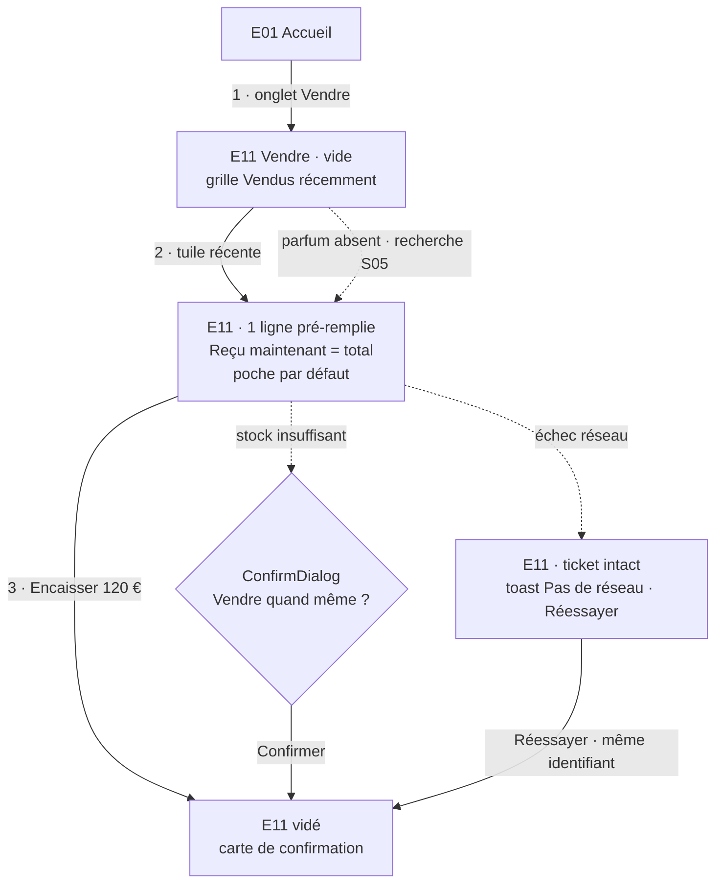

**Variantes**

| Variante | Taps | Temps | Ce qui change |
|---|---|---|---|
| Parfum absent de la grille | 4 + saisie | ≈ 11 s | Champ « Rechercher un parfum » → S05 (récents en tête, recherche sans accents) → résultat |
| Deux flacons identiques | 4 | ≈ 7 s | Retaper la même tuile : quantité 2 (la tuile affiche « ×2 ») |
| Client avec fiche | 5 | ≈ 10 s | Ligne « Client de passage » → S06 → client récent |
| Vente à crédit partiel (reçu 50 € sur 120 €) | 6 + saisie | ≈ 18 s | Client (2 taps, requis pour une créance) ; tap « Reçu maintenant », saisie 50 ; CTA « Encaisser 50 € », résumé « Espèces · 70 € resteront à encaisser » |
| Vente entièrement à crédit | 6 | ≈ 12 s | Client (2 taps) ; chip « Rien » ; CTA « Enregistrer · 120 € à encaisser » |
| Rendu de monnaie | +1, facultatif | +1 s | Chip « 50 € » sous « Donné en espèces » → « À rendre 30 € » (informatif, rien n'est écrit) |
| Plusieurs poches | +3 + saisie | ≈ +10 s | « Plusieurs poches… » → S08 → montants par poche |
| Hors catalogue | 7 + 2 saisies | ≈ 30 s | S05 → « Hors catalogue : "…" » (nom normalisé, alerte « déjà au catalogue ») → marque → prix → « Ajouter » |
| Interrompu (appel, autre onglet, app fermée) | 1 pour reprendre | ≈ 2 s | Le brouillon est conservé sur l'appareil ; point sur l'icône Vendre ; tap sur l'onglet → brouillon intact |

**Avant (01 §4.2, estimé)** : Vendre · « Choisir un parfum » · champ · saisie · parfum · volume · répartition par poche · « Enregistrer la vente » = **7 taps + saisie, ≈ 30 s**, puis redirection vers la Compta ; sans répartition, second passage Compta → Trésorerie → Répartir → poche → valider (**+5 taps**). Vente à crédit : enregistrer « payée » puis corriger le reste dû dans le ticket (**≈ 13 taps + 2 saisies, ≈ 70 s**).

### PC-02 — Encaisser une créance (tâche n°2)

**Objectif 02** : ≤ 4 taps depuis l'Accueil, < 10 s. **Cible** : **3 taps, ≈ 6 s**.

| # | Geste | État affiché ensuite | Cumul |
|---|---|---|---|
| 0 | — | E01 : tuile « À encaisser 340 € » | 0 s |
| 1 | Tap tuile « À encaisser » | E13 : un groupe par client (le plus ancien dû d'abord), chaque ligne de document porte son **bouton-montant** ambre | 1,2 s |
| 2 | Tap « 80 € » sur la ligne « Vente du 3 août » | S02 « Encaisser · Fares » : rappel « Vente du 3 août · total 100 €, payé 20 € », montant 80 € (plafond 80 € affiché), chips « Tout 80 € · La moitié 40 € », poche par défaut | 3,2 s |
| 3 | Tap CTA « Encaisser 80 € · Espèces » | T7 ; S02 se ferme ; la ligne quitte la liste, le total du groupe pulse ; toast « 80 € encaissés · Espèces » avec « Annuler » (5 s, contre-passation à la même date) | 5,4 s |

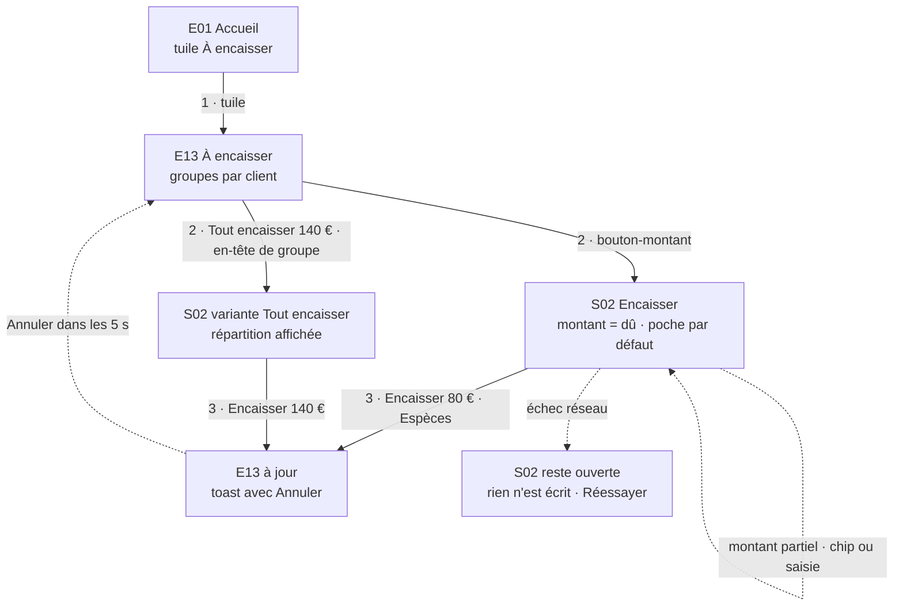

**Variantes** : montant partiel (chip « La moitié » ou saisie) = 4 taps ≈ 9 s ; client avec plusieurs créances : « Tout encaisser 140 € » sur l'en-tête du groupe = 3 taps ; depuis un autre onglet : onglet Clients → rangée « À encaisser » → montant → CTA = 4 taps ; depuis la liste Commandes : glisser vers la gauche → « Encaisser » → CTA = 4 taps.

**Avant (01 §4.2)** : tuile · bouton-montant · poche (sauf poche unique) · Encaisser = 4 taps ≈ 10 s. L'existant tenait l'objectif ; le gain vient de la poche mémorisée, du regroupement par client et du filet « Annuler ».

### PC-03 — Prendre une commande (tâche n°3)

**Objectif 02** : ≤ 15 taps, < 60 s. **Cible** : **9 taps, ≈ 15 s**. Cas : client déjà en fiche, 2 parfums récents, livraison demain, acompte de la moitié.

| # | Geste | État affiché ensuite | Cumul |
|---|---|---|---|
| 1 | Tap onglet « Commandes » | E10, vue « À livrer » | 1,2 s |
| 2 | Tap « Nouvelle commande » (en-tête) | E11 en mode « Commande » (onglet Vendre actif) : ligne Client en évidence « Client requis », bloc « Livraison prévue », bloc Paiement intitulé « Acompte » à 0 € ; CTA « Choisir le client » | 2,4 s |
| 3 | Tap CTA « Choisir le client » | S06 : clients récents (dernière activité), recherche, « Créer » | 3,6 s |
| 4 | Tap « Fares » | S06 se ferme ; client posé ; CTA « Ajouter un parfum » | 5,6 s |
| 5 | Tap tuile parfum 1 | Ligne 1 ; CTA « Créer la commande » | 7,6 s |
| 6 | Tap tuile parfum 2 (bandeau de récents sous les lignes) | Ligne 2 ; « Total 240 € » | 9,6 s |
| 7 | Chip « Demain » | Livraison prévue ven. 18 sept. | 10,8 s |
| 8 | Chip « La moitié » (Acompte) | Acompte 120 €, poche par défaut ; CTA « Créer la commande · acompte 120 € », résumé « Espèces · lot Commande de mars » (N9) | 12 s |
| 9 | Tap CTA | T1 : document `ORDER` né `CONFIRMED` (acompte sans réserve), paiement `DEPOSIT` + mouvement. Composeur vidé, revenu en mode Vente ; carte « Commande de Fares · livraison ven. 18 · acompte 120 € » (Voir · Partager le récap · Annuler) | 14,2 s |

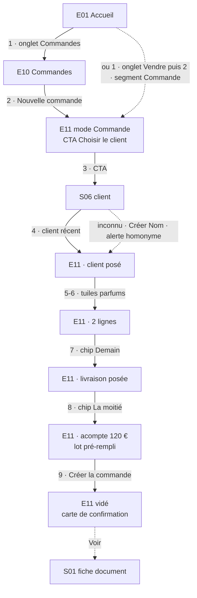

**Variantes** : parfums hors grille = +2 taps + 2 saisies ≈ 30 s ; sans acompte = 8 taps (la commande naît « En attente ») ; client inconnu = « Créer "Nom" » dans S06, avec alerte d'homonyme = +1 tap + saisie ; depuis la fiche client (« Nouvelle commande ») = client déjà posé, **6 taps**.

**Avant (01 §4.1, estimé)** : Commandes · Nouvelle · client (ouvrir, chercher, choisir) · 2 × sélecteur de parfum · 2 × volume · case acompte · montant · déplier « Livraison » · date · Créer = **≈ 18 taps + 4 saisies, ≈ 90 s** ; l'acompte partait **sans poche** (bug haute) et le lot se rattachait plus tard.

### PC-04 — Livrer une commande (tâche n°4)

**Objectif 02** : livraison complète ≤ 3 taps ; pointage 2 taps par ligne depuis la fiche. **Cible** : **3 taps** (commande soldée), **4 taps** avec encaissement du solde, **1 tap par ligne** depuis la fiche.

**Cas A — commande confirmée, soldée**

| # | Geste | État affiché ensuite | Cumul |
|---|---|---|---|
| 1 | Tap onglet « Commandes » | E10, section « Aujourd'hui » | 1,2 s |
| 2 | Glisser la ligne vers la droite | Action « Livrer » révélée (fond `success`) | 2,4 s |
| 3 | Tap « Livrer » | T4 sans réserve, optimiste : la ligne se replie (200 ms) ; toast « Commande de Fares livrée » avec « Annuler » 5 s — T4b (03 §4.3) : retour « Confirmée » **avec le pointage et le stock d'avant la livraison** (une commande pointée 1/3 redevient 1/3) | 3,6 s |

**Cas B — il reste 60 € à encaisser** : au tap 3, S02 variante **Livrer** s'ouvre (« Livrer · Fares », « Total 120 € · payé 60 € », montant 60 €, poche par défaut). Tap 4 « Encaisser 60 € et livrer » : encaissement et livraison écrits **ensemble** (**→ 04** : une seule action serveur transactionnelle composant T7 et T4) ; toast « Livrée · 60 € encaissés » avec « Annuler » : défait les deux en **une** transaction (T4b : paiement contre-passé à sa date, statut, pointage et stock d'avant). Action secondaire « Livrer sans encaisser » (T4 seule, la créance apparaît dans E13). **4 taps, ≈ 6 s.**

**Cas C — livraison partielle** : tap sur la ligne (2) → S01 ; « Tout » sur l'article livré (3) (ou « + » par unité) → T3 optimiste, « Livré 1/2 », stock suivi décrémenté ; glisser S01 vers le bas pour revenir. Quand toutes les lignes sont pointées, le segment « Livrée » de S01 est mis en évidence (pulse) : un tap livre, avec la même logique (S02 Livrer si dû > 0, `ConfirmDialog` si réserve).

**Réserves** (03 §2.3) : livrer une commande « En attente », ou dont le stock suivi est insuffisant, ouvre d'abord un `ConfirmDialog` dont la description est la réserve du domaine (+1 tap).

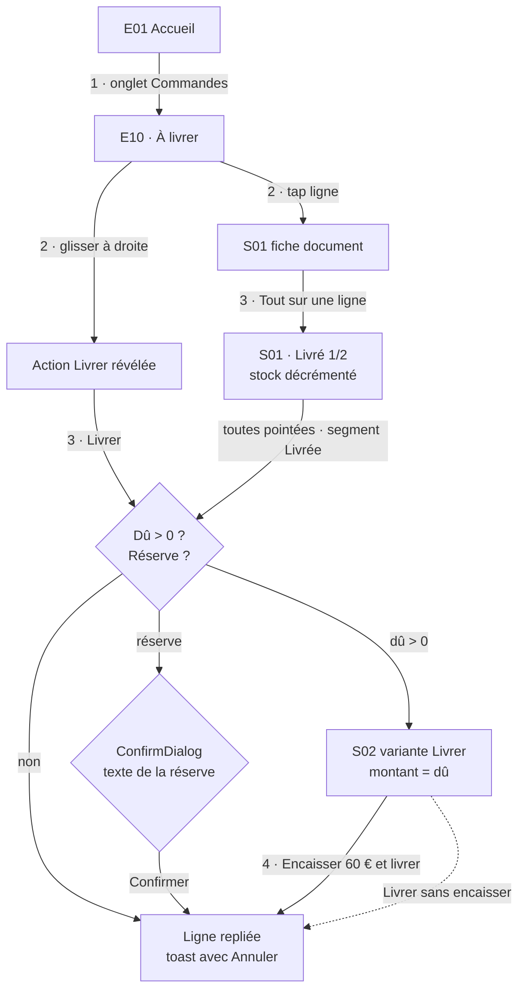

**Avant (01 §4.1–4.2, estimé)** : Commandes · fiche · « Solde » · poche · Enregistrer · sortir puis revenir (fiche périmée) · « Tout » × 2 · « Tout est livré » · « Finaliser la vente » · ressaisie du coût DZD de chaque ligne · confirmer · Enregistrer = **≈ 14 taps + 2 saisies, ≈ 2 min**, et la Trésorerie comptait l'argent deux fois.

### PC-05 — Enregistrer un paiement sur une commande (tâche n°5)

**Objectif 02** : ≤ 5 taps depuis la fiche. **Cible** : **2 à 3 taps**.

| Cas | Pas-à-pas depuis S01 ouverte | Taps |
|---|---|---|
| Acompte sur une commande « En attente » | (1) CTA « Encaisser un acompte » → S02 variante Acompte : montant vide, chips « La moitié · Tout », plafond = total − payé, poche par défaut ; (2) chip « La moitié » ; (3) CTA « Encaisser 60 € · Espèces » → T7 `DEPOSIT` ; confirmation automatique sans réserve : le segment passe à « Confirmée », tuiles « Payé » et « À encaisser » à jour avec pulse, paiement ajouté à la liste ; toast « 60 € encaissés · Espèces » + « Annuler » (5 s) : T4b contre-passe l'acompte **et** remet la commande « En attente » (`confirmedAt` effacé) — aucune créance fantôme | 3 |
| Solde sur une commande livrée | (1) CTA « Encaisser 60 € » → S02 pré-remplie au dû ; (2) CTA | 2 |
| Paiement différent du dû | (1) CTA ; saisie du montant ; (2) CTA | 2 + saisie |
| Sans ouvrir la fiche | Commandes (1) · glisser vers la gauche (2) · « Encaisser » (3) · CTA (4) | 4 |

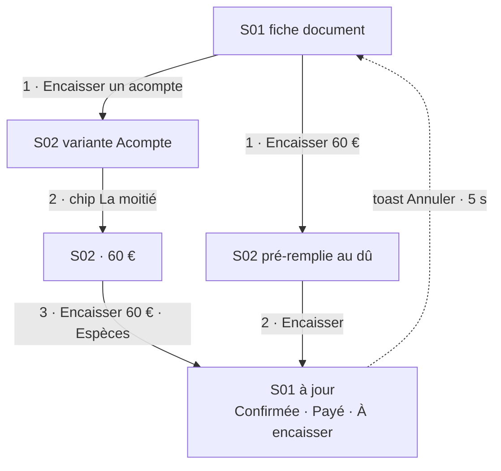

**Avant** : Acompte ou Solde · poche · Enregistrer = 3 taps, mais la fiche restait périmée (dû, statut, « Finaliser » invisibles) jusqu'à re-navigation.

### PC-06 — Consulter le dû d'un client et le relancer (tâche n°6)

**Objectif 02** : fiche en 2 taps, chiffre identique à À encaisser, relance partageable en 2 taps de plus. **Cible** : **2 taps (≈ 4 s) ; relance prête en 4 taps (≈ 12 s)**.

| # | Geste | État affiché ensuite | Cumul |
|---|---|---|---|
| 1 | Tap onglet « Clients » | E12 : rangée « À encaisser · 340 € · 5 documents », champ de recherche, liste A–Z avec badge « 80 € dû » | 1,2 s |
| 2 | Tap « Fares » (ou recherche « 06 12 » → résultat : téléphone normalisé) | E14 : tuiles « À encaisser 140 € » (fonction `aEncaisser`, même chiffre que E13) · « Documents 12 » · « Dernier achat 3 sept. » ; rangée Appeler · WhatsApp · Snap | 3,2 s |
| 3 | Tap « Relancer » | S09 : aperçu du message (ardoise document par document, dates, total), texte modifiable | 4,4 s |
| 4 | Tap « Envoyer… » | Feuille de partage iOS (Web Share ; repli : copie + toast « Message copié ») | 5,6 s |
| 5 | Choix de l'app (Snapchat, SMS, WhatsApp…) | Message prêt à envoyer dans l'app choisie | ≈ 8 s |

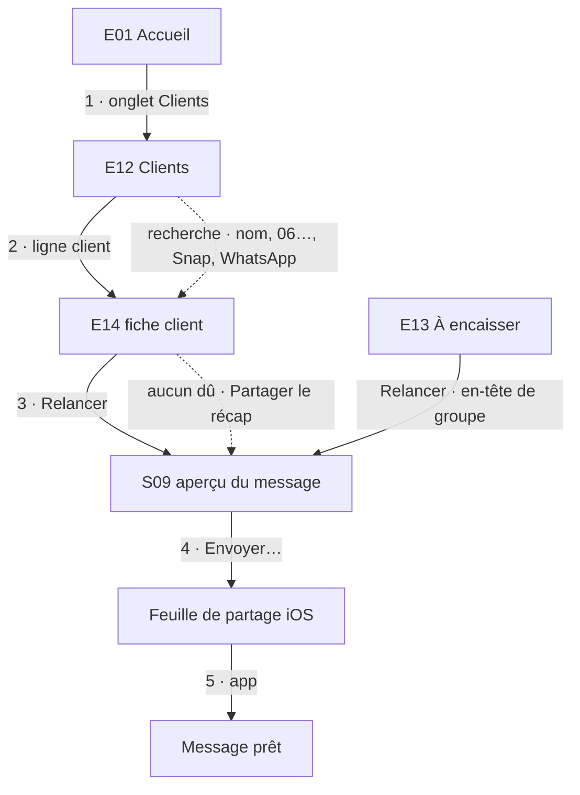

**Avant (01 §4.6, §4.10, estimé)** : depuis Commandes, revenir à l'Accueil · raccourci Clients · recherche (qui échouait avec « 06… ») · client = 3–4 taps ; la relance n'existait pas (rédaction à la main, ≈ 90 s) ; la tuile « À encaisser » de la fiche était fausse.

### PC-07 — Ajouter un parfum au catalogue, photo comprise (tâche n°7)

**Objectif 02** : < 90 s ; bascule de visibilité en 1 tap. **Cible** : **9 taps + 2 saisies, ≈ 40 s** (import de photo compris) ; visibilité **1 tap**.

| # | Geste | État affiché ensuite | Cumul |
|---|---|---|---|
| 1 | Tap onglet « Catalogue » | E15, onglet Parfums | 1,2 s |
| 2 | Tap « + Parfum » | E19 « Nouveau parfum » : zone Photo en tête, Marque, Nom, Prix 80 ml (10 et 50 ml repliés) ; CTA « Choisir la marque » | 2,4 s |
| 3 | Tap rangée « Marque » | S05 en mode marques : marques récentes, recherche sans accents, « Créer la marque » seulement sans équivalent (`cleNom`) | 3,6 s |
| 4 | Tap « Dior » | Marque posée ; CTA « Saisir le nom » (focus du champ) | 5,6 s |
| — | Saisie « sauvage » | Aperçu normalisé « Sauvage » (`nommage.ts`) | 8,6 s |
| 5 | Tap « Ajouter la photo » | Menu iOS du champ fichier | 9,8 s |
| 6 | Tap « Photothèque » | Sélecteur de photos iOS | 11 s |
| 7 | Tap la photo | Recadrage portrait 1024 × 1536 | 13 s |
| 8 | Tap « Utiliser » | Conversion WebP, envoi direct au stockage (URL signée), aperçu | 19 s |
| — | Saisie prix 80 ml « 120 » | CTA « Ajouter au catalogue » | 22 s |
| 9 | Tap CTA | Création ; ouverture de E16 (consultation) ; toast « Sauvage ajouté » — ou « Sauvage ajouté, masqué : la marque Dior est masquée » si une règle de visibilité l'impose | ≈ 24 s |

Marge de lecture et d'hésitation comprise : **≈ 40 s**.

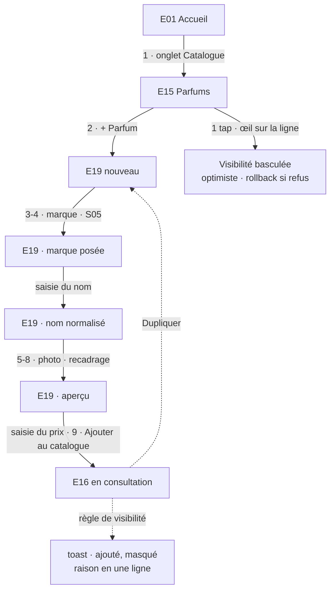

**Variantes** : parfum de la même marque qu'un existant : fiche → « Dupliquer » (marque et tarifs repris) → nom + photo ≈ 30 s ; arrivage de stock : fiche → « Ajuster » (stepper) = 2–3 taps.

**Avant (01 §4.5, estimé)** : Catalogue · + Parfum · marque (saisie effacée au focus) · nom · stock · image · Créer → retour à la liste sans filtres · rouvrir la fiche · prix du volume + son propre « Enregistrer » = **≈ 14 taps + 5 saisies, ≈ 3 min**.

### PC-08 — Suivre un lot : dépense et marge (tâche n°8)

**Objectif 02** : dépense ≤ 5 taps ; marge d'un lot visible en 2 taps. **Cible** : **dépense 4 taps + saisie (≈ 10 s) ; marge lisible à 0 tap sur l'Accueil**.

| # | Geste | État affiché ensuite | Cumul |
|---|---|---|---|
| 0 | — | E01, section « Lots ouverts » : « Commande de mars · Marge nette du lot 412 € » | 0 s |
| 1 | Tap sur le lot | E06 : tuiles Encaissé · Marge nette (%) · À encaisser · Coûts d'achat · Dépenses ; documents ; dépenses | 1,2 s |
| 2 | Tap CTA « Ajouter une dépense » | S12 : chips des libellés déjà saisis (« Transport », « Douane »…), montant, date « Aujourd'hui », poche par défaut | 2,4 s |
| 3 | Chip « Transport » | Libellé posé, focus sur le montant | 3,6 s |
| — | Saisie « 45 » | CTA « Ajouter 45 € · Banque » | 6,6 s |
| 4 | Tap CTA | T9 ; tuiles « Dépenses » et « Marge nette » du lot à jour avec pulse | 7,6 s |

Rattacher les ventes et commandes au lot : **0 tap** (lot pré-rempli dès la création, N9).

**Variante — ranger ce qui n'a pas de lot** (capacité de production du 10/09/2026, `521e086`) : E01 « Tous les lots » (1) → E05, section « À rattacher » en tête (« 4 documents sans lot ») ; sur la ligne, rangée « Lot » (2) → S07 lots ouverts ; tap sur le lot (3) → T13, la ligne quitte la section, toast « Rattaché à Commande de mars » (pour défaire : « Retirer du lot » dans S01, ou décocher dans S13). **3 taps par document**, sans ouvrir de fiche. Une commande livrée s'y range aussi : c'est l'envoi terminé qu'on veut rattacher pour lui imputer le transport.

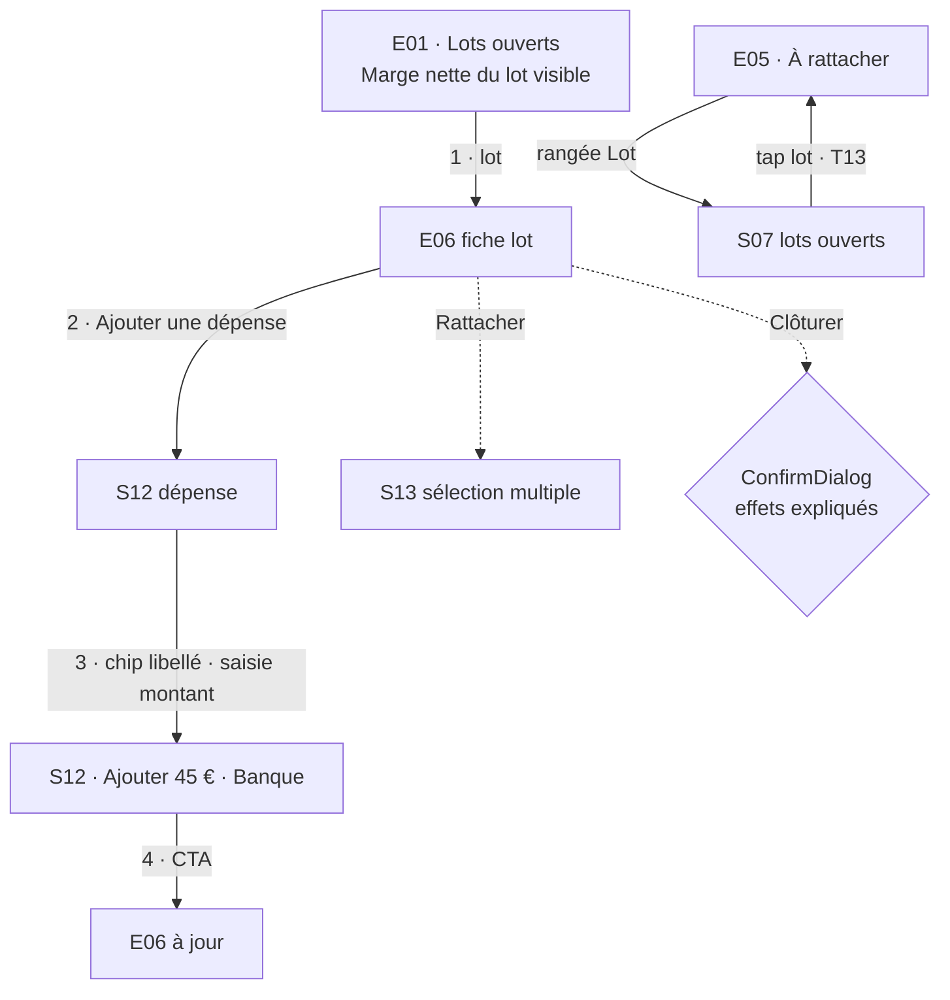

**Avant (01 §4.4)** : Accueil · bloc lots · lot · Ajouter · libellé · montant · poche · Enregistrer ≈ 5 taps + 2 saisies, sans date possible ; chaque vente se rattachait après coup (≈ 5 taps par document).

### PC-09 — Faire le bilan du jour et du mois (tâche n°9)

**Objectif 02** : récap de journée en 1 tap ; compta du mois en 2 taps. **Cible** : **lecture du jour à 0 tap, récap détaillé 1 tap, partage 2 taps ; compta du mois 1 tap**.

| Cas | Pas-à-pas | Taps |
|---|---|---|
| Lire la journée | Bloc « Aujourd'hui » de E01 : Encaissé aujourd'hui, ventes du jour, à livrer aujourd'hui et demain | 0 |
| Récap détaillé | (1) tap sur l'en-tête du bloc → E02 : Encaissé du jour par poche, documents du jour, livraisons de demain, créances à relancer | 1 |
| Partager le récap | (2) CTA « Partager le récap » → feuille de partage iOS | 2 |
| Compta du mois | (1) tuile « Encaissé · septembre » → E03 vue Ventes, période Mois : Encaissé, Marge nette (%), dépenses déduites, graphe par semaine, documents par lot | 1 |
| Mois précédent | (2) « ‹ » du sélecteur de période | 2 |
| Exporter pour le comptable | (2) « Exporter » → fichier CSV partagé (même périmètre que l'écran) | 2 |

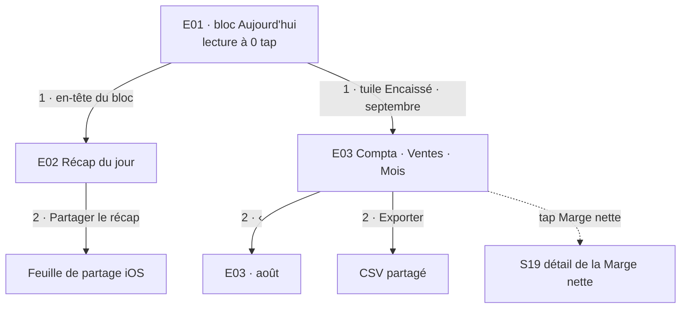

**Avant** : aucun récap de journée (calcul de tête) ; « Ce mois » ouvrait une Compta sans période, sur un périmètre différent de la tuile (01 §4.6).

### PC-10 — Corriger une erreur

**Objectif (décision)** : toute erreur d'argent ou de saisie se défait en **≤ 3 taps depuis l'endroit où elle est visible**, avec un dialogue qui dit la vérité sur l'effet (principe 5 de 02, 03 §4.4). L'existant rendait l'annulation d'un paiement irréversible et sans filet (01 §4.1).

| Erreur | Pas-à-pas | Taps | Effet (03) |
|---|---|---|---|
| Encaissement tout juste fait | (1) « Annuler » dans le toast (5 s) | 1 | T8 : contre-passation à la même date ; si cet encaissement avait confirmé la commande (acompte sur « En attente »), T4b : contre-passation **et** retour « En attente », en une transaction |
| Vente tout juste enregistrée | (1) « Annuler » sur la carte de confirmation de E11 → `ConfirmDialog` « Annuler la vente de 120 € ? » : « Le document reste consultable, marqué annulé. Les 120 € sont retirés d'Espèces aujourd'hui. Le stock est restitué. » ; (2) « Annuler la vente ». **Sans aucun paiement** (« Reçu maintenant » à 0, commande sans acompte) : `ConfirmDialog` « Supprimer cette vente ? » / « Supprimer cette commande ? », puis suppression différée 5 s avec « Annuler » — l'erreur de saisie ne laisse aucun document « Annulée » | 2 | T5 avec remboursement du payé ; T6 sans paiement |
| Paiement saisi par erreur (plus tard) | Dans S01 : (1) « … » sur la ligne de paiement ; (2) « Annuler ce paiement » ; (3) confirmer (« Une écriture inverse est ajoutée à la même date dans Espèces ; le paiement reste visible, barré. » + sur une commande engagée « Elle reste confirmée : 120 € resteront à encaisser. ») | 3 | T8 annuler (statut inchangé ; pour remettre en attente : segment de S01) |
| Mauvais montant, date ou poche | (1) « … » ; (2) « Corriger » → S04 pré-rempli ; saisie ; (3) « Corriger : 50 € au lieu de 80 € » | 3 + saisie | T8 corriger (annuler + nouveau) |
| Commande notée par erreur, sans paiement | S01 : (1) « ⋯ » ; (2) « Supprimer » ; (3) confirmer → toast « Commande supprimée » + « Annuler » 5 s | 3 | T6 |
| Document payé à abandonner | S01 : (1) « ⋯ » ; (2) « Annuler la commande » → S03 (remboursement pré-coché, montant = payé, poche) ; (3) « Annuler et rembourser 60 € » | 3 | T5 |
| Dépense de lot erronée | E06 : (1) « … » sur la dépense ; (2) « Supprimer » ; (3) confirmer (« 45 € reviennent dans Banque à la date de la dépense ») | 3 | T10 |
| Transfert erroné | E04 ou S14 : (1) « … » ; (2) « Annuler le transfert » ; (3) confirmer | 3 | T12 |

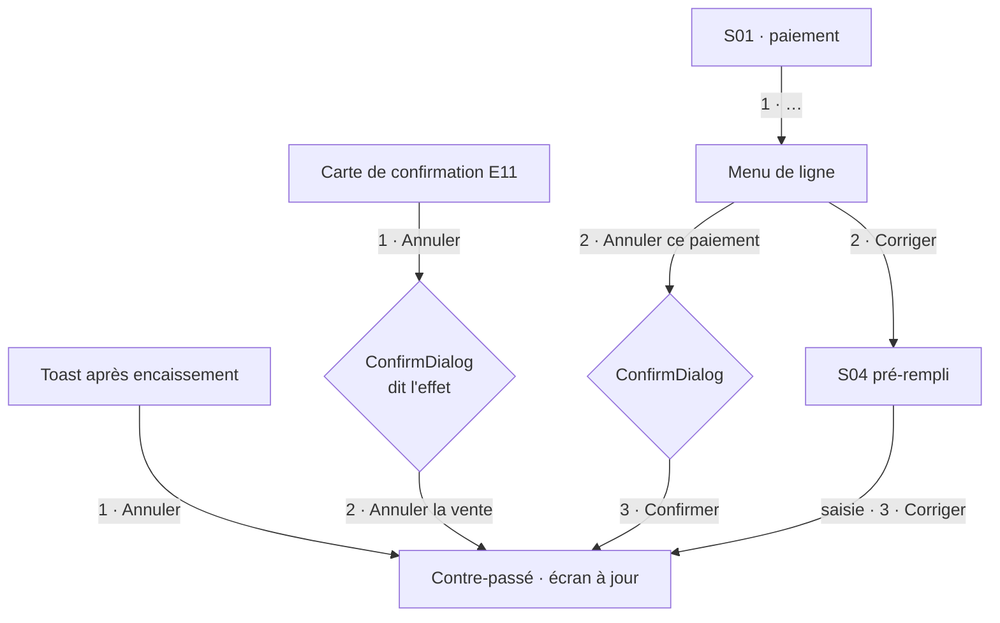

### PC-11 — Ranger l'argent : répartir et déposer

**Objectif (décision)** : répartir le non attribué ≤ 2 taps depuis l'Accueil ; transfert entre poches ≤ 5 taps + saisie. Avec la poche par défaut (N2), le non attribué devient rare ; il reste l'issue de la reprise de données (03 §7.6) et des écarts.

| Cas | Pas-à-pas | Taps |
|---|---|---|
| Répartir | E01 alerte « 120 € non attribués · Répartir » (1) → S15 mode Répartir : montant = tout, destination = poche par défaut ; (2) « Ranger 120 € dans Espèces » | 2 |
| Déposer des espèces à la banque | E01 tuile « Trésorerie » (1) → E03 vue Trésorerie ; poche « Espèces » (2) → S14 ; « Transférer » (3) → S15 mode Transfert (depuis Espèces) ; chip « Banque » (4) ; saisie ou chip « Tout » ; (5) « Transférer 300 € vers Banque » | 5 + saisie |

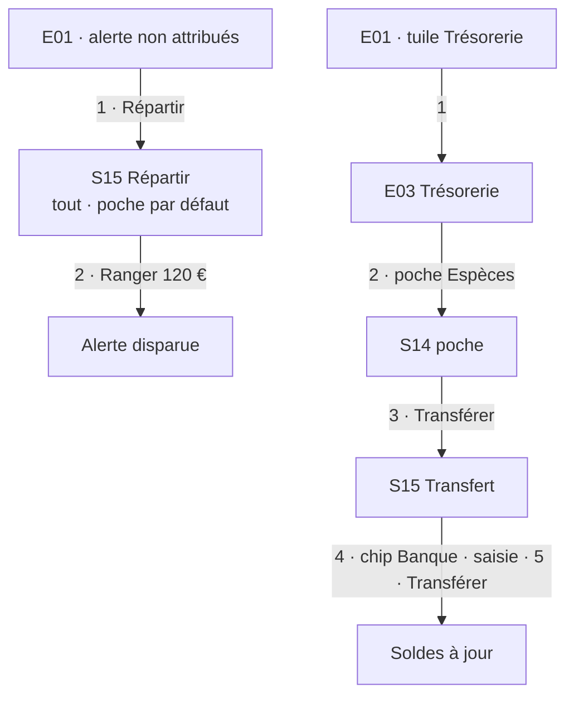

### PC-12 — Première utilisation

**Objectif (décision)** : une première vente enregistrée **en moins de 5 minutes** après la première connexion, sans aide extérieure (état « vide de départ » exigé par 05 §5.1, absent de l'existant, 01 §4.6).

| # | Geste | État |
|---|---|---|
| 0 | Connexion (E18) | E01 vide : carte « Pour commencer » à trois étapes, chacune cochée automatiquement quand elle est faite |
| 1 | « Créer tes poches » | S16 pré-rempli « Espèces » (type Espèces), solde d'ouverture ; puis « Banque » en un tap depuis la même sheet ; la première poche créée devient la poche par défaut |
| 2 | « Ajouter un parfum » | E19 nouveau (PC-07) |
| 3 | « Faire une vente » | E11 (PC-01) ; la carte disparaît quand les trois étapes sont faites |

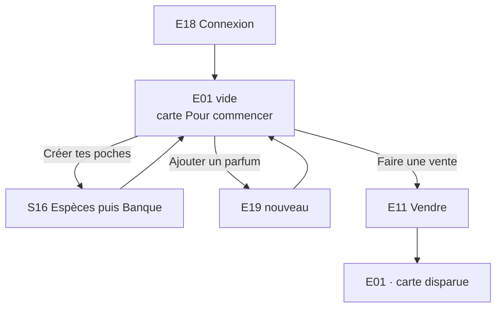

### PC-13 — Publier la story d'un parfum (capacité de production, écart du 17/09/2026)

**Objectif (décision, reprise de `77985aa`)** : à 22 h, retrouver la planche story d'un parfum et l'envoyer vers Snapchat ou Photos **en deux gestes une fois sur la fiche**, sans fouiller une pellicule de quarante images. **Cible** : **5 taps + saisie, ≈ 15 s** depuis l'Accueil ; déposer une planche : **4 taps + import**.

| # | Geste | État affiché ensuite | Cumul |
|---|---|---|---|
| 1 | Tap loupe du header | S17, champ focalisé | 1,2 s |
| — | Saisie « sauv » | Groupe « Parfums » : « Sauvage · Dior » | 4,2 s |
| 2 | Tap « Sauvage » | E16 en consultation ; zone « Visuels story · 2 » : vignettes 9:16 | 6,2 s |
| 3 | Tap la vignette | Visionneuse plein écran : visuel, « Partager / Enregistrer », « Retirer » | 8,2 s |
| 4 | Tap « Partager / Enregistrer » | Téléchargement du fichier (spinner sur le bouton), puis feuille de partage iOS avec le fichier « nurea-dior-sauvage-story » | ≈ 11 s |
| 5 | Tap « Snapchat » (ou « Enregistrer l'image ») | Snapchat s'ouvre avec la planche | ≈ 15 s |

**Déposer une planche** (fiche ouverte) : « Ajouter des visuels » (1) → menu iOS du champ fichier, « Photothèque » (2) → sélection d'une ou plusieurs images (3) → « Ajouter » (4) → chaque fichier est préparé (WebP, 1920 px au plus, **jamais recadré**), envoyé, rangé ; toast « 2 visuels ajoutés » (ou « 1 visuel ajouté · 1 refusé : format illisible »). Retirer : visionneuse → « Retirer » → `ConfirmDialog` S18 → la vignette disparaît.

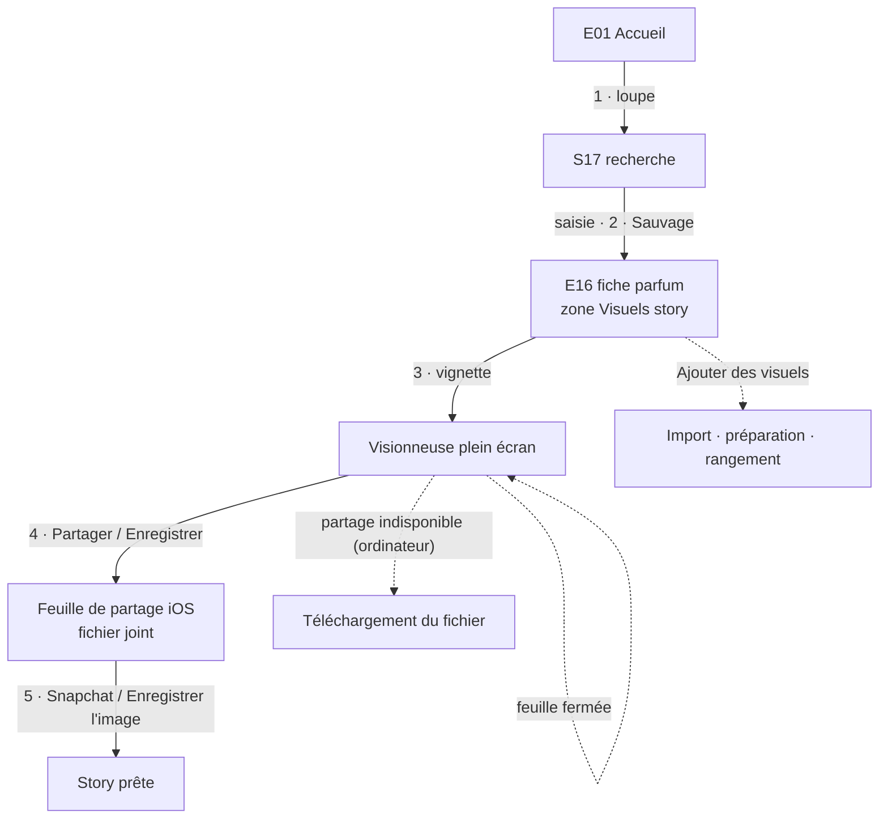

**Avant (production avant le 10/09/2026)** : aucune place pour ces visuels — recherche dans la pellicule du téléphone, sans savoir si la planche y était encore.

### Synthèse chronométrée

| Parcours | Objectif | Avant (estimé) | Cible |
|---|---|---|---|
| PC-01 Vente simple | ≤ 8 taps, < 20 s | 7 taps + saisie, ≈ 30 s (+5 taps de répartition) | **3 taps, ≈ 6 s** |
| PC-01 Vente à crédit partiel | — | ≈ 13 taps + 2 saisies, ≈ 70 s | **6 taps + saisie, ≈ 18 s** |
| PC-02 Encaisser une créance | ≤ 4 taps, < 10 s | 4 taps, ≈ 10 s | **3 taps, ≈ 6 s** |
| PC-03 Prendre une commande | ≤ 15 taps, < 60 s | ≈ 18 taps + 4 saisies, ≈ 90 s | **9 taps, ≈ 15 s** |
| PC-04 Livrer (soldée / avec solde) | ≤ 3 taps | ≈ 14 taps + 2 saisies, ≈ 2 min | **3 taps / 4 taps, ≈ 4–6 s** |
| PC-04 Pointer une ligne | 2 taps par ligne | 1 tap (« Tout ») | **1 tap** |
| PC-05 Paiement depuis la fiche | ≤ 5 taps | 3 taps, fiche périmée | **2–3 taps** |
| PC-06 Fiche client / relance | 2 taps / +2 | 3–4 taps / impossible | **2 taps / +2 (≈ 12 s au total)** |
| PC-07 Nouveau parfum / visibilité | < 90 s / 1 tap | ≈ 3 min / 1 tap | **≈ 40 s / 1 tap** |
| PC-08 Dépense de lot / marge du lot | ≤ 5 taps / 2 taps | ≈ 5 taps + 2 saisies, sans date / 3 taps | **4 taps + saisie / 0 tap** |
| PC-09 Récap du jour / compta du mois | 1 tap / 2 taps | inexistant / mauvais périmètre | **0–1 tap / 1 tap** |
| PC-10 Défaire une erreur | ≤ 3 taps | irréversible pour un paiement | **1–3 taps** |
| PC-11 Répartir / transférer | ≤ 2 / ≤ 5 taps | 5 taps | **2 / 5 taps** |
| PC-12 Première vente | < 5 min | non guidé | **carte « Pour commencer »** |
| PC-13 Publier la story d'un parfum | 2 gestes sur la fiche | production du 10/09/2026 : fiche d'édition → galerie → visionneuse → partage (≈ 5 taps) | **5 taps + saisie, ≈ 15 s** depuis l'Accueil |
| PC-08 variante · Ranger un document sans lot | — | production du 10/09/2026 : « À rattacher » de `/admin/lots` (3 taps) | **3 taps** |

---

## 3. Spécification écran par écran

**Gabarit.** Chaque fiche donne : **But** · **Zones** (de haut en bas) · **Action principale** (au plus une, 05 §5.4 ; « aucune » sur un écran de lecture) · **Actions secondaires** · **Gestes** · **États** (chargement, vide, erreur, et états particuliers) · **Composants** (briques de `src/ui/*` et `src/app-shell/*`, 05 §3) · **Données** (entités et fonctions de 03).

**Règles communes à tous les écrans** (non répétées ensuite) :
- Chaque route est rendue dans `PageScaffold` ; le titre de l'écran est rendu immédiatement, chaque bloc de données est sous son propre `Suspense` avec un squelette aux proportions exactes (05 §5.1).
- Tout paramètre d'URL est lu par un composant client **sous `<Suspense>`** ; un filtre actif est **toujours visible et effaçable** (chip « … ✕ »).
- Une erreur de **chargement** = `ErrorBanner` inline à la place du bloc (« … indisponible — Réessayer »), le reste de l'écran vit ; une erreur d'**écriture** = toast erreur + retour à l'état précédent (rollback optimiste), ou `ErrorBanner` dans la sheet si la saisie doit être conservée.
- Pull-to-refresh sur toute route de lecture — pas sur les formulaires E11, E17, E19, E20, E21, ni sur E18, ni dans une sheet ; il attend la fin réelle du rafraîchissement (≥ 300 ms).
- Après toute écriture : l'écran reflète le nouvel état sans re-navigation, pulse `admin-confirm-pulse` sur l'élément concerné (05 §4.4).

### 3.1 Routes de l'onglet Accueil

#### E01 — Accueil · `/admin`

- **But.** Voir en un coup d'œil ce qui attend et où en est l'argent ; entrer dans la compta, les lots, les statistiques et les réglages **par le chiffre qui les résume**.
- **Zones.**
  1. **Header du shell** : logo, bouton « Rechercher » (S17).
  2. **Carte contextuelle** (une seule à la fois, par priorité) :
     - « Installer l'app » — Safari iOS hors mode standalone (consigne Partager → Sur l'écran d'accueil), ou invite `beforeinstallprompt` sur les autres navigateurs ; fermable, fermeture mémorisée sur l'appareil ;
     - « Nouveautés » — affichée jusqu'à fermeture après la bascule vers la refonte, trois lignes : « Clients a son onglet : À encaisser est dedans. » · « La compta s'ouvre en touchant tes chiffres ci-dessous. » · « Vente et commande : même écran, bascule en haut. » ; bouton « J'ai compris » ;
     - « Pour commencer » — vide de départ (PC-12) : trois étapes cochées automatiquement (« Créer tes poches » → S16, « Ajouter un parfum » → E19 en création, « Faire une vente » → E11).
  3. **« À faire »** (`ListSection`, rendue seulement si une rangée existe ; chaque rangée ouvre **exactement** l'ensemble compté) :
     - « 3 commandes en retard » → `/admin/commandes?filtre=retard` ;
     - « 120 € non attribués » + bouton « Répartir » → S15 en mode Répartir, **sur place** ;
     - « 2 clients à relancer · plus de 30 j » → `/admin/encaisser?anciennete=30` (clients qui portent une créance ancienne, `creancesAnciennes()`, 03 §5.8 : le nombre de groupes de l'écran ouvert) ;
     - « 2 documents au coût à compléter » → `/admin/compta?periode=tout&filtre=cout-a-completer` ;
     - « 1 parfum en rupture » → `/admin/catalogue?tab=parfums&stock=rupture` ;
     - « 3 parfums en stock bas » → `/admin/catalogue?tab=parfums&stock=bas` (deux rangées distinctes : « Stock bas » vaut 1 à 3, la rupture 0 — lexique §1.7 — et chaque lien ouvre exactement ce qu'il compte).
  4. **« Aujourd'hui · jeudi 17 septembre › »** (`Card`, en-tête cliquable → E02) : « Encaissé aujourd'hui » (`h2`), légende « 3 ventes · 1 commande prise » ; rangées « À livrer aujourd'hui · 2 » → `/admin/commandes?filtre=aujourdhui` et « À livrer demain · 3 » → `?filtre=demain` (masquées à 0).
  5. **Argent** : `KpiTile` dominante « Encaissé · septembre » (`display`) avec la ligne « Marge nette · septembre 1 240 € · 38 % » → `/admin/compta?vue=ventes&periode=mois` ; `KpiTile` « À encaisser » → E13 ; `KpiTile` « Trésorerie » → `/admin/compta?vue=tresorerie`.
  6. **« Commandes à livrer »** : deux tuiles de compteur « En attente 2 » → `?filtre=en-attente` et « Confirmées 5 » → `?filtre=confirmees` (une tuile à 0 disparaît ; le bloc disparaît si les deux valent 0).
  7. **« Lots ouverts »** (3 au plus, les plus récents) : ligne « Commande de mars », légende « arrivée prévue 3 oct. · 12 documents », à droite « Marge nette du lot » (`Money`) → E06 ; lien « Tous les lots » → E05. Aucun lot ouvert : rangée « Créer un lot » → E21 (si aucun lot n'existe) ou « Aucun lot ouvert · Tous les lots ».
  8. **« Top parfums · septembre »** (5 lignes : rang, nom, marque, « 12 flacons ») ; lien « Tout le classement » → E07. Bloc absent s'il n'y a eu aucune vente ce mois-ci.
  9. **Rangée « Réglages »** → E08.
- **Action principale** : aucune — écran de lecture ; chaque chiffre est un lien vers son écran d'action.
- **Actions secondaires** : « Répartir » ; fermeture des cartes.
- **Gestes** : tap ; pull-to-refresh.
- **États.**
  - *Chargement* : les blocs 3 et 4 partagent un `Suspense` (une requête agrégée, la plus rapide de l'écran **→ 04**) dont le squelette est celui du bloc 4 ; les blocs 5 à 8 sont dans des `Suspense` imbriqués sous lui et ne se révèlent qu'après lui : seuls des squelettes peuvent se déplacer, jamais un contenu déjà rendu ; le bloc 5 a son squelette exact (3 tuiles) ; les blocs 6 à 8, conditionnels, n'ont pas de squelette.
  - *Vide de départ* (aucun document, aucun parfum) : carte « Pour commencer » + rangée Réglages ; blocs 3 à 8 absents.
  - *Rien à faire* : bloc 3 absent (bonne nouvelle silencieuse).
  - *Erreur* : `ErrorBanner` par bloc (« Chiffres indisponibles — Réessayer »).
- **Composants** : `PageScaffold`, `Card`, `ListSection`, `ListRow`, `KpiTile`, `Money`, `Button` (`ghost`), `DateLabel`, `Skeleton`, `ErrorBanner` ; shell : `PwaInstallHint` (carte), `PullToRefresh`.
- **Données** : `enRetard()` (compte) ; solde de la poche système (`tresorerie`) ; clients à relancer = `creancesAnciennes()` comptées par client, clé de regroupement de E13 (03 §5.8) ; documents engagés `hasUnknownCost` (`DocumentBalance`) ; `Perfume` suivis (`stock IS NOT NULL`) comptés séparément à `stock = 0` et à `1 ≤ stock ≤ LOW_STOCK_THRESHOLD` (`stockAlerts()`, 04 §11) ; `encaisse(jour)` ; `SaleDocument` du jour par origine (`orderedAt`) ; `SaleDocument` `PENDING`/`CONFIRMED` par `expectedDeliveryAt` (aujourd'hui, demain) ; `encaisse(mois)`, `margeNette(mois)`, `aEncaisser()`, `tresorerie()` ; comptes `ORDER` par statut ; `Batch` `OPEN` + `margeNette(batchId)` ; top parfums du mois (§E07).

#### E02 — Récap du jour · `/admin/journee`

- **But.** Faire le bilan d'une journée en 1 tap et le partager (N4).
- **Zones.**
  1. Navigateur de date : « ‹ jeudi 17 septembre › » (« › » désactivé sur aujourd'hui).
  2. **« Encaissé »** du jour (`display`) + une ligne par poche (« Espèces 180 € », « Banque 60 € »), remboursements déduits.
  3. **« Documents du jour »** (`ListSection`) : ventes directes, commandes prises, commandes livrées ce jour ; ligne : client, « Vente · 2 articles » / « Commande prise » / « Commande livrée », à droite « À encaisser » (`warning`) si dû, sinon « Total » → S01.
  4. **« À livrer le lendemain »** : commandes `PENDING`/`CONFIRMED` prévues le jour suivant → S01.
  5. **« À relancer »** : clients qui portent une créance ancienne (`creancesAnciennes()`, 03 §5.8 : même ensemble que l'alerte de E01), avec le montant → E14.
- **Action principale** : « Partager le récap » (`StickyAction`, `ShareButton`) — texte : date ; Encaissé total et par poche ; nombre de ventes et de commandes ; livraisons du lendemain (noms) ; relances (nombre de clients, montant). Masquée si la journée est vide.
- **Actions secondaires** : « ‹ » / « › ».
- **Gestes** : tap ; pull-to-refresh.
- **États** : *chargement* : squelettes des blocs 2 et 3 ; *vide* : « Rien d'enregistré ce jour-là. » (ligne calme) ; *erreur* : `ErrorBanner`.
- **Composants** : `PageScaffold`, `Money`, `ListSection`, `ListRow`, `StickyAction`, `ShareButton`, `DateLabel`, `Button` (`ghost`, flèches 44 px).
- **Données** : `CashMovement` `PAYMENT` du jour groupés par `pocketId` (même périmètre que `encaisse`) ; `SaleDocument` (`orderedAt`, `deliveredAt` dans le jour ; `expectedDeliveryAt` le lendemain) ; `DocumentBalance` ; `Customer`.

#### E03 — Compta · `/admin/compta`

- **But.** Lire l'argent d'une période (vue Ventes) et gérer les poches (vue Trésorerie).
- **Zones communes** : `SegmentedControl` « Ventes | Trésorerie » (`vue`) ; action d'en-tête « Exporter » (vue Ventes).
- **Zones — vue Ventes.**
  1. Sélecteur de période : chips « Jour · Semaine · Mois · Année · Tout » (`periode`) + navigateur « ‹ septembre 2026 › » (`ref`, absent pour « Tout »).
  2. Chiffres de la période, **non cliquables** sauf la Marge nette (on est sur l'écran de référence) : « Encaissé · septembre » (`display`) ; « Marge nette · septembre » + % (tap → S19) ; ligne « Dépenses déduites · septembre » ; bandeau « À encaisser 340 € » → E13 (sans période : c'est un encours, pas un flux).
  3. Graphe « Encaissé par semaine » (par jour pour « Semaine », par semaine pour « Mois », par mois pour « Année » et « Tout » ; 04 §6.2 ne prévoit que `encaisseParSemaine(8)` : variantes **→ 04**) ; absent sous 2 points.
  4. Recherche (`q`), visible au-delà de 6 documents dans la liste de la zone 5 (les lignes sont des documents, plus des groupes) ou tant qu'elle filtre — **mêmes champs et mêmes règles que E10 zone 3** (client, contact, notes, lot, parfum, marque, hors catalogue ; tous les mots) ; une section qui contient un résultat s'affiche **ouverte** ; chip de filtre actif « Coût à compléter ✕ ».
  5. **Documents de la période** : documents ayant un paiement dans la période **ou** engagés (`confirmedAt`) dans la période ; une `ListSection` par lot (lots ouverts d'abord ; en-tête « Commande de mars · 12 documents › » → E06, **sans montant** : les montants d'un lot ne se lisent que sur sa fiche, 02 §4.3), puis une section « Hors lot » unique ; ligne : client, « Vente du 3 sept. · 2 articles » (légende « Coût à compléter » en `warning` si besoin), à droite « À encaisser » (`warning`) si dû, sinon « Total » → S01. Liste fenêtrée. **Sous le filtre « Coût à compléter »**, l'ensemble est restreint aux documents **engagés** (`CONFIRMED`/`DELIVERED`) dont `confirmedAt` est dans la période et `hasUnknownCost` : exactement les coûts comptés 0 € dans la Marge nette de la période (S19) ; avec la période « Tout », exactement le compteur de E01 (un document annulé payé n'y figure jamais).
- **Zones — vue Trésorerie.**
  1. « Trésorerie » (`display`, `tresorerie()`).
  2. Rangée « 120 € non attribués » + « Répartir » → S15 (si solde > 0).
  3. `ListSection` « Poches » : nom, type en légende, solde à droite (`danger` si négatif), mention « par défaut » en légende de la poche proposée → S14 ; rangée finale « Nouvelle poche » → S16.
  4. Bouton secondaire « Nouveau mouvement » → S15.
  5. « Journal · septembre » : 20 derniers mouvements du mois en cours, « Net du mois » calculé sur le **mois complet** ; lien « Tout le journal » → E04.
- **Action principale** : aucune (lecture).
- **Actions secondaires** : « Exporter » (`GET /api/admin/export/compta?du=&au=`, 04 §3.5 : CSV, séparateur `;`, BOM Excel, colonnes au vocabulaire canonique, **même période que l'écran** ; fichier ouvert dans la feuille de partage iOS ou téléchargé) ; « Répartir » ; « Nouveau mouvement » ; « Nouvelle poche ».
- **Gestes** : tap ; pull-to-refresh.
- **États.**
  - *Chargement* : segment et période immédiats ; squelettes des chiffres, du graphe et de la liste.
  - *Vide (Ventes)* : « Aucune vente sur cette période. » (sélecteur conservé) ; *vide de filtre* : `EmptyState` « Aucun client ne correspond » + « Effacer la recherche ».
  - *Vide (Trésorerie)* : aucune poche hors « Non attribué » → `EmptyState` « Crée ta première poche » + action → S16.
  - *Erreur* : « Poches indisponibles — Réessayer » (jamais « Aucune poche ») ; « Chiffres indisponibles — Réessayer ».
- **Composants** : `PageScaffold`, `SegmentedControl`, `Chip`, `Button`, `Money`, `SearchField`, `ListSection`, `ListRow`, `WindowedList`, `EmptyState`, `ErrorBanner` ; graphe : **→ 05** (brique `BarChart` à formaliser dans `src/ui/patterns/`).
- **Données** : `encaisse(from, to)`, `margeNette(from, to)`, dépenses de la période (mouvements `EXPENSE` et leurs contre-passations, 03 §5.4), `aEncaisser()`, `DocumentBalance`, `SaleDocument`, `Batch`, `Customer` ; `tresorerie()` par poche, `Pocket`, `Setting.defaultPocketId`, `CashMovement` du mois.

#### E04 — Journal · `/admin/compta/journal`

- **But.** Retrouver n'importe quel mouvement d'argent et annuler un mouvement manuel.
- **Zones.**
  1. Navigateur « ‹ septembre 2026 › » (`mois`).
  2. Chips de poche « Toutes · Espèces · Banque · Non attribué… » (`poche`).
  3. En-tête : « Net du mois +1 240 € » (mois complet, poche filtrée).
  4. Mouvements groupés par jour (`DateLabel`) : libellé selon le lexique §1.7, légende « Espèces · 14 h 32 », montant signé à droite. Un mouvement contre-passé et sa contre-passation sont repliés sous une ligne « Annulé » dépliable. Les « Écart historique » issus de la reprise (03 §7.6) s'affichent tels quels.
- **Action principale** : aucune.
- **Actions secondaires** : tap sur un paiement → S01 du document ; sur une dépense → E06 ; menu « … » d'un transfert, ajustement, paiement fournisseur ou écart historique → « Annuler » (`ConfirmDialog`, T12).
- **Gestes** : tap ; pull-to-refresh.
- **États** : *chargement* : squelette de liste ; *vide* : « Aucun mouvement en septembre. » ; *erreur* : `ErrorBanner`.
- **Composants** : `PageScaffold`, `Chip`, `ListSection`, `ListRow`, `Money` (`signed`), `CollapsibleSection`, `ConfirmDialog`, `DateLabel`.
- **Données** : `CashMovement` (`pocketId`, `occurredAt`, `kind`, `amount`, `label`, `reversesId`, `transferGroupId`) ; `Payment` → `SaleDocument` → nom du client ; `BatchExpense` → `Batch` ; `Pocket`.

#### E05 — Lots · `/admin/lots`

- **But.** Voir tous les envois fournisseur et leur Marge nette ; en créer un.
- **Zones.**
  0. **« À rattacher »** (écart du 17/09/2026 : capacité de production `521e086`, **avant** les lots — ce qui reste à ranger, personne ne pense à aller le chercher ; absente s'il n'y a rien) : `ListSection` « À rattacher · 4 » ; `SearchField` (visible au-delà de 6 lignes ou tant qu'il filtre ; mêmes champs que E10 zone 3, debounce 250 ms) ; lignes = **documents non annulés sans lot**, commandes **et** ventes, **livrés compris** (un envoi terminé se rattache pour lui imputer transport et douane), du plus récent au plus ancien ; ligne : client, légende « Commande du 12 sept. · Sauvage, Libre +2 » (+ « En attente » / « Livrée »), à droite « À encaisser » ou « Total », rangée secondaire « Lot : choisir › » → S07 (lots **ouverts** seulement) ; le choix écrit T13 et la ligne quitte la section sans attendre le rafraîchissement (rollback + toast portant la raison si refus) ; 100 lignes au plus puis « Afficher plus » — **jamais tronqué en silence** : « 100 affichés sur 132 ». Tap sur la ligne hors rangée « Lot » → S01.
  1. `SectionHeader` « Lots » + action « Nouveau lot » ; `ListSection` « Ouverts » ; `CollapsibleSection` « Clos » repliée. Ligne : nom ; légende « arrivée prévue 3 oct. · 12 documents » (ou « créé en sept. » sans date prévue), complétée de « · 120 € à encaisser » (`Money warning`) quand le lot porte une créance ; à droite « Marge nette du lot » (`Money`, un seul montant en `trailing`) → E06. Encaissé, pourcentage, coûts d'achat et dépenses se lisent sur E06 (décision « Simplifier » de 02 §4.4).
- **Action principale** : « Nouveau lot » → E21 puis E06 du lot créé.
- **Actions secondaires** : déplier « Clos ».
- **Gestes** : tap ; pull-to-refresh.
- **États** : *chargement* : `SkeletonList` ; *vide de départ* : `EmptyState` « Aucun lot » + « Créer un lot » ; *erreur* : `ErrorBanner`.
- **Composants** : `PageScaffold`, `SectionHeader`, `ListSection`, `ListRow`, `CollapsibleSection`, `Money`, `EmptyState`.
- **Données** : `Batch` (`name`, `expectedAt`, `status`, `createdAt`), compte de `SaleDocument` par lot, Marge nette et À encaisser par lot agrégés côté base (`chiffresParLot()`, 04 §6.2) ; zone 0 : `SaleDocument` `batchId IS NULL AND status <> CANCELLED` (+ `DocumentBalance`, `SaleLine.perfumeName` pour le résumé), compte total ; écriture T13 (`assignDocumentsToBatchAction`, lot ouvert exigé).

#### E06 — Fiche lot · `/admin/lots/[id]`

- **But.** Connaître la Marge nette réelle d'un envoi, y rattacher des documents, y saisir des dépenses.
- **Zones.**
  1. En-tête : nom (`InlineNameEditor`) ; légende « Ouvert · arrivée prévue 3 oct. » (tap sur la date → sélecteur natif, effaçable) ; menu « ⋯ » : « Clôturer » / « Rouvrir », « Supprimer le lot ».
  2. **Tuiles fixes** (grille stable, toujours les cinq) : « Encaissé » (`display`) et « Marge nette » + % (tap → S19 au périmètre du lot) ; « À encaisser », « Coûts d'achat », « Dépenses ».
  3. **« Documents · 12 »** : ligne client, « Commande du 12 sept. · livrée », à droite « À encaisser » ou « Total » → S01 ; action de section « Rattacher » (lot ouvert uniquement) → S13 (`?assigner=1`). **Tout ce qui est rattaché est listé** (écart du 17/09/2026, `521e086`, `3707715`) : une commande **en attente** y figure (légende « En attente » ; son total n'entre ni dans « À encaisser » ni dans « Coûts d'achat » tant qu'elle n'est pas engagée, un acompte déjà reçu compte dans l'Encaissé comme partout, 03 §5.2–5.4) ; un document **annulé** aussi, dans une sous-section repliée « Annulés · 1 » — sinon il resterait rattaché sans être visible ni détachable, et rendrait le lot impossible à supprimer sans que la raison soit lisible.
  4. **« Dépenses · 3 »** : libellé, légende « 12 sept. · Banque » (+ note), montant ; menu « … » : « Modifier » (libellé et notes → S12), « Supprimer » (`ConfirmDialog`, T10).
  5. **« Notes »** : champ modifiable en place (enregistrement à la sortie du champ).
- **Action principale** : « Ajouter une dépense » (`StickyAction`) → S12 — aussi sur un lot clos (03 : dépenses tardives possibles).
- **Actions secondaires** : « Rattacher », « Clôturer » / « Rouvrir » (`ConfirmDialog` : « Clôturer « Commande de mars » ? Plus aucune vente ni commande ne pourra y être rattachée. Les dépenses tardives restent possibles. Tu pourras le rouvrir. »), « Supprimer le lot » (possible seulement sans document ni dépense jamais saisie, 02 §4.4 ; sinon entrée désactivée avec la raison « Impossible : 12 documents et 3 dépenses rattachés », ou, si les dépenses ont toutes été supprimées, « Impossible : ce lot a un historique de dépenses. Clôture-le plutôt. »).
- **Gestes** : tap ; pull-to-refresh.
- **États** : *chargement* : squelette de la grille et des listes ; *lot introuvable* : `EmptyState` « Ce lot n'existe plus » + « Retour aux lots » ; *sections vides* : « Aucun document rattaché » + « Rattacher », « Aucune dépense » ; *erreur* : `ErrorBanner` par bloc.
- **Composants** : `PageScaffold`, `InlineNameEditor`, `Money`, `ListSection`, `ListRow`, `StickyAction`, `ConfirmDialog`, `DateLabel`, `Textarea`, `EmptyState`.
- **Données** : `Batch` ; `encaisse`, `margeNette`, `aEncaisser` au périmètre `batchId` ; coûts (`DocumentBalance.cost` des documents engagés) ; dépenses (mouvements `EXPENSE` non contre-passés) ; `SaleDocument` + `DocumentBalance` ; `BatchExpense` + `CashMovement` + `Pocket`.

#### E21 — Nouveau lot · `/admin/lots/nouveau`

- **But.** Ouvrir un envoi fournisseur en quelques secondes.
- **Zones.** « Nom » (2 caractères au moins, exemple en placeholder « Commande d'octobre ») ; « Arrivée prévue » (sélecteur natif, facultatif) ; « Notes » (`CollapsibleSection` repliée).
- **Action principale** : « Créer le lot » → E06 du lot créé.
- **États** : *échec* : comportement `useAction` (04 §3.7), saisie conservée ; quitter modifié → « Abandonner la saisie ? ».
- **Composants** : `PageScaffold` (`formScroll`), `FormField`, `Input`, `CollapsibleSection`, `StickyAction`.
- **Données** : `Batch` ; `createBatchAction`.

#### E07 — Statistiques · `/admin/statistiques`

- **But.** Savoir quels parfums tournent, sur une période choisie.
- **Zones.** Sélecteur de période (comme E03) ; sous-titre « 84 flacons vendus · septembre » ; classement : rang, vignette, nom, marque (badge « Hors catalogue » le cas échéant), à droite « 12 flacons », barre proportionnelle sous la ligne ; « Afficher plus » (ajoute 20 lignes à la suite).
- **Action principale** : aucune.
- **Gestes** : tap ; pull-to-refresh.
- **États** : *chargement* : `SkeletonList` ; *vide* : « Aucune vente sur cette période. » ; *erreur* : `ErrorBanner`.
- **Composants** : `PageScaffold`, `Chip`, `ListRow`, `Badge`, `Button` (`ghost`).
- **Données** : Σ `SaleLine.quantity` des lignes non offertes des documents engagés dont `confirmedAt` est dans la période, groupé par `perfumeId` (sinon par `perfumeName` normalisé : hors catalogue, ou parfum supprimé depuis ; badge « Hors catalogue » seulement si `isOffCatalog`) ; nom vivant du parfum, à défaut le snapshot (**→ 04**). Le classement se fait **en unités** : aucun montant sommé hors du vocabulaire canonique.

#### E08 — Réglages · `/admin/reglages`

- **But.** Régler les préférences de saisie et se déconnecter (N3).
- **Zones.**
  1. « Encaissement » : rangée « Poche par défaut : Espèces › » → S07 (poches) ; aide « Proposée partout ; elle change toute seule quand tu en choisis une autre. »
  2. « Achats » : « Taux DZD par défaut » (champ numérique, suffixe « DA pour 1 € ») ; aide « Proposé sur une ligne sans prix mémorisé. »
  3. « Poches » : rangée « Ordre des poches › » → S21.
  4. « Application » : « Version » (identifiant de build) ; « Rechercher une mise à jour ».
  5. « Compte » : « Connecté en tant que <identifiant> » ; « Se déconnecter » (texte `danger`).
- **Action principale** : aucune — chaque réglage s'enregistre au changement (optimiste, toast « Enregistré »), comme dans Réglages iOS.
- **Actions secondaires** : « Se déconnecter » (`ConfirmDialog` « Se déconnecter ? Ton brouillon de vente reste sur cet appareil. »).
- **États** : *chargement* : squelettes de rangées ; *erreur d'écriture* : valeur restaurée + toast. L'emplacement « Notifications » (N10, v2) n'est **pas** affiché en v1.
- **Composants** : `PageScaffold`, `FormSection`, `ListRow`, `Input`, `SelectSheet`, `ConfirmDialog`, `Toast`.
- **Données** : `Setting` (`defaultPocketId`, `defaultExchangeRate`), `Pocket`, `AdminUser.username`.

#### E09 — Page hors ligne · `public/admin-offline.html` (pas de route)

- **But.** Dire honnêtement que le réseau manque, sans perdre le travail en cours.
- **Zones.** Page autonome de 04 §14.4 (CSS inline, aucune ressource externe) : titre « Pas de connexion », texte « Les données de gestion sont toujours lues en direct. Reconnecte-toi au réseau pour continuer. » **Ajout proposé (→ 04)** : si le brouillon du composeur existe dans le stockage local de l'appareil, ligne « Ton ticket en cours est gardé sur ce téléphone. » (quelques lignes de script inline, sans dépendance).
- **Action principale** : « Réessayer » (rechargement).
- **États** : statique, servie par le service worker après échec ou 10 s sans réponse d'une navigation (04 §14.2) ; aucune donnée métier.
- **Composants** : aucun composant React (HTML autonome ; valeurs des tokens de 05 recopiées en CSS inline, 04 §14.4).
- **Données** : aucune (lecture locale du brouillon uniquement).

### 3.2 Route de l'onglet Commandes

#### E10 — Commandes · `/admin/commandes`

- **But.** Savoir quoi livrer, à qui et quand ; livrer et encaisser d'un geste.
- **Zones.**
  1. `SectionHeader` « Commandes » + action « Nouvelle commande » → `/admin/vendre?mode=commande`.
  2. `SegmentedControl` « À livrer (8) · Livrées · Annulées » (`vue` ; le segment « Annulées » n'apparaît que s'il existe une commande annulée).
  3. `SearchField` « Client, parfum, marque, lot… » (`q`), visible au-delà de 6 lignes ou tant qu'il filtre. **Champs couverts** (écart du 17/09/2026, capacité de production `9a28437`/`521e086`) : nom vivant du client et nom saisi, contact (téléphone normalisé, Snap), notes du document et des lignes, nom du lot, nom et marque de chaque ligne (`SaleLine.perfumeName`, `brandName` : les articles **hors catalogue** compris) ; plusieurs mots = **tous** doivent correspondre, chacun dans n'importe quel champ (« dior sauvage ») ; insensible à la casse et aux accents ; mots d'une lettre ignorés, 6 mots au plus ; debounce 250 ms, le champ garde le focus à chaque frappe. **Une recherche porte sur toute la vue**, repliés compris : dans « Livrées », une commande livrée il y a quatre mois se trouve si on la nomme. Vide : « Rien ne correspond à « … ». La recherche couvre le client, le contact, le parfum, la marque, le lot et les notes. »
  4. Vue « À livrer » : chips « En attente (2) · Confirmées (6) » (`filtre`, rendus seulement s'ils discriminent) ; les filtres ouverts par un lien (`retard`, `aujourdhui`, `demain`) apparaissent en chip actif effaçable « En retard ✕ ».
  5. **Liste « À livrer »** : sections « En retard » (en-tête `warning`) · « Aujourd'hui » · « Demain » · « Cette semaine » · « Plus tard » · « Sans date », chacune avec son compteur ; tri par livraison prévue puis date de commande. Ligne (`SwipeableRow` + `ListRow`) : `Avatar` ; client ; légende « 2 articles · sam. 20 » (+ heure si fixée, c'est-à-dire `expectedDeliveryHasTime`, + « · Livré 1/3 » si partielle) ; à droite, **un seul** élément par priorité : badge « En attente » si `PENDING`, sinon « À encaisser » (`Money warning`) si dû, sinon rien.
  6. **Liste « Livrées »** : section « À encaisser » (commandes livrées avec dû, plus anciennes d'abord), puis une section par mois ; à droite « À encaisser » ou « Total » ; « Afficher plus » (ajoute à la suite).
  7. **Liste « Annulées »** : par mois ; légende « 40 € encaissés conservés » si des paiements nets subsistent.
- **Action principale** : « Nouvelle commande ».
- **Actions secondaires** : tap sur une ligne → S01 ; glissements (ci-dessous).
- **Gestes** : glisser vers la droite → « Livrer » (vue À livrer ; PC-04) ; glisser vers la gauche → « Encaisser » (lignes à dû > 0, vues À livrer et Livrées ; ouvre S02). Aucune action ne s'exécute au seul glissement (§4.2). Pull-to-refresh.
- **États.**
  - *Chargement* : squelettes de sections.
  - *Vide de départ* (aucune commande) : `EmptyState` « Aucune commande » + « Prendre une commande ».
  - *Rien à livrer* (vue À livrer vide) : « Rien à livrer. » (ligne calme, sans bouton).
  - *Vide de filtre* : `EmptyState` « Aucune commande ne correspond » + « Effacer les filtres ».
  - *Écriture optimiste échouée* (Livrer) : la ligne réapparaît, toast erreur avec la raison.
  - *Erreur* : `ErrorBanner`.
- **Composants** : `PageScaffold`, `SectionHeader`, `SegmentedControl`, `SearchField`, `Chip`, `ListSection`, `SwipeableRow`, `ListRow`, `Avatar`, `Badge`, `Money`, `EmptyState`, `Toast` (`UndoProvider`).
- **Données** : `SaleDocument` `origin = ORDER` (`status`, `expectedDeliveryAt`, `orderedAt`, `customerId`, `customerName`) ; `DocumentBalance` (`due`, `paid`) ; `SaleLine` (nombre, `quantity`, `deliveredQuantity`) ; `Customer.fullName` ; `enRetard()`. Écritures : T4 (Livrer), T7 via S02.

### 3.3 Route de l'onglet Vendre

#### E11 — Composeur Vendre · `/admin/vendre`

- **But.** Enregistrer une vente directe ou prendre une commande, pré-rempli par toutes les mémoires de l'app, en 3 à 9 taps.
- **Zones.**
  1. **En-tête collant** : `SegmentedControl` « Vente | Commande » (basculer conserve lignes, client, lot et montant saisi) ; menu « ⋯ » : « Vider le ticket » (`ConfirmDialog` s'il y a des lignes).
  2. **Bandeau de reprise** (seulement si l'on arrive avec des paramètres alors qu'un brouillon non vide existe) : « Un ticket est en cours (2 articles). » + « Continuer ce ticket » / « Nouveau ticket » (vide le brouillon, applique les paramètres).
  3. **Carte de confirmation** (après une écriture réussie ; disparaît à l'ajout d'une ligne, à la sortie de l'onglet ou par « ✕ ») : « Vente enregistrée · 120 € · Espèces » ou « Commande de Fares · livraison ven. 18 · acompte 60 € » ; actions « Voir » (S01), « Reçu » / « Récap » (`ShareButton`), « Annuler » : document **avec** paiement → `ConfirmDialog` « Annuler la vente de 120 € ? » puis T5 avec remboursement du payé ; document **sans aucun** paiement (« Reçu maintenant » à 0, commande sans acompte) → `ConfirmDialog` « Supprimer cette vente ? » / « Supprimer cette commande ? » puis T6, suppression différée 5 s avec « Annuler » (une erreur de saisie ne laisse pas de document « Annulée » dans Commandes ni dans l'historique client, 03 §4.4).
  4. **Client** : rangée « Client de passage › » ou « Fares Benali › » (+ contact en légende) → S06. En mode Commande sans client, ou en Vente avec un reste à encaisser sans nom, la rangée est en évidence « Client requis ».
  5. **Articles.**
     - *Sans ligne* : grille « Vendus récemment » 2 colonnes × 4 (tuile ≥ 88 px de haut : vignette, nom, marque, « 80 ml · 120 € » = dernier volume et dernier prix pratiqués ; badge « Rupture » ou « Masqué » si c'est le cas) ; bouton-champ « Rechercher un parfum » → S05. Retaper une tuile ajoute 1 à la quantité (« ×2 » sur la tuile).
     - *Avec lignes* : une `Card` par ligne — vignette, nom · marque ; chips de volume « 10 · 50 · 80 » (contenances réelles ; une ligne ajoutée sans volume mémorisé prend 80 ml, `DEFAULT_VOLUME_ML` ; changer de volume re-remplit prix, coût et taux depuis `PerfumePricing`) ; `Stepper` de quantité (à 1, le « − » devient « Retirer », toast « Ligne retirée » + « Annuler ») ; prix `MoneyInput` (aide « dernier prix : 110 € » si le prix saisi s'en écarte, « Aucun prix mémorisé pour 50 ml » si vide) ; `GiftToggle` « Offert » (décoché : dernier prix restauré) ; rangée repliée « Coût 9 000 DA · taux 277 · 32,49 € » (tap : champs coût DZD, taux et « Note » de la ligne — note par ligne de l'existant, 01 §3.1, `SaleLine.note` ; une note saisie s'affiche en légende de la rangée) ou « Coût à compléter » (`warning`, non bloquant) ; un badge au plus : « Rupture » / « Stock bas » / « Masqué ». Sous les lignes : bandeau horizontal des récents + « Rechercher un parfum ».
  6. **Mode Commande uniquement** : « Livraison prévue » — chips « Aujourd'hui · Demain · Après-demain · Choisir… » (sélecteur natif date, heure facultative : une heure choisie pose `expectedDeliveryHasTime`, sinon le jour est enregistré à 00:00 Europe/Paris, 03 §3) ; « Notes » (`CollapsibleSection`).
  7. **Lot** (les deux modes) : rangée « Lot : Commande de mars › » pré-remplie sur le lot ouvert le plus récent (N9), affichée en clair pour ne jamais rattacher à son insu ; → S07 (dont « Sans lot »).
  8. **Paiement** (`Card`) : « Total 240 € » (`h2`) + légende « Marge avant dépenses 87 € » ; « Reçu maintenant » (Vente, pré-rempli au total, chips « Tout · La moitié · Rien ») ou « Acompte » (Commande, 0 €, chips « Rien · La moitié · Tout ») — `MoneyInput` plafonné au total, « La moitié » arrondie à l'euro ; chips de poche (masqués si le montant vaut 0 ; simple texte s'il n'existe qu'une poche) + lien « Plusieurs poches… » → S08 ; si la poche est de type Espèces : « Donné en espèces » chips « 20 € · 50 € · 100 € · Autre » → « À rendre 30 € » (informatif) ; après un changement de poche : aide « Banque sera proposée la prochaine fois ».
  9. **`StickyAction`** : ligne de résumé (poche · reste à encaisser · lot) + bouton `primary` `lg` pleine largeur dont le libellé suit la table ci-dessous.

  | Situation | Libellé du CTA (tap = effet) | Résumé |
  |---|---|---|
  | Aucune ligne | CTA absent | — |
  | Une ligne non offerte sans prix | « Ajouter le prix · Sauvage 50 ml » (focus du champ) | — |
  | Ligne sans volume valide (brouillon ancien) | « Choisir le volume · Sauvage » (défile jusqu'à la ligne) | — |
  | Commande sans client | « Choisir le client » (ouvre S06) | — |
  | Vente dont le reçu < total, sans nom de client | « Choisir le client » | « Nécessaire pour suivre les 70 € à encaisser » |
  | Vente, reçu = total | « Encaisser 120 € » | « Espèces » |
  | Vente, 0 < reçu < total | « Encaisser 50 € » | « Espèces · 70 € resteront à encaisser » |
  | Vente, reçu = 0 | « Enregistrer · 120 € à encaisser » | « Fares » |
  | Commande sans acompte | « Créer la commande » | « Livraison ven. 18 · lot Commande de mars » |
  | Commande avec acompte | « Créer la commande · acompte 60 € » | « Espèces · lot Commande de mars » |
  | Envoi en cours | spinner (`isLoading`), double tap sans effet | — |

- **Action principale** : le CTA ci-dessus (T1).
- **Actions secondaires** : bascule Vente/Commande, « Plusieurs poches… », « Vider le ticket », actions de la carte de confirmation.
- **Gestes** : tap ; aucun glissement ; clavier : `enterkeyhint="next"` enchaîne prix → coût → taux d'une ligne, le dernier champ ferme le clavier sans soumettre.
- **Brouillon** : tout changement est enregistré sur l'appareil (mode, client, lignes, livraison, lot, montants, poche **et l'identifiant de document généré côté client**) ; restauré au retour, après fermeture de l'app ou expiration de session ; point sur l'icône Vendre tant qu'il est non vide ; remis à zéro après une écriture réussie, **en mode Vente** ; expiré après 24 h (`useDraft`, 04 §3.7). Un renvoi après échec réutilise le même identifiant : aucun doublon possible (03 §3). **→ 04**
- **Paramètres d'URL** (à usage unique : consommés dans le brouillon puis retirés de l'URL par `router.replace`) : `mode` ; `client` (pose le client) ; `parfum` (ajoute une ligne) ; `depuis` (« Refaire » / « Revendre » : reprend lignes, client et lot s'il est encore ouvert — **jamais** paiements, livraison ni notes).
- **États.**
  - *Chargement* : le composeur est utilisable immédiatement (recherche, hors catalogue) ; seule la grille a un squelette de 8 tuiles.
  - *Vide* : grille des récents ; sans aucun historique de vente : grille absente, recherche seule ; catalogue vide : `EmptyState` « Ajoute d'abord un parfum » + « Ajouter un parfum » (E19), la ligne hors catalogue reste possible.
  - *Réserve de stock* (stock suivi insuffisant) : `ConfirmDialog` au tap du CTA, texte de la réserve du domaine (« Stock de Sauvage à 1 : la fiche passera à 0. Vendre quand même ? »).
  - *Erreur de chargement des récents* : grille remplacée par « Récents indisponibles · Réessayer », recherche active.
  - *Erreur d'écriture* : comportement `useAction` (04 §3.7) — hors réseau, toast « Pas de réseau. Ta saisie est gardée — réessaie quand ça capte. » + « Réessayer » (même identifiant : aucun doublon possible) ; le ticket reste affiché tel quel ; refus de validation : message sous le champ concerné ; en cas de succès, la carte de confirmation remplace le toast de succès.
  - *Session expirée* : E18 avec `retour=/admin/vendre`, brouillon intact au retour.
- **Composants** : `PageScaffold` (`formScroll`), `SegmentedControl`, `Card`, `ListRow`, `SelectSheet` (S05, S06, S07), `Stepper`, `MoneyInput`, `Chip`, `GiftToggle`, `CollapsibleSection`, `Badge`, `StickyAction`, `Button`, `ConfirmDialog`, `ErrorBanner`, `ShareButton`, `Toast`, `Skeleton`. **→ 05** : ligne de résumé de `StickyAction`.
- **Données** : lecture — récents (derniers parfums distincts des `SaleLine` avec volume et prix), `Perfume` (`stock`, `status`, `image`), `PerfumePricing`, `Customer`, `Batch` ouvert le plus récent, `Pocket` actives (`sortOrder`), `Setting` (`defaultPocketId`, `defaultExchangeRate`) ; écriture — T1 (document, lignes, paiements + mouvements, stock, apprentissage `PerfumePricing`, `Setting.defaultPocketId`).

### 3.4 Routes de l'onglet Clients

#### E12 — Clients · `/admin/clients`

- **But.** Trouver un client en 1 à 2 taps ; voir d'un coup d'œil qui doit de l'argent.
- **Zones.**
  1. `SectionHeader` « Clients » + action « Nouveau » → E20 (`/admin/clients/nouveau`).
  2. Rangée « À encaisser · 340 € · 5 documents › » (`Card`, montant `warning`) → E13 ; absente s'il n'y a aucune créance.
  3. `SearchField` « Nom, téléphone, Snap, WhatsApp » (toujours visible ; `q` ; debounce 200 ms ; la recherche repart de la première page ; « 06 12… » trouve « +33 6 12… »).
  4. Liste A–Z : une `ListSection` par initiale (initiale accentuée rangée sous sa lettre de base ; « # » pour le reste) ; ligne : `Avatar`, nom, légende contact (« 06 12 34 56 78 » ou « @snap »), badge « 80 € dû » si créance ; compteur « 124 clients » ; « Afficher plus » **ajoute** à la liste.
- **Action principale** : « Nouveau ».
- **Actions secondaires** : tap ligne → E14 ; rangée À encaisser.
- **Gestes** : tap ; pull-to-refresh.
- **États** : *chargement* : `SkeletonList` ; *vide de départ* : `EmptyState` « Aucun client » + « Ajouter un client » ; *vide de filtre* : « Aucun client ne correspond à « Farès » » + « Créer « Farès » » (E20, `nouveau?nom=Farès`) + « Effacer » ; *erreur* : `ErrorBanner`.
- **Composants** : `PageScaffold`, `SectionHeader`, `Card`, `SearchField`, `ListSection`, `ListRow`, `Avatar`, `Badge`, `EmptyState`.
- **Données** : `Customer` (`fullName`, `phoneE164`, `snapchat`, `whatsappE164`) ; `aEncaisser` par client (agrégé côté base, **→ 04**) ; compte total.

#### E13 — À encaisser · `/admin/encaisser`

- **But.** Encaisser et relancer toutes les créances, client par client, plus anciennes d'abord.
- **Zones.**
  1. En-tête : « À encaisser » ; montant total (`display`, `warning`) ; légende « 5 documents · 3 clients ».
  2. Chip « Plus de 30 jours (2) » (rendu s'il discrimine ; compteur = nombre de clients) ; actif via `anciennete=30` : « Plus de 30 jours ✕ » — n'affiche que les créances anciennes (`creancesAnciennes()`, 03 §5.8), groupées par client : autant de groupes que le compteur « à relancer » de E01.
  3. `SearchField` client, visible au-delà de 6 groupes ou tant qu'il filtre.
  4. **Un groupe par client** (`ListSection`), ordre : plus ancienne créance d'abord. En-tête, ligne 1 : nom (tap → E14 ; client de passage : nom saisi, sans lien) et total `warning` ; ligne 2 : « depuis 42 j » (âge de la plus ancienne créance du groupe en jours calendaires Europe/Paris depuis `confirmedAt` ; `danger` si c'est une créance ancienne, N > 30, 03 §5.8 ; sinon légende neutre) + boutons texte « Relancer » (→ S09) et, dès deux documents, « Tout encaisser 140 € » (→ S02 variante Tout encaisser).
  5. **Lignes de document** : icône d'origine (commande / vente) ; « Vente du 3 août » ou « Commande livrée le 2 sept. » ; légende « payé 20 € sur 100 € » ; à droite **bouton-montant** « 80 € » (`warning`, 44 px) → S02.
- **Action principale** : « Encaisser » — porté par le bouton-montant de chaque ligne (aucun bouton `primary` d'écran).
- **Actions secondaires** : tap sur la ligne (hors bouton) → S01 ; « Relancer » ; « Tout encaisser ».
- **Gestes** : glisser une ligne vers la gauche → « Encaisser » (ouvre S02, équivalent du bouton-montant sur toute la largeur) ; pull-to-refresh.
- **États** : *chargement* : squelettes de groupes ; *tout est fait* : « Rien à encaisser. » (ligne calme, sans bouton) ; *vide de filtre* : « Aucune créance ne correspond » + « Effacer les filtres » ; *erreur* : `ErrorBanner`.
- **Composants** : `PageScaffold`, `Money`, `Chip`, `SearchField`, `ListSection`, `SwipeableRow`, `ListRow`, `Button` (`text`, et bouton-montant `secondary` teinté `warning`), `EmptyState`.
- **Données** : `DocumentBalance` (`status IN (CONFIRMED, DELIVERED)`, `due > 0`) — la liste est exactement l'ensemble sommé par `aEncaisser()` ; sous `anciennete=30`, exactement `creancesAnciennes()` ; `SaleDocument` (`origin`, `orderedAt`, `confirmedAt`, `deliveredAt`, `customerId`, `customerName`) ; `Customer`.

#### E14 — Fiche client · `/admin/clients/[id]`

- **But.** Tout savoir d'un client (dû, historique, habitudes), le joindre, l'encaisser, lui revendre.
- **Zones.**
  1. En-tête : `Avatar`, nom modifiable en place (`InlineNameEditor`, geste gardé par 02 §4.10), légende « Client depuis mars 2025 ».
  2. Rangée de contact : boutons neutres de 64 px « Appeler » (`tel:`), « WhatsApp » (`wa.me`), « Snap » ; chaque bouton n'apparaît que si le champ existe ; aucun : rangée en évidence « Compléter la fiche » → E20 (fiche créée à la volée, nom seul) — **seul** accès au formulaire tant qu'aucun contact n'existe.
  3. Tuiles en lecture : « À encaisser » (`warning`) · « Documents » (non annulés) · « Dernier achat ». La tuile « À encaisser » n'est pas un lien : l'encaissement est le CTA du bas, sous le pouce (un seul chemin visible vers S02, 05 §5.3).
  4. Boutons secondaires : « Relancer » (s'il y a une créance) ou « Partager le récap » (sinon) → S09 ; « Nouvelle commande » → `/admin/vendre?mode=commande&client=<id>`.
  5. **« Achète souvent »** (dès 2 documents) : 3 parfums les plus achetés, « 4 fois · 80 ml », bouton « Revendre » → `/admin/vendre?client=<id>&parfum=<perfumeId>`.
  6. **« Historique »** : tous les documents, commandes et ventes, du plus récent au plus ancien ; ligne « Vente du 3 août · 2 articles » (+ « En attente » / « Annulée » en légende si c'est le cas) ; à droite « À encaisser » si document engagé à dû, sinon « Total » ; → S01 ; « Afficher plus » (ajoute à la suite).
  7. **« Coordonnées »** en lecture (rangées absentes si vides) : Téléphone (affiché « 06 12 34 56 78 »), WhatsApp, Snap, Adresse, Notes ; bouton de section « Modifier » → E20 (tous les champs, nom compris, au même endroit), affiché **seulement si un moyen de contact existe** ; sinon la rangée « Compléter la fiche » de la zone 2 y mène — jamais deux accès visibles au formulaire.
  8. Bas de page : « Supprimer le client » (texte `danger`).
- **Action principale** (`StickyAction`) : « Encaisser 140 € » s'il y a une créance (S02 Tout encaisser), sinon « Vendre à Fares » (`/admin/vendre?client=<id>`).
- **Actions secondaires** : zone 4, « Revendre », « Modifier », « Supprimer le client » — désactivé avec la raison si un document `PENDING` ou `CONFIRMED` existe (« Impossible : 2 commandes en cours. Livre-les ou annule-les d'abord. ») ; sinon `ConfirmDialog` « Supprimer Fares ? Ses 12 documents sont conservés et restent affichés sous son nom. » → retour E12, toast « Fiche supprimée » + « Annuler » (suppression différée 5 s).
- **Gestes** : tap ; pull-to-refresh.
- **États** : *chargement* : squelettes (en-tête, tuiles, historique) ; *introuvable* : `EmptyState` « Cette fiche n'existe plus » + « Retour aux clients » ; *historique vide* : « Aucun achat pour l'instant » + « Vendre à Fares » ; *renommage refusé* : nom restauré + toast ; *erreur* : `ErrorBanner` par bloc.
- **Composants** : `PageScaffold`, `Avatar`, `InlineNameEditor`, `Button`, `KpiTile` (sans `href` : tuiles en lecture, l'action est le CTA, 05 §3.2), `ListSection`, `ListRow`, `StickyAction`, `ConfirmDialog`, `EmptyState`, `DateLabel`.
- **Données** : `Customer` ; `aEncaisser({ customerId })` ; `SaleDocument` + `DocumentBalance` filtrés par client ; top 3 `SaleLine` par `perfumeId` pour ce client ; date du dernier document.

#### E20 — Formulaire client · `/admin/clients/[id]/modifier` et `/admin/clients/nouveau`

- **But.** Créer une fiche ou la compléter en quelques secondes, tous les champs au même endroit.
- **Zones.** `FormSection` : « Nom » (requis ; pré-rempli par `nom=` en création) ; « Téléphone » (`inputmode="tel"`, aperçu normalisé « +33 6 12 34 56 78 » dès que la saisie est reconnue) ; « Snap » ; « WhatsApp » (même normalisation) ; « Adresse » ; « Notes ». En création, alerte d'homonyme avant enregistrement (nom normalisé identique ou même téléphone) : « Fares Benali existe déjà » + « Ouvrir sa fiche » / « Créer quand même ».
- **Action principale** : « Créer la fiche » (création) ou « Enregistrer » (modification) → E14 avec pulse.
- **Gestes** : quitter un formulaire modifié (retour, onglet) → `ConfirmDialog` « Abandonner la saisie ? ».
- **États** : *chargement* (modification) : squelette des champs ; *conflit de téléphone* : erreur sous le champ « Ce numéro est déjà celui de Lina. » + lien « Ouvrir sa fiche » (04 §9.3) ; *échec réseau* : comportement `useAction` (04 §3.7), saisie conservée.
- **Composants** : `PageScaffold` (`formScroll`), `FormSection`, `FormField`, `Input`, `Textarea`, `StickyAction`, `ConfirmDialog`.
- **Données** : `Customer` ; `createCustomerAction`, `updateCustomerAction` ; normalisation par `src/domain/phone.ts` (04 §2.1).

### 3.5 Routes de l'onglet Catalogue

#### E15 — Catalogue · `/admin/catalogue`

- **But.** Gérer ce que montre la vitrine : parfums, marques, mise en avant ; basculer une visibilité en 1 tap.
- **Zones.**
  1. `SegmentedControl` « Parfums · Marques · En avant » (`tab`).
  2. Zone épinglée : `SearchField` (insensible aux accents) ; chips à compteur rendus seulement s'ils discriminent — Parfums : « Masqués (n) · Stock bas (n) · Rupture (n) » ; Marques : « Masquées (n) · Gammes complètes (n) » ; filtre venu d'un lien toujours affiché et effaçable.
  3. **Parfums** : `SectionHeader` action « + Parfum » ; liste fenêtrée ; ligne : vignette, nom (+ badge « Rupture » ou « Stock bas » si le stock est suivi), légende marque (+ « · 2 visuels story » quand le parfum en a — écart du 17/09/2026 : on cherche un parfum et l'on voit tout de suite si sa planche est là, sans ouvrir la fiche ; information, pas un badge), à droite **bouton œil** 44 px (œil barré et ligne atténuée si masqué) ; tap ligne → E16.
  4. **Marques** : action « + Marque » ; ligne : logo (proportions d'origine), nom, légende « Sélection · 14 parfums » ou « Gamme complète », bouton œil ; tap → E17.
  5. **En avant** : deux emplacements matérialisés (rempli : vignette, nom, « Retirer » ; vide : « Emplacement libre » en pointillés) ; dessous, candidats = **parfums visibles uniquement**, avec la recherche ; tap = mettre en avant (refus au-delà de 2 : toast « Les 2 emplacements sont pris : retire d'abord un parfum. »).
- **Action principale** : « + Parfum » (Parfums) / « + Marque » (Marques) ; aucune (En avant).
- **Actions secondaires** : œil ; « Retirer » un emplacement.
- **Gestes** : tap (l'œil est optimiste, rollback + toast portant la raison du refus : « Rends d'abord la marque Dior visible. », « Ajoute un visuel pour publier ce parfum. » — textes uniques de `src/domain/publication.ts`, les mêmes que le serveur, 04 §12) ; pull-to-refresh. Rendre visible une marque en mode Sélection qui a des parfums masqués avec visuel → `ConfirmDialog` « Dior est visible. Republier aussi ses 8 parfums qui ont un visuel ? » (« Republier » / « Plus tard »).
- **États** : *chargement* : `SkeletonList` ; *vide de départ* : `EmptyState` « Catalogue vide » + « Ajouter un parfum » ; *vide de filtre* : « Aucun parfum ne correspond » + « Effacer les filtres » (jamais la liste entière sous un filtre actif) ; *erreur* : `ErrorBanner`.
- **Composants** : `PageScaffold`, `SegmentedControl`, `SearchField`, `Chip`, `SectionHeader`, `WindowedList`, `ListRow`, `Badge`, `Button` (icône), `Card`, `EmptyState`, `ConfirmDialog`, `Toast`.
- **Données** : instantané catalogue admin (`Brand`, `Perfume` : `status`, `stock`, `image`, `isFeatured`, `catalogMode` ; nombre de `PerfumeMedia` par parfum) ; écritures du module catalogue suivies de `revalidateAdminCatalogue()` (contrat vitrine 01 §5.2).

#### E16 — Fiche parfum · `/admin/catalogue/parfums/[id]`

- **But.** Consulter un parfum et agir dessus — le vendre, le rendre visible, ajuster son stock — sans ouvrir de formulaire (02 §4.6 : la recherche ouvre la fiche en consultation).
- **Zones.**
  1. **Visuel** en grand (bascule clair / sombre en CSS, comme la vitrine).
  2. **Identité** : nom ; marque (tap → E17 de la marque).
  3. **Vitrine** : interrupteur « Visible sur la vitrine » (écriture immédiate, optimiste, rollback + toast portant la raison ; verrouillé avec la raison affichée, même texte que le toast de E15 : « Ajoute un visuel pour publier ce parfum. », « Rends d'abord la marque Dior visible. », « La marque Dior est en gamme complète : repasse-la en Sélection pour publier ce parfum. ») ; interrupteur « Mettre en avant · 1/2 » (seulement si visible).
  4. **Tarifs** (lecture) : une rangée par volume renseigné, dans l'ordre 10 · 50 · 80 ml : « 80 ml · 120 € · coût 9 000 DA (32,49 €) » ; aucun tarif : « Aucun tarif mémorisé » + lien « Modifier ».
  5. **Stock** : rangée « Stock : Non suivi › » ou « Stock : 5 › » → S20.
  6. **Activité** : « Vendu 12 fois · dernier le 14 sept. » (absent si jamais vendu).
  7. **« Visuels story · 2 »** (écart du 17/09/2026 — capacité de production `77985aa`, geste PC-13 ; pattern `MediaGallery`, 05 §3.2) : les planches prêtes à publier, **distinctes du visuel du catalogue** (aide sous le titre : « Pour tes stories. N'apparaissent pas sur la vitrine. ») — elles ne décident jamais de la visibilité. Grille de 3 vignettes 9:16 ; bouton « Ajouter des visuels » (`secondary`, plusieurs fichiers, HEIC accepté ; chaque fichier est préparé sur l'appareil — WebP, 1920 px au plus sur le grand côté, **jamais recadré** —, envoyé par URL signée puis rangé par `addPerfumeMediaAction` ; un fichier refusé n'arrête pas les suivants ; toast « 2 visuels ajoutés » ou « 1 visuel ajouté · 1 refusé : <raison> ») ; tap sur une vignette → **visionneuse plein écran** : « Partager / Enregistrer » (`primary` de la visionneuse ; feuille de partage iOS avec le fichier « nurea-<marque>-<parfum>-story » → Snapchat, Photos ; sur un appareil sans partage de fichiers : « Télécharger ») et « Retirer » (`ghost`) → S18 « Retirer ce visuel ? » → `removePerfumeMediaAction` (objet effacé du stockage après l'écriture). Au-delà de 24 visuels : « Maximum 24 visuels par parfum. Supprime-en un avant d'en ajouter. » Sans visuel : ligne calme « Aucun visuel story » + le bouton d'ajout.
- **Action principale** : « Vendre » (`StickyAction`) → `/admin/vendre?parfum=<id>`. (Dans la visionneuse de la zone 7, qui recouvre l'écran, « Partager / Enregistrer » est l'unique `primary` visible.)
- **Actions secondaires** : « Modifier » (en-tête) → E19 ; menu « ⋯ » : « Dupliquer » → `/admin/catalogue/parfums/nouveau?dupliquer=<id>` (marque et tarifs repris, nom et visuel vides — visuels story non repris) ; « Ajouter des visuels », « Partager / Enregistrer », « Retirer » (zone 7).
- **Gestes** : tap ; pull-to-refresh ; Échap ferme la visionneuse (clavier physique).
- **États** : *chargement* : squelette de la fiche (grille de la zone 7 : 3 vignettes squelettes au ratio 9:16) ; *introuvable* : `EmptyState` « Ce parfum n'existe plus » + « Retour au catalogue » ; *bascule refusée* : interrupteur restauré + toast avec la raison ; *dépôt en cours* : bouton « Ajouter des visuels » en `isLoading`, grille utilisable ; *partage* : spinner sur « Partager / Enregistrer » pendant le téléchargement du fichier ; feuille de partage fermée sans choix = rien ne se passe (pas de téléchargement de repli) ; *échec de récupération* : message dans la visionneuse « Téléchargement impossible. Vérifie ta connexion. » + lien « Ouvrir dans un onglet » (appui long possible) ; *retrait refusé* : vignette restaurée + toast ; *erreur* : `ErrorBanner`.
- **Composants** : `PageScaffold`, `ImagePreview`, `ListRow`, `Money`, `Badge`, `Button`, `StickyAction`, `Toast`, `MediaGallery` (porté à J11), `ConfirmDialog` ; interrupteur : **→ 05** (primitive `Switch`).
- **Données** : `Perfume` (`status`, `isFeatured`, `stock`, `image`, `imageLight`), `Brand`, `PerfumePricing` ×3, compte et dernière date des `SaleLine` du parfum, `PerfumeMedia` du parfum (`url`, `label`, `width`, `height`, par `sortOrder`) ; écritures `setPerfumeStatusAction`, `setPerfumeFeaturedAction` (04 §3.4), puis `revalidateAdminCatalogue()` ; visuels : `createImageUploadUrlAction({ usage: "story", perfumeId })`, `addPerfumeMediaAction`, `removePerfumeMediaAction` (04 §12 — chemin décidé par le serveur ; n'invalident pas la vitrine).

#### E19 — Formulaire parfum · `/admin/catalogue/parfums/[id]/modifier` et `/admin/catalogue/parfums/nouveau`

- **But.** Créer un parfum en moins de 90 s ; modifier fiche **et** tarifs en un seul enregistrement.
- **Zones.**
  1. **Visuel** (`ImageField`) : image principale (thème sombre) et « Variante claire » facultative ; recadrage portrait WebP ; en modification, enregistrement automatique après envoi (force de l'existant, 02 §4.5).
  2. **Identité** : rangée « Marque » → S05 (mode marques) ; « Nom » (aide « Sera enregistré : Sauvage » quand la normalisation change la saisie).
  3. **Tarifs** : une sous-section par contenance réelle — « 80 ml » ouverte, « 10 ml » et « 50 ml » repliées si vides — prix €, coût DZD, taux (placeholder = taux par défaut de `Setting`), légende « Coût en euros 32,49 € » ; « Retirer ce volume ».
  4. **Modification seulement** : « Supprimer le parfum » (texte `danger`, bas de page).
  Le stock n'est **pas** dans ce formulaire (03 §4.6, 04 §3.4) : il se règle depuis E16 (S20) ; un parfum créé est « Non suivi ».
- **Action principale** : « Enregistrer » (modification : fiche + tarifs en **une** écriture **→ 04**, composition de `updatePerfumeAction` et `savePerfumePricingAction` dans une même transaction) ; « Ajouter au catalogue » (création), qui guide tant qu'il manque la marque ou le nom (« Choisir la marque », « Saisir le nom »). Succès → E16 du parfum, pulse.
- **Actions secondaires** : « Supprimer le parfum » → `ConfirmDialog` « Supprimer Sauvage ? Il disparaît de la vitrine immédiatement. Les ventes passées gardent son nom. » avec « Supprimer » (`danger`), « Masquer plutôt », « Annuler » ; suppression différée 5 s avec « Annuler ».
- **Gestes** : quitter un formulaire modifié → `ConfirmDialog` « Abandonner la saisie ? ».
- **États** : *chargement* : squelette ; *introuvable* : `EmptyState` + « Retour au catalogue » ; *envoi d'image échoué* : `ErrorBanner` dans le champ « Envoi impossible — Réessayer » ; *enregistrement refusé* : message sous le champ (`VALIDATION`) ou toast (`CONFLICT`, ex. « Dior a déjà un parfum nommé Sauvage. »), saisie conservée ; *création sous règle de visibilité* : toast « Sauvage ajouté, masqué : la marque Dior est masquée ».
- **Composants** : `PageScaffold` (`formScroll`), `ImageField`, `ImagePreview`, `FormSection`, `FormField`, `Input`, `MoneyInput`, `CollapsibleSection`, `ListRow`, `SelectSheet`, `StickyAction`, `ConfirmDialog`, `ErrorBanner`, `Toast`.
- **Données** : `Perfume`, `Brand`, `PerfumePricing`, `Setting.defaultExchangeRate` ; écritures du module catalogue (`createPerfumeAction`, `updatePerfumeAction`, `savePerfumePricingAction`, `deletePerfumeAction`, `createImageUploadUrlAction`), `revalidateAdminCatalogue()` automatique (04 §10.2). Images envoyées puis abandonnées : `scripts/storage-orphans.ts` (04 §7.3).

#### E17 — Formulaire marque · `/admin/catalogue/marques/[id]/modifier` et `/admin/catalogue/marques/nouvelle`

- **But.** Créer et régler une marque (mode, logo, visibilité) sans casser la vitrine.
- **Zones.**
  1. **Logo** (`ImageField` **sans recadrage portrait**, proportions d'origine) + variante claire.
  2. **Nom** (normalisé ; si une marque équivalente existe : notice `info` « Louis Vuitton existe déjà — Ouvrir »).
  3. **Mode** : cartes radio « Sélection — seuls les parfums publiés apparaissent » / « Gamme complète — une carte unique avec le logo ».
  4. **Vitrine** : interrupteur « Visible » (verrouillé en gamme complète sans logo : « Ajoute un logo pour publier une gamme complète ») ; rangée « Lien public » (lecture seule, bouton « Copier ») : l'URL de la vitrine filtrée sur la marque (`?maison=<slug>`), **stable au renommage**.
  5. Rangée « Parfums de la marque · 14 › » → `/admin/catalogue?tab=parfums&q=<nom>`.
  6. Modification seulement : « Supprimer la marque » (texte `danger`).
- **Action principale** : « Enregistrer » (modification) ; « Ajouter la marque » (création).
- **Dialogues** : un enregistrement qui masque la marque ou la passe en « Gamme complète » → `ConfirmDialog` « Ses 14 parfums seront masqués sur la vitrine. » (T14) ; un enregistrement qui la rend visible en « Sélection » alors que des parfums avec visuel sont masqués → « Republier les 8 parfums qui ont un visuel ? » ; supprimer → « Supprimer Dior et ses 14 parfums ? Ils disparaissent de la vitrine. Les ventes passées gardent leurs noms. » + « Masquer plutôt ».
- **Gestes et états** : comme E19.
- **Composants** : `PageScaffold`, `ImageField`, `FormSection`, `Input`, `Card` (radio), `ListRow`, `StickyAction`, `ConfirmDialog`, `Toast` ; interrupteur **→ 05**.
- **Données** : `Brand` (`name`, `slug` en lecture seule, `catalogMode`, `status`, `image`, `imageLight`), compte de `Perfume` ; `createBrandAction`, `updateBrandAction`, `setBrandVisibilityAction` (T14), `deleteBrandAction` ; `revalidateAdminCatalogue()`.

### 3.6 Hors shell

#### E18 — Connexion · `/admin/login`

- **But.** Entrer dans l'app sans friction ; revenir exactement où l'on était après une expiration.
- **Zones.** Logo ; « Identifiant » (`autocomplete="username"`, sans majuscule automatique) ; « Mot de passe » (`autocomplete="current-password"`) avec bouton « Afficher » ; message contextuel après une expiration (04 §8.5) : notice `info` « Ta session a expiré. Reconnecte-toi : ta saisie est gardée. »
- **Action principale** : « Se connecter » → `retour` (accepté seulement s'il commence par `/admin`), sinon `/admin`.
- **États** : *envoi* : `isLoading` ; *refus* : « Identifiant ou mot de passe incorrect. » ; *blocage temporaire* : « Trop d'essais. Réessaie dans 4 min. » (durée réelle du blocage, 04 §8.5) ; *hors ligne* : « Pas de connexion. » Pas de « mot de passe oublié » (02 §7).
- **Composants** : `Card`, `FormField`, `Input`, `Button` ; composant client sous `<Suspense>` (lecture de `retour`).
- **Données** : `AdminUser` (`username`, `failedLoginCount`, `lockedUntil`).
- *Mise en œuvre J4 (`app/admin/login/page.tsx`, `LoginScreen.tsx`).* `retour` est lu par la page serveur et passé en props : le formulaire ne lit pas l'URL, il n'a donc ni `useSearchParams` ni `Suspense` à porter. **Quand dire « Ta session a expiré »** : le navigateur supprime un cookie expiré, la garde ne distingue donc pas une expiration d'une première visite ; le shell pose, dès qu'il s'affiche, un témoin sans donnée (`nurea_admin_vu=1`, chemin `/admin`, `src/app-shell/session-hint.ts`) et la notice s'affiche seulement avec un `retour` **et** ce témoin ; l'écran ouvert sans `retour` (déconnexion, visite directe) efface le témoin. Session déjà valide : l'écran redirige aussitôt vers `retour` (lien de connexion rouvert, PWA relancée). Refus : l'identifiant reste, le mot de passe est vidé et reprend le focus. Bouton « Afficher » sans voler le focus (le clavier reste ouvert). Clavier ouvert : le champ saisi, et le bouton « Se connecter » quand le dernier champ est actif, restent au-dessus du clavier (vérifié par `npm run test:layout` à 320, 375 et 430 px). Formulaire en `method="post"` : un envoi parti avant l'hydratation ne met jamais le mot de passe dans l'URL.

### 3.7 Sheets et dialogues

Toutes les sheets utilisent `Sheet` (vaul, `size: full`, z 70/71 ; imbriquée : z 80/81, bande distincte de celle des confirmations, z 90/91, 05 §2.7) ; elles ne sont pas glissables tant qu'une saisie a été modifiée (`dismissible: false` → `ConfirmDialog` « Abandonner la saisie ? ») ; leur CTA vit dans le pied de sheet (`--admin-sheet-footer-pad`).

#### S01 — Fiche document · `?doc=<id>` (toute route)

- **But.** Tout voir et tout faire sur une commande ou une vente, sans quitter la liste d'où l'on vient.
- **Zones.**
  1. **En-tête** : titre = nom du client (lien → E14 si fiche liée ; sinon « Client de passage » ou le nom saisi, modifiable en place, + bouton « Lier une fiche » → S06) ; description « Commande du 12 sept. · livraison sam. 20 » ou « Vente du 3 août » ; menu « ⋯ » ; « ✕ ».
  2. **Statut** (commandes non annulées) : `SegmentedControl` « En attente · Confirmée · Livrée » — **le seul contrôle de statut de la fiche** (le pied de sheet ne porte pas de « Livrer »). Changement sans réserve : écriture optimiste (T4) + toast « Annuler » (T4b : statut, horodatages, pointage et stock d'avant, 03 §4.3) ; avec réserve : `ConfirmDialog` portant le texte du domaine ; vers « Livrée » avec dû > 0 : S02 variante Livrer ; toutes les lignes pointées : le segment « Livrée » est mis en évidence. Document annulé : bandeau « Annulée le 14 sept. » + « Réactiver » (réserve ; **seul** accès à la réactivation) — une commande revient « En attente », une vente directe redevient livrée, articles re-décomptés du stock (03 §2.3). Une vente directe non annulée n'a pas de contrôle de statut.
  3. **Argent** :
     - commande confirmée, livrée, ou vente : trois chiffres « Total » · « Payé » · « À encaisser » (`warning`) ; si `paid > total`, le troisième devient « Trop-perçu » ;
     - commande en attente : « Total » · « Payé » + ligne « En attente : rien à encaisser tant qu'elle n'est pas confirmée. » ;
     - document annulé : « Total » · « Payé » + ligne « 60 € encaissés conservés » si le payé net est positif ;
     - légende « Marge avant dépenses 87 € · 42 % » ou, si un coût manque, « Marge avant dépenses : coût à compléter » (`warning`, défile vers la ligne).
  4. **Articles** (`ListSection` « Articles · Livré 3/4 » ; « Articles » pour une vente directe) : une carte par ligne — vignette, nom, un badge au plus (« Offert » prioritaire sur « Hors catalogue »), légende « 80 ml · 2 × 120 € » (+ « Coût à compléter » ; une ligne reprise sans contenance ou à une contenance héritée 30 / 100 ml : « Volume à choisir » en `warning`, 03 §4.3) ; pour une commande non annulée, seconde rangée « Livré » avec `Stepper` 0..quantité et bouton « Tout » (T3 optimiste, stock suivi ajusté ; valeur finale envoyée 400 ms après le dernier tap, `setLineDeliveredAction` coalescée, 04 §3.7). Action de section « Modifier » → **mode édition en place** : chaque ligne devient une carte du composeur (volume, quantité, prix, Offert, et rangée repliée « Coût » avec coût DZD, taux et note de la ligne), « Ajouter un article » (S05), « Retirer » ; pied « Enregistrer les modifications » / « Annuler » ; sheet non glissable ; T2 (quantités livrées conservées ; réserve si une quantité passe sous le livré, une par ligne concernée : « Sauvage 50 ml — 2 déjà livrés : le livré passera à 1. »).
  5. **Paiements** (absente s'il n'y en a aucun) : « Acompte » / « Solde » / « Paiement » / « Remboursement », légende « 12 sept. · Espèces » (+ moyen, note), montant (négatif pour un remboursement) ; menu « … » : « Corriger » (S04), « Annuler ce paiement » (`ConfirmDialog`, T8). Paire paiement + contre-passation repliée sous « Paiement annulé · 40 € ».
  6. **Infos** : « Lot » (→ S07 lots ouverts ; « Retirer du lot » ; lot clos : « Lot clos », non modifiable) ; « Livraison prévue » (commandes : chips comme E11) ; « Notes » (champ en place).
- **Action principale** (pied de sheet), selon l'état :

  | État du document | Primaire | Secondaire |
  |---|---|---|
  | Commande en attente | « Encaisser un acompte » (S02 Acompte) | — |
  | Commande confirmée, dû > 0 | « Encaisser 60 € » (S02 Solde) | — |
  | Commande confirmée, soldée (payée d'avance) | — | « Partager le récap » |
  | Livrée ou vente directe, dû > 0 | « Encaisser 60 € » (S02 Solde) | « Partager le récap » |
  | Livrée ou vente directe, soldée | — | « Partager le reçu » |
  | Trop-perçu | « Rembourser 10 € » (S03) | « Partager le reçu » |
  | Annulée, payé net > 0 | « Rembourser 60 € » (S03) | — |
  | Annulée, payé nul | — | — |

  Le pied de sheet porte l'argent et le partage ; les changements de statut (dont livrer) vivent dans le segment de la zone 2, la réactivation dans le bandeau « Annulée » : jamais deux boutons visibles pour la même transition (§1.2).

- **Menu « ⋯ »** : « Modifier les lignes » · « Refaire » (→ `/admin/vendre?depuis=<id>`) · « Partager le récap » / « Partager le reçu » (texte : lignes, « Total », « Payé » **réel**, « À encaisser », livraison prévue) · « Annuler la commande » / « Annuler la vente » (S03 ; absent si annulé) · « Supprimer » (seulement **sans aucun paiement** : `ConfirmDialog` puis toast « Commande supprimée » + « Annuler » 5 s, T6).
- **Gestes** : glisser vers le bas ou « ✕ » : fermer (bloqué en édition) ; pas de pull-to-refresh.
- **États** : *chargement* : la sheet s'ouvre immédiatement, squelettes de l'en-tête et des blocs ; *document introuvable* (supprimé) : « Ce document n'existe plus » + « Fermer » ; *erreur* : `ErrorBanner` « Document indisponible — Réessayer » ; *écriture optimiste refusée* : valeur restaurée + toast avec la raison.
- **Composants** : `Sheet`, `SegmentedControl`, `Money`, `ListSection`, `Card`, `Stepper`, `Badge`, `MoneyInput`, `GiftToggle`, `Chip`, `ListRow`, `InlineNameEditor`, `Textarea`, `Button`, `ConfirmDialog`, `ShareButton`, `ErrorBanner`, `Skeleton`, `DateLabel`.
- **Données** : `SaleDocument`, `SaleLine`, `Payment` + `CashMovement` (+ `reversesId`), `DocumentBalance`, `Customer`, `Batch`, `Pocket` ; écritures T2, T3, T4, T4b (« Annuler » du toast), T5, T6, T8, T13 (lot unitaire), rattachement client (module documents). Une ligne reprise hors règles (volume nul, don à prix non nul, coût sans taux) : tout geste qui la touche renvoie `VALIDATION` et la fiche s'ouvre en édition sur cette ligne avec le message du domaine (03 §4.3).

#### S02 — Encaisser (variantes Acompte, Solde, Livrer, Tout encaisser)

- **But.** Enregistrer de l'argent reçu en 2 taps, montant et poche pré-remplis, sans jamais dépasser le dû.
- **Variantes.**

  | Variante | Ouverte depuis | Titre | Montant initial / plafond | CTA | Écriture |
  |---|---|---|---|---|---|
  | Acompte | S01 (commande non livrée) | « Acompte · Fares » | vide ; chips « La moitié · Tout » / total − payé | « Encaisser 60 € · Espèces » | T7 `DEPOSIT` (+ confirmation automatique sans réserve) |
  | Solde | S01, E13 (bouton-montant, glissement), E10 (glissement) | « Encaisser · Fares » | dû ; chips « Tout · La moitié » / dû | « Encaisser 80 € · Espèces » | T7 |
  | Livrer | E10 (glissement « Livrer »), S01 segment « Livrée » avec dû > 0 | « Livrer · Fares » | dû / dû | « Encaisser 60 € et livrer » ; secondaire « Livrer sans encaisser » | T7 + T4 en une action transactionnelle **→ 04** |
  | Tout encaisser | E13 (en-tête de groupe), E14 (CTA), S17 (bouton d'un résultat client) | « Tout encaisser · Fares » | Σ dû du client / Σ dû | « Encaisser 140 € · Espèces » | un T7 par document, **une** transaction, du plus ancien au plus récent **→ 04** |

- **Zones.**
  1. Rappel : « Vente du 3 août · total 100 €, payé 20 € » (variante Tout encaisser : liste des documents avec la répartition calculée en direct, « Vente du 3 août 80 € · Commande du 12 sept. 60 € »).
  2. `MoneyInput` (pas de focus automatique : le montant proposé suffit dans la majorité des cas) ; chips de montant ; erreur sous le champ si 0 ou au-delà du plafond (« 80 € au maximum »).
  3. Chips de poche (poches actives dans l'ordre choisi, « Non attribué » en dernier ; la poche par défaut pré-sélectionnée) ; aide « Banque sera proposée la prochaine fois » après un changement ; si poche de type Espèces : « Donné en espèces » chips « 20 € · 50 € · 100 € » → « À rendre 20 € ».
  4. `CollapsibleSection` « Plus d'options » : date (« Aujourd'hui · Hier · Choisir… », jamais dans le futur), moyen (chips « Espèces · Virement · Carte · Autre », pré-rempli selon le type de poche), note.
- **Action principale** : le CTA de la variante ; la touche Entrée du clavier (`enterkeyhint="done"`) le déclenche si le montant est valide.
- **Après succès** : la sheet se ferme ; toast « 80 € encaissés · Espèces » + « Annuler » (5 s) ; pulse sur l'élément d'origine. « Annuler » : Solde et Tout encaisser → contre-passation T8 ; **Acompte** qui a confirmé une commande « En attente » → T4b : contre-passation **et** retour « En attente » (si un autre paiement net subsiste, la commande reste confirmée et le toast de l'annulation le dit : « La commande reste confirmée : 120 € à encaisser ») ; acompte sur une commande déjà confirmée → contre-passation T8 ; **Livrer** → T4b : contre-passation, retour à l'état d'avant la livraison (statut, pointage par ligne, stock), en une transaction (03 §4.3).
- **États** : *envoi* : `isLoading` ; *échec* : la sheet reste ouverte, saisie intacte ; toast `useAction` (04 §3.7) « Pas de réseau. Ta saisie est gardée — réessaie quand ça capte. » + « Réessayer » (même identifiant de paiement : aucun doublon) ; *refus métier* (dû changé entre-temps) : « Le montant dépasse le reste dû (40,00 €). » et montant recalé ; *poches indisponibles* : `ErrorBanner` « Poches indisponibles — Réessayer » (jamais « Aucune poche »).
- **Composants** : `Sheet`, `MoneyInput`, `Chip`, `CollapsibleSection`, `FormField`, `Textarea`, `Button`, `ErrorBanner`, `Toast`.
- **Données** : `DocumentBalance` (`total`, `paid`, `due`), `Pocket` (actives, `kind`, `sortOrder`), `Setting.defaultPocketId` ; écritures T7 (+ T4), mise à jour de `Setting.defaultPocketId` au choix d'une autre poche.

#### S03 — Annuler le document / Rembourser

- **But.** Annuler une commande ou une vente en disant ce qui arrive à l'argent et au stock ; rendre de l'argent à un client.
- **Zones — Annuler.** Titre « Annuler la commande » / « Annuler la vente » ; texte « Le document reste consultable, marqué annulé. Les articles livrés reviennent en stock. » ; si payé net > 0 : interrupteur « Rembourser 60 € » (activé par défaut), `MoneyInput` (plafond = payé net), chips de poche, date du jour.
- **Zones — Rembourser.** Titre « Rembourser · Fares » ; montant (plafond = payé net pour un annulé, trop-perçu sinon), poche, note.
- **Action principale** : « Annuler et rembourser 60 € » / « Annuler la commande » (`danger`) ; « Rembourser 60 € · Espèces ».
- **États** : comme S02.
- **Composants** : `Sheet`, `MoneyInput`, `Chip`, `Button` (`danger`), `ErrorBanner`.
- **Données** : `DocumentBalance`, `Pocket` ; écritures T5 (annulation + remboursements `REFUND`), T8 (rembourser).

#### S04 — Corriger un paiement

- **But.** Rectifier un montant, une date ou une poche en une étape honnête.
- **Zones.** Rappel « Acompte du 12 sept. · 80 € · Espèces » ; `MoneyInput`, date, chips de poche, moyen, note — pré-remplis ; texte « L'ancien paiement sera annulé à sa date et remplacé par celui-ci. »
- **Action principale** : « Corriger : 50 € au lieu de 80 € » (le libellé nomme ce qui change ; « Aucune modification » désactivé tant que rien ne change).
- **États** : comme S02.
- **Composants** : `Sheet`, `MoneyInput`, `Chip`, `FormField`, `Button`, `ErrorBanner`.
- **Données** : `Payment`, `CashMovement`, `Pocket` ; écriture T8 (annuler + nouveau, une transaction).

#### S05 — Sélecteur de parfum (et de marque, et hors catalogue)

- **But.** Trouver un parfum ou une marque en 1 tap (récents) ou 3 lettres, sans jamais créer de doublon.
- **Zones — parfums.**
  1. `SearchField` (focus automatique quand la sheet est ouverte par « Rechercher un parfum » ; la saisie est **conservée** si on rouvre la sheet).
  2. Avant saisie : « Vendus récemment » (8).
  3. Résultats (insensibles aux accents, nom et marque) : vignette, nom, marque, un badge au plus (« Rupture », « Stock bas », « Masqué ») ; un parfum déjà au ticket affiche « Au ticket ×2 » et le tap ajoute 1.
  4. En pied, dès qu'un texte est saisi : « Hors catalogue : « lattafa khamrah » » → sous-formulaire dans la même sheet : nom (aperçu normalisé), marque (recherche + création dédoublonnée), alerte « Déjà au catalogue : Khamrah (Lattafa) — Choisir celui-ci » si équivalent ; « Ajouter la ligne ».
- **Zones — marques** (depuis E19) : marques récentes, recherche ; « Créer la marque « … » » seulement si aucune marque équivalente (`cleNom`) ; notice `info` « Rattaché à Louis Vuitton, déjà au catalogue ».
- **Action principale** : tap sur un résultat (la sheet se ferme).
- **États** : *chargement* : lignes squelettes ; *aucun résultat* : « Aucun parfum ne correspond » + l'entrée hors catalogue ; *erreur* : `ErrorBanner` « Catalogue indisponible — Réessayer » (la ligne hors catalogue reste possible).
- **Composants** : `SelectSheet` (`recent`, `onCreate`, `empty`), `SearchField`, `ListRow`, `Badge`, `FormField`, `Input`, `Button`.
- **Données** : `Perfume` (tous statuts), `Brand`, récence des `SaleLine`, `PerfumePricing` (volume et prix affichés) ; normalisation `nommage.ts`, résolution `resoudMarque`.

#### S06 — Sélecteur de client

- **But.** Poser un client en 1 tap, en créer un sans quitter la saisie, ou rester « de passage ».
- **Zones.**
  1. Rangée « Client de passage » → sous-formulaire : nom (facultatif pour une vente payée, obligatoire pour une créance ou une commande), contact libre ; « Valider ».
  2. `SearchField` (nom, téléphone normalisé, Snap, WhatsApp).
  3. « Récents » : 8 clients triés par **dernier document**.
  4. Résultats ; en pied, « Créer « Fares B. » » → S10 (création en ligne, alerte d'homonyme).
  (Depuis S01 « Lier une fiche » : sans la rangée « Client de passage ».)
- **Action principale** : tap sur un client.
- **États** : *chargement* : récents en squelette ; *aucun résultat* : « Aucun client » + « Créer « … » » ; *erreur* : `ErrorBanner`.
- **Composants** : `SelectSheet`, `SearchField`, `ListRow`, `Avatar`, `FormField`, `Input`, `Button`, `Toast`.
- **Données** : `Customer` ; création par le module clients.

#### S07 — Sélecteurs simples : lot, poche

- **But.** Choisir un lot ou une poche en 1 tap.
- **Zones — lot** : « Sans lot » ; lots **ouverts**, le plus récent en tête (nom, « arrivée prévue 3 oct. ») ; en pied « Nouveau lot » → S11 (création en ligne ; le lot créé est sélectionné).
- **Zones — lot pour une dépense** (ouvert par « Nouvelle dépense » de la recherche, §4.4) : **pas** de « Sans lot » (une dépense appartient toujours à un lot) ; lots ouverts, puis section « Clos » (les dépenses tardives restent possibles, 03 `BatchStatus`) ; « Nouveau lot » en pied. Le choix ouvre S12 sur l'écran courant, portant ce lot.
- **Zones — poche** (Réglages) : poches actives (hors « Non attribué »), solde en légende.
- **Action principale** : tap sur une option.
- **États** : *vide* (aucun lot ouvert) : « Aucun lot ouvert » + « Nouveau lot » ; *erreur* : `ErrorBanner`.
- **Composants** : `SelectSheet`, `ListRow`.
- **Données** : `Batch` (`status = OPEN`), `Pocket`.

#### S08 — Plusieurs poches

- **But.** Ventiler un encaissement de création sur plusieurs poches (cas rare).
- **Zones.** En-tête « Reçu 120 € · réparti 100 € · reste 20 € » ; une ligne par poche active avec `MoneyInput` ; aide « Le reste ira dans Non attribué. » ; erreur si la somme dépasse le reçu.
- **Action principale** : « Valider la répartition » (le résumé du CTA de E11 devient « Espèces 100 € · Banque 20 € »).
- **États** : *somme supérieure au reçu* : message sous le total « 20 € de trop », « Valider » désactivé ; *poches indisponibles* : `ErrorBanner` « Poches indisponibles — Réessayer ».
- **Composants** : `Sheet`, `ListRow`, `MoneyInput`, `Button`.
- **Données** : `Pocket` ; aucune écriture (portée par T1 au CTA de E11).

#### S09 — Relancer / Partager le récap

- **But.** Envoyer au client son ardoise sans rien rédiger (N5, N6).
- **Zones.** `Textarea` pré-rempli et modifiable : salutation avec le nom tel qu'il est enregistré (`Customer.fullName`, ou nom saisi du client de passage) — aucun prénom n'est deviné à partir du nom complet ; le gérant retouche le texte s'il le souhaite ; une ligne par document engagé à dû (« – Commande du 12 sept. : 60 € restants ») ; « Total à régler : 140 € » ; formule de fin. Sans créance (« Partager le récap ») : les 5 derniers documents (« – Vente du 3 août : 120 €, réglée »). Le gabarit est **une constante unique**, relue avec le gérant avant livraison (**→ 07**).
- **Action principale** : « Envoyer… » (`ShareButton` : feuille de partage iOS ; repli : copie + toast « Message copié »).
- **Actions secondaires** : « Copier ».
- **États** : *chargement* : squelette du texte ; *erreur* : `ErrorBanner`.
- **Composants** : `Sheet`, `Textarea`, `ShareButton`, `Button`.
- **Données** : `Customer.fullName`, `DocumentBalance` + `SaleDocument` du client.

#### S10 — Création de client en ligne (dans S06)

- **But.** Créer une fiche sans quitter la saisie d'une vente ou d'une commande.
- **Zones.** Sous-formulaire dans S06 : « Nom » (pré-rempli par la recherche), « Téléphone » (facultatif, normalisé) ; alerte d'homonyme (« Fares Benali existe déjà — Choisir » / « Créer quand même »).
- **Action principale** : « Créer et choisir » → fiche créée et posée sur le document ; toast « Fiche créée » + « Compléter » (→ E20 ; le brouillon du composeur est conservé).
- **États** : *conflit de téléphone* : message sous le champ « Ce numéro est déjà celui de Lina. » + « Choisir Lina » ; *échec* : comportement `useAction` (04 §3.7), saisie conservée.
- **Composants** : `FormField`, `Input`, `Button` (dans `SelectSheet`).
- **Données** : `Customer` ; création en ligne portée par `createCustomerAction` ou par `createDocumentAction` (04 §3.4).

#### S11 — Création de lot en ligne (dans S07)

- **But.** Ouvrir un lot sans quitter la saisie d'une vente ou d'une commande.
- **Zones.** Sous-formulaire dans S07 : « Nom » ; « Arrivée prévue » (repliée).
- **Action principale** : « Créer et choisir » → le lot créé est posé sur le document.
- **États** : *nom trop court* : message sous le champ ; *échec* : comportement `useAction`, saisie conservée.
- **Composants** : `FormField`, `Input`, `Button` (dans `SelectSheet`).
- **Données** : `Batch` ; `createBatchAction`.

#### S12 — Dépense de lot

- **But.** Saisir une dépense datée en 3 taps + un montant.
- **Ouverture** : depuis E06 (« Ajouter une dépense », lot de la fiche) ou depuis la recherche globale (« Nouvelle dépense » → S07 en mode « lot pour une dépense » → S12 sur l'écran courant, lot choisi rappelé dans le titre « Dépense · Commande de mars »). Après succès hors E06 : toast « 45 € de dépense · Commande de mars » (le lot n'est pas ouvert).
- **Zones — ajout** (sheet remise à zéro à chaque ouverture) : chips des libellés déjà saisis (ceux du lot d'abord, puis les plus fréquents ; 6 au plus) + champ libellé ; `MoneyInput` ; date « Aujourd'hui · Hier · Choisir… » ; chips de poche ; notes (replié).
- **Zones — modification** : libellé et notes modifiables ; montant, date et poche en lecture seule avec l'aide « Pour changer le montant, supprime la dépense puis saisis-la à nouveau. »
- **Action principale** : « Ajouter 45 € · Banque » (T9) ; « Enregistrer » (modification).
- **États** : comme S02.
- **Composants** : `Sheet`, `Chip`, `Input`, `MoneyInput`, `CollapsibleSection`, `Button`, `ErrorBanner`.
- **Données** : `BatchExpense` (libellés distincts), `CashMovement`, `Pocket`, `Setting.defaultPocketId`.

#### S13 — Rattacher des documents à un lot · `?assigner=1` sur E06

- **But.** Rattacher ou détacher plusieurs documents en une fois (lot ouvert uniquement).
- **Zones.** `SearchField` (mêmes champs que E10 zone 3) ; candidats : documents non annulés sans lot ou de ce lot, **tous statuts** (une commande en attente se rattache dès sa création, et reste détachable si elle revient en attente), du plus récent au plus ancien, case cochée si déjà rattaché ; compteur « 3 changements ». Données par le RSC de la page sous `?assigner=1` (04 §2.3) : aucune requête lancée par un effet client (fin de la boucle requête → erreur → requête et des cases décochées par la fermeture d'un toast, `521e086`).
- **Action principale** : « Enregistrer (3 changements) » (seul le différentiel part, T13). Le toast dit **ce qui a été appliqué**, pas ce qui a été demandé : « 3 documents rattachés » ; si un document a changé entre-temps (annulé, lot déplacé) : « 2 documents rattachés · 1 ignoré : annulé depuis » (jamais « mis à jour » quand rien ne l'a été).
- **États** : *vide* : « Aucun document à rattacher » ; *erreur* : `ErrorBanner`.
- **Composants** : `Sheet`, `SearchField`, `ListRow` (case), `Button`.
- **Données** : `SaleDocument` (`batchId`, `status`), `Customer`.

#### S14 — Poche

- **But.** Voir une poche et agir dessus.
- **Zones.** Nom (`InlineNameEditor`, sauf « Non attribué ») ; type ; solde (`display`) ; légende « Poche proposée par défaut » ou bouton « Définir par défaut » ; 10 derniers mouvements + « Voir tout » → E04 `?poche=` ; « Archiver » (seulement à solde nul et hors poche système ; sinon désactivé : « Solde non nul : transfère d'abord 120 € ») ; « Supprimer » si la poche n'a jamais eu de mouvement (`deletePocketAction`, 04 §3.4 ; `ConfirmDialog` « Supprimer la poche Banque ? » qui, si son solde d'ouverture n'est pas nul, dit « Ses 200 € d'ouverture sortent de la Trésorerie. »).
- **Action principale** : « Transférer » → S15 (source = cette poche).
- **Actions secondaires** : « Ajustement » → S15 ; « Définir par défaut » ; « Archiver ».
- **États** : *chargement* : squelette des mouvements ; *archivage refusé* : entrée désactivée avec la raison ; *renommage refusé* : nom restauré + toast ; *erreur* : `ErrorBanner` dans la sheet.
- **Composants** : `Sheet`, `InlineNameEditor`, `Money`, `ListRow`, `Button`, `ConfirmDialog`.
- **Données** : `Pocket`, solde (`tresorerie`), `CashMovement`, `Setting.defaultPocketId` ; écritures T15, module trésorerie.

#### S15 — Mouvement : Répartir, Transfert, Ajustement, Paiement fournisseur

- **But.** Déplacer ou corriger de l'argent entre poches, en disant l'effet.
- **Zones.** `SegmentedControl` « Transfert · Ajustement · Paiement fournisseur » (masqué en mode Répartir, titre « Répartir le non attribué »).
  - *Répartir* : montant (défaut : tout le non attribué, plafonné) ; « Vers » (chips, poche par défaut pré-sélectionnée). CTA « Ranger 120 € dans Espèces ».
  - *Transfert* : « De » et « Vers » (chips) ; montant + chip « Tout » ; date ; note. « Non attribué » ne peut jamais passer sous zéro ; une autre poche qui passerait en négatif → réserve `ConfirmDialog`. CTA « Transférer 300 € vers Banque » (T11).
  - *Ajustement* : poche ; sens « Ajouter · Retirer » ; montant ; raison (requise). CTA « Retirer 20 € d'Espèces ».
  - *Paiement fournisseur* : poche ; montant ; note ; aide « Sort de la Trésorerie sans toucher la Marge nette : le coût des parfums est déjà compté sur les articles. » CTA « Payer 500 € depuis Banque ».
- **États** : comme S02.
- **Composants** : `Sheet`, `SegmentedControl`, `Chip`, `MoneyInput`, `FormField`, `Button`, `ConfirmDialog`, `ErrorBanner`.
- **Données** : `Pocket`, soldes, `CashMovement` (`TRANSFER`, `ADJUSTMENT`, `SUPPLIER`) ; écritures T11 et écritures simples du module trésorerie.

#### S16 — Nouvelle poche

- **But.** Créer « Espèces » ou « Banque » en 5 secondes.
- **Zones.** Nom ; type (chips « Espèces · Banque · Fournisseur · Autre ») ; solde d'ouverture (`MoneyInput`, 0 par défaut) ; interrupteur « Proposer par défaut » (activé s'il n'existe aucune poche par défaut). Dans la carte « Pour commencer » : pré-rempli « Espèces », puis action « Créer aussi Banque ».
- **Action principale** : « Créer la poche ».
- **États** : *nom vide* : « Créer la poche » guide vers le champ ; *échec* : comportement `useAction`, saisie conservée.
- **Composants** : `Sheet`, `FormField`, `Input`, `Chip`, `MoneyInput`, `Button`.
- **Données** : `Pocket`, `Setting.defaultPocketId`.

#### S17 — Recherche globale

Spécifiée en §4.4.

#### S18 — Confirmations (`ConfirmDialog`)

Toutes les confirmations de l'app, en un seul endroit : leur description **dit la vérité sur l'effet** (05 §3.2) — « sans retour possible » seulement là où aucun filet n'existe, « Tu pourras annuler pendant 5 secondes » là où le filet existe (correction de production `12e2327`). Un échec de l'écriture confirmée s'affiche **dans la boîte**, qui reste ouverte (05 §3.2, `3291428`).

| Geste | Titre | Description | Bouton (ton) |
|---|---|---|---|
| Réserve de transition (S01, E10) | « Livrer cette commande ? » (selon la transition) | Texte de réserve produit par le domaine `canTransition`, jamais recopié dans l'UI | « Confirmer » (`primary`) |
| Réserve de stock (E11, S01) | « Stock insuffisant » | « Stock de Sauvage à 1 : la fiche passera à 0. » | « Continuer » (`primary`) |
| Annuler ce paiement (S01) | « Annuler ce paiement de 40 € ? » (« Annuler ce remboursement de 40 € ? ») | « Une écriture inverse est ajoutée à la même date dans Espèces. Le paiement reste visible, barré. » ; sur une commande confirmée ou livrée, en plus : « Elle reste confirmée : 120 € resteront à encaisser. » (le statut ne change pas, 03 §4.4) | « Annuler le paiement » (`danger`) |
| Annuler la vente depuis la carte de confirmation (E11), document **avec** paiement | « Annuler la vente de 120 € ? » | « Le document reste consultable, marqué annulé. Les 120 € sont retirés d'Espèces aujourd'hui. Le stock est restitué. » | « Annuler la vente » (`danger`) |
| Supprimer un document sans paiement (S01 ; carte de confirmation de E11) | « Supprimer cette commande ? » / « Supprimer cette vente ? » | « Elle n'a aucun paiement. Tu pourras annuler pendant 5 secondes. » | « Supprimer » (`danger`) |
| Supprimer une poche sans mouvement (S14) | « Supprimer la poche Banque ? » | « Elle n'a aucun mouvement. » (+ « Ses 200 € d'ouverture sortent de la Trésorerie. » si le solde d'ouverture n'est pas nul) | « Supprimer » (`danger`) |
| Supprimer une dépense (E06) | « Supprimer la dépense Transport ? » | « 45 € reviennent dans Banque à la date de la dépense. La Marge nette du lot remonte d'autant. » | « Supprimer » (`danger`) |
| Annuler un mouvement manuel (E04, S14) | « Annuler ce transfert ? » | « Une écriture inverse est ajoutée à la même date sur les deux poches. » | « Annuler le transfert » (`danger`) |
| Clôturer un lot (E06) | « Clôturer « Commande de mars » ? » | « Plus aucune vente ni commande ne pourra y être rattachée. Les dépenses tardives restent possibles. Tu pourras le rouvrir. » | « Clôturer » (`primary`) |
| Supprimer un client (E14) | « Supprimer Fares ? » | « Ses 12 documents sont conservés et restent affichés sous son nom. » | « Supprimer » (`danger`) |
| Supprimer un parfum (E19) | « Supprimer Sauvage ? » | « Il disparaît de la vitrine immédiatement. Les ventes passées gardent son nom. » (+ « Ses 2 visuels story sont supprimés aussi. » s'il en a) | « Supprimer » (`danger`) + « Masquer plutôt » (`secondary`) |
| Retirer un visuel story (E16 zone 7) | « Retirer ce visuel ? » | « Il est supprimé de la fiche et du stockage, sans retour possible. Ton téléphone garde les copies déjà enregistrées. » | « Retirer » (`danger`) |
| Masquer une marque / passer en gamme complète (E17) | « Masquer Dior ? » / « Passer Dior en gamme complète ? » | « Ses 14 parfums seront masqués sur la vitrine. » | « Confirmer » (`primary`) |
| Republier (E15, E17) | « Republier les parfums de Dior ? » | « 8 parfums ont un visuel et redeviendront visibles. » | « Republier » (`primary`) + « Plus tard » |
| Supprimer une marque (E17) | « Supprimer Dior et ses 14 parfums ? » | « Ils disparaissent de la vitrine. Les ventes passées gardent leurs noms. » | « Supprimer » (`danger`) + « Masquer plutôt » |
| Abandonner une saisie (sheets, S01 en édition, E17, E19, E20, E21) | « Abandonner la saisie ? » | « Tes modifications ne seront pas enregistrées. » | « Abandonner » (`danger`) |
| Vider le ticket (E11) | « Vider le ticket ? » | « Les 2 articles et le client saisis seront retirés. » | « Vider » (`danger`) |
| Se déconnecter (E08) | « Se déconnecter ? » | « Ton brouillon de vente reste sur cet appareil. » | « Se déconnecter » (`danger`) |

#### S19 — Détail de la Marge nette

- **But.** Comprendre un chiffre d'un coup d'œil, sans jargon.
- **Zones.** Périmètre en titre (« Marge nette · septembre » ou « Marge nette · Commande de mars ») ; équation en quatre lignes : « Encaissé 3 200 € » · « − Coûts d'achat des documents engagés 1 700 € » · « − Dépenses de lot 260 € » · « = Marge nette 1 240 € · 39 % » ; si des coûts manquent : « 2 documents au coût à compléter, comptés 0 € › » (`warning`) — compte les documents engagés dans le périmètre de la sheet dont `hasUnknownCost`, et ouvre **exactement** cet ensemble : au périmètre d'une période (depuis E03), le lien ferme la sheet et pose `filtre=cout-a-completer` sur l'URL courante en gardant `periode` et `ref` (E03 zone 5) ; au périmètre d'un lot (depuis E06), la rangée se déplie dans S19 en liste de ces documents (chaque ligne → S01), E03 n'ayant pas de filtre de lot ; phrase de définition (02 §6).
- **Action principale** : aucune (« Fermer »).
- **États** : *chargement* : squelette des quatre lignes ; *Encaissé nul* : pourcentage non affiché (03 §5.4) ; *erreur* : `ErrorBanner`.
- **Composants** : `Sheet`, `Money`, `ListRow`, `Text`.
- **Données** : `encaisse`, coûts et dépenses de `margeNette` au même périmètre (03 §5.4), `DocumentBalance.hasUnknownCost`.

#### S20 — Ajuster le stock

- **But.** Régler le stock d'un parfum sans le mêler à l'enregistrement de la fiche.
- **Zones.** Interrupteur « Suivre le stock » (désactivé = « Non suivi », aucune alerte) ; `Stepper` grand format + champ numérique.
- **Action principale** : « Mettre le stock à 5 » (réglage absolu, module catalogue, `revalidateAdminCatalogue()`).
- **États** : *envoi* : `isLoading` ; *refus* : valeur restaurée + toast ; succès : la rangée « Stock » de E16 pulse.
- **Composants** : `Sheet`, `Stepper`, `Input`, `Button`.
- **Données** : `Perfume.stock` (`NULL` = non suivi).

#### S21 — Ordre des poches

- **But.** Choisir l'ordre d'affichage des poches (chips, listes).
- **Zones.** Une ligne par poche active avec boutons « Monter » / « Descendre » de 44 px (pas de glisser-déposer, 05 §4.2) ; enregistrement immédiat.
- **États** : *échec* : ordre restauré + toast ; bouton « Monter » désactivé sur la première ligne, « Descendre » sur la dernière.
- **Composants** : `Sheet`, `ListRow`, `Button` (icône).
- **Données** : `Pocket.sortOrder`.

### 3.8 Éléments transitoires

| Élément | Où | Contenu | Règle |
|---|---|---|---|
| Carte de confirmation | E11 | Voir §E11 zone 3 | Remplace le toast de succès (un seul signal) |
| Toast | Shell | Succès, erreur, « Annuler » | Un seul à la fois, z 100 (au-dessus de tout, confirmation comprise), portalisé vers `<body>` et tapable même sous une sheet ou une modale (05 §3.1), au-dessus de la tab bar et du clavier ; 3 s, 5 s avec « Annuler » |
| Toast « Nouvelle version · Recharger » | Shell | Mise à jour du service worker disponible | Affiché seulement quand aucune sheet n'est ouverte et aucun formulaire n'est modifié ; sinon différé |
| Indicateur de navigation | Header | Barre fine sous le header | Seulement pendant une attente réelle (mécanismes de pending de Next, 05 §3.4) |
| Point de brouillon | Tab bar | Point accent sur « Vendre » | §1.5 |

---

## 4. Gestes transverses et recherche

### 4.1 Inventaire des gestes

| Geste | Où | Effet | Garde-fou | Chemin visible équivalent |
|---|---|---|---|---|
| Tap | Partout | Action ; sur un montant hors de son écran : son écran d'action (`KpiTile` `href`, 05 §3.2) | Press scale 0,97 en 100 ms | — |
| Glissement de ligne | E10, E13 uniquement (§4.2) | Révèle **une** action par côté | Rien ne s'exécute au seul glissement | Boutons de S01, bouton-montant de E13 |
| Glisser une sheet vers le bas | Toutes les sheets | Ferme | Bloqué dès qu'une saisie est modifiée → « Abandonner la saisie ? » | « ✕ » |
| Tirer pour rafraîchir | Routes de lecture (ni E11, E17, E18, E19, E20, E21, ni sheet) | Rafraîchit | Indicateur visible jusqu'à la fin réelle, ≥ 300 ms | — |
| Tap sur l'onglet actif | Tab bar | Ferme la sheet → racine → haut → efface les filtres (§1.5) | — | Retour du header |
| Tap sur un onglet inactif | Tab bar | Restaure le dernier écran de l'onglet (§1.5) | — | — |
| Retaper une tuile récente | E11 | Quantité + 1 | « ×2 » sur la tuile, `Stepper` sur la ligne | `Stepper` |
| Chips de montant | E11, S02, S03, S15 | « Tout », « La moitié » (arrondie à l'euro), « Rien » | Plafond au dû / au total / au solde | Saisie |
| Chips de billets | E11, S02 (poche Espèces) | « À rendre » calculé | Informatif, rien n'est écrit | — |
| Chips de date | E11, S02, S12, S15 | « Aujourd'hui », « Demain », « Hier », « Choisir… » | Paiement et dépense jamais dans le futur | Sélecteur natif |
| Touche Entrée | `MoneyInput` d'une sheet d'argent | Déclenche le CTA | Seulement si le montant est valide | CTA |
| Toast « Annuler » (5 s) | Après encaisser, livrer, changer de statut, supprimer un document sans paiement, supprimer une fiche client ou un parfum | Défait l'écriture (contre-passation pour l'argent ; T4b — état d'avant le geste, pointage et stock compris — pour livrer, changer de statut ou un acompte qui a confirmé ; suppression différée pour le reste) | Un seul toast à la fois ; un nouveau geste valide le précédent | Menus de S01 (« Annuler ce paiement »), statut |
| CTA qui guide | E11, E17, E19 | Le libellé nomme ce qui manque et y mène | Jamais de bouton désactivé muet | — |
| Double tap sur un CTA d'écriture | Partout | Sans effet | Identifiant généré côté client (03 §3) + `isLoading` | — |

### 4.2 Glissements de ligne : liste fermée

| Écran | Vers la droite (action de tête) | Vers la gauche (action de queue) |
|---|---|---|
| E10 Commandes, vue « À livrer » | « Livrer » (fond `success`) → écriture sans réserve + toast « Annuler », ou `ConfirmDialog`, ou S02 Livrer si dû > 0 | « Encaisser » (fond `warning`, lignes à dû > 0) → S02 |
| E10 Commandes, vue « Livrées » | — | « Encaisser » (lignes à dû > 0) → S02 |
| E13 À encaisser | — | « Encaisser » → S02 |

Règles (05 §4.2, bornées ici) : une action au plus par côté ; **le glissement révèle, le tap exécute** (un défilement raté ne déclenche jamais rien) ; **aucune écriture d'argent sans sheet visible** ; aucun glissement destructif ; chaque action a un chemin visible équivalent. Aucun autre écran n'active de glissement : catalogue, dépenses, paiements, mouvements passent par leurs boutons et menus « … ».

### 4.3 Politique d'annulation

| Nature du geste | Filet |
|---|---|
| Écriture d'argent (encaisser, livrer et encaisser) | Toast « Annuler » 5 s = contre-passation, et retour à l'état d'avant quand le geste avait changé le statut (T4b : « Livrer et encaisser », acompte qui a confirmé) ; ensuite « Annuler ce paiement » dans S01, qui ne change plus le statut |
| Changement d'état réversible (statut, pointage de livraison, visibilité, réglage) | Optimiste + rollback en cas de refus ; toast « Annuler » pour le statut = T4b (03 §4.3) : statut, horodatages, **pointage par ligne et stock** d'avant, sans réserve ; refusé si le document a changé depuis (on repasse alors par le segment de S01) |
| Suppression sans trace d'argent (document sans paiement, fiche client, parfum, marque) | `ConfirmDialog` **puis** suppression différée 5 s avec « Annuler » (`UndoProvider`) |
| Contre-passation explicite (annuler un paiement, supprimer une dépense, annuler un mouvement) | `ConfirmDialog` qui dit l'effet ; pas d'undo (l'écriture inverse est elle-même visible et datée) |
| Abandon d'une saisie | `ConfirmDialog` « Abandonner la saisie ? » |

### 4.4 Recherche globale (S17)

- **Ouverture** : bouton « Rechercher » du header, sur **tous** les écrans du shell (libellé visible sur les racines, loupe seule ailleurs) ; ⌘K avec un clavier physique ; l'affordance « ⌘K » n'est affichée qu'avec un pointeur fin.
- **Forme** : dialogue plein écran (Radix Dialog, z 92, 05 §2.7), `SearchField` avec focus immédiat.
- **Avant saisie** :
  1. « Récents » : les 5 derniers objets ouverts sur cet appareil (documents, clients, parfums, lots).
  2. « Créer » : « Nouvelle vente » (E11), « Nouvelle commande » (E11 `mode=commande`), « Nouveau client » (E20), « Nouveau parfum » (E19), « Nouvelle dépense » (S07 en mode « lot pour une dépense » — sans « Sans lot », lots clos compris — puis S12 portant le lot choisi, sur l'écran courant).
  3. « Aller à » : « Compta », « Trésorerie », « À encaisser », « Lots », « Statistiques », « Réglages ».
- **Dès 2 caractères** (debounce 200 ms, insensible aux accents ; `GET /api/admin/search?q=&scope=`, annulable, 04 §3.5) : groupes de 6 résultats au plus, chacun avec « Voir les 14 résultats » quand il y en a plus :
  - **Clients** (nom, téléphone normalisé — « 06 12 » trouve « +33 6 12 » —, Snap, WhatsApp) ; à droite, bouton « Encaisser 80 € » si le client a une créance (→ S02 Tout encaisser) ;
  - **Documents** (nom **vivant** du client **et** nom saisi dans le document) : « Commande du 12 sept. · Fares », à droite « À encaisser » ou « Total » ;
  - **Parfums** (nom, marque) : à droite, bouton « Vendre » (→ E11 `?parfum=`).
- **Enchaînement avec une sheet** : S17 est un dialogue (z 92), au-dessus des sheets (z 70/71, imbriquées 80/81). Toute action qui ouvre une sheet — « Encaisser 80 € » d'un client (S02 Tout encaisser), « Nouvelle dépense » (S07 puis S12), un document (S01) — **ferme d'abord la palette**, puis ouvre la sheet sur l'écran courant, sans changer d'onglet ; la sheet n'est jamais rendue sous la palette. Une action qui navigue (« Vendre », client, parfum, lot) ferme la palette en naviguant.
- **Sélection** : un document ouvre **S01 sur l'écran courant** (l'onglet ne change pas) ; un client ouvre E14 ; un parfum ouvre E16 **en consultation** ; un lot (parmi les récents) ouvre E06 ; « Voir les N résultats » ouvre la liste filtrée (`/admin/clients?q=`, `/admin/catalogue?q=`).
- **États** : *aucun résultat* : « Rien ne correspond à « … » » + « Créer le client « … » » et « Créer le parfum « … » » ; *erreur* : `ErrorBanner` « Recherche indisponible — Réessayer » ; *hors ligne* : récents et « Créer » restent disponibles.
- *Mise en œuvre J4 (cadre seulement, `src/app-shell/CommandPalette.tsx`).* Dialogue plein écran Radix, z 90, champ focalisé à l'ouverture, « Fermer » à droite du champ. « Créer » et « Aller à » ne listent que les écrans déjà livrés (`isNavigable` de `routes.ts`) : un raccourci ne mène jamais à une page absente, chaque entrée apparaît au jalon de son écran. Dès 2 caractères, avant J8 : une ligne calme dit que la recherche arrive au jalon J8.
- **Données** : `Customer`, `SaleDocument` (+ `Customer.fullName`, `customerName`), `Perfume`, `Brand` — instantanés en mémoire côté serveur (04 §15, règle 10) ; le bouton « Encaisser » d'un client lit `aEncaisserParClient()`.

### 4.5 Clavier iOS

- Tout champ ≥ 16 px (pas de zoom au focus) ; montants : `inputmode="decimal"`, virgule et point acceptés ; téléphone : `inputmode="tel"` ; identifiant : `autocapitalize="none"`.
- `enterkeyhint="next"` enchaîne les champs d'une même carte ; le dernier champ d'un formulaire de page ferme le clavier sans soumettre ; dans une sheet d'argent, « OK » déclenche le CTA si la saisie est valide.
- Sheets en `size: full` : le CTA reste au-dessus du clavier (calculs de `Sheet`, 05 §2.8) ; aucune page ne refait ces calculs.

### 4.6 États transverses

- **Session expirée** : toute requête refusée pour session redirige vers E18 `?retour=<écran courant>` (04 §8.5) ; le brouillon du composeur et la saisie d'une sheet d'argent ne sont pas perdus (le brouillon est sur l'appareil ; la sheet d'argent se rouvre vide, le paiement n'ayant pas été écrit). Session de 7 jours à renouvellement glissant (04 §8.2).
- **Réseau dégradé** : navigation qui échoue ou reste 10 s sans réponse → E09 (04 §14.2) ; lecture en échec → `ErrorBanner` ; écriture en échec → saisie conservée + « Réessayer » avec le même identifiant.
- **Mise à jour de l'app** : toast « Nouvelle version · Recharger » (§3.8), jamais pendant une saisie.
- **Installation** : carte d'Accueil (E01), jamais une bannière fixe.

### 4.7 Gestes et mécanismes écartés

| Écarté | Proposé par | Raison |
|---|---|---|
| Appui long, menus contextuels, `ContextMenu` | iOS natif | Indécouvrable, en conflit avec le menu système d'iOS dans une PWA, contraire à 05 §4.2 ; tout ce qu'il offrait existe en bouton ou en menu « … » |
| Appui long sur l'icône Vendre | iOS natif | Indécouvrable ; « Nouvelle commande » est à 2 taps par la bascule |
| Exécution au glissement complet | iOS natif | Un défilement raté ne doit jamais écrire |
| Encaissement direct au glissement, sans sheet | Vitesse | Même nombre de taps que le bouton-montant, sans voir la poche ni le montant |
| Glissements sur catalogue, dépenses, paiements, mouvements | iOS natif | Gestes rares ou destructifs ; boutons visibles suffisants |
| Glisser-déposer (ordre des poches) | — | 05 §4.2 ; boutons « Monter / Descendre » |
| File d'écritures hors ligne | Vitesse (piste) | Contraire à « données toujours en direct » ; brouillon + renvoi idempotent couvrent l'interruption |
| Transitions de page animées, grand titre repliable | iOS natif | Aucun gain de tâche ; coût de mise au point en PWA iOS |

---

## 5. Nouveautés v1 : leur place exacte

### 5.1 Nouveautés de la vision (02 §5)

| N° | Nouveauté | Écran(s) et zone | Forme | Parcours |
|---|---|---|---|---|
| N1 | « Reçu maintenant » | E11 zone 8 (Vente : « Reçu maintenant », Commande : « Acompte ») ; S02 | `MoneyInput` pré-rempli au total (Vente) ; le CTA annonce ce qui restera à encaisser | PC-01, PC-03 |
| N2 | Poche par défaut | E11 zone 8, S02, S03, S12, S15 (chips, pré-sélection) ; E08 « Poche par défaut » ; S14 « Définir par défaut » ; S16 | Dernier choix mémorisé côté serveur, nommé dans le CTA, aide « … sera proposée la prochaine fois » | PC-01, PC-02, PC-05, PC-08 |
| N3 | Réglages | E08, rangée « Réglages » en bas de E01 | Poche et taux par défaut, ordre des poches, version, déconnexion | — |
| N4 | Récap de journée | Bloc « Aujourd'hui » de E01 (lecture à 0 tap) ; E02 (détail, jours précédents, partage) | Encaissé du jour par poche, documents du jour, livraisons du lendemain, relances | PC-09 |
| N5 | Relances guidées | E13 (« Relancer » par client, alerte « à relancer » de E01) ; E14 (« Relancer ») ; S09 | Message pré-rédigé modifiable → feuille de partage | PC-06 |
| N6 | Récap client partageable | E14 (« Partager le récap » quand il n'y a pas de créance) ; S09 | Même sheet que N5 | PC-06 |
| N7 | Vendus récemment | E11 grille (sans ligne) puis bandeau (avec lignes) ; S05 en tête | 8 références, dernier volume et dernier prix ; retaper = + 1 | PC-01, PC-03 |
| N8 | Mémoire de prix apprenante | E11 lignes, S01 en édition, E19 tarifs | Pré-remplissage ; aide « dernier prix : X € » quand on s'en écarte ; « Aucun prix mémorisé pour 50 ml » | PC-01, PC-03 |
| N9 | Lot dès la création | E11 zone 7 (visible, pré-remplie) ; S07 | Lot ouvert le plus récent, affiché en clair | PC-03, PC-08 |
| N10 | Notifications push (v2) | Emplacement réservé dans E08, **non affiché en v1** | — | — |
| N11 | Statistiques par période (v2) | E07 a **déjà** sa période en v1 ; tops marques et clients ajoutés au même écran en v2 | — | — |

### 5.2 Ajouts décidés par ce document

Coût : S (< 1 jour), M (1–3 jours), à l'échelle de `07-PLAN-EXECUTION.md`.

| # | Ajout | Écran(s) | Tâche servie | Coût | Dépendance |
|---|---|---|---|---|---|
| A1 | Composeur unique « Vente \| Commande » | E11 | n°1, n°3 | S | — |
| A2 | CTA qui dit l'effet et guide vers ce qui manque | E11, E17, E19, S02, S04 | toutes | S | **→ 05** ligne de résumé de `StickyAction` |
| A3 | Carte de confirmation (Voir · Reçu · Annuler) | E11 | n°1 | S | — |
| A4 | Brouillon persistant, point sur « Vendre », renvoi sans doublon | E11, tab bar | n°1, n°3 | M | **→ 04** (stockage local, identifiant client) ; **→ 05** (`TabBar` `badge`) |
| A5 | Mémoire d'onglet et tap sur l'onglet actif | Shell, `navigation.ts` | toutes | S | **→ 04** |
| A6 | Sheet « Livrer » qui encaisse le solde | S02, E10, S01 | n°4, n°5 | S | **→ 04** action transactionnelle T7 + T4 |
| A7 | « Tout encaisser » d'un client | E13, E14, S02, S17 | n°2 | M | **→ 04** plusieurs T7 en une transaction |
| A8 | « Revendre », « Achète souvent », « Refaire » | E14, S01, E11 (`parfum`, `depuis`) | n°1, n°3 | S | — |
| A9 | Rendu de monnaie par billets | E11, S02 | n°1 | S | — |
| A10 | Libellés de dépense récents | S12 | n°8 | S | — |
| A11 | Republication des parfums d'une marque | E15, E17 | n°7 | S | Contrat vitrine inchangé |
| A12 | « Dupliquer » un parfum | E16 → E19 | n°7 | S | — |
| A13 | Cartes « Nouveautés » et « Pour commencer » | E01 | prise en main | S | — |
| A14 | Détail de la Marge nette | S19 (E03, E06) | n°9 | S | — |
| A15 | Alerte et filtre « coût à compléter » | E01, E03, S01, S19 | n°9 | S | `DocumentBalance.hasUnknownCost` |
| A16 | Actions dans les résultats de recherche (« Encaisser », « Vendre ») | S17 | n°1, n°2 | S | — |
| A17 | « Lien public » copiable de la marque | E17 | n°7 | S | `Brand.slug` stable (03) |
| A18 | Récap du jour navigable (jours précédents) | E02 | n°9 | S | — |
| A19 | Ordre des poches | S21, E08 | n°2 (chips) | S | `Pocket.sortOrder` |
| A20 | **Visuels story** : galerie, dépôt multiple, visionneuse, « Partager / Enregistrer » (partage natif avec fichier) — capacité de production (`77985aa`), écart du 17/09/2026 | E16 zone 7 ; pastille E15 ; S18 « Retirer ce visuel ? » | publier la story d'un parfum (PC-13) | M | 03 `PerfumeMedia` ; 04 §12 ; 05 `MediaGallery` (J11) |
| A21 | **« À rattacher »** : documents sans lot, rattachés ligne par ligne — capacité de production (`521e086`), écart du 17/09/2026 | E05 zone 0 ; S07 | n°8 (PC-08 variante) | S | T13 ; recherche de A22 |
| A22 | **Recherche étendue** (client, contact, notes, lot, parfum, marque, hors catalogue ; tous les mots) — capacité de production (`9a28437`, `521e086`), écart du 17/09/2026 | E10 zone 3, E03 zone 4, E05 zone 0, S13 | n°4, n°9 | S | colonnes `SaleLine.perfumeName` / `brandName` (plus de JSON) |

---

## 6. Traçabilité : capacité v1 → écran(s) → parcours

Chaque capacité **non abandonnée** de 02 §4 (liste de non-régression) est portée par au moins un écran. Les capacités sans surface (garde, caches, contraintes) sont indiquées « invisible » avec le document qui les porte.

### 6.1 Commandes (02 §4.1)

| Capacité | Décision 02 | Écran(s) | Parcours |
|---|---|---|---|
| Liste groupée par urgence + compteurs + filtre URL | Garder | E10 (sections, compteurs, `vue`, `filtre`) ; E01 (alertes, tuiles) | PC-04 |
| Pagination + recherche ; livrées repliées | Simplifier | E10 (`q`, vues Livrées / Annulées, « Afficher plus ») | PC-04 |
| Livrées retirées du suivi sans rien effacer (production : fenêtre de 48 h, `9a28437`/`3291428` ; écart du 17/09/2026) | Garder (forme : segment) | E10 : « À livrer » ne montre jamais une livrée, segment « Livrées » (à encaisser d'abord, puis par mois) ; statut toujours modifiable depuis S01 | PC-04 |
| Recherche étendue : client, contact, notes, lot, parfum, marque, hors catalogue ; traverse les livrées (écart du 17/09/2026) | Garder | E10 zone 3 (A22) | PC-04 |
| Création : client lié ou libre, catalogue / hors catalogue, contenances 10 / 50 / 80 ml (défaut 80), don, coût DZD + taux, notes, livraison | Garder | E11, S05, S06 | PC-03 |
| Note par ligne (01 §3.1, `SaleLine.note`) | Garder | E11 zone 5 et S01 zone 4 (rangée repliée « Coût » de chaque ligne) | PC-03 |
| Acompte initial avec poche | Simplifier | E11 zone 8 (« Acompte » + poche) | PC-03 |
| Mémoire de prix `PerfumePricing` | Garder (+ N8) | E11, S01 édition, E19 | PC-01, PC-03 |
| Cycle de statuts avec réserves confirmables | Garder | S01 zone 2, S18 | PC-04 |
| Annulation = vrai état, remboursement guidé | Simplifier | S01 menu, S03, bandeau « Annulée » + « Réactiver » | PC-10 |
| Paiements sur fiche, historique typé, annulation par contre-écriture | Garder | S01 zone 5, S02, S04, S18 | PC-05, PC-10 |
| Livraison partielle par ligne | Garder | S01 zone 4 (`Stepper`, « Tout », « Livré 3/4 ») | PC-04 |
| Finalisation fusionnée (livrer et solder) | Fusionner | E10 glissement « Livrer », S02 variante Livrer, S01 segment « Livrée » | PC-04 |
| Duplication « réassort » | Garder | S01 « Refaire », E14 « Revendre » → E11 `depuis` / `parfum` | PC-03 (variante) |
| Suppression avec confirmation + undo 5 s | Garder | S01 menu « Supprimer » (sans paiement), S18 | PC-10 |
| Rattachement aux lots (fiche + masse), dès la création | Garder (+ N9) | E11 zone 7, S01 zone 6, S07, S13 | PC-03, PC-08 |
| Partage du récap, marge estimée, nom éditable | Garder | S01 (« Partager le récap », « Marge avant dépenses », nom en place) | PC-05 |

### 6.2 Vendre / Encaisser (02 §4.2)

| Capacité | Décision 02 | Écran(s) | Parcours |
|---|---|---|---|
| Vente directe multi-lignes | Garder | E11 | PC-01 |
| Pré-remplissage à l'ajout et au changement de volume | Garder | E11 zone 5 | PC-01 |
| Taux par défaut en réglage | Simplifier | E08, E11, E19 | — |
| Dons (« Offert ») | Garder | E11 `GiftToggle`, S01 | PC-01 |
| Hors catalogue normalisé, rattachement marque, détection doublon | Garder | S05 sous-formulaire | PC-01 (variante) |
| Rattachement client (fiche ou passage) | Garder | E11 zone 4, S06, S01 « Lier une fiche » | PC-01, PC-03 |
| Total, marge temps réel, rendu monnaie | Garder | E11 zone 8 | PC-01 |
| Répartition par poches simplifiée | Simplifier (+ N2) | E11 chips de poche, S08 | PC-01 |
| Vente à crédit (« Reçu maintenant ») | Fusionner (N1) | E11 zone 8 | PC-01 (variante) |
| Décrément du stock (tous chemins) | Garder | invisible (03 §4.7) ; visible sur E15, E16, S05 (badges) | PC-01 |
| Écran « À encaisser » | Garder | E13 | PC-02 |
| Sheet d'encaissement pré-remplie, « La moitié » arrondie, plafond | Garder | S02 | PC-02 |

### 6.3 Compta / Trésorerie (02 §4.3)

| Capacité | Décision 02 | Écran(s) | Parcours |
|---|---|---|---|
| Écran à deux vues, vue dans l'URL | Garder | E03 (`vue`) | PC-09, PC-11 |
| Encaissé / Marge nette / bandeau À encaisser / dépenses déduites | Garder | E03 zone 2, E01 bloc Argent, S19 | PC-09 |
| Liste par sections (lots, hors lot) | Simplifier | E03 zone 5 | PC-09 |
| Recherche (reste montée ; étendue au contact, aux notes, au lot, au parfum, à la marque, au hors catalogue — écart du 17/09/2026) | Simplifier | E03 zone 4 (A22) | — |
| Graphe « Encaissé par semaine » | Garder | E03 zone 3 | PC-09 |
| Ticket : consultation, édition, lot, partage, suppression | Garder | S01 | PC-05, PC-10 |
| Export CSV | Garder | E03 « Exporter » | PC-09 |
| Trésorerie : poches, transferts, répartir, ajustement, paiement fournisseur ; renommer / archiver | Garder | E03 vue Trésorerie, S14, S15, S16, S21 | PC-11 |
| Journal paginé par mois | Simplifier | E04, E03 zone 5 | PC-11 |
| Mouvements automatiques et contre-passation | Fusionner | invisible (03 §4.3) ; visible dans E04 et S01 zone 5 | PC-10 |
| Poche système « Non attribué » | Garder | E03, E01 alerte, S15 Répartir | PC-11 |
| KPI + blocs Argent et Alertes | Garder | E01 blocs 3 et 5 | PC-09 |

### 6.4 Lots (02 §4.4)

| Capacité | Décision 02 | Écran(s) | Parcours |
|---|---|---|---|
| Liste Ouverts / Clos avec KPI | Simplifier (02 §4.4) | E05 (Marge nette, À encaisser en légende) ; KPI complets sur E06 | PC-08 |
| Création (nom, date prévue, notes) | Garder | E21 ; S11 (en ligne) | PC-08 |
| Détail : renommage, clôture / réouverture, tuiles stables, date et notes éditables | Simplifier | E06 | PC-08 |
| Assignation en masse (un seul sheet) | Fusionner | S13 | PC-08 |
| Ce qui n'appartient à aucun lot, rattachable ligne par ligne, livrés compris (écart du 17/09/2026) | Garder | E05 zone 0 « À rattacher », S07 (A21) | PC-08 variante |
| Appartenance au lot visible quel que soit le statut (en attente, annulé détachable) | Garder | E06 zone 3, S13 | PC-08 |
| Assignation unitaire + dès la création | Garder (+ N9) | S01 zone 6, E11 zone 7 | PC-03 |
| Dépenses datées, suppression confirmée | Garder | S12, E06 zone 4, S18 | PC-08, PC-10 |
| Suppression de lot protégée | Garder | E06 menu (désactivé avec raison) | — |
| Intégrations Accueil / Compta / Trésorerie | Garder | E01 bloc Lots, E03 sections, E04 | PC-08 |

### 6.5 Catalogue (02 §4.5)

| Capacité | Décision 02 | Écran(s) | Parcours |
|---|---|---|---|
| Liste 3 onglets, recherche sans accents, chips, URL, filtre stock | Garder | E15 | PC-07 |
| CRUD parfum et marque, dédoublonnage, normalisation | Garder | E16, E19, E17, S05 | PC-07 |
| Visibilité optimiste + verrous en cascade | Garder | E15 œil, E16 et E17 interrupteurs, S18 | PC-07 |
| Mise en avant limitée à 2, parfum visible exigé | Garder | E15 « En avant », E16 | — |
| Upload WebP, auto-save, logo sans recadrage | Garder | E19, E17 `ImageField` | PC-07 |
| Grille tarifaire (10 / 50 / 80 ml), un seul enregistrement | Garder | E19 zone 3 (lecture sur E16) | PC-07 |
| Visuels story rangés sur la fiche parfum : dépôt multiple (HEIC), sans recadrage, galerie, retrait (écart du 17/09/2026) | Garder | E16 zone 7 (A20) ; pastille E15 | PC-13 |
| Récupération d'un visuel par le partage natif (Snapchat, Photos), sinon téléchargement | Garder | E16 zone 7, visionneuse | PC-13 |
| Stock « Non suivi » ≠ « Rupture » | Simplifier | S20, E16 zone 5, E15 badges, E01 alerte | PC-07 |
| Instantané admin + invalidation coordonnée vitrine | Garder | invisible (03 §6.2) | — |
| Suppression dure avec historique protégé | Simplifier | E19, E17 (« Masquer plutôt », undo), S18 | — |

### 6.6 Accueil / Shell (02 §4.6)

| Capacité | Décision 02 | Écran(s) | Parcours |
|---|---|---|---|
| Dashboard en blocs streamés | Garder | E01 | PC-09 |
| Bloc Argent hiérarchisé, même périmètre | Garder | E01 bloc 5 (« Encaissé · <mois> » dominant) | PC-09 |
| Alertes conditionnelles ouvrant l'ensemble compté | Garder | E01 bloc 3 | PC-02, PC-11 |
| Pipeline commandes | Garder | E01 bloc 6 | PC-04 |
| Raccourcis Clients, Lots, Statistiques + Réglages | Garder | Clients = onglet ; Lots = bloc « Lots ouverts » ; Statistiques = « Tout le classement » ; Réglages = rangée de E01 ; tous à ≤ 1 tap de l'Accueil, sans doublon de navigation | PC-06, PC-08 |
| Recherche globale (navigation, création, résultats ; parfum → fiche) | Garder | S17 (§4.4) | PC-06 |
| Tab bar 5 onglets, retour dérivé de la route, `navigation.ts` testé | Garder | §1.1, §1.4, §1.5 | tous |
| Statistiques avec période et pagination | Simplifier | E07 | — |
| Shell PWA (pull-to-refresh réel, undo, installation, SW + hors ligne, viewport) | Garder | §4.1, §4.3, §4.6, E01 carte, E09 | — |
| Réglages réels | Simplifier | E08 | — |

### 6.7 Auth / PWA / Infra (02 §4.7)

| Capacité | Décision 02 | Écran(s) | Parcours |
|---|---|---|---|
| Connexion identifiant / mot de passe | Garder | E18 | PC-12 |
| Garde unique vérifiant le JWT | Fusionner | invisible (04) ; effet visible : « Session expirée » (E18, §4.6) | — |
| Déconnexion | Simplifier | E08 | — |
| Backoff de connexion persistant | Simplifier | E18 message « Trop d'essais » | — |
| Création de compte par CLI | Garder | hors écran | — |
| Manifeste, splash, icônes, raccourcis | Garder | shell ; raccourcis mis à jour (§1.6) | — |
| Service worker, repli hors ligne | Garder | E09, §4.6 | — |
| Metadata admin | Garder | shell (inchangé) | — |
| En-têtes de sécurité | Simplifier | invisible (04) | — |

### 6.8 Socle de données, vitrine, clients (02 §4.8, §4.9, §4.10)

| Capacité | Décision 02 | Écran(s) | Parcours |
|---|---|---|---|
| Document unique, ledger unique, snapshots | Fusionner | S01 (une fiche pour commande et vente), E11 (un composeur) | PC-01 à PC-05 |
| Contrat de lecture vitrine (champs, visibilité, invalidation) | Garder | E15, E16, E17, E19 (règles de visibilité, invalidation après écriture) | PC-07 |
| `Brand.slug` stable au renommage | Simplifier | E17 « Lien public » (lecture seule) | — |
| `isFeatured` ≤ 2, défense en profondeur | Garder | E15 « En avant » | — |
| Liste clients A–Z, recherche, badge dû, pagination | Garder | E12 | PC-06 |
| Création par formulaire et inline | Garder | E20, S06, S10 | PC-03 |
| Fiche : nom en place, KPI, Appeler / WhatsApp / Snap, notes, historique complet | Garder | E14 | PC-06 |
| Édition, suppression avec garde + undo | Garder | E20 (« Modifier »), E14 (nom en place, « Supprimer »), S18 | — |
| Sélecteur partagé fiche / passage | Garder | S06 | PC-01, PC-03 |
| Ardoise dérivée (même définition partout) | Garder | E12 badge, E13, E14 tuile (`aEncaisser`) | PC-02, PC-06 |
| Champ WhatsApp (cherché) | Garder | E14, S06, S17, E12 recherche | PC-06 |
| Téléphone normalisé à la saisie et à la recherche | Simplifier | E20, S10, E12, S17 | PC-06 |

### 6.9 Nouveautés (02 §5)

N1 → E11, S02 (PC-01, PC-03) · N2 → E11, S02, S03, S12, S15, E08 (PC-01, PC-02) · N3 → E08 · N4 → E01, E02 (PC-09) · N5 → E13, E14, S09 (PC-06) · N6 → E14, S09 (PC-06) · N7 → E11, S05 (PC-01) · N8 → E11, S01, E19 (PC-01, PC-03) · N9 → E11, S07 (PC-03, PC-08) · N10, N11 → réservés (§5.1).

---

## 7. Réponses aux frictions UX de l'audit

Toutes les entrées « Frictions UX » de 01 §4.1 à §4.10 et §5.5, dans l'ordre de l'audit, puis les incohérences de 01 qui ont un effet visible à l'écran.

### 7.1 Commandes (01 §4.1)

| Réf. | Friction | Réponse | Où |
|---|---|---|---|
| F-4.1-01 | Après un paiement, la fiche ne reflète ni le dû, ni le passage « à traiter », ni « Finaliser » | État serveur unique : tuiles, statut, paiements et CTA se mettent à jour dans la foulée, avec pulse ; « Finaliser » n'existe plus (« Livrer ») | S01, S02 |
| F-4.1-02 | « Passer à traiter » sans acompte : dialogue de réserve puis erreur 400 | Une seule pile d'écriture : la réserve confirmée s'applique vraiment ; une commande offerte à 0 € se confirme | S01 zone 2, S18 |
| F-4.1-03 | « Modifier » efface la livraison partielle sans prévenir ; `/edit` accessible sur une commande livrée | Édition en place dans S01 (T2), quantités livrées conservées, réserve explicite si une quantité passe sous le livré ; plus de route `/edit` (redirigée) | S01 zone 4, §1.6 |
| F-4.1-04 | Ouvrir « Encaisser » depuis une vieille commande la supprime (« Commande introuvable ») | Plus aucune purge, aucune lecture n'écrit ; les commandes livrées restent dans la vue « Livrées » | E10, S01 |
| F-4.1-05 | Liste plafonnée à 200, sans pagination, recherche ni accès par client ; livrées et annulées s'accumulent | Vues « À livrer / Livrées / Annulées », recherche client ou parfum, « Afficher plus » ; historique par client dans E14 | E10, E14 |
| F-4.1-06 | Le stock ne bouge pas à la livraison partielle | Le stock suivi suit chaque pointage (T3) ; badges visibles dans S05 et E15 | S01, E15 |
| F-4.1-07 | L'acompte à la création n'a pas de poche | Même bloc Paiement que partout : poche pré-sélectionnée, nommée dans le CTA | E11 zone 8 |
| F-4.1-08 | Annuler un paiement est irréversible et sans filet, alors que supprimer une commande a un undo | Toast « Annuler » après tout encaissement ; « Annuler ce paiement » et « Corriger » dans S01 avec dialogue qui dit l'effet | S02, S01, S04, S18 |
| F-4.1-09 | Commande ou vente directe : choix non guidé, deux formulaires, aucune passerelle | Un composeur, bascule « Vente \| Commande » qui conserve toute la saisie | E11 |
| F-4.1-10 | Le récap partagé annonce comme « payé » les seuls acomptes | Récap et reçu calculés sur le payé réel (ledger) : « Total · Payé · À encaisser » | S01 menu |
| F-4.1-11 | Retour liste perd le filtre (via tab bar) et le défilement | Fiche en sheet au-dessus de la liste (rien n'est démonté) ; mémoire d'onglet avec filtres et défilement | S01, §1.5 |

### 7.2 Vendre / Encaisser (01 §4.2)

| Réf. | Friction | Réponse | Où |
|---|---|---|---|
| F-4.2-01 | La répartition par poches repart de zéro ; tout tombe en « Non attribué » | Poche par défaut apprise (N2) ; « Plusieurs poches… » seulement si besoin | E11, S08 |
| F-4.2-02 | Vendre à crédit : parcours en deux temps non guidé | « Reçu maintenant » (N1) ; le CTA dit ce qui restera à encaisser ; nom du client exigé | E11, PC-01 |
| F-4.2-03 | Redirection vers la compta, toast à peine visible | On reste sur Vendre : carte de confirmation persistante (Voir · Reçu · Annuler) | E11 zone 3 |
| F-4.2-04 | Aucune information de stock dans le sélecteur ni sur la ligne | Badges « Rupture / Stock bas » dans S05, sur les tuiles et les lignes ; réserve confirmée à l'écriture | S05, E11 |
| F-4.2-05 | Prix vide en silence sans tarif mémorisé | Aide « Aucun prix mémorisé pour 50 ml », « dernier prix : X € » ; le CTA mène au champ manquant ; la vente enregistre le tarif (N8) | E11 |
| F-4.2-06 | Mode « fromOrder » : coût DZD à ressaisir, marge fausse | Plus de pont : on livre le même document, ses coûts restent sur ses lignes ; « Coût à compléter » signalé si inconnu | S01, S02 Livrer |
| F-4.2-07 | À encaisser ne distingue pas ventes et commandes ; total et payé cachés dans la sheet | Icône d'origine, « Vente du… » / « Commande livrée le… », « payé 20 € sur 100 € » sur chaque ligne | E13 |
| F-4.2-08 | « La moitié » donne des centimes arbitraires | Arrondi à l'euro, partout | S02, E11 |

### 7.3 Compta / Trésorerie (01 §4.3)

| Réf. | Friction | Réponse | Où |
|---|---|---|---|
| F-4.3-01 | Encaissement partiel depuis le ticket : saisie inversée « ce qui restera dû », sans poche | Le reste dû ne se saisit plus : on encaisse (montant reçu, poche) dans S02 | S01, S02 |
| F-4.3-02 | Vendre ne permet pas de saisir un reste dû | « Reçu maintenant » | E11 |
| F-4.3-03 | Pas d'UI pour renommer, réordonner, archiver une poche, ni corriger un mouvement | S14 (renommer, archiver à solde nul, par défaut), S21 (ordre), « Annuler » sur tout mouvement manuel | S14, S21, E04 |
| F-4.3-04 | Journal limité à 30 lignes, sans pagination ni filtre de poche | E04 paginé par mois, net sur le mois complet, chips de poche | E04 |
| F-4.3-05 | « Importer l'historique » affiché en permanence | Retiré (script de reprise unique, 03 §7) | E03 |
| F-4.3-06 | `window.confirm` natif à la fermeture d'un ticket | Sheets non glissables tant que la saisie est modifiée + `ConfirmDialog` « Abandonner la saisie ? » | S01, S18 |
| F-4.3-07 | KPI sans période | Sélecteur « Jour · Semaine · Mois · Année · Tout » + navigateur ; chiffres datés | E03, E07 |
| F-4.3-08 | Rafraîchissement complet de la page après chaque action de Trésorerie | Mise à jour immédiate des soldes concernés, revalidation ciblée (**→ 04**) | E03, S15 |
| F-4.3-09 | Panne des poches affichée comme « Aucune poche » | `ErrorBanner` « Poches indisponibles — Réessayer » | E03, S02 |

### 7.4 Lots (01 §4.4)

| Réf. | Friction | Réponse | Où |
|---|---|---|---|
| F-4.4-01 | « Clôturer » sans confirmation ni explication | `ConfirmDialog` qui dit l'effet (plus de rattachement, dépenses tardives possibles, réouvrable) ; verrou serveur | E06, S18 |
| F-4.4-02 | Dépense supprimée en un tap ; lot supprimé via `window.confirm` | `ConfirmDialog` pour les deux (contre-passation annoncée) ; lot supprimable seulement vide | E06, S18 |
| F-4.4-03 | Dépense sans date ni notes ; poche non réinitialisée à l'annulation | Chips de date, notes repliées, sheet remise à zéro à chaque ouverture | S12 |
| F-4.4-04 | Date prévue et notes non modifiables après création | Modifiables en place | E06 |
| F-4.4-05 | Rattachement impossible à la création d'une vente ou d'une commande | Lot pré-rempli visible dans le composeur (N9) | E11 zone 7 |
| F-4.4-06 | Liste des lots sans date | « arrivée prévue 3 oct. » ou « créé en sept. » en légende | E05 |
| F-4.4-07 | En-tête « 0 vente » sur un lot plein de commandes | « 12 documents » (un seul type de document) | E06, E05 |
| F-4.4-08 | La tuile « À encaisser » remplace « Coût achats » selon l'état | Cinq tuiles fixes | E06 |

### 7.5 Catalogue (01 §4.5)

| Réf. | Friction | Réponse | Où |
|---|---|---|---|
| F-4.5-01 | Stock 0 = non suivi et rupture : fausses alertes | Interrupteur « Suivre le stock » (non suivi = `NULL`, aucun badge ni alerte) | S20, E15, E01 |
| F-4.5-02 | Grille tarifaire éditable par un lecteur seul | Sans objet : rôles supprimés (02 §7) | — |
| F-4.5-03 | Deux boutons « Enregistrer » aux effets différents | Un seul « Enregistrer » (fiche + tarifs) ; le stock a son propre geste dans S20, jamais sur le même bouton | E19 |
| F-4.5-04 | Images envoyées avant la fiche : orphelins ; suppression sans les images | Écran inchangé pour l'utilisateur ; nettoyage par `scripts/storage-orphans.ts` (04 §7.3) ; « Abandonner la saisie ? » avant de quitter | E19 |
| F-4.5-05 | Le dialogue de suppression de marque tait l'effet sur l'historique | « Les ventes passées gardent leurs noms » + « Masquer plutôt » | E17, S18 |
| F-4.5-06 | Marque redevenue visible ou « Sélection » : ses parfums restent masqués | Proposition « Republier les N parfums qui ont un visuel ? » | E15, E17 |
| F-4.5-07 | Le sélecteur de vente mélange parfums visibles et masqués sans les distinguer | Badge « Masqué » dans S05 et sur les tuiles | S05, E11 |
| F-4.5-08 | Retour au catalogue sans filtres ni défilement | Retour vers le parent avec sa query et son défilement ; mémoire d'onglet | §1.5 |
| F-4.5-09 | Saisie du champ Marque effacée au focus | Recherche conservée à la réouverture de S05 | S05 |

### 7.6 Accueil / Shell (01 §4.6)

| Réf. | Friction | Réponse | Où |
|---|---|---|---|
| F-4.6-01 | Accueil fourre-tout ; Clients à 2 taps + détour ; raccourcis en seconde navigation | Clients devient un onglet ; l'Accueil rassemble les chiffres et leurs écrans, entrés par le chiffre ; bloc Raccourcis supprimé | §1.1, E01 |
| F-4.6-02 | Lots ouvert depuis l'Accueil allume l'onglet Compta | Tout écran rattaché à l'onglet de son parent ; test « même trajet » | §1.4 |
| F-4.6-03 | Statistiques sans période ni pagination, promesse plus grosse que l'écran | Période + « Afficher plus » ; classement en unités ; tops marques et clients en v2 | E07 |
| F-4.6-04 | Bannière d'installation au-dessus du header, écran comprimé | Carte fermable dans le flux de l'Accueil | E01 |
| F-4.6-05 | La palette ouvre un parfum directement en formulaire | Ouvre E16 en consultation (« Vendre » en CTA) ; « Modifier » mène au formulaire E19 | S17, E16 |
| F-4.6-06 | Pull-to-refresh terminé après 600 ms fixes | Attend la fin réelle (≥ 300 ms) | §4.1 |
| F-4.6-07 | Affordance ⌘K sur tactile | Affichée seulement avec un pointeur fin | §4.4 |
| F-4.6-08 | Aucun état de première utilisation | Carte « Pour commencer » | E01, PC-12 |

### 7.7 Auth / PWA (01 §4.7)

| Réf. | Friction | Réponse | Où |
|---|---|---|---|
| F-4.7-01 | Aucune déconnexion | « Se déconnecter » dans Réglages | E08 |
| F-4.7-02 | Expiration de session muette, saisie perdue | « Session expirée » + retour à l'écran d'origine ; brouillon conservé ; session renouvelée à l'usage | E18, §4.6, E11 |
| F-4.7-03 | Installation proposée sur iOS Safari seulement | Carte d'installation aussi via `beforeinstallprompt` | E01 |
| F-4.7-04 | Aucune invite de mise à jour | Toast « Nouvelle version · Recharger », jamais pendant une saisie ; « Rechercher une mise à jour » dans Réglages | §3.8, E08 |
| F-4.7-05 | Hors ligne sans délai maximal sur réseau dégradé | Repli sur la page hors ligne après échec ou 10 s sans réponse (04 §14.2) | E09 |
| F-4.7-06 | Comptes gérés en ligne de commande | Conservé : mono-opérateur, aucune UI de comptes (02 §4.7) | — |
| F-4.7-07 | Barre de progression après l'arrivée | Indicateur de navigation réel, seulement pendant l'attente | §3.8 |
| F-4.7-08 | Ni « mot de passe oublié » ni affichage du mot de passe | Bouton « Afficher » ; pas de « mot de passe oublié » (02 §7) | E18 |

### 7.8 Modèle de données, vu de l'écran (01 §4.8)

| Réf. | Friction | Réponse | Où |
|---|---|---|---|
| F-4.8-01 | Purge J+1 : une commande livrée disparaît de l'app | Rien ne s'efface ; vue « Livrées » paginée ; historique client | E10, E14 |
| F-4.8-02 | Une commande livrée non soldée disparaît d'« Encaisser » : dette effacée | Tout document engagé à dû reste dans E13 jusqu'à encaissement ou annulation | E13 |
| F-4.8-03 | Reste dû corrigé en champ libre, sans historique | Liste des paiements datés dans S01 ; la dette ne s'édite pas, elle se paie | S01 zone 5 |
| F-4.8-04 | Éditer une commande remet la livraison à zéro | Édition en place (T2) | S01 zone 4 |
| F-4.8-05 | Encaissement sans poche → « Non attribué » à ranger plus tard | Poche toujours proposée et pré-sélectionnée ; « Répartir » en 2 taps pour le reste | S02, PC-11 |
| F-4.8-06 | Journal d'audit alimenté mais jamais affiché | Abandonné (02 §4.7) ; traçabilité lisible = paiements de S01 + journal E04 | S01, E04 |
| F-4.8-07 | WhatsApp retiré de la vitrine mais saisi côté admin | Conservé côté admin comme contact sortant, et cherchable | E14, S17 |

### 7.9 Calculs financiers, vus de l'écran (01 §4.9)

| Réf. | Friction | Réponse | Où |
|---|---|---|---|
| F-4.9-01 | Aucun écran de rapprochement compta / Trésorerie | Inutile : un paiement = un mouvement dans la même transaction (03 §4.1) ; chaque paiement du journal E04 ouvre son document | E04 |
| F-4.9-02 | Reste à payer saisi à la main ; champ vide = « tout encaissé » silencieux | On saisit ce qu'on reçoit, pré-rempli au total ; le CTA annonce ce qui restera dû | E11 |
| F-4.9-03 | Échec de Trésorerie après une vente réussie, non signalé | Une seule transaction : en cas d'échec rien n'est écrit, `ErrorBanner` + « Réessayer », ticket conservé | E11 |
| F-4.9-04 | Impossible de rembourser une commande annulée | S03 : annuler propose le remboursement ; « Rembourser » sur un document annulé | S01, S03 |
| F-4.9-05 | Correction du reste dû envoyée d'office en « Non attribué » | Supprimé : encaissement avec choix de poche | S02 |
| F-4.9-06 | Accueil périmé après une vente (caches) : la vente semble perdue | Carte de confirmation sur place ; revalidation des chiffres après écriture (**→ 04**) | E11, E01 |

### 7.10 Clients (01 §4.10)

| Réf. | Friction | Réponse | Où |
|---|---|---|---|
| F-4.10-01 | Téléphone à taper en E.164 ; « 06… » introuvable | Normalisation à la saisie et à la recherche | E20, S10, E12, S17 |
| F-4.10-02 | Fiche créée à la volée jamais complétée ; homonymes non détectés | Toast « Fiche créée · Compléter », rangée « Compléter la fiche » ; alerte d'homonyme (nom normalisé ou téléphone) | S06, S10, E14, E20 |
| F-4.10-03 | « Charger plus » remplace la liste ; compteur de page | « Afficher plus » ajoute ; compteur total | E12 |
| F-4.10-04 | « Client supprimé » annoncé avant le refus du serveur, puis message générique | Garde vérifiée avant : bouton désactivé avec la raison ; sinon confirmation vraie + undo | E14 |
| F-4.10-05 | Tuile « À encaisser » de la fiche non actionnable | CTA « Encaisser 140 € » sous le pouce, sous la tuile (« Tout encaisser », un seul chemin visible) ; « Relancer » | E14 |
| F-4.10-06 | « Récents » = les plus gros clients | Récents = dernière activité | S06 |
| F-4.10-07 | Nom modifiable à deux endroits, le reste seulement par formulaire | Le nom reste modifiable en place (geste fréquent, 02 §4.10) ; **tous** les champs, nom compris, sont dans un seul formulaire « Modifier », signalé sur la section Coordonnées | E14, E20 |

### 7.11 Effets gestion → vitrine (01 §5.5)

| Réf. | Friction | Réponse | Où |
|---|---|---|---|
| F-5.5-01 | Base en panne invisible pour le visiteur | Hors périmètre de la gestion (vitrine) ; aucune surface ici | — |
| F-5.5-02 | Renommer une marque casse les liens `?maison=` | Slug stable (03 §6.1) ; « Lien public » affiché en lecture seule | E17 |
| F-5.5-03 | Une seule suggestion externe dans la recherche vitrine | Hors périmètre de la gestion (vitrine) | — |
| F-5.5-04 | Suppression de parfum ou de marque immédiate, sans retour | « Masquer plutôt » proposé en premier ; suppression différée 5 s avec « Annuler » | E19, E17, S18 |

### 7.12 Incohérences de l'audit à effet visible

| Constat (01) | Réponse | Où |
|---|---|---|
| Badge de statut masqué dans des groupes mêlant deux statuts (§4.1) | Badge « En attente » sur la ligne, groupes par date | E10 |
| « Encaisser » désigne deux écrans (§4.2) | « Encaisser » = le geste (S02) ; l'écran s'appelle « À encaisser » | E13, S02 |
| `/admin/encaisser` : onglet Compta, retour Accueil (§4.2, §4.6) | Écran de l'onglet Clients, retour « Clients » | §1.2 |
| Vente à dette teintée en rouge (§4.3) | Montant non reçu = `warning` ; rouge réservé aux créances > 30 j | E13, lexique §1.7 |
| « Ce mois » et « Encaissé » voisins à périmètres différents (§4.6) | « Encaissé · <mois> » dominant, même fonction que Compta | E01 |
| Alerte « en retard » ouvrant un sous-ensemble ; libellé « dépassée » faux 24 h (§4.6) | Lien vers exactement `enRetard()` ; retard dès 00:00 Europe/Paris | E01, E10 |
| Recherche compta qui disparaît quand elle réussit (§4.3) | Champ monté tant qu'un filtre est actif | E03 |
| Montants d'un lot différents entre compta et fiche lot (§4.4) | Montants de lot uniquement sur E06 (et la ligne de E01/E05, même fonction) | E03, E06 |
| « Client inconnu » vs « Anonyme » (§4.4) | « Client de passage » partout | lexique §1.7 |
| Mise en avant d'un parfum masqué (§4.5) | Candidats visibles uniquement | E15 |
| `?stock=low` sans chip ni état vide (§4.5) | Chip actif effaçable, vide de filtre explicite | E15 |
| Notice « marque existante » dans la bannière d'erreur (§4.5) | Notice `info` | S05, E17 |
| Avertissements de création de parfum jamais affichés (§4.5) | Toast « ajouté, masqué : <raison> » | E19 |
| Recherche catalogue sensible aux accents (§4.5) | Insensible aux accents partout | E15, S05, S17 |
| « Saisie libre » vs « Hors catalogue » (§4.6) | « Hors catalogue » partout | lexique §1.7 |
| Date « Mercredi 17 Septembre » (§4.6) | `DateLabel` : « mercredi 17 septembre » | E01, E02 |
| Palette : « Nouvelle vente » et « Vendre » doublons ; Statistiques et Encaisser absents (§4.6) | Groupes « Créer » et « Aller à » sans doublon, écrans complets | §4.4 |
| Squelette à 3 tuiles pour un rendu à 2 (§4.6) | Bloc Argent toujours à 3 tuiles, squelette identique | E01 |
| Messages « Session expirée » jamais émis (§4.7) | Émis par le garde de session | E18 |
| Recherche client sans WhatsApp ; commandes introuvables après renommage (§4.10) | WhatsApp cherché ; documents cherchés par nom vivant et nom saisi | E12, S17 |
| Tuile « Commandes » comptant les annulées ; historique plafonné à 50 (§4.10) | Tuile « Documents » hors annulés ; historique paginé complet | E14 |
| Historique client affichant « à encaisser » sur des annulées (§4.10) | Montant « À encaisser » seulement sur un document engagé | E14 |
| Initiales accentuées rangées sous « # » (§4.10) | Rangées sous leur lettre de base | E12 |
| Tuile « Payé » excluant les soldes (§4.1, bug moyenne) | « Payé » = somme du ledger (`DocumentBalance.paid`) | S01 |
| « Tout est livré » saute la réserve de statut (§4.1, bug moyenne) | Un seul chemin de transition (T4) : le segment « Livrée », mis en évidence quand tout est pointé, passe par le verdict du domaine | S01 |
| Ligne « Don » perdue à l'édition ; décocher « Offert » laisse le prix à 0 (§4.1, §4.2) | État « Offert » conservé en édition ; décocher restaure le dernier prix | S01, E11 |
| Lignes ajoutées au ticket non enregistrées (§4.3, bug haute) | Édition en place unique (T2) | S01 |

### 7.13 Corrections de production à effet visible (écart du 17/09/2026)

Défauts corrigés sur `main` après l'ancien `main` de la conception (01 §3.11) ; chacun est soit rendu impossible par ce document, soit repris en règle.

| Commit | Défaut corrigé en production | Réponse de la refonte | Où |
|---|---|---|---|
| `9a28437` | « Passer à traiter » refusé par une règle restée dans la route après son abandon par le domaine | Impossible : une seule pile d'écriture, un seul `canTransition` (03 §2.3) | S01 zone 2 |
| `9a28437`, `3707715`, `9e0b5d8` | Écrans qui repliaient en silence toute contenance inconnue sur 100 ml, lignes créées à 100 ml en dur, reçu annonçant « 100 ml » pour une ligne à 80 | Chips 10 · 50 · 80, défaut 80 en un seul endroit (`DEFAULT_VOLUME_ML`) ; une contenance hors règle n'est jamais réécrite : « Volume à choisir » (03 §4.3) ; reçu et récap lus sur `SaleLine.volumeMl` | E11, S01, S09 |
| `3291428` | Confirmation invisible (voile et carte repeints en gris), texte « irréversible » menteur, erreur en toast inerte | 05 §2, §3.2 : jetons sans fond, textes par appelant, erreur dans la boîte | S18 |
| `3291428` | Deux boutons menant à « livrée » avec deux règles | Impossible : un seul contrôle de statut, T4 | S01 zone 2 |
| `3291428` | Fiche et liste non rafraîchies après un acompte ou un changement de statut | Impossible : lecture de ses écritures (04 §10.2) | S01, E10 |
| `12e2327` | Double tap sur « Encaisser » : deux ventes | Impossible : identifiant client + `isLoading` (04 §3.6) | E11, S02 |
| `12e2327` | Filet « Annuler » de travers et intapable sous une sheet | 05 §3.1 : toast portalisé | Shell |
| `12e2327` | Logo de marque recadré en 2:3 | Déjà la règle : `ImageField kind="logo"` sans recadrage | E17 |
| `521e086` | Liste des commandes qui perdait le focus à chaque frappe ; champ de compta qui disparaissait quand la recherche aboutissait ; résultats repliés | E10 zone 3 (focus conservé), E03 zone 4 (champ monté tant qu'il filtre, sections ouvertes) | E10, E03 |
| `521e086` | « Commandes mises à jour » affiché même sans rattachement | S13 : le toast dit ce qui a été appliqué | S13 |
| `521e086`, `3707715` | Commande en attente ou annulée rattachée mais invisible sur la fiche du lot, donc indétachable ; lot rendu indestructible | E06 zone 3 liste tout le rattaché | E06 |
| `3707715` | Recherche dans « Livrées » muette au-delà de 48 h | Une recherche traverse les repliés | E10 zone 3 |
| `3707715` | « Retirer » invisible dans la visionneuse, `window.open` bloqué par Safari, téléchargement lancé après fermeture de la feuille de partage | 05 §3.2 `MediaGallery` (règles de portage) | E16 zone 7 |
| `d433e18` | Un lot avec deux montants selon l'écran | Impossible : pas de montant en en-tête de lot dans la Compta, montants du lot sur E06 seulement (02 §4.3) | E03, E06 |

---

## 8. Points transmis aux documents aval

### 8.1 → 04 Architecture

Compléments et arbitrages à intégrer dans `04-ARCHITECTURE.md` (écrit en parallèle) :

1. **Route ajoutée** : `app/admin/(gestion)/compta/journal/page.tsx` (E04, journal paginé par mois, filtre de poche).
2. **Présentation des fiches document en sheet** : `?doc=<id>` (+ `edition=1`) accepté sur toute page du shell, alimenté par un bloc partagé `DocumentSheetBlock` (règle 04 §13.1) ; choix du montage commun (bloc via `PageScaffold` ou slot parallèle `@sheet`). Les adresses `/admin/commandes/[id]`, `/admin/compta/ventes/[id]` et leurs `/modifier` deviennent des redirections vers la forme `?doc=` ; `routes.document({ id, origin })` renvoie directement cette forme ; `/admin/commandes/nouvelle` redirige vers `/admin/vendre?mode=commande` (arbitrage n°5).
3. **Rattachements aux onglets** (04 §18) : `/admin/journee`, `/admin/reglages`, `/admin/statistiques`, `/admin/lots` → Accueil ; `/admin/encaisser`, `/admin/clients` → Clients ; `/admin/compta/ventes/[id]` → Accueil (redirection). Table complète : §1.2, `navigation.ts` : §1.4.
4. **Mémoire d'onglet** (URL sans paramètres de sheet + défilement), `onTabPress`, reprise du contexte du parent au retour (§1.5).
5. **Actions composées transactionnelles** : « Livrer et encaisser » (T7 + T4 en une transaction, annulation combinée depuis le toast par T4b de 03 §4.3, `revertDocumentChangeAction`) ; « Tout encaisser » (plusieurs T7, du plus ancien au plus récent, en une transaction) ; enregistrement unique fiche parfum + tarifs (`updatePerfumeAction` + `savePerfumePricingAction`, E19).
6. **Requêtes des écrans** : documents d'une période pour la Compta (paiement ou engagement dans la période) ; graphe par jour / semaine / mois selon la période (au-delà de `encaisseParSemaine(8)`) ; classement E07 en unités ; filtre « coût à compléter » ; récents du composeur (dernier volume et dernier prix par parfum) ; « Achète souvent » d'un client ; libellés de dépense récents.
7. **Paramètres d'URL** retenus : `filtre`, `vue`, `periode`, `ref`, `anciennete`, `stock=bas|rupture`, `visibilite=masques`, `mode`, `client`, `parfum`, `depuis`, `dupliquer`, `nom`, `mois`, `poche`, `jour` ; redirections complémentaires du §1.6.
8. **Page hors ligne** : ligne facultative « Ton ticket en cours est gardé sur ce téléphone » lue dans le stockage local (E09).
9. **Recherche** : bouton « Encaisser » sur un résultat client (`aEncaisserParClient()`), bouton « Vendre » sur un résultat parfum.
10. **« Refaire » / « Revendre »** : pré-remplissent le composeur (`?depuis=`, `?client=`, `?parfum=`) pour relecture avant validation, au lieu d'appeler directement `duplicateDocumentAction` ; l'action reste disponible si 04 la conserve pour un autre usage.

### 8.2 → 05 Design system

1. `StickyAction` : ligne de résumé facultative au-dessus du bouton.
2. `TabBar` : prop `badge` (point de brouillon) avec libellé accessible.
3. `KpiTile` : `href` facultatif — tuile en lecture seule quand l'action du chiffre est déjà un bouton de l'écran (E14 : CTA « Encaisser ») ; sur son écran de référence, un chiffre s'affiche en `Money` + libellé, sans tuile.
4. Brique `BarChart` (graphe « Encaissé par … ») dans `src/ui/patterns/`.
5. Liste fermée des écrans à glissement (§4.2) à reporter dans 05 §4.2.
6. Superposition : un `ConfirmDialog` ouvert depuis une sheet imbriquée doit s'afficher au-dessus d'elle — **tranché le 17/09/2026 par un jeton dédié** (sheet imbriquée 80/81, modale 90/91 : l'ordre de montage des portails s'est révélé aléatoire en production, `3291428`, 05 §2.7) et à couvrir par `npm run test:layout`.
7. Primitive `Switch` (interrupteur iOS, cible 44 px, `role="switch"`) : E16, E17, S03, S16, S20 — absente de l'inventaire 05 §3.1.

### 8.3 → 07 Plan d'exécution

1. Objectifs chronométrés de la synthèse du §2 comme critères d'acceptation (mesure sur iPhone réel, PWA installée).
2. Couverture `npm run test:layout` du §1.8 ; tests `navigation.test.ts` du §1.4.
3. Relecture avec le gérant : gabarit du message de relance (S09), textes de la carte « Nouveautés » (E01), confirmations (S18).
4. Écart du 17/09/2026 : PC-13 (story) et la variante « À rattacher » de PC-08 entrent dans les parcours chronométrés ; E16 zone 7 et E05 zone 0 dans `npm run test:layout` (visionneuse plein écran comprise).

---

*Fin du document 06. `04-ARCHITECTURE.md` intègre les compléments du §8.1 (route du journal, présentation en sheet, mémoire d'onglet, actions composées) ; `07-PLAN-EXECUTION.md` ordonne la construction écran par écran et reprend les objectifs chronométrés du §2 comme critères d'acceptation.*
