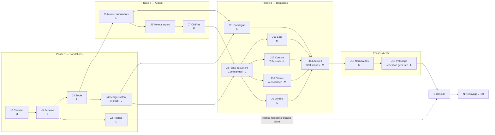

# 07 — Plan d'exécution

**Date : 17 septembre 2026.**

**But du document.** Dire comment construire la refonte de « Nuréa Gestion » (PWA admin iOS de Nuréa Parfums) **jalon par jalon, sans jamais casser l'app en production ni perdre une donnée** : stratégie de bascule, migration des données réelles, jalons ordonnés avec contenu, dépendances, critères d'acceptation vérifiables et taille relative, vérifications continues, risques et parades, définition de « terminé ». Ce document est autoportant : un exécutant (agent IA ou humain) qui n'a jamais vu ce repo peut le suivre du premier commit à la suppression du schéma `legacy`, en ouvrant les documents amont seulement quand un jalon y renvoie.

**Docs amont** (tous lus et appliqués) :
- `docs/refonte/00-README.md` — cadre, directive prioritaire, invariants.
- `docs/refonte/01-AUDIT-EXISTANT.md` — carte fonctionnelle §3 (**liste de non-régression**, reprise en §6.3 ci-dessous), bugs §4, contrat vitrine §5.
- `docs/refonte/02-VISION-PRODUIT.md` — tâches et objectifs de vitesse §2, périmètre v1 §4, nouveautés N1–N11 §5, vocabulaire §6, sécurité §7.
- `docs/refonte/03-MODELE-DONNEES.md` — schéma cible §3, transactions T1–T15 §4.3, SQL des chiffres §5, **stratégie de migration §7** (ordonnancée ici).
- `docs/refonte/04-ARCHITECTURE.md` — arborescence §2, pile d'écriture §3, transactions §4, argent §5, chiffres §6, auth §8, cache §10, PWA §14, tests §16, scripts §17.
- `docs/refonte/05-DESIGN-SYSTEM.md` — tokens §2, briques §3, gestes §4, règles d'écran §5.
- `docs/refonte/06-ECRANS-PARCOURS.md` — navigation §1, **parcours chronométrés §2** (critères de §6.4 ci-dessous), écrans et sheets §3, points transmis §8.

**Écart intégré le 17/09/2026.** La branche `refonte/integration` et cette conception sont parties de l'ancien `main` local (`47aaad4`) alors que la production tournait sur `9e0b5d8` (11 commits de plus, 01 §3.11). Intégré ici : trois migrations de production avant l'expand (§2.1), restauration et reprise adaptées (§2.2, §2.5), jalons touchés J2, J4, J8, J11, J12, J13 et §3.0.3, non-régression NR-11.x (§6.3), PC-13 (§6.4). **Critère 4 de §3.0.1** (« `main` fusionnée dans `refonte/integration` depuis moins de 7 jours ») : il n'était pas tenu — c'est ce qui a laissé l'écart grandir.

**Docs aval** : aucun. Ce document est le dernier de la série ; l'exécution le suit. Toute décision qu'un jalon remet en cause est d'abord amendée dans le document amont concerné (principe de 02 §8 : une documentation qui ment est un bug).

**Directive prioritaire du client** : la prise en main et l'aspect pratique priment ; la sécurité est secondaire. Dans ce plan, elle se traduit par trois choix d'ordonnancement : (1) les écrans du geste quotidien (fiche document, encaissement, Vendre) arrivent **avant** les écrans de lecture ; (2) le gérant manipule la nouvelle app sur ses vraies données (copie) **dès le premier écran livré**, pas à la fin ; (3) une nouveauté qui ne sert pas une tâche terrain peut glisser après la bascule sans la bloquer (§3, J15).

**Conventions.** Tailles relatives reprises de 02 §5 : **S** < 1 jour, **M** 1–3 jours, **L** > 3 jours (un jalon qui dépasse deux semaines est découpé). « Le gérant » est l'unique utilisateur (02 §1). Les commandes s'exécutent à la racine du repo ; `npx tsc --noEmit` et `npm run typecheck` sont équivalents. Les chiffres s'écrivent **Encaissé / À encaisser / Marge nette / Trésorerie**, sans synonyme.

---

## 0. Le plan en bref

| # | Décision | § |
|---|---|---|
| 1 | **Même dépôt, construction en place sur une branche d'intégration** `refonte/integration`, qui remplace le code de gestion à ses emplacements cibles (04 §2). Ni remplacement progressif en production (modèles de données incompatibles), ni arborescence v2 parallèle (répéterait l'échec de la « gestion v2 »). | 1.1 |
| 2 | **La production reste sur `main` et l'app actuelle, intacte**, jusqu'au jour J. Seules deux petites livraisons partent sur `main` avant : retrait du `slug` parfum du catalogue public, et mode maintenance de la gestion (inactif par défaut). | 1.4 |
| 3 | **Préproduction dès J0** : projet Supabase distinct (base « répétition » = copie restaurée de la production, bucket d'images vide), déploiement Vercel de la branche. Le gérant y teste chaque écran sur **ses vraies données migrées**. | 1.3 |
| 4 | **La reprise des données est écrite tôt (J2) et rejouée à chaque jalon** sur une copie fraîche de la production. La bascule n'exécute que ce qui a été répété. | 2 |
| 5 | **Bascule en une fenêtre de maintenance courte** : gel, dump, dernière répétition sur une « jumelle » restaurée du même dump, puis expand → reprise → contract en production, promotion d'une build **préconstruite**, contrôles, feu vert du gérant. | 1.6 |
| 6 | **Retour arrière unique avant le feu vert** : restauration du dump + promotion du déploiement précédent. Après le feu vert : correctifs vers l'avant, schéma `legacy` conservé 30 jours. | 1.7 |
| 7 | **Contrôles chiffrés bloquants** : solde de chaque poche et Trésorerie au centime, À encaisser au centime, Encaissé « à périmètre constant » égal à l'ancien au centime, Encaissé nouvelle définition expliqué au centime (résidu 0,00 €). | 2.5 |
| 8 | **17 jalons** (J0–J16) en cinq phases — fondations, argent, domaines, nouveautés, polissage — puis la bascule (B) et le nettoyage à J+30 (N). Chacun a des critères exécutables. | 3 |
| 9 | **Deux seuils de fin** : « prêt à basculer » (non-régression complète, parcours du quotidien tenus, répétition générale réussie) et « refonte terminée » (tout le périmètre v1, schéma `legacy` supprimé). | 6 |



**Deux pistes parallèles possibles** après J3 : une piste interface (J4, puis J11) et une piste serveur (J5 → J6 → J7) ; J2 avance en parallèle de J3. Elles se rejoignent à J8.

---

## 1. Stratégie de bascule

### 1.1 Les options, et la décision

| Critère | A. Remplacement progressif en production (domaine par domaine, derrière l'app actuelle) | B. Arborescence v2 parallèle dans le même déploiement (`app/admin-v2`, `src/v2/*`) | **C. Même dépôt, construction en place sur une branche d'intégration, bascule unique** |
|---|---|---|---|
| Compatibilité des données | **Impossible sans double écriture** : l'ancienne app écrit `Order`/`Sale`/`remainingDue`, la nouvelle `SaleDocument`/`Payment` (03 §3). Faire cohabiter les deux exigerait une synchronisation permanente entre deux modèles de l'argent — exactement le « cache à écrivains multiples » et les « deux piles d'écriture » que 02 §8 interdit. La reprise de 03 §7 est « tout ou rien » en une transaction. | Même problème : un seul `schema.prisma`, un seul client Prisma, une seule base ; les deux arborescences ne peuvent pas lire deux schémas. | Aucun problème : la branche vit sur une copie migrée ; la production garde son schéma jusqu'à la bascule. |
| Invariants du projet | Deux définitions de l'Encaissé coexisteraient à l'écran pendant des semaines (contraire à 02 §6). | Viole « Interdit : créer un second jeu de composants admin hors de `src/ui/*` » (CLAUDE.md) ; les chemins cibles de 04 §2 (`src/server/documents`…) côtoieraient les anciens. | Tous tenus : le code cible est écrit directement à son emplacement définitif. |
| Risque d'abandon | Faible en apparence, mais chaque domaine « à moitié migré » rend le suivant plus cher. | **Élevé** : c'est la forme exacte de la « gestion v2 » abandonnée (tables parallèles, jamais fusionnées, 01 §4.8). | Réel (branche longue) : traité par des parades explicites (§1.2, risque R1 en §5). |
| Double travail | Adaptateurs jetables entre modèles. | Déplacement final de tout le code v2 vers ses vrais emplacements. | Aucun. |
| Usage de l'app pendant le chantier | Perturbé à chaque domaine basculé. | Deux apps admin dans la même PWA. | **Inchangé** : le gérant garde l'app actuelle en production. |

**Décision : option C.** La raison déterminante est le modèle de données : 03 unifie commande et vente et déplace l'euro dans `CashMovement` ; aucun état intermédiaire où l'ancienne et la nouvelle app écrivent la même base n'est sûr. On construit donc **tout** à côté de la production, sur une copie de ses données, et on bascule **une fois**, après l'avoir répété.

**Pourquoi cette fois la branche ne mourra pas** (l'échec de la v2 était une branche jamais fusionnée) :
1. **La reprise des données est écrite au deuxième jalon** (J2), pas à la fin : le risque principal est levé tôt, sur les vraies données.
2. **Le gérant utilise la préproduction dès J8** : la branche produit de la valeur visible toutes les une à deux semaines, pas un « big bang » invisible.
3. **`main` est fusionnée dans la branche chaque semaine** : la divergence reste bornée (la vitrine continue d'évoluer sur `main`).
4. **Chaque jalon est fusionné dans `refonte/integration` par une PR verte** : pas de travail en suspens hors de la branche d'intégration.
5. **La bascule a une date cible fixée à la fin de J14** (fin des domaines) et une ligne de coupe (§3, J15) : une nouveauté en retard ne retarde pas la bascule.

### 1.2 Organisation du dépôt

**Branches.**

| Branche | Rôle | Règles |
|---|---|---|
| `main` | Production (vitrine + ancienne gestion) jusqu'au jour J, puis production de la refonte | Aucune évolution de l'ancienne gestion pendant le chantier ; **`prisma/schema.prisma` et `prisma/migrations/` gelés** ; seuls entrent : les commits vitrine, les deux livraisons préalables (§1.4), les correctifs bloquants (§1.4). |
| `refonte/integration` | Intégration de la refonte ; déployée en préproduction | Créée depuis `main` à J0. Protégée : fusion uniquement par PR dont la CI est verte. `main` y est fusionnée au moins une fois par semaine et à chaque fin de jalon. Jamais de `rebase` (historique partagé). |
| `refonte/jNN-<sujet>` | Travail d'un jalon (ex. `refonte/j08-fiche-document`) | Créée depuis `refonte/integration`, fusionnée par PR. Un jalon volumineux peut être livré en plusieurs PR, chacune verte. |
| `hotfix/<sujet>` | Correctif bloquant sur l'ancienne app, pendant le chantier | Depuis `main`, fusionné dans `main`, puis `main` fusionnée dans `refonte/integration`. Si le correctif touche des données, un cas de test est ajouté à `tests/db/reprise.test.ts`. |

Le nom `refonte/integration` (et non `refonte`) est imposé par Git : une branche ne peut pas porter le même nom qu'un préfixe d'autres branches (`refonte` et `refonte/j08-…` ne peuvent coexister). La branche historique `rework` (déjà fusionnée) n'est pas réutilisée.

**Commits et PR.** Convention de l'existant : `type(portée): message en français` (ex. `feat(documents): la livraison partielle survit à l'édition`). Chaque PR de jalon reprend dans sa description la liste des critères d'acceptation du jalon (§3), cochés avec la commande exécutée et son résultat.

**CI (ajoutée à J0).** Le dépôt est sur GitHub et n'a pas de CI : `.github/workflows/refonte.yml` exécute, sur chaque PR vers `refonte/integration` et chaque push sur cette branche :
- job `verify` : Node 22, service PostgreSQL 15, `npm ci`, `npm run typecheck`, `npm run lint`, `npm test`, `npm run test:db` ;
- job `layout` (à partir de J4) : navigateurs Playwright, `npm run test:layout` ;
- job `parcours` (à partir de J8) : `npm run test:e2e`.

**Référence exécutable de l'ancienne app.** Pour comparer un comportement, l'exécutant garde l'ancienne app lançable à côté : `git worktree add ../nurea-ancien main`, puis `npm ci && npm run dev -- --port 3200` dans ce dossier, branché sur la base de répétition **restaurée mais non migrée** (§2.4, option `--sans-migration`). Les fichiers de l'existant à reprendre se lisent par `git show main:<chemin>` (tableau §3.0.3).

### 1.3 Environnements

| Environnement | Base | Stockage d'images | Code | Usage |
|---|---|---|---|---|
| **Production** | Supabase actuel (`lkdhqqzocmxtyarseizc`) | Bucket `catalog` actuel | `main` | Vitrine et ancienne gestion jusqu'au jour J |
| **Préproduction** | Projet Supabase **distinct** `nurea-repetition`, base `postgres` = copie de la production migrée par les vrais scripts (§2.4) | Bucket `catalog` **du projet de répétition** (vide au départ) | `refonte/integration`, déploiement Vercel de la branche (alias stable, ex. `gestion-preprod.vercel.app`) | Démonstrations, tests du gérant, parcours chronométrés, répétitions |
| **Jumelle** (jour J) | Même projet `nurea-repetition`, restaurée depuis le dump de la bascule | idem | Tag de bascule | Dernière répétition sur des données identiques à la production (§1.6) |
| **Test local et CI** | PostgreSQL ≥ 15 jetable (`TEST_DATABASE_URL`) ; pour les tests via pooler (J6) : base `nurea_test` créée dans le projet de répétition, **jamais** la base `postgres` de répétition | Aucun (upload simulé) | Branche de travail | `npm run test:db`, `test:layout`, `test:e2e` |

**Garde-fous d'environnement (tous livrés à J0 ou J1, tous vérifiés par un critère) :**

1. **Variables Vercel séparées par environnement.** Les variables *Preview* pointent vers `nurea-repetition` : `DATABASE_URL`, `DIRECT_URL`, `NEXT_PUBLIC_SUPABASE_URL`, `SUPABASE_SERVICE_ROLE_KEY`, `SUPABASE_STORAGE_BUCKET`, un `ADMIN_JWT_SECRET` différent de la production, `NUREA_ENV=preprod`. Aucune clé Resend ni Fraganty en *Preview* (le formulaire de contact retombe sur son repli `mailto`).
2. **Projet Supabase distinct, pas seulement une autre base.** La préproduction supprime des images après suppression d'un parfum (04 §12) : avec la clé de service de production, elle effacerait des visuels de la vitrine. Avec un projet distinct, sa clé ne peut rien toucher en production. En complément, `src/server/catalogue/storage.ts` ne supprime **que** les URL qui commencent exactement par `${NEXT_PUBLIC_SUPABASE_URL}/storage/v1/object/public/${SUPABASE_STORAGE_BUCKET}/` (test unitaire, J11) : les visuels de production référencés par la copie restent intouchables.
3. **Images des deux projets affichables.** `next.config.mjs` code en dur l'hôte de production dans `supabaseImageRemotes()` (01 §5.6) : J0 y ajoute l'hôte lu dans `NEXT_PUBLIC_SUPABASE_URL` (sans retirer celui de production, que la copie référence).
4. **Garde des migrations dans le build** (J1) : `npm run build` n'applique **jamais** les migrations de la refonte (§2.3).
5. **Garde d'hôte dans les scripts de migration** (J2) : tout script qui écrit refuse de s'exécuter si l'hôte cible contient la référence du projet de production, sauf si l'argument `--confirm-host <hôte>` reproduit exactement cet hôte (pas d'invite interactive : exécutable par un agent, jamais par inadvertance).
6. **La préproduction se reconnaît au premier coup d'œil** (J4) : si `NUREA_ENV=preprod`, le shell affiche un bandeau fixe non fermable « Essai — ces données seront effacées », et le manifeste PWA suffixe le nom « (essai) ». Le gérant ne doit jamais saisir une vraie vente en préproduction ; s'il l'installe sur son écran d'accueil, l'icône dit « Nuréa Gestion (essai) ». Hors préproduction, ni bandeau ni suffixe.
7. **Indexation** : les déploiements de préproduction Vercel portent `x-robots-tag: noindex` par défaut ; la gestion est en plus `noindex` (01 §3.7).

### 1.4 Comment l'app actuelle reste utilisable pendant le chantier

- **Rien ne change pour le gérant** : `main` déploie l'ancienne app sur la base de production ; la refonte n'y touche pas.
- **Gel fonctionnel de l'ancienne gestion.** Pas de nouvelle fonctionnalité, pas de migration. Un bug de l'ancienne app se contourne (les contournements utiles sont notés pour la recette), sauf s'il est **bloquant** (perte de données en cours, app inutilisable pour vendre ou encaisser) : il suit alors le circuit `hotfix/*` (§1.2).
- **La vitrine continue d'évoluer** sur `main`, avec deux contraintes : pas de changement de schéma, et toute modification de `src/lib/catalogue-service.ts` est signalée dans la PR (c'est le fichier du contrat vitrine, adapté par la refonte à J1 et J11).
- **Deux livraisons préalables sur `main`** (J0), sans effet visible pour le gérant :
  - **L1 — Catalogue public sans `Perfume.slug`** : retrait de `slug: true` du `select` des parfums dans `loadPublicCatalogFromDb` (`src/lib/catalogue-service.ts`) ; le `slug` de **marque** reste lu (03 §6.3). Rend la vitrine indépendante d'une colonne supprimée par la migration.
  - **L2 — Mode maintenance de la gestion** : dans `middleware.ts`, si la variable `NUREA_GESTION_MAINTENANCE` vaut `1`, toute requête `/admin` ou `/admin/*` reçoit une page HTML statique 503 « Nuréa Gestion est en maintenance. Reviens dans un moment. » (aucune lecture en base, aucune redirection) et toute requête `/api/admin/*` un 503 JSON ; le `matcher` est étendu à `/api/admin/:path*`. Variable absente : comportement inchangé. Sert au gel du jour J (§1.6), sans rebuild ni changement de code ce jour-là.

### 1.5 Moment de la bascule : « prêt à basculer »

La bascule se déclenche quand **toutes** les conditions ci-dessous sont vraies (revue « go / no-go » la veille, en présence du gérant) :

| # | Condition | Preuve |
|---|---|---|
| G1 | Jalons J0 à J14 et J16 acceptés ; les éléments de J15 marqués « requis avant bascule » acceptés | PR fusionnées, critères cochés |
| G2 | Checklist de non-régression §6.3 : chaque ligne « présent » vérifiée en préproduction | Tableau §6.3 coché |
| G3 | Parcours chronométrés du quotidien (§6.4, lignes marquées « bascule ») tenus sur iPhone réel | Fiche de mesure |
| G4 | Répétition générale (J16) réussie de bout en bout, durées mesurées, retour arrière éprouvé | Journal de répétition |
| G5 | Dernière répétition de la reprise sur une copie de moins de 24 h : V1–V8 et C1–C5 verts, résidu 0,00 € | Rapport de reprise |
| G6 | Listes d'arbitrage R4 relues avec le gérant ; aucun cas « à investiguer » ouvert | Compte rendu d'arbitrage (hors dépôt) |
| G7 | Build de la refonte **sans accès base** vérifiée (§2.3, critère de J16) | Sortie de commande |
| G8 | Créneau choisi par le gérant, hors activité (jour de fermeture ou soirée), et **pas** la nuit du changement d'heure (24→25 octobre 2026) ; fenêtre réservée = 2 × la durée mesurée en répétition générale | Agenda |
| G9 | **Bucket `catalog` (Supabase) : types d'origine autorisés** — la conversion WebP se fait désormais côté serveur, l'appareil envoie son fichier d'origine sous `tmp/`. Le bucket doit accepter `image/jpeg`, `image/png`, `image/webp`, `image/gif`, `image/heic`, `image/heif` jusqu'à 12 Mo (il n'acceptait que `image/webp`). **Réglage à faire par le gérant dans la console Supabase.** | Envoi d'une photo JPEG depuis un iPhone en préproduction, visuel WebP affiché sur la fiche |

### 1.6 Procédure du jour J

Rôles : **l'opérateur** (l'exécutant du plan, poste avec accès Vercel CLI, `pg_dump`/`pg_restore`/`psql` de la même version majeure que PostgreSQL chez Supabase, Node 22, dépôt au tag de bascule) et **le gérant**. Toutes les sorties de commande sont archivées dans `migration-artifacts/<AAAA-MM-JJ>/` (dossier ignoré par Git : il contient des données clients).

**La veille (J−1)**

| Étape | Action | Contrôle | Si échec |
|---|---|---|---|
| B−3 | Revue go / no-go (§1.5) | G1–G8 vrais | Report |
| B−2 | Noter l'identifiant du déploiement de production courant **P0** (`vercel inspect <domaine de production>`) | Identifiant noté | — |
| B−1a | Depuis un checkout de `main` : `vercel deploy --prod --skip-domain --env NUREA_GESTION_MAINTENANCE=1` → déploiement **M** (ancienne app en maintenance, non promu) | Build verte ; URL de M notée | Corriger, recommencer |
| B−1b | Depuis le tag `bascule-<AAAA-MM-JJ>` posé sur `refonte/integration` : `vercel deploy --prod --skip-domain --build-env NUREA_SKIP_MIGRATE_DEPLOY=1` → déploiement **R** (refonte, non promu). **Personne n'ouvre l'URL de R avant B9** : son code vitrine, lu contre l'ancien schéma, mettrait en cache un catalogue vide partagé avec la production (03 §6.3, piège documenté). | Build verte ; URL de R notée | Corriger, recommencer |

**Le jour J**

| Étape | Action (commande) | Contrôle | Si échec |
|---|---|---|---|
| B0 | Le gérant ferme l'app ; les ventes de la fenêtre sont notées hors app et saisies après la réouverture | — | — |
| B1 | **Gel** : `vercel promote <M>` | `/admin` → 503 page maintenance ; `/` → 200 avec le nombre habituel de fiches | `vercel promote <P0>`, report |
| B2 | **Dump** (archive d'enquête, si `pg_dump` est disponible sur le poste) : `pg_dump --format=custom --schema=public --no-owner --no-privileges "$PROD_DIRECT_URL" -f prod-avant.dump` ; `pg_restore --list prod-avant.dump > /dev/null` ; empreinte `sha256sum` | Liste lisible, empreinte notée | Recommencer ; sinon `promote P0`, report |
| **B2b** | **Instantané de l'ancien monde — la source du retour arrière** *(amendement J17)* : `npm run migration:instantane -- --out prod/ --confirm-host <hôte prod>`. Lecture seule stricte (§2.2) ; ne demande que Node. C'est lui, et non le dump, que `migration:rollback` rejoue (§1.7). | Sortie 0 ; `prod/instantane/manifest.json` écrit, comptages = ceux de la production ; empreintes SHA-256 par table | Recommencer ; sinon `promote P0`, report — **sans instantané, pas de retour arrière : on ne va pas plus loin** |
| B3 | **Jumelle** : `npm run repetition:refresh -- --from-dump prod-avant.dump` (restauration dans `nurea-repetition`, puis référence, expand, reprise, contract, vérifications — §2.4) | Sortie 0 ; rapport de la jumelle archivé | `promote P0`, report, analyse |
| B3b | En parallèle de B4–B8 : déployer le tag en préproduction (sur la jumelle) et lancer `E2E_REMOTE=1 PLAYWRIGHT_BASE_URL=<préprod> npm run test:layout` puis `… npx playwright test parcours --project=Mobile` (V10 de 03) | Verts | Arrêt avant B9 ; retour arrière §1.7 |
| B4 | **Référence de production** : `npm run migration:reference -- --confirm-host <hôte prod> --out prod/` | Bloc `mesures` de `prod/reference.json` **identique** à celui de la jumelle (fichier trié et déterministe, §2.2 ; seuls diffèrent l'hôte et l'horodatage) : même dump, aucune écriture depuis B1, le gel a tenu | Arrêt ; `promote P0` ; analyse |
| B5 | **Expand** : `npm run migration:sql -- refonte_expand --confirm-host <hôte prod>` | Sortie 0 ; `_prisma_migrations` contient `…_refonte_expand` | Retour arrière §1.7 |
| B6 | **Reprise** : `npm run migration:reprise -- --apply --reference prod/reference.json --report prod/ --confirm-host <hôte prod>` | Sortie 0 ; `prod/rapport.json` identique à celui de la jumelle (hors horodatages) | Retour arrière §1.7 (la transaction a déjà annulé la reprise) |
| B7 | **Contract** : `npm run migration:sql -- refonte_contract --confirm-host <hôte prod>` | Sortie 0 | Retour arrière §1.7 |
| B8 | **Vérifications** : `npm run migration:verify -- --reference prod/reference.json --confirm-host <hôte prod>` | Sortie 0 (V6–V8, C1–C5, invariants, comptages vitrine en base) | Retour arrière §1.7 |
| B9 | **Mise en ligne** : `vercel promote <R>` | `/admin/login` affiche la nouvelle connexion ; `/` répond 200 | Retour arrière §1.7 |
| B10 | **Vitrine (V9)** : dans la nouvelle app, ouvrir un parfum en modification (E19) et taper « Enregistrer » sans rien changer — une écriture réelle déclenche `revalidateAdminCatalogue()` par construction (04 §10.2 ; la liste fermée de routes de 04 §3.5 exclut toute route de maintenance) ; puis recharger `/` | Nombre de fiches dans le DOM, de cartes « gamme » et de marques Explorer = référence | Retour arrière §1.7 |
| B11 | **Lecture seule en production** : `E2E_REMOTE=1 PLAYWRIGHT_BASE_URL=<prod> npx playwright test bascule --project=Mobile` (`e2e/bascule/lecture-seule.spec.ts`, J16) | Toutes les routes s'affichent sans `ErrorBanner` ; tuiles de l'Accueil = valeurs de B8 | Retour arrière §1.7 |
| B12 | **Revue du gérant** (≈ 20 min) : solde de chaque poche comparé à ce qu'il sait (espèces comptées si possible) ; liste À encaisser ; trois documents récents ; écarts historiques du journal expliqués avec le rapport R3 ; la PWA installée sur son iPhone s'ouvre sur la nouvelle version (toast « Nouvelle version » ou relance) | Feu vert explicite | Retour arrière §1.7 |
| B13 | **Réouverture** : le gérant reprend ; il saisit les ventes notées pendant la fenêtre | — | Correctifs vers l'avant (§1.8) |
| B14 | **Fusion** : PR du tag `bascule-<date>` vers `main` (commit de fusion) ; tag `avant-refonte` sur le dernier commit de `main` avant fusion. Le déploiement automatique de `main` reconstruit le même code (aucune migration de la refonte en attente : la garde laisse passer ; seuls les deux dossiers de socle historique de §2.1 sont appliqués, sans effet sur une base existante). | Le nouveau déploiement de production passe B11 à nouveau | Promouvoir de nouveau R |

### 1.7 Retour arrière

| Moment de l'échec | État de la base | Action | Données perdues |
|---|---|---|---|
| B1 à B4 | Inchangée | `vercel promote <P0>` | Aucune |
| B5 (expand) | Inchangée ou expand appliqué | **Restauration** puis `promote P0` (ci-dessous) | Aucune (gestion gelée depuis B1) |
| B6 (reprise) | Expand appliqué ; reprise annulée par sa transaction | Restauration puis `promote P0` | Aucune |
| B7 à B12 (avant feu vert) | Schéma de la refonte | Restauration puis `promote P0` ; si R avait été promu, la vitrine repasse sur l'ancien code | Aucune |
| Après le feu vert (B13) | Données nouvelles écrites | **Pas de retour de base.** Correctifs vers l'avant (§1.8). Le schéma `legacy` et le dump restent disponibles pour enquête. | — |

**Restauration — un seul chemin, Node seul, éprouvé** *(amendement J17, 22/09/2026)* :

> **Ce que ce paragraphe disait avant, et pourquoi il a changé.** Il décrivait un retour arrière en
> `pg_restore` + `psql` : sommaire du dump filtré, dump rendu en SQL, puis `rollback.sql` et le dump
> rejoués dans une transaction. **Le poste d'exploitation n'a ni `pg_restore` ni `psql`** (ni Docker
> pour en fournir) : ce chemin n'était pas exécutable le jour J, et n'a donc jamais été éprouvé. Le
> retour arrière livré ne demande que **Node et le client Prisma**. Il ne part pas d'un dump binaire
> mais de l'**instantané JSON** de l'ancien monde — celui-là même qu'extrait la répétition, en lecture
> seule stricte (§2.2). Le `pg_dump` de B2 reste pris quand l'outil est disponible : c'est l'archive
> d'enquête, ce n'est plus le chemin du retour.

Pourquoi on ne peut pas se contenter d'un `pg_restore --clean` : `--clean` ne supprime que les objets
**présents dans le dump**. Les objets créés par l'expand et le contract resteraient (`SaleDocument`,
`SaleLine`, `Payment`, `Setting`, nouveaux enums, fonctions et triggers `nurea_*`, vue
`DocumentBalance`, clés étrangères ajoutées à `CashMovement` et `BatchExpense`), et leurs clés
étrangères vers `Customer`, `Batch`, `Perfume` et `CashMovement` feraient échouer ses `DROP TABLE`
sans `CASCADE` : la base ne serait pas « strictement connue ». On **vide donc `public` et `legacy`
sans supprimer les schémas** (leurs droits par défaut et les extensions installées par Supabase sont
conservés), puis on rebâtit l'ancien monde.

1. `npm run migration:rollback -- --instantane <dossier> [--reference <fichier>] --confirm-host <hôte prod>`,
   qui enchaîne quatre phases chronométrées (`scripts/migration/rollback.ts`) :
   - **vidage**, en **une** transaction (`scripts/migration/lib/vidage.ts`) : vues et vues
     matérialisées, tables (`CASCADE` : index, contraintes, clés étrangères, triggers, séquences
     possédées), séquences restées seules, fonctions et procédures, enfin les types énumérés — dans
     `public` **et** dans `legacy`, en épargnant sans exception tout objet appartenant à une extension
     (`pg_depend.deptype = 'e'`). Les noms sont lus dans le catalogue et cités par `format('%I')`,
     jamais mis entre guillemets à la main. Un objet qui survivrait au balayage annule la transaction :
     rien n'est vidé ;
   - **schéma** : les dossiers de `prisma/migrations/` qui **précèdent** `…_refonte_expand`, un par un
     (`prisma db execute` puis `migrate resolve --applied`) — l'ancien monde tel que le dépôt le décrit ;
   - **données**, en **une** transaction : les lignes de l'instantané dans l'ordre des clés étrangères,
     `_prisma_migrations` **remplacée** par celle de l'instantané (aucune des deux migrations de la
     refonte n'y figure), puis séquences remises à niveau ;
   - **contrôle**, cinq assertions bloquantes : **R1** plus aucun objet de la refonte (tables, vue,
     fonctions `nurea_*`, triggers, enums) et `legacy` vide ; **R2** chaque table de l'instantané de
     retour dans `public`, à son compte exact ; **R3** `_prisma_migrations` = celle de l'instantané ;
     **R4** chaque séquence au-dessus du plus grand identifiant restauré ; **R5** la référence
     **recalculée** par `scripts/migration/reference.ts` — dans son propre processus, au même instant
     de mesure (`--instant`) — **identique au bloc `mesures` d'avant la bascule**. Un centime d'écart
     et la commande sort en erreur, avec « NE PAS ROUVRIR ».

   Le bloc `mesures` attendu est pris, dans l'ordre : `--reference <fichier>` s'il est donné ; sinon
   celui que la reprise a inséré dans `legacy."MigrationReference"` (lu **avant** le vidage, qui
   l'emporte) ; sinon `reference-attendue.json`, que la commande recopie dans son dossier de sortie dès
   qu'elle l'a lu — une relance après échec le retrouve là, l'instantané n'étant jamais modifié.

   **Ce que ce retour arrière ne promet pas** : les phases « schéma » et « données » ne peuvent pas
   entrer dans la transaction du vidage (le CLI Prisma applique chaque migration dans son propre
   processus). Entre la fin du vidage et la fin du chargement, `public` est vide. C'est sans
   conséquence le jour J — la gestion est gelée depuis B1 et l'ancienne app n'est repromue qu'ensuite —
   et cette fenêtre est comptée dans la fenêtre de bascule. **Mesurée le 22/09/2026** sur la copie des
   données réelles (35 documents, 281 parfums, 1 177 lignes) : **51,4 s au total**, dont 50,8 s pour
   les 24 dossiers de migration appliqués un par un (le démarrage du CLI Prisma, ≈ 2,1 s par dossier) ;
   le vidage prend 71 ms, le chargement 108 ms, les contrôles 385 ms.

   Si une phase échoue, sa transaction est annulée : on corrige et on relance la commande telle quelle.

2. `vercel promote <P0>`.
3. Vitrine : dans l'ancienne app, rouvrir un parfum et l'enregistrer sans changement (déclenche l'invalidation de l'existant, 01 §5.2), puis vérifier les comptages de V9.
4. Le gérant reprend l'ancienne app. Analyse de l'échec, correction, nouvelle date.

Pourquoi restaurer plutôt que laisser l'expand en place (option ouverte par 03 §7.9) : l'expand laisse une ligne dans `_prisma_migrations` inconnue des dossiers de `main` ; restaurer ramène la base à un état **strictement** connu, sans pari sur la tolérance de `prisma migrate deploy` lors d'un futur build de `main`. La durée de restauration a été mesurée en J17 (51,4 s, ci-dessus) et est comptée dans la fenêtre.

### 1.8 Après la bascule

- **J+0 à J+7 (surveillance)** : chaque matin, `npm run check:invariants -- --confirm-host <hôte prod>` (lecture seule) ; lecture des journaux Vercel (actions > 1 s, codes `UNEXPECTED` avec leur référence, 04 §9.5) ; cinq minutes de retour du gérant. Tout écart d'invariant est un incident prioritaire.
- **Arbitrages post-bascule du gérant, dans l'app** (listes R4) : remettre à 0 ou à leur valeur le stock des parfums qu'il suit réellement (S20) ; compléter les coûts inconnus (filtre « coût à compléter », E03) ; annuler, s'il le souhaite, les écarts historiques ou la compensation de reprise (E04, T12).
- **Correctifs** : branche `hotfix/<sujet>` depuis `main`, `npm run verify` + `npm run test:layout` si UI, PR, déploiement. Toute évolution de schéma est désormais une migration normale (nouveau dossier), appliquée par le build.
- **J+30 : jalon N (nettoyage)** — détaillé en §3.6.
---

## 2. Migration des données

La stratégie (quoi migrer, comment, avec quelles règles) est entièrement fixée par 03 §7 et n'est pas redite ici. Ce chapitre fixe **quand** elle se joue, **avec quels scripts**, **comment elle se répète** et **quels chiffres prouvent** qu'aucun euro n'a bougé.

### 2.1 Quand elle se joue

| Moment | Ce qui se passe | Base |
|---|---|---|
| J1 | Les migrations `…_refonte_expand` et `…_refonte_contract` sont écrites et testées **sur base vide** | Test |
| J2 | Scripts de reprise écrits, testés sur un jeu « ancien schéma » synthétique, puis **première répétition sur copie réelle** ; rapport relu avec le gérant | Test, puis répétition |
| Fin de chaque jalon, J2 à J16 | **Répétition continue** : copie fraîche de la production, chaîne complète, rapport comparé au précédent (§2.4) | Répétition |
| Chaque modification des migrations ou de la reprise | Répétition immédiate (sinon la préproduction diverge du code) | Répétition |
| J16 | **Répétition générale** de la procédure du jour J, chronométrée, retour arrière compris | Répétition + mécanique Vercel |
| Jour J, B3 | Répétition sur la jumelle restaurée du dump de bascule | Jumelle |
| Jour J, B4–B8 | Exécution réelle | Production |
| J+30 | Suppression du schéma `legacy` (jalon N) | Production |

**Règle des deux migrations.** Jusqu'à la bascule, la refonte a **exactement deux** dossiers de migration : `prisma/migrations/<horodatage>_refonte_expand/` et `prisma/migrations/<horodatage>_refonte_contract/` (horodatages postérieurs à la **dernière migration ordinaire appliquée en production**, aujourd'hui `20260910160000_fix_delivered_at_backfill`). Tant qu'ils n'ont jamais été appliqués en production, **on les modifie** au lieu d'en ajouter : la base de test est recréée par `prisma migrate reset`, la base de répétition par restauration d'une copie. Après la bascule, toute évolution de schéma est un nouveau dossier ordinaire. La migration de nettoyage `…_refonte_cleanup` n'entre dans le dépôt **qu'à J+30** : présente plus tôt, le premier build de production l'appliquerait.

**Socle historique (ajouté à J1).** L'historique hérité ne se rejouait pas sur une base vide : la première migration (`20260326120000_brand_taxonomy`) modifie `Brand`, qu'aucune migration ne crée (la production a reçu `Brand`, `Perfume`, `AdminUser`, `AuditLog`, `ExternalImportSuggestion` et plusieurs colonnes de lignes par `prisma db push`). Deux dossiers intercalés le complètent : `20260325000000_socle_tables_initiales` (tables et enums d'avant les migrations, créés seulement si `Brand` n'existe pas) et `20260701091500_socle_colonnes_hors_migrations` (`OrderItem`/`SaleItem.unitCostDzd`, `exchangeRate`, `SaleItem.note`, en `ADD COLUMN IF NOT EXISTS`, lus par la migration suivante). Sans effet sur une base existante — vérifié sur une base déjà migrée, tables déplacées dans `legacy` comprises —, ils n'entrent pas dans la règle des deux migrations : en production, le premier `prisma migrate deploy` qui suit la bascule (B14) les enregistre sans rien modifier. Condition des bases jetables : encodage **UTF8** (des migrations héritées contiennent des caractères absents de WIN1252, encodage par défaut d'un PostgreSQL initialisé sous Windows en français).

**Migrations ordinaires de la production (écart intégré le 17/09/2026).** La branche est partie de l'ancien `main` local (`47aaad4`) alors que la production tournait sur `9e0b5d8` ; trois migrations appliquées en production le 10/09/2026 manquaient au dépôt de la refonte. Elles y sont désormais, **à l'octet près** (sommes SHA-256 égales aux `checksum` de `_prisma_migrations` de l'instantané de production) et s'ordonnent **avant** l'expand : `20260910120000_real_volumes_10_50_80` (30 → 10, 100 → 80, défaut `OrderItem.volumeMl` 80, rattrapage de `Order.deliveredAt`), `20260910140000_perfume_media` (table `PerfumeMedia`), `20260910160000_fix_delivered_at_backfill` (+ `README.md` du retour arrière des contenances). Sur une base vide, elles s'appliquent après les deux dossiers de socle (sans effet sur les données : aucune ligne). **Règle pour la suite** : toute migration ordinaire fusionnée dans `main` avant la bascule est recopiée telle quelle (même nom, même contenu) ; si son horodatage dépasse celui de l'expand, l'expand et le contract — jamais appliqués en production — sont **renommés** avec un horodatage postérieur. La restauration de répétition prend tous les dossiers qui précèdent l'expand (§2.2) : une migration de production oubliée y apparaît comme une table ou une colonne de l'instantané absente de la cible, et la restauration échoue.

### 2.2 Les scripts

Tous vivent dans `scripts/migration/` et `scripts/repetition/`, s'exécutent par `tsx`, n'importent **rien** de `src/server` (ils décrivent l'ancien et le nouveau monde en SQL, indépendamment du code applicatif), écrivent leurs sorties dans `migration-artifacts/<date>/` (ajouté à `.gitignore` à J0) et sortent avec un code non nul au moindre écart.

| Script (commande npm) | Rôle | Arguments | Écrit en base ? |
|---|---|---|---|
| `scripts/migration/reference.ts` (`npm run migration:reference`) | Calcule, **sur l'ancien schéma**, la référence de 03 §7.2 et les mesures C1–C6 de §2.5 (anciennes formules, copiées de `src/server/kpi/queries.ts` et `src/server/orders/financials.ts` de `main`), plus les trois comptages de la vitrine (requêtes de `catalogue-service.ts`). Refuse de s'exécuter si la table `Order` n'existe pas dans `public` (déjà migré). | `--out <dossier>` ; `--confirm-host` si production | Non (lecture seule) |
| `scripts/migration/apply-sql-migration.ts` (`npm run migration:sql`) | Applique **une** migration de la refonte à la main : `prisma db execute --file prisma/migrations/<nom>/migration.sql` (le fichier est enveloppé dans `BEGIN; … COMMIT;`), puis `prisma migrate resolve --applied <nom>`. Dans le contract, chaque `VALIDATE CONSTRAINT` est isolé dans un bloc `DO … EXCEPTION WHEN check_violation` (03 §4.9) : une contrainte que des lignes historiques violent reste `NOT VALID` sans annuler la transaction. Le retour arrière n'est **pas** ici : c'est une commande à part (`migration:rollback`, ci-dessous) ; `--rollback` est refusé avec un message qui y renvoie. | `<suffixe>` (`refonte_expand` ou `refonte_contract`) ; `--confirm-host` | Oui |
| `scripts/migration/reprise.ts` (`npm run migration:reprise`) | La reprise de 03 §7.3 étape 3 (3a à 3i), en **une** transaction interactive. **`--dry-run` par défaut** (ROLLBACK final) ; `--apply` pour valider. Refuse de démarrer si `SaleDocument` n'est pas vide. Insère la référence dans `legacy."MigrationReference"`, remplit `legacy."MigrationMap"`, exécute les assertions V1–V7 et C1–C5 **dans** la transaction (forme « dans la transaction » de 03 §7.8 : vue `DocumentBalance` créée par l'expand, nature des mouvements lue dans `kindV2`), écrit `rapport.json` et `rapport.md` (R1–R4). Code découpé par étape : `scripts/migration/reprise/3a-poche-systeme.ts` … `3i-assertions.ts`. | `--reference <fichier>` (obligatoire) ; `--apply` ; `--report <dossier>` ; `--confirm-host` | Oui (ou rien en `--dry-run`) |
| `scripts/migration/instantane.ts` (`npm run migration:instantane`) | **Instantané JSON de l'ancien monde** (B2b), la source du retour arrière. Lecture seule stricte : `BEGIN … REPEATABLE READ READ ONLY`, la liste des tables, un `row_to_json` par table, `ROLLBACK` — rien d'autre, par un client PostgreSQL minimal sans Prisma. Écrit `<dossier>/instantane/` (manifeste, un `.ndjson` par table, empreintes SHA-256, journal des instructions envoyées). | `--out <dossier>` ; `--confirm-host` | Non (lecture seule) |
| `scripts/migration/rollback.ts` (`npm run migration:rollback`) | **Retour arrière** de §1.7, avec Node seul (ni `pg_restore` ni `psql`) : vidage de `public` et `legacy` en une transaction, migrations d'avant l'expand, lignes de l'instantané, puis les cinq contrôles R1–R5 dont la référence recalculée au centime. Rapport `rollback.json` / `rollback.md`, durées par phase. | `--instantane <dossier>` (obligatoire) ; `--reference` ; `--out` ; `--confirm-host` | Oui |
| `scripts/migration/verify-post.ts` (`npm run migration:verify`) | Après le contract : V8 (contraintes validées ou listées), C1–C5 recalculés sur le schéma final contre la référence, invariants de 03 §5.7, comptages vitrine en base (V9), visuels story `PerfumeMedia` toujours dans `public`, nombre et empreinte = référence (V11). | `--reference <fichier>` ; `--confirm-host` | Non |
| `scripts/repetition/refresh.ts` (`npm run repetition:refresh`) | Chaîne complète sur `nurea-repetition` : dump de la production (lecture seule, schéma `public`) ou `--from-dump <fichier>` ; restauration ; `reference` ; `migration:sql refonte_expand` ; `migration:reprise --apply` ; `migration:sql refonte_contract` ; `migration:verify` ; comparaison au rapport précédent (§2.4). Chronomètre chaque étape. **Refuse toute cible dont l'hôte contient la référence du projet de production**, sans exception. | `--from-dump` ; `--sans-migration` (s'arrête après la restauration, pour lancer l'ancienne app) | Oui, sur la répétition uniquement |
| `scripts/migration/migrate-deploy-guarded.ts` (appelé par `npm run build`) | Garde du build (§2.3) | variables `NUREA_SKIP_MIGRATE_DEPLOY` | Oui (migrations ordinaires seulement) |
| `scripts/check-invariants.ts` (`npm run check:invariants`, 04 §7.3) | Invariants de 03 §5.7 à tout moment, en lecture seule | `--confirm-host` si production | Non |

**Variante locale de `repetition:refresh` (livrée à J2, en attendant le projet `nurea-repetition`).** La cible est une base PostgreSQL **locale** (`DIRECT_URL` sinon `DATABASE_URL`) : refus sans exception de toute URL de production, de tout hôte non local et de tout nom de base autre que `nurea_repetition…`/`nurea_test…` (la base est détruite puis recréée). Source : `--from-production` lit l'URL dans `SOURCE_DATABASE_URL` (jamais dans `.env`) et extrait un **instantané JSON** (`<out>/instantane/`, un fichier `row_to_json` par table de `public`, `_prisma_migrations` comprise, empreintes SHA-256) par un client PostgreSQL minimal qui n'envoie que `BEGIN ISOLATION LEVEL REPEATABLE READ READ ONLY`, la liste des tables (`information_schema.tables`), un `SELECT row_to_json(t)` par table et `ROLLBACK` — aucune instruction de session, aucune écriture ; `--from-snapshot <dossier>` rejoue un instantané. Restauration : base UTF-8, **tous les dossiers de migration qui précèdent `…_refonte_expand`** (aujourd'hui jusqu'à `20260910160000_fix_delivered_at_backfill`, socle et migrations de production du 10/09/2026 compris) appliqués un par un (`prisma db execute` puis `migrate resolve --applied`), lignes insérées par `json_populate_recordset` dans l'ordre des clés étrangères (colonnes explicites ; `_prisma_migrations` remplacée par celle de la source), séquences remises à niveau, comptages vérifiés. Sorties : `<out>/repetition-<HHMMSS>/` (`reference.json`, `rapport.*`, `verification.*`, `comparaison.*`, `durees.json`). `--from-dump` (variante Supabase, `pg_restore`) reste à écrire avec le projet de répétition.

**Chemins des scripts.** Un dossier de sortie relatif (`--out prod/`, `--report prod/`) est rangé sous `migration-artifacts/<date>/` ; un fichier d'entrée relatif (`--reference prod/reference.json`) est cherché depuis le répertoire courant puis sous `migration-artifacts/<date>/`. Les commandes du jour J (§1.6) écrivent donc toutes dans le dossier ignoré par Git.

**Déterminisme.** `reference.json` et `rapport.json` trient toutes leurs listes par identifiant et formatent les montants en chaînes à deux décimales : deux exécutions sur les mêmes données produisent le même bloc `mesures` (c'est ce qui rend possible le contrôle du gel en B4).

**Noms fixés ici pour `legacy."MigrationMap"`** (03 §7.3 ne les nomme pas) : `"oldTable" text`, `"oldId" text`, `"newTable" text`, `"newId" text`, `note text` (`oldTable` et `oldId` obligatoires). **`legacy."MigrationReference"`** : `id` (identité), `"computedAt" timestamptz`, `host text`, `reference jsonb` (le contenu de `reference.json`), `"insertedAt" timestamptz` ; une ligne par référence insérée. Une ligne par ancienne ligne reprise ou fusionnée (une `Sale` fusionnée dans le document de sa commande donne `("Sale", <Sale.id>, "SaleDocument", <Order.id>, "paire")`).

**Compléments de cas à l'algorithme de 03 §7.5–7.7**, décidés ici par analogie avec la règle « la pièce fait foi » que 03 §7.6 applique aux dépenses, et couverts par `tests/db/reprise.test.ts` :
- un `CashMovement` lié à un `PaymentTransaction` mais d'un **montant différent** de la pièce devient un écart historique (montant, poche, date inchangés) et un mouvement conforme est créé en « Non attribué » à la date du paiement ; la compensation 3g rééquilibre la poche ;
- une `Sale` dont `remainingDue` sort de `[0 ; totalRevenue]` : la cible `T` est bornée (03 §7.5), l'écart de bornage est mesuré (`D0`, §2.5) et listé en R4 ;
- une poche **archivée à solde non nul** fait échouer V6 : la première répétition (J2) dit si le cas existe ; s'il existe, la décision (désarchiver et lister, ou transférer) est prise avec le gérant et **codée dans la reprise** avant J3. *Répétition du 17/09/2026 sur l'instantané réel : le cas n'existe pas (trois poches archivées, toutes à 0,00 €).*
- une commande `DELIVERED` sans `Order.deliveredAt` est datée de son `updatedAt`, **jamais** de `deliveryAt` (livraison prévue ; erreur de rattrapage corrigée en production par `20260910160000_fix_delivered_at_backfill`) — cas 26 du jeu de test ;
- une ligne ou un tarif à une contenance hors 10 / 50 / 80 n'est **pas** retraduit : ligne listée en R4 (`volumesAtypiques`, `line_volume_ck` admise par V8) ; tarif listé en `catalogueHorsRegles` (`pricing_volume_ck` **non admise** par V8 : la répétition s'arrête et le gérant tranche). *Répétition du 17/09/2026 : aucun cas (lignes 10 / 50 / 80 seulement, tarifs idem).*

### 2.3 Les migrations ne s'appliquent jamais par accident

Le script `build` de 04 §17.3 (`prisma generate && prisma migrate deploy && next build`) appliquerait expand **et** contract d'un coup, sans la reprise entre les deux : le contract déplacerait les anciennes tables dans `legacy` et l'app afficherait une gestion vide. D'où, dès J1 :

```json
"build": "prisma generate && tsx scripts/migration/migrate-deploy-guarded.ts && next build"
```

`migrate-deploy-guarded.ts` :
1. si `NUREA_SKIP_MIGRATE_DEPLOY=1` : journalise « migrations non appliquées (build préconstruite) » et rend la main sans toucher la base ;
2. sinon, liste les dossiers de `prisma/migrations/` absents (ou non terminés) de `_prisma_migrations` ;
3. si l'un d'eux se termine par `_refonte_expand` ou `_refonte_contract` : **échec du build** avec le message « Migration de la refonte en attente : elle s'applique à la main (docs/refonte/07-PLAN-EXECUTION.md §1.6), jamais par un build. » ;
4. sinon, exécute `prisma migrate deploy`.

Conséquences : en production avant la bascule, un build de la refonte échoue au lieu de migrer ; en préproduction, la base de répétition a déjà ses migrations appliquées par `repetition:refresh`, le build passe ; la build préconstruite R (B−1b) ne touche pas la base. Au jalon N, le script est supprimé et `build` reprend la forme de 04 §17.3.

**Build sans base.** `next build` ne doit exécuter **aucune** requête (les écrans de gestion sont dynamiques, `/` est `force-dynamic`) : sinon la build préconstruite lirait l'ancien schéma avec le nouveau client. Vérifié en J16 : `NUREA_SKIP_MIGRATE_DEPLOY=1 DATABASE_URL=postgresql://x:x@127.0.0.1:1/x DIRECT_URL=postgresql://x:x@127.0.0.1:1/x npm run build` réussit.

### 2.4 Répétition à blanc

**Protocole** (`npm run repetition:refresh`), à chaque fin de jalon à partir de J2 :
1. dump de la production (lecture seule, aucun verrou applicatif) et restauration dans `nurea-repetition` ;
2. chaîne `reference → expand → reprise --apply → contract → verify` ;
3. comparaison automatique avec la répétition précédente : nouvelles lignes dans R3 (écarts historiques) et R4 (listes d'arbitrage), nouvelles catégories de mouvements, écart du résidu R1 ; **toute nouveauté est expliquée dans la PR du jalon** (donnée nouvelle saisie par le gérant, cas non prévu → test ajouté à `reprise.test.ts` et correction de la reprise) ;
4. durées par étape consignées (elles dimensionnent la fenêtre du jour J) ;
5. la préproduction est redéployée sur la base fraîche.

**Ce que la répétition ne remplace pas** : `tests/db/reprise.test.ts` (J2) couvre des cas **construits** (A, B, C de 03 §7.5 et chaque cas particulier de 03 §7.7 et de §2.2), y compris ceux qui n'existent pas encore dans la copie réelle ; la répétition couvre ce que les données réelles contiennent **vraiment**.

### 2.5 Vérifications chiffrées

**Tolérance : 0,00 €.** La consigne « à l'euro près » est tenue au centime : tous les montants sont des `numeric` exacts à deux décimales (03 §4.8), un écart d'un centime est un défaut, pas un arrondi.

Les contrôles C1–C5 sont **bloquants** : ils s'exécutent dans la transaction de reprise (échec ⇒ ROLLBACK) puis de nouveau après le contract (`migration:verify`). Ils complètent V1–V8 de 03 §7.8 sans les remplacer.

| # | Contrôle | Référence (ancien schéma, `reference.ts`) | Après migration | Règle |
|---|---|---|---|---|
| C1 | **Trésorerie** | Solde de chaque poche (archivées comprises) ; total des poches non archivées ; solde de la (des) poche(s) système | Mêmes requêtes sur le schéma final | Égalité par poche (= V1) **et** du total **et** du « non attribué » |
| C2 | **Encaissé à périmètre constant** | Ancien Encaissé global de `revenueSummary` | Même périmètre recalculé sur le nouveau modèle, moins l'écart de bornage `D0` | Égalité |
| C3 | **Encaissé, nouvelle définition** | C2 + décomposition `D1`, `D2` | Somme des mouvements `PAYMENT` | `nouveau = ancien − D0 + D1 + D2`, résidu 0,00 € (03 R1 : résidu non expliqué = bloquant) |
| C4 | **À encaisser** | Ancien À encaisser (`listOutstanding`) | Nouvelle définition (03 §5.3) | Égalité (= V3 global) |
| C5 | **Cohérence du ledger** | — | Σ `paid` des documents = Σ mouvements `PAYMENT` ; transferts à deux jambes de somme nulle ; poches archivées à solde nul | Égalités |
| C6 | Encaissé du mois courant, Marge nette globale | Anciennes formules | Nouvelles formules | **Informatif** (R1, R2) : les définitions changent (date du paiement, coûts inconnus) |

**SQL de référence (ancien schéma).**

```sql
-- C1 : solde par poche, tel que l'app l'affichait (archivées comprises pour V1).
SELECT p.id, p.archived, p."isSystem",
       (p."openingBalance" + COALESCE(SUM(m.amount), 0))::numeric(12,2) AS solde
FROM "Pocket" p LEFT JOIN "CashMovement" m ON m."pocketId" = p.id
GROUP BY p.id ORDER BY p.id;

-- Payé net et total de chaque commande sans vente (base de C2, C3, C4).
CREATE TEMP VIEW ref_commandes AS
SELECT o.id, o.status,
       (SELECT COALESCE(SUM(i."unitPrice" * i.quantity), 0) FROM "OrderItem" i WHERE i."orderId" = o.id) AS total,
       (SELECT COALESCE(SUM(CASE WHEN t.type = 'REFUND' THEN -t.amount ELSE t.amount END), 0)
          FROM "PaymentTransaction" t WHERE t."orderId" = o.id) AS paye
FROM "Order" o
WHERE NOT EXISTS (SELECT 1 FROM "Sale" s WHERE s."orderId" = o.id);

-- C2 (référence) : ancien Encaissé global = ventes (total − reste dû, NON borné)
--   + commandes READY/DELIVERED sans vente, payé plafonné au total et planché à 0 (orderComptaMath).
SELECT (SELECT COALESCE(SUM("totalRevenue" - "remainingDue"), 0) FROM "Sale")
     + (SELECT COALESCE(SUM(GREATEST(LEAST(paye, total), 0)), 0) FROM ref_commandes
         WHERE status IN ('READY', 'DELIVERED'))                                   AS encaisse_ancien;

-- D0 : écart de bornage des ventes (03 §7.5 borne T dans [0 ; totalRevenue]).
SELECT COALESCE(SUM(("totalRevenue" - "remainingDue")
                    - LEAST(GREATEST("totalRevenue" - "remainingDue", 0), "totalRevenue")), 0) AS d0
FROM "Sale";

-- D1 : paiements nets des commandes sans vente en attente ou annulées
--      (hors de l'ancien Encaissé, dans le nouveau : un acompte conservé est de l'argent encaissé, 03 §5.2).
SELECT COALESCE(SUM(paye), 0) AS d1 FROM ref_commandes WHERE status IN ('PENDING', 'CANCELLED');

-- D2 : part du payé net des commandes confirmées/livrées sans vente que l'ancien plafonnement ignorait
--      (trop-perçus, payés nets négatifs).
SELECT COALESCE(SUM(paye - GREATEST(LEAST(paye, total), 0)), 0) AS d2
FROM ref_commandes WHERE status IN ('READY', 'DELIVERED');

-- C4 (référence) : ancien À encaisser = restes dus des ventes (bornés) + dû des commandes confirmées sans vente.
SELECT (SELECT COALESCE(SUM(LEAST(GREATEST("remainingDue", 0), "totalRevenue")), 0) FROM "Sale")
     + (SELECT COALESCE(SUM(GREATEST(total - paye, 0)), 0) FROM ref_commandes
         WHERE status IN ('READY', 'DELIVERED'))                                   AS a_encaisser_ancien;
```

**SQL après migration (schéma final).** Ces requêtes servent **deux fois**. Dans la transaction de reprise (étape 3i, avant le contract), elles s'exécutent telles quelles — la vue `DocumentBalance` existe depuis l'expand (03 §7.3) — à **une** substitution près : `m.kind = 'PAYMENT'` s'écrit `m."kindV2" = 'PAYMENT'`, car `kind` porte encore l'ancien enum, sans valeur `PAYMENT`, jusqu'au contract (03 §7.8, forme « dans la transaction »). `verify-post.ts` les exécute dans la forme ci-dessous. Les deux formes sont produites par le même module des scripts de migration (partagé par `reprise/3i-assertions.ts` et `verify-post.ts`), paramétré par le nom de la colonne de nature : jamais deux copies à tenir à la main.

```sql
-- C2 (après) : périmètre de l'ancien Encaissé, sur le nouveau modèle.
WITH doc_vente AS (
  SELECT DISTINCT "newId" AS id FROM legacy."MigrationMap"
  WHERE "oldTable" = 'Sale' AND "newTable" = 'SaleDocument'
)
SELECT COALESCE(SUM(b.paid) FILTER (WHERE b."documentId" IN (SELECT id FROM doc_vente)), 0)
     + COALESCE(SUM(GREATEST(LEAST(b.paid, b.total), 0)) FILTER (
         WHERE b."documentId" NOT IN (SELECT id FROM doc_vente)
           AND b.status IN ('CONFIRMED', 'DELIVERED')), 0)                         AS encaisse_perimetre_ancien
FROM "DocumentBalance" b;
-- Règle : encaisse_perimetre_ancien = encaisse_ancien − d0.

-- C3 (après) : Encaissé, définition canonique (03 §5.2), depuis toujours.
SELECT COALESCE(SUM(m.amount), 0)::numeric(12,2) AS encaisse_nouveau
FROM "CashMovement" m JOIN "Payment" p ON p."movementId" = m.id
WHERE m.kind = 'PAYMENT';
-- Règle : encaisse_nouveau = encaisse_ancien − d0 + d1 + d2, au centime.

-- C4 (après) : À encaisser canonique (03 §5.3).
SELECT COALESCE(SUM(due), 0)::numeric(12,2) AS a_encaisser
FROM "DocumentBalance" WHERE status IN ('CONFIRMED', 'DELIVERED');
-- Règle : a_encaisser = a_encaisser_ancien.

-- C5 : cohérence du ledger.
SELECT (SELECT COALESCE(SUM(paid), 0) FROM "DocumentBalance")
     = (SELECT COALESCE(SUM(m.amount), 0) FROM "CashMovement" m
         JOIN "Payment" p ON p."movementId" = m.id)                               AS paye_egal_mouvements;
SELECT "transferGroupId" FROM "CashMovement" WHERE kind = 'TRANSFER'
GROUP BY "transferGroupId" HAVING COUNT(*) <> 2 OR SUM(amount) <> 0;             -- attendu : aucune ligne
```

Pourquoi l'identité C3 tient : après la reprise, chaque document issu d'une vente a `paid = T` exactement (03 §7.5, étapes 2 à 4) et chaque commande sans vente a `paid` = son payé net (cas B). Donc `Σ paid = Σ T + Σ payé net` ; l'ancien Encaissé vaut `Σ (T + écart de bornage) + Σ payé plafonné des commandes confirmées` ; la différence est exactement `−D0 + D1 + D2`. Un résidu non nul révèle un paiement mal rattaché, un mouvement mal classé ou un cas non prévu : la reprise s'arrête.

**Comptages** (bloquants, = V5) : documents = commandes + ventes − paires ; lignes = `OrderItem` hors paires + `SaleItem` ; chaque `PaymentTransaction` a son `Payment` ; chaque ancien `CashMovement` est classé dans exactement une catégorie de 03 §7.6 ; tables conservées en place (`Customer`, `Batch`, `Brand`, `Perfume`, `PerfumePricing`, `PerfumeMedia`) = référence. **Vitrine** (bloquant, = V9) : parfums publiés, cartes « gamme complète », marques Explorer, identiques avant et après. **Visuels story** (bloquant, = V11, après le contract) : `PerfumeMedia` dans `public`, nombre et empreinte (toutes colonnes, date en millisecondes) identiques à la référence.

### 2.6 Rapport et arbitrage avec le gérant

- `rapport.md` est rédigé pour le gérant : en tête, les quatre chiffres « avant / après » (Trésorerie, Encaissé depuis toujours, À encaisser, Marge nette) avec une phrase d'explication par écart (C3, C6) ; puis les écarts historiques par poche (R3) ; puis les listes d'arbitrage (R4). Aucun identifiant technique sans le nom du client ou du parfum à côté.
- **Relecture n°1 à J2** (première copie réelle) : le gérant découvre les écarts historiques — notamment le double comptage de finalisation (01 §2.3 n°2), désormais visible — et confirme les décisions de 03 §7.7 (stock ≤ 0 → non suivi, coûts inconnus, dons à prix non nul).
- **Relecture n°2 à J16** (répétition générale) : liste finale, sans surprise par rapport à la n°1, sinon explication.
- Le compte rendu d'arbitrage est conservé **hors dépôt** avec les rapports (données personnelles).
---

## 3. Jalons

### 3.0 Conventions communes

#### 3.0.1 Définition de fin d'un jalon

Un jalon est accepté quand, **en plus** de ses critères propres :

1. la PR (ou la dernière PR du jalon) liste chaque critère avec la commande exécutée et son résultat ;
2. `npm run verify` (= `typecheck` + `lint` + `test` + `test:db`) et `npm run build` sont verts, en local et en CI ;
3. à partir de J4 : `npm run test:layout` vert si une interface admin a changé ; à partir de J8 : `npm run test:e2e` vert (parcours livrés jusque-là) ;
4. `main` a été fusionnée dans `refonte/integration` depuis moins de 7 jours, et `npx playwright test catalog-filters` (vitrine) est vert ;
5. à partir de J2 : une répétition fraîche de la reprise est verte et son rapport est comparé au précédent (§2.4) ;
6. la préproduction est déployée sur la base fraîche ; à partir de J8, les écrans du jalon ont été montrés au gérant (10 minutes) et ses retours sont notés dans la PR ;
7. tout écart avec un document amont a été amendé dans ce document (jamais « on verra plus tard »).

#### 3.0.2 Réconciliation des documents amont (faite à J0)

04 et 06 ont été écrits en parallèle : 06 §8.1 transmet à 04 des compléments que 04 n'intègre pas encore, et 06 §8.2 des amendements à 05. **Règle d'arbitrage : 06 fait foi pour ce qu'il transmet explicitement (présentation, navigation, gestes, textes) ; 04 fait foi pour tout le reste (couches, écriture, transactions, cache).** Les amendements suivants sont reportés dans 04 et 05 à J0, et sont ceux que les jalons appliquent :

| # | Amendement | Porté par |
|---|---|---|
| A-1 | Onglets : **Accueil · Commandes · Vendre · Clients · Catalogue** ; rattachements et parents de 06 §1.4 | J4 |
| A-2 | Route ajoutée `app/admin/(gestion)/compta/journal/page.tsx` (E04) | J12 |
| A-3 | Fiche document en **sheet adressable** `?doc=<id>` (+ `edition=1`) sur toute page du shell. **Montage décidé ici** : `PageScaffold` reçoit une prop `docId?: string` et rend `<Block><DocumentSheetBlock id={docId} /></Block>` ; chaque page de `src/features/*/pages` lit `searchParams.doc` et le passe. Un test d'architecture `tests/architecture/document-sheet.test.ts` vérifie que chaque page du groupe `(gestion)` transmet `docId`. Raison : pas de slot parallèle (`@sheet`), dont l'état persiste de façon peu prévisible lors des navigations douces. Les pages `commandes/[id]`, `commandes/[id]/modifier`, `compta/ventes/[id]`, `compta/ventes/[id]/modifier` et `commandes/nouvelle` de 04 §2.1 ne sont **pas** créées : ce sont des redirections de `next.config.mjs` vers `?doc=` et `/admin/vendre?mode=commande`. | J8, J9 |
| A-4 | Mémoire d'onglet, `onTabPress`, retour qui restitue le contexte du parent (06 §1.5) | J4 |
| A-5 | Actions composées transactionnelles : `deliverAndCollectAction` dans `src/server/documents/actions.ts` (T7 puis T4 dans **une** transaction) ; `collectAllAction` dans `src/server/payments/actions.ts` (un T7 par document, du plus ancien au plus récent, **une** transaction) | J6 |
| A-6 | Fiche parfum et tarifs en **un** enregistrement : `createPerfumeAction` et `updatePerfumeAction` acceptent la grille tarifaire dans leur entrée ; `savePerfumePricingAction` n'est pas créée | J11 |
| A-7 | Requêtes d'écran de 06 §8.1.6 (documents d'une période, séries du graphe par période, classement en unités, coût à compléter, récents du composeur, « Achète souvent », libellés de dépense récents) | J7, J9, J12, J15 |
| A-8 | Paramètres d'URL de 06 §8.1.7 et redirections complémentaires de 06 §1.6 | J3 (table), jalons d'écran |
| A-9 | « Refaire » / « Revendre » pré-remplissent le composeur (`?depuis=`, `?client=`, `?parfum=`) ; `duplicateDocumentAction` n'est pas créée (aucun appelant) | J9 |
| A-10 | 05 : prop `badge` de `TabBar`, ligne de résumé de `StickyAction`, `href` facultatif de `KpiTile`, brique `BarChart`, primitive `Switch`, superposition `ConfirmDialog` au-dessus d'une sheet imbriquée, liste fermée des écrans à glissement | J4 |
| A-11 | 04 §17.3 : forme transitoire de `build` (§2.3) ; scripts `migration:*` et `repetition:refresh` (§2.2) ; mode maintenance `NUREA_GESTION_MAINTENANCE` dans `proxy.ts` (§3.1, J3) ; bandeau de préproduction (§1.3) | J1, J2, J3, J4 |
| A-12 | Non-régression oubliée par 06 : **note par ligne** (`SaleLine.note`, 01 §3.1) éditable dans la rangée repliée « Coût » d'une ligne du composeur (E11) et de l'édition en place (S01) — reportée depuis dans 06 (E11 zone 5, S01 zone 4, §6.1) et 02 §4.1 | J8, J9 |
| A-13 | Arbitrage n°13 de 06 (bloc Argent de l'Accueil) : « Encaissé · (mois) » dominant avec « Marge nette · (mois) », tuiles À encaisser et Trésorerie, **sans** Encaissé depuis toujours ni tuile « Ce mois » (le total historique se lit dans Compta, période « Tout ») — reporté dans 02 §4.6 et §6 (décision « Simplifier ») et dans 04 §6.3 et §6.6 (contenu de `tableauDeBord()`) | J7, J14 |

#### 3.0.3 Fichiers de l'existant à reprendre

J1 retire l'ancienne gestion de la branche (elle ne compile plus contre le nouveau schéma). Ce qui mérite d'être repris se relit sur `main` (`git show main:<chemin>`) au jalon indiqué — jamais recopié sans relecture des règles de 04.

| Existant (`main`) | Devenir | Jalon |
|---|---|---|
| `src/lib/nommage.ts` (+ tests) | Reste en place, tel quel (02 §4.5) | — |
| `src/lib/admin/resoudMarque.ts` | `src/server/catalogue/resoudMarque.ts`, en **lecture seule** : le lecteur est un paramètre (`tx.db` ou client de lecture) ; `resoudMarqueParNom` rend `{ existante } \| { aCreer }` ; la création passe par `catalogueWriter.createBrand` (04 §2.1) | J11 |
| `src/domain/order-status.ts` (+ tests vitest) | `src/domain/document-status.ts`, `READY` → `CONFIRMED`, tests repris et adaptés | J3 |
| `src/domain/balance.ts`, `deriveFulfillment`, `signedAmount` et son test | `src/domain/document-balance.ts`, `src/domain/fulfillment.ts` ; signe porté par `insertMovement` | J3, J6 |
| `src/app-shell/*` (AdminShell, AppHeader, TabBar, navigation.ts + test, PullToRefresh, UndoProvider, ViewportSync + `useAdminKeyboardInset`, CommandPalette, ServiceWorkerRegistrar, PwaInstallHint) | Réécrits selon 05 §3.4 et 06 §1 (fusion viewport, Radix pour la palette) | J4, J16 |
| `src/ui/*`, `src/design/tokens.ts`, `src/design/globals.admin.css` | Consolidés selon 05 | J4 |
| `e2e/helpers/layoutInvariants.ts`, `e2e/layout-invariants.spec.ts` | Conservés, liste de routes mise à jour | J4 |
| `app/api/admin/login/route.ts` (hygiène : hash factice, message indifférencié) | `loginAction` | J3 |
| `src/lib/admin/revalidateAdminCatalogue.ts` (corps) | `src/server/cache/invalidate.ts` | J3 |
| `src/lib/admin/image-utils.ts`, `WindowedList`, `nureaAdminThumbLoader` | `src/features/catalogue/components/image-convert.ts` (sans recadrage pour un logo), briques conservées | J4, J11 |
| `scripts/create-admin.ts` | Sans rôle | J3 |
| `scripts/build-admin-pwa-assets.mjs`, `src/lib/pwa/manifests.ts`, `src/lib/pwa/admin-splash.ts` | Liste des cibles dans `src/lib/pwa/splash-targets.json` ; raccourcis mis à jour | J16 |
| Anciennes formules d'Encaissé et d'À encaisser (`src/server/kpi/queries.ts`, `src/server/orders/financials.ts`, `src/server/collect/queries.ts`) | Copiées **en SQL** dans `scripts/migration/reference.ts` uniquement (vérifié le 17/09/2026 : les commits `9a28437`…`9e0b5d8` ne changent pas la formule globale — seulement la recherche et le regroupement par lot) | J2 |
| *Écart du 17/09/2026 (`47aaad4..9e0b5d8`, 01 §3.11) — `main` désigne désormais `9e0b5d8` :* | | |
| `src/domain/volumes.ts` (+ test) | `VOLUMES_ML` = [10, 50, 80] et `DEFAULT_VOLUME_ML` = 80 dans `src/domain/sale-line.ts` ; `normalizeVolumeMl` / `LEGACY_VOLUME_ML` non repris (données déjà traduites ; une valeur hors règle est demandée, 03 §4.3) | J5 |
| `src/domain/order-status.ts` : `deliveredAtFor`, `DELIVERED_VISIBILITY_HOURS` | `timestampsAfter` de `document-status.ts` (déjà) ; la fenêtre de 48 h devient le segment « Livrées » de E10 (02 §4.1) | J5, J8 |
| `src/server/search/filters.ts` (+ `search-filters.test.ts`) | Règles de la recherche étendue (tous les mots, variante sans accents, termes ≥ 2 lettres, 6 au plus) dans `src/server/documents/queries.ts`, sur `SaleLine.perfumeName` / `brandName` au lieu du JSON | J8, J12, J13 |
| `src/server/batches/queries.ts` (`listUnbatched`), `src/features/batches/components/UnbatchedSection.tsx` | Zone « À rattacher » de E05 (06), requête dans `documents/queries.ts`, écriture T13 | J13 |
| `src/server/catalogue/media.ts`, `app/api/admin/perfumes/[id]/media/**`, `app/api/admin/storage/sign/route.ts` (`scope: "story"`), `src/lib/supabase/adminStorage.ts` (`safeImagePath` à portée, `removeObjects`) | `src/server/catalogue/media.ts` (writer, transaction) et `actions.ts` (`addPerfumeMediaAction`, `reorderPerfumeMediaAction`, `removePerfumeMediaAction`), `storage.ts` (chemin décidé par le serveur, suppression après commit), `createImageUploadUrlAction({ usage })` (04 §3.4, §12) | J11 |
| `src/lib/admin/image-utils.ts` : `prepareStoryImage`, mode `fit` de `convertToWebp`, HEIC | `image-convert.ts` (04 §12) | J11 |
| `src/ui/patterns/MediaGallery.tsx`, `src/features/catalogue/components/PerfumeMediaPanel.tsx`, pastille de `PerfumeListRow.tsx` | `src/ui/patterns/MediaGallery.tsx` (05 §3.2, couleurs et z-index en jetons), E16 zone 7, légende de E15 (06) | J11 |
| `src/design/globals.admin.css` (`.admin-theme` sans fond, `.admin-paint`, bandes d'empilement), `src/design/tokens.ts`, `src/ui/primitives/Toast.tsx` (portail), `src/ui/patterns/ConfirmDialog.tsx` (erreur dans la boîte, corps défilant) | Corrections reportées dans le design system de la branche (05 §2, §2.7, §3.1, §3.2 — **appliquées** le 17/09/2026, commit `01aaed2`) | J4 (reprise de l'écart) |

---

### 3.1 Phase 1 — Fondations

#### J0 — Chantier, environnements, vérifications préalables · **M**

**Dépend de** : rien.

**Contenu.**
- Branche `refonte/integration` protégée ; `.github/workflows/refonte.yml` (§1.2) ; `.gitignore` : `migration-artifacts/`.
- Scripts npm de 04 §17.3 et de §2.2 déclarés (ceux dont le fichier n'existe pas encore échouent explicitement « livré au jalon Jn ») ; Vitest mis à niveau (≥ 3.2) avec trois projets `unit`, `arch`, `db` dans `vitest.config.ts`.
- Alignement React 19 (`react`, `react-dom`, `@types/react`, `@types/react-dom`) et ajout de `server-only` (04 §17.4), l'ancienne app compilant encore sur la branche.
- Projet Supabase `nurea-repetition` ; variables Vercel *Preview* (§1.3, garde-fou 1) ; alias stable de préproduction.
- `scripts/repetition/refresh.ts` dans sa version « restauration seule » (`--sans-migration`), avec le refus de toute cible de production.
- `next.config.mjs` : hôte d'images lu dans `NEXT_PUBLIC_SUPABASE_URL` ajouté à `supabaseImageRemotes()`.
- **Vérifications de bibliothèques demandées par 04 §10.2 et §17.4** (petites preuves jetables, résultats consignés dans la PR) :
  - V-lib-1 : une extension `prisma.$extends({ query: { $allModels: { $allOperations } } })` enregistre, via `AsyncLocalStorage`, les modèles écrits **à l'intérieur** d'un `$transaction` interactif ;
  - V-lib-2 : dans Next 16, une server action qui appelle `updateTag` renvoie la page déjà rafraîchie (lecture de ses propres écritures, sans `router.refresh()`) ;
  - V-lib-3 : une transaction interactive Prisma via le pooler Supabase (port 6543, `pgbouncer=true`) avec un trigger `DEFERRABLE INITIALLY DEFERRED` qui lève au `COMMIT` : l'exception remonte au code et rien n'est écrit ;
  - V-lib-4 : `useOptimistic` et les types React 19 disponibles (`npm run typecheck`).
- Réconciliation documentaire §3.0.2 (amendements A-1 à A-13 reportés dans 02, 04 et 05 ; A-10, A-12 et A-13 le sont déjà) ; tableau de statut de `00-README.md` mis à jour.
- **Livraisons L1 et L2 sur `main`** (§1.4), par une branche `fix/vitrine-slug-maintenance`.

**Critères d'acceptation.**
- [ ] Sur la branche : `npm run typecheck`, `npm run lint`, `npm run build`, `npm test` verts ; CI verte sur une PR de test.
- [ ] `npm run repetition:refresh -- --sans-migration` restaure la production dans `nurea-repetition` ; `SELECT count(*) FROM "Sale"` et `FROM "CashMovement"` identiques des deux côtés au moment du dump.
- [ ] `DATABASE_URL=<url de production> npx tsx scripts/repetition/refresh.ts --sans-migration` sort en erreur avec le message de refus, sans rien écrire.
- [ ] La préproduction répond, affiche l'ancienne app sur la base de répétition, et une connexion avec le compte copié fonctionne.
- [ ] V-lib-1 à V-lib-4 : chacune « validée » ou « repli retenu » ; un repli est immédiatement amendé dans 04 §10.2 (repli prévu : `tx.touch(...)` explicite dans les writers et/ou `revalidateTag(tag, { expire: 0 })`).
- [ ] L1 en production : `/` affiche le même nombre de fiches qu'avant (comptage des cartes dans le DOM, toutes y sont, 01 §3.9) ; `npx playwright test catalog-filters` vert sur `main`.
- [ ] L2 : `NUREA_GESTION_MAINTENANCE=1 npm run build && npm run start` en local sur `main` ⇒ `curl -s -o /dev/null -w "%{http_code}" localhost:3000/admin` = `503`, idem `/api/admin/orders`, et `/` = `200` ; sans la variable, `/admin` redirige vers la connexion comme avant.
- [ ] `grep -n "compta/journal" docs/refonte/04-ARCHITECTURE.md` et `grep -n "Switch" docs/refonte/05-DESIGN-SYSTEM.md` trouvent les amendements.

#### J1 — Schéma cible, migrations, retrait de l'ancienne gestion · **L**

**Dépend de** : J0.

**Contenu.**
- `prisma/schema.prisma` = 03 §3, intégralement.
- `prisma/migrations/<horodatage>_refonte_expand/migration.sql` = 03 §7.3 étape 2 (schéma `legacy`, enums et tables neuves, colonnes nullables, `legacy."MigrationMap"` avec les noms de §2.2, `legacy."MigrationReference"`, **vue `DocumentBalance` et fonctions `nurea_period_start/end`** (03 §5.1) — nécessaires aux assertions de la reprise), enveloppé dans `BEGIN; … COMMIT;`.
- `prisma/migrations/<horodatage>_refonte_contract/migration.sql` = 03 §7.3 étape 4 : conversions et suppressions, CHECK en `NOT VALID` puis `VALIDATE CONSTRAINT` **chacun dans son bloc `DO … EXCEPTION WHEN check_violation`** (03 §4.9 : un échec laisse la contrainte `NOT VALID` sans annuler le contract), triggers (03 §4.10), déplacement des anciennes tables dans `legacy`. Aucune colonne lue par la vue `DocumentBalance` n'y change de type. Les deux fichiers s'appliquent aussi **sur une base sans données** (base de test).
- `scripts/migration/migrate-deploy-guarded.ts` et nouveau script `build` (§2.3).
- **Retrait de l'ancienne gestion de la branche** : `app/admin/` (sauf `layout.tsx`, repris à J4), `app/api/admin/**`, anciens `src/server/*`, `src/features/*`, `src/lib/gestion/`, `src/lib/admin/` (hors éléments du tableau §3.0.3), `src/schemas/`, hooks admin de `src/hooks/`, `src/domain/money.ts` et `balance.ts` actuels, `prisma/seed-migrate.ts`, scripts de maintenance qui lisent des modèles supprimés (`scripts/stock-a-creer.ts`, `stock-corriger.ts`, `repare-nommage.ts` : relus, supprimés s'ils touchent `Order`/`Sale`/`isPrivate`/`slug`, sinon adaptés), specs e2e de l'ancienne gestion (`admin-gestion`, `order-status`, `treasury`, `passe2-features`, `audit-screenshots`, `mobile-overlap`, `catalogue`, `marque-doublon` — leurs assertions utiles sont reprises par les parcours de J8–J11), `e2e/helpers/adminSession.ts`. `middleware.ts` reste jusqu'à J3.
- Vitrine : `src/lib/catalogue-service.ts` compile sur le nouveau client (type `PublicationStatus`), la partie admin (`getCachedAdminCatalogue`) est retirée (recréée à J11).
- Tests base : `tests/db/constraints.test.ts` (une insertion violant chaque CHECK de 03 §4.9 est refusée avec le **nom** de la contrainte ; index unique partiel de la poche système), `tests/db/triggers.test.ts` (03 §4.10 : `DELETE`/`UPDATE` refusés, mouvement `PAYMENT` sans pièce refusé au `COMMIT`, contre-passation incohérente refusée). Ces tests écrivent en SQL brut (autorisé dans `tests/`, pas dans `src/`).
- `tests/architecture/css-registers.test.ts` : `app/layout.tsx` n'importe aucune feuille ; seul `app/admin/layout.tsx` importe `globals.admin.css` ; seul `app/(shop)/layout.tsx` importe `globals.css`.

**Critères d'acceptation.**
- [ ] `npx prisma validate` vert.
- [ ] `npx prisma migrate reset --force --skip-seed` sur `TEST_DATABASE_URL` applique toutes les migrations, anciennes puis expand puis contract.
- [ ] `npx prisma migrate diff --from-migrations prisma/migrations --to-schema-datamodel prisma/schema.prisma --shadow-database-url "$SHADOW_DATABASE_URL" --exit-code` sort avec le code 0 (tables, colonnes, index et clés étrangères identiques ; CHECK, triggers et vue ne sont pas modélisés par Prisma).
- [ ] `npm run test:db` : `constraints` et `triggers` verts.
- [ ] Contract sur une base où une ligne viole un CHECK (base de test migrée jusqu'à l'expand par `prisma db execute`, une `SaleLine` au volume NULL insérée en SQL brut, puis `npm run migration:sql -- refonte_contract`) : sortie 0, la migration est enregistrée, `line_volume_ck` reste `NOT VALID` et toutes les autres contraintes sont validées (`pg_constraint.convalidated`).
- [ ] Sur une base où l'expand est en attente, `npm run build` échoue avec le message de §2.3 ; avec `NUREA_SKIP_MIGRATE_DEPLOY=1`, la garde laisse passer sans toucher la base.
- [ ] `npm run typecheck`, `npm run lint`, `npm run build` verts (vitrine complète, gestion vide) ; `npx playwright test catalog-filters` vert.
- [ ] `grep -rnE "prisma\.(order|sale|orderItem|saleItem|paymentTransaction|auditLog)\b" src app scripts` ne renvoie rien.
- [ ] `css-registers.test.ts` vert.

#### J2 — Reprise des données et première répétition réelle · **L**

**Dépend de** : J1. **En parallèle de** J3.

**Contenu.**
- `scripts/migration/reference.ts`, `apply-sql-migration.ts`, `reprise.ts` (+ `reprise/3a…3i`), `verify-post.ts` (§2.2) ; `scripts/repetition/refresh.ts` complété (chaîne complète, chronométrage, comparaison au rapport précédent), **en variante locale** (§2.2 : instantané JSON extrait en lecture seule, cible PostgreSQL locale) tant que le projet `nurea-repetition` n'existe pas. `apply-sql-migration.ts --rollback` (qui exige `pg_restore`/`psql`) n'est pas livré par cette variante.
- Assertions V1–V7 (03 §7.8) et C1–C5 (§2.5) dans la transaction, dans leur forme « dans la transaction » (vue `DocumentBalance` de l'expand, nature lue dans `kindV2`) ; rapport R1–R4 au format de §2.6.
- `tests/db/reprise.test.ts` : une base de test reçoit l'**ancien** schéma (application par `prisma db execute` de tous les dossiers de migration qui précèdent l'expand, dans l'ordre — les deux dossiers de socle de §2.1 compris, qui apportent aussi la colonne `SaleItem.note` du drift, et les trois migrations de production du 10/09/2026) ; ses bases portent le nom de la base de test en préfixe (`<base>_j2_reprise`, `<base>_j2_restaure`), pour que deux exécutions sur deux bases de test ne se détruisent pas ; un jeu de données construit contient au minimum : vente directe payée, vente à reste dû, vente dont la commande a été purgée, paire commande + vente avec acompte (double comptage de finalisation), paire dont la commande est restée `PENDING` sans paiement et paire dont la commande est `CANCELLED` avec acompte (horodatages de 03 §7.7), commande en attente avec acompte sans mouvement, commande confirmée partiellement livrée, commande annulée avec acompte, paiement annulé (REFUND « Annulation paiement (id) » sans mouvement), remboursement ordinaire avec `REFUND_OUT`, ventilation `SALE_IN` excédentaire, mouvement orphelin, doublon de mouvement, mouvement de paiement de montant divergent, transfert incomplet, dépense sans mouvement, dépense au montant divergent, poches système en double, `remainingDue` hors bornes et remonté après coup (`R < 0`), vente sans client, ligne sans nom, volume 75 ml et volume nul, coût inconnu enrichi depuis la commande appariée, don à prix non nul, stocks 5 / 0 / −2 ; **depuis l'écart du 17/09/2026** : contenances 10 / 50 / 80 sur toutes les autres lignes et le tarif, une ligne à la contenance héritée 30 ml non traduite, un visuel story `PerfumeMedia`, une commande livrée sans `deliveredAt` dont la livraison était prévue plus tard ; puis chaîne expand → reprise `--apply` → contract → verify.
- **Première répétition sur la copie réelle** et relecture n°1 du rapport avec le gérant (§2.6).

**Critères d'acceptation.**
- [ ] `npm run test:db -- reprise` vert : V1–V7 et C1–C5 verts sur le jeu construit, **avec les valeurs attendues écrites en dur dans le test** (soldes par poche, `encaisse_nouveau`, `d0`, `d1`, `d2`, À encaisser) ; chaque cas du jeu apparaît dans la bonne liste du rapport.
- [ ] Même test : les deux paires dont la commande n'était pas livrée ont `confirmedAt` = règle de 03 §7.7 (premier acompte s'il précède la vente, sinon `soldAt`) et V7 est vert.
- [ ] Même test, écart du 17/09/2026 : la ligne à 30 ml figure en R4 `volumesAtypiques` et dans V8 `line_volume_ck`, refuse toute mise à jour puis l'accepte une fois passée à 10 ml ; la commande livrée sans `deliveredAt` est datée de son `updatedAt`, pas de sa livraison prévue ; V11 vert, `PerfumeMedia` restée dans `public` avec `createdAt` en `timestamptz` au même instant.
- [ ] Même test, après le contract : sortie 0 malgré les volumes 75 ml, 30 ml hérité et nul et le don à prix non nul ; V8 liste `line_volume_ck` et `line_gift_ck` restées `NOT VALID` avec leurs lignes ; un `UPDATE "SaleLine" SET "deliveredQuantity" = 0` en SQL brut sur la ligne au volume nul est refusé par `line_volume_ck` (comportement qui motive la garde des lignes reprises, 03 §4.3, testée en J6).
- [ ] Même test, écart injecté (solde de référence d'une poche modifié de 0,01 €) : sortie non nulle, et `SELECT count(*) FROM "SaleDocument"` = 0 (ROLLBACK intégral).
- [ ] Même test, reprise lancée deux fois : la seconde refuse de démarrer (`SaleDocument` non vide).
- [ ] `npm run migration:reprise -- --reference <fichier>` (sans `--apply`) sur la répétition après expand : sortie 0, rapport produit, `SaleDocument` vide ensuite.
- [ ] `npm run repetition:refresh` : sortie 0 ; V8 listé ; C1–C5 verts ; résidu C3 = 0,00 € ; durées par étape consignées dans la PR. *17/09/2026, instantané réel du jour, après intégration de l'écart : sortie 0 de bout en bout, V1–V9, V11, C1–C5 verts, V8 sans contrainte restée `NOT VALID`, aucun écart historique ni compensation, 281 stocks passés en « non suivi », 1 coût inconnu ; total ≈ 90 s dont 81 s de restauration du schéma.*
- [ ] Rapport : chaque ancien `CashMovement` dans exactement une catégorie (V5) ; listes R4 présentes même vides.
- [ ] Relecture n°1 faite ; décisions consignées hors dépôt ; toute décision qui change la reprise est codée et testée avant la fin du jalon.
- [ ] Scripts appelés avec une URL de production sans `--confirm-host` : sortie non nulle, rien écrit.

#### J3 — Socle applicatif · **L**

**Dépend de** : J1. **En parallèle de** J2.

**Contenu** (04, emplacements de 04 §2.1).
- `src/domain/` : `money.ts` (04 §5), `document-status.ts` (repris, §3.0.3), `document-balance.ts`, `fulfillment.ts`, `stock.ts`, `publication.ts`, `periods.ts`, `phone.ts`, `ids.ts`, `errors.ts`.
- `src/contracts/` : `result.ts`, `zod-fr.ts`, `auth.ts` (les contrats des autres modules arrivent avec leur module).
- `src/server/` : `env.ts`, `core/` (`define-action.ts`, `define-query.ts`, `define-read-route.ts`, `errors.ts`, `error-messages.ts`, `log.ts`), `db/` (`client.ts`, `transaction.ts`, `locks.ts`, `unit-of-work.ts`), `cache/` (`tags.ts`, `cached.ts`, `invalidate.ts`), `auth/` (`token.ts`, `session.ts`, `actions.ts`, `writer.ts`).
- `proxy.ts` (04 §8.3) **avec le mode maintenance** : `NUREA_GESTION_MAINTENANCE=1` ⇒ réponse 503 avec `public/admin-maintenance.html` (autonome, CSS inline) pour `/admin/*`, 503 JSON pour `/api/admin/*` (le `matcher` couvre alors aussi `/api/admin/:path*`). Suppression de `middleware.ts`.
- `instrumentation.ts` ; `next.config.mjs` : `headers()` (04 §8.6) et `redirects()` (04 §2.3 + 06 §1.6 + redirections des adresses de document, A-3) ; `scripts/create-admin.ts` sans rôle.
- Règles ESLint de 04 (`decimal.js`/`decimal.js-light` hors `money.ts`, `Prisma.Decimal` hors `src/server/db/**`, `useSearchParams` hors `useUrlState`).
- `tests/architecture/` : `route-handlers`, `server-actions`, `queries-defined`, `table-ownership`, `layers`, `money-imports`, `cache-calls`, `offline-page` (en attente de J16, marqué `todo`), plus **`vocabulaire.test.ts`** (décidé ici : les chaînes littérales de `src/features`, `src/ui`, `src/app-shell` et `src/server/export` ne contiennent aucun terme interdit — « CA », « chiffre d'affaires », « bénéfice », « panier moyen », « prévision », « Saisie libre », « Anonyme », « Client inconnu », « À traiter », « Maison », « Galerie », « Sillage » — mots entiers, insensible à la casse sauf « CA » (sensible à la casse, pour ne pas confondre avec « ça ») ; l'invariant de vocabulaire est ainsi vérifié par une machine comme les autres, 04 §1.1).

**Critères d'acceptation.**
- [ ] `npm test` : `money.test.ts` couvre les 14 cas de 04 §5.4 ; `document-status` (tests repris, `CONFIRMED`) ; `document-balance` ; `phone` (« 06 12 34 56 78 » → `+33612345678`, « +33 6 12… », « 0033… », saisie invalide → `null`) ; `periods` (29 mars et 25 octobre 2026) ; `publication` ; `stock` ; tous les tests d'architecture verts.
- [ ] `npm run test:db` : `periods.test.ts` (fonctions SQL = `src/domain/periods.ts`), `invalidation.test.ts` (modèles écrits dans `inTransaction` enregistrés), rejeu d'idempotence (deux créations du même id ⇒ une ligne, deux succès), `LockOrderError` sur un ordre de verrous violé, backoff de connexion (5 échecs ⇒ verrou 1 min, puis 2, 4, 8, plafond 15, remise à 0 au succès).
- [ ] Un jeton signé au **format de l'existant** (avec la revendication `role`) et le même secret est accepté par `verifySessionToken` : les sessions en cours survivent à la bascule.
- [ ] `loginAction` refuse `retour=//exemple.com` et `retour=https://exemple.com` (destination `/admin`).
- [ ] En local (`npm run build && npm run start`) : `curl -I localhost:3000/admin` sans cookie ⇒ `307` vers `/admin/login?retour=%2Fadmin` ; avec un cookie forgé ⇒ même redirection ; `curl -I localhost:3000/admin/login` porte `Strict-Transport-Security`, `X-Frame-Options: DENY`, `X-Content-Type-Options: nosniff`, `Referrer-Policy: same-origin`.
- [ ] Avec `NUREA_GESTION_MAINTENANCE=1` : `/admin` ⇒ 503, `/` ⇒ 200.
- [ ] `curl -sIL -o /dev/null -w "%{url_effective}" localhost:3000/admin/ordres/abc` (cookie de session valide fourni) aboutit à `/admin/commandes?doc=abc` par redirections permanentes (chaîne de 04 §2.3 et A-3) ; un test unitaire vérifie que chaque destination de `redirects()` appartient à l'inventaire de 06 §1.2.

#### J4 — Design system, shell, connexion, harnais d'écran · **L**

**Dépend de** : J3. **En parallèle de** J5–J7.

**Contenu.**
- `src/design/tokens.ts` (source) et `globals.admin.css` (dérivée) selon 05 §2 ; `tests/architecture/tokens-sync.test.ts`.
- `src/ui/primitives/` et `src/ui/patterns/` : inventaire de 05 §3.1–3.2 avec les amendements A-10 (`Switch`, `BarChart`, résumé de `StickyAction`, `href` facultatif de `KpiTile`).
- `src/app-shell/` : `AdminShell`, `AppHeader`, `TabBar` (5 onglets de 06 §1.1, prop `badge`), `navigation.ts` (06 §1.4, mémoire d'onglet A-4), `routes.ts`, `Block.tsx`, `hooks/` (`useAction`, `useDraft`, `useUrlState`, `useCoalescedAction`, `useReadRoute`), `UndoProvider`, `PullToRefresh` (fin réelle ≥ 300 ms), service viewport unique, provider de toasts, cadre de `CommandPalette` sur Radix Dialog (sans résultats avant J8), bandeau de préproduction (§1.3, garde-fou 6).
- `app/admin/layout.tsx` (metadata inchangées, 01 §3.7), `app/admin/login/page.tsx` (E18), `app/admin/(gestion)/layout.tsx` (`requireSession` + shell), `loading.tsx`, `error.tsx`, `page.tsx` **provisoire** (titre « Accueil » et `EmptyState` « Écran livré au jalon J14 » ; remplacé à J14, cf. §6.2).
- Harnais e2e : `e2e/global-setup.ts` (migration de la base de test, `e2e/fixtures/seed.ts`, compte créé par `scripts/create-admin.ts`, connexion **par l'écran**, `storageState`), `e2e/helpers/tap.ts` (budget de taps), `e2e/routes.ts` (inventaire des routes et sheets de 06 §1.2 et §1.8, consommé par `layout-invariants.spec.ts`) ; mode `E2E_REMOTE=1` (pas de migration ni de seed, identifiants lus dans l'environnement) pour la préproduction et la production.
- Ajout à `e2e/helpers/layoutInvariants.ts` : au plus **un** bouton `primary` visible par écran ou par sheet (05 §3.1 « un seul primary visible »), repéré par `data-variant="primary"`.
- **Reprise de l'écart du 17/09/2026** (05, mentions « appliqué ») — **appliquée** le 17/09/2026 (commit `01aaed2`) : `.admin-theme` ne peint plus de fond (`.admin-paint` sur les conteneurs pleine page : coque et page de connexion) ; bandes d'empilement sheet imbriquée 80/81, modale 90/91, palette 92, toast 100 (`tokens.ts` puis feuille) ; `Toast` portalisé vers `<body>` avec `pointer-events: auto` ; `ConfirmDialog` affiche l'échec dans la boîte et fait défiler son corps. Le design system J4a de la branche avait été construit avant ces corrections de production (`3291428`, `12e2327`, `3707715`) ; il les porte depuis `01aaed2`, avec les invariants « couches peintes » et « accent d'onglet » et le banc e2e des couches (`e2e/parcours/couches.spec.ts`, `e2e/helpers/banc.ts`, qui compile par `esbuild`, dépendance de développement).

**Critères d'acceptation.**
- [ ] `npm test` : `tokens-sync`, `navigation.test.ts` (les 7 tests de 06 §1.4), `routes-builders`, `layers` verts.
- [ ] `npm run test:layout` vert sur E18 (clavier ouvert sur chaque champ) et sur l'Accueil provisoire, à 320, 375 et 430 px.
- [ ] e2e : connexion par l'écran ; mauvais mot de passe ⇒ « Identifiant ou mot de passe incorrect. » ; après 5 échecs ⇒ « Trop d'essais. Réessaie dans 1 min. » ; cookie supprimé puis navigation ⇒ E18 avec le message « Ta session a expiré… » et retour à l'écran d'origine après connexion.
- [ ] Préproduction : bandeau « Essai — ces données seront effacées » visible ; le manifeste (`/api/pwa/admin`) porte le nom suffixé « (essai) » ; en local sans `NUREA_ENV=preprod`, ni bandeau ni suffixe.
- [ ] `rg -n "#[0-9A-Fa-f]{3,8}\b" src/ui src/app-shell src/features` ne trouve aucune couleur hors `src/design/` (05 §2 : aucune valeur en dur).
- [ ] Écart du 17/09/2026 : `tokens-sync` échoue si la règle `.admin-theme` déclare un `background` ; `npm run test:layout` : une `ConfirmDialog` ouverte depuis une sheet imbriquée est au-dessus d'elle, son voile est translucide et sa carte blanche ; le toast « Annuler » affiché au-dessus d'une sheet ouverte répond au tap ; une `ConfirmDialog` dont l'action échoue reste ouverte avec le message.

*Mise en œuvre de la partie shell (17/09/2026, avant la reprise de l'écart).* Les **cinq** racines d'onglet ont une page provisoire (titre + `EmptyState` « Écran livré au jalon Jn ») pour que la barre d'onglets soit navigable : Accueil J14, Commandes J8, Vendre J9, Clients J10, Catalogue J11 — `test:layout` les couvre toutes. `routes.ts` porte l'état de chaque écran (à venir, provisoire, livré) : un jalon d'écran passe son écran en « livré » et l'ajoute à `e2e/routes.ts` (la spec échoue sinon). *À J14, l'Accueil était la dernière page provisoire : `EcranProvisoire` n'a plus d'appelant et a été retiré — plus aucun écran n'est « provisoire ».* Le harnais lance l'app en `next dev` (base e2e, secret de test, aucun `.env`) ; `E2E_SERVER=start` sert un build pour le projet Desktop seulement — le cookie `Secure` de production est refusé par WebKit sur `http://localhost`. Invariants ajoutés : un seul `primary` par écran ou sheet, libellé d'onglet jamais tronqué ; corrigés : texte `sr-only` n'est pas « rogné », une rangée étendue par pseudo-élément (`ListRow`) est une cible de la taille de la rangée. Détails : 04 §2.2 et §16.4, 05 §3.4, 06 §1.4, §1.5, E18 et S17.

---

### 3.2 Phase 2 — L'argent

Les trois jalons de cette phase ne livrent aucun écran : ils livrent **les écritures et les chiffres**, entièrement couverts par des tests sur un vrai PostgreSQL. Aucun écran ne doit précéder la règle d'argent qu'il appelle.

#### J5 — Moteur des documents et du stock · **L**

**Dépend de** : J3 (et J1).

**Contenu.**
- `src/contracts/documents.ts`, `customers.ts`, `batches.ts` (partie lot).
- `src/server/documents/writer.ts` : T1 **sans paiement** (document `ORDER` né `PENDING`, ou `DIRECT_SALE` né `DELIVERED`), T2 (modification **en place** : mise à jour, ajout, retrait de lignes ; quantités livrées conservées ; réserve si une quantité passe sous le livré), T3 (pointage absolu borné), T4 (transitions et horodatages, entrée en `DELIVERED` ⇒ `deliveredQuantity := quantity`), T6 (suppression sans paiement), T13 (rattachement au lot, lot `OPEN` exigé), rattachement et création de client en ligne, snapshots typés, `unitCostEur = dzdToEur(...)`.
- `src/server/documents/actions.ts` : `createDocumentAction` (branche sans paiement), `updateDocumentAction`, `setLineDeliveredAction`, `changeDocumentStatusAction`, `deleteDocumentAction`, `assignDocumentsToBatchAction`.
- `src/server/catalogue/stock.ts` (`applyDeliveredDeltas`, `setStock`, 04 §11) ; `src/server/catalogue/writer.ts` partiel (`upsertPricing` pour l'apprentissage N8).
- `src/server/customers/writer.ts` et `actions.ts` (création, modification, suppression refusée si un document `PENDING` ou `CONFIRMED` est lié ; messages de 04 §9.3).
- `src/server/batches/writer.ts` partiel et `actions.ts` : `createBatchAction`, `updateBatchAction`, `setBatchStatusAction`, `deleteBatchAction`.
- Tests : `tests/db/transactions/t01-create-document.test.ts` (sans paiement), `t02`, `t03`, `t04`, `t06`, `t13`, `tests/db/stock.test.ts` (04 §11), `tests/db/customers.test.ts`.

**Critères d'acceptation.**
- [ ] `npm run test:db -- transactions stock customers` vert ; chaque fichier T contient : cas nominal, gardes, **atomicité** (erreur injectée après la première écriture ⇒ aucune ligne en base).
- [ ] Régression du bug haute 01 §4.1 : T2 qui ne change qu'une note laisse `deliveredQuantity` intacte sur toutes les lignes.
- [ ] Régression du bug haute 01 §4.1 : `PENDING → CONFIRMED` sans acompte lève `NEEDS_CONFIRMATION` ; rappelée avec `confirm: true`, elle s'applique (une commande offerte à 0 € se confirme).
- [ ] Ligne `isGift` avec un prix non nul ⇒ `VALIDATION` (et le CHECK `line_gift_ck` refuse un contournement).
- [ ] Coût 30 000 DZD au taux 277 ⇒ `unitCostEur` = 108,30 ; coût DZD absent ⇒ `unitCostEur` NULL.
- [ ] Stock : vente directe d'un parfum suivi à 5 ⇒ 4 ; parfum non suivi (`NULL`) ⇒ inchangé ; livraison au-delà du stock ⇒ `NEEDS_CONFIRMATION` puis 0 ; annulation (T5, J6) et suppression (T6) restituent.
- [ ] Rattachement à un lot `CLOSED` ⇒ `CONFLICT` « Le lot « … » est clos : rouvre-le pour y rattacher cette vente. »
- [ ] Création de client au téléphone déjà pris ⇒ `CONFLICT` « Ce numéro est déjà celui de (nom). »
- [ ] `table-ownership.test.ts` vert (seul `documents/writer.ts` écrit `SaleDocument`/`SaleLine`, seul `catalogue/stock.ts` écrit `Perfume.stock`).
- [ ] Toute écriture de stock enregistre les modèles du catalogue ⇒ `revalidateAdminCatalogue()` appelée (test avec `next/cache` simulé).

#### J6 — Moteur de l'argent : encaissements, Trésorerie, dépenses · **L**

**Dépend de** : J5.

**Contenu.**
- `src/contracts/payments.ts`, `treasury.ts`, `settings.ts`, `batches.ts` (dépenses).
- `src/server/treasury/movements.ts` (`insertMovement`, `insertReversal`, `setMovementLabel` — seul INSERT de `CashMovement`), `treasury/writer.ts` (poches), `treasury/actions.ts` (`createPocketAction`, `updatePocketAction`, `archivePocketAction`, `deletePocketAction` (poche non système sans mouvement), `transferAction`, `adjustAction`, `recordSupplierPaymentAction`, `reverseMovementAction`), `treasury/queries.ts` (poches actives, journal par mois).
- `src/server/settings/` (`updateSettings`, `rememberPocket`, `getSettings`).
- `src/server/payments/writer.ts` (pièces `Payment` et corps de T8) et `actions.ts` : `recordPaymentAction` (T7, nature fixée par le serveur, plafond au dû, confirmation automatique sans réserve seulement), `voidPaymentAction`, `correctPaymentAction`, `refundAction` (T8), **`collectAllAction`** (A-5). Le corps de T7 et de `collectAll` vit dans `documents/writer.ts`, qui écrit le document (04 §3.4, mise en œuvre J6).
- Documents : T1 **avec paiements** (Σ ≤ total, poche mémorisée), T5 `cancelDocumentAction` (remboursements proposés, plafond au payé, verrou exclusif des poches de sortie), **`deliverAndCollectAction`** (A-5), **`revertDocumentChangeAction`** (T4b de 03 §4.3 : filet « Annuler » du toast après tout changement de statut, tout encaissement, « Livrer et encaisser » ou « Tout encaisser » ; `changeDocumentStatusAction`, `recordPaymentAction`, `deliverAndCollectAction` et `collectAllAction` renvoient le jeton d'annulation) ; garde des lignes reprises hors règles (03 §4.3) dans le writer `documents`.
- Lots : `addBatchExpenseAction` (T9, datable, jamais dans le futur), `deleteBatchExpenseAction` (T10).
- Tests : `t01` (variante avec paiements), `t04b-revert-document-change`, `t05`, `t07`, `t08`, `t09`, `t10`, `t11`, `t12`, `t15`, `tests/db/composed-actions.test.ts`, `tests/db/concurrency.test.ts`, `tests/db/invariants.test.ts` (requêtes de 03 §5.7 après chaque scénario).

**Critères d'acceptation.**
- [ ] `npm run test:db` entièrement vert.
- [ ] T7 : encaisser plus que le dû ⇒ `CONFLICT` « Le montant dépasse le reste dû (xx,xx €). » ; acompte sur `PENDING` sans réserve ⇒ document `CONFIRMED` et `confirmedAt` posé ; avec réserve ⇒ statut inchangé.
- [ ] T8 annuler : contre-passation **même poche, même date de valeur**, montant opposé ; seconde annulation du même paiement ⇒ `CONFLICT` « Ce mouvement a déjà été annulé. » ; annuler un **remboursement** ⇒ paiement d'entrée (DEPOSIT si non livré, BALANCE sinon) au mouvement positif qui contre-passe le REFUND, accepté par les triggers ; statut du document inchangé dans tous les cas.
- [ ] T4b (`t04b`) : commande pointée 1/3 puis livrée, puis « Annuler » ⇒ `CONFIRMED`, pointage 1/3 et stock d'avant rétablis ; « Livrer et encaisser » puis « Annuler » ⇒ en plus, paiement contre-passé ; acompte qui a confirmé une commande `PENDING` puis « Annuler » ⇒ paiement contre-passé, `PENDING`, `confirmedAt` NULL ; document modifié entre le geste et l'annulation ⇒ `CONFLICT`, rien d'écrit.
- [ ] T5 (`t05`) : vente directe annulée puis réactivée (T4) ⇒ `DELIVERED`, quantités complètes, stock re-décrémenté (réserve si insuffisant), `confirmedAt` et `deliveredAt` posés ; remboursement qui rendrait « Non attribué » négatif ⇒ `CONFLICT` ; ligne reprise au volume nul (fixture : `line_volume_ck` recréée `NOT VALID` après insertion SQL) ⇒ `VALIDATION` « Choisis le volume de … » sans rien écrire, puis annulation acceptée une fois le volume choisi (T2).
- [ ] T8 corriger : une transaction, ancien paiement contre-passé à sa date, nouveau paiement à la date saisie.
- [ ] T11 : « Non attribué » ne passe jamais sous zéro (y compris avec deux transferts concurrents, `concurrency.test.ts`) ; autre poche en négatif ⇒ `NEEDS_CONFIRMATION`.
- [ ] T15 : archiver une poche à solde non nul ⇒ `CONFLICT` ; poche système ⇒ `CONFLICT`.
- [ ] `deletePocketAction` : poche sans mouvement ⇒ supprimée (et `Setting.defaultPocketId` à NULL si c'était la poche par défaut) ; poche avec un mouvement ⇒ `CONFLICT` « Cette poche a un historique : archive-la une fois son solde à 0. » ; poche système ⇒ `CONFLICT`.
- [ ] `deliverAndCollectAction` : erreur injectée dans la partie T4 ⇒ aucun paiement ni mouvement écrit ; succès ⇒ document `DELIVERED`, dû 0, un mouvement `PAYMENT`.
- [ ] `collectAllAction` sur trois documents d'un client ⇒ trois paiements, du plus ancien au plus récent ; un plafond dépassé sur le troisième ⇒ rien d'écrit.
- [ ] `concurrency.test.ts` : deux encaissements simultanés dépassant ensemble le dû ⇒ un succès, un `CONFLICT` ; double envoi du même id de paiement ⇒ une ligne, deux succès.
- [ ] Après toute la suite : `npm run check:invariants` sur la base de test ⇒ sortie 0 (Σ payé = Σ mouvements `PAYMENT`, transferts à deux jambes nulles, poches archivées à zéro).
- [ ] `t07`, `t11` et `concurrency.test.ts` exécutés **une fois** via le pooler Supabase (`TEST_DATABASE_URL` = base `nurea_test` du projet de répétition, port 6543, `pgbouncer=true`) : verts (transactions interactives et triggers différés à travers le pooler).

#### J7 — Les chiffres · **M**

**Dépend de** : J6.

**Contenu.**
- `src/server/chiffres/sql.ts`, `index.ts`, `dto.ts` : `encaisse`, `aEncaisser`, `margeNette`, `tresorerie`, `enRetard`, `creancesAnciennes` (03 §5.8), `documentBalance`, variantes (`aEncaisserDetail`, `aEncaisserParClient`, `chiffresParLot`) et **séries par période** (jour, semaine, mois, année, tout — A-7) remplaçant `encaisseParSemaine(8)` ; composite `tableauDeBord()` au contenu de 04 §6.3 (A-13 : Encaissé et Marge nette **du mois**, À encaisser, Trésorerie ; pas d'Encaissé depuis toujours) enrichi des compteurs de l'Accueil de 06 E01 (en retard, non attribué, clients à relancer selon `creancesAnciennes()`, documents au coût à compléter, commandes en attente et confirmées) ; `src/server/catalogue/queries.ts` : `stockAlerts()`.
- `src/contracts/chiffres.ts`.
- `scripts/check-invariants.ts` complet, avec l'option `--chiffres` (affiche les chiffres canoniques calculés par les fragments de `sql.ts` via un client Prisma simple, hors Next).
- Tests : `tests/db/chiffres-parity.test.ts` (vue = jumeau TypeScript sur documents aléatoires à graine fixe ; composite = appels individuels ; Σ groupé = total), `tests/db/chiffres-definitions.test.ts` (scénarios de 02 §6 et 03 §5.4), `tests/db/perf.test.ts` (04 §15, volume réel × 10 généré).

**Critères d'acceptation.**
- [ ] `npm run test:db -- chiffres perf` vert ; un centime d'écart vue/jumeau fait échouer le test (vérifié en altérant volontairement l'arrondi du jumeau dans une branche jetable).
- [ ] Scénarios : acompte sur commande annulée compté dans l'Encaissé ; commande `PENDING` hors À encaisser ; trop-perçu d'un document qui ne compense pas la dette d'un autre ; dépense supprimée qui disparaît de sa période ; document en retard dès 00:00 Europe/Paris et pas la veille à 23:59.
- [ ] `EXPLAIN ANALYZE` de `tableauDeBord()`, `aEncaisserDetail()` et de la première page des commandes < 50 ms sur le volume × 10.
- [ ] Sur la base de répétition fraîchement migrée : `npx tsx scripts/check-invariants.ts --chiffres` affiche Trésorerie, Encaissé depuis toujours et À encaisser **égaux** à C1, C3 et C4 du rapport de reprise du même jour.

---

### 3.3 Phase 3 — Les domaines

Ordre choisi : d'abord ce que le gérant fait **chaque jour sur un objet existant** (fiche document, encaissement, livraison — testable dès le premier jour sur ses vraies commandes migrées, ce qui valide aussi visuellement la reprise), puis la saisie (Vendre), puis les écrans de consultation. Chaque jalon d'écran livre les **quatre états** de 05 §5.1 de chacun de ses écrans et sheets, et leurs routes dans `e2e/routes.ts`.

#### J8 — Fiche document, Commandes, encaissement · **L**

**Dépend de** : J4, J6, J7.

**Contenu.**
- Route de lecture `GET /api/admin/search` (`defineReadRoute`, 04 §3.5) et `src/server/search/queries.ts` ; « Vendus récemment » dans `src/server/documents/queries.ts`. (`GET /api/admin/picker?v=`, sa version et son contenu dans `src/server/catalogue/queries.ts` sont livrés avec le serveur du catalogue, J11.)
- Sheets de sélection partagées : S05 (parfums ; le sous-formulaire « Hors catalogue » arrive à J9), S06 + S10 (client, création en ligne, alerte d'homonyme), S07 + S11 (lot, création en ligne ; poche).
- `DocumentSheetBlock` et **S01** complète (zones 1 à 6, tableau des actions principales, menu « ⋯ » sauf « Refaire » livré à J9, édition en place avec **note par ligne** A-12), montée par `PageScaffold` (A-3).
- **S02** (variantes Acompte, Solde, Livrer, Tout encaisser), **S03**, **S04**, confirmations de S18 concernées.
- **E10** Commandes : vues « À livrer · Livrées · Annulées », sections par urgence, chips, recherche **étendue** (06 E10 zone 3 : client, contact, notes, lot, parfum, marque, hors catalogue ; tous les mots ; traverse les repliés — écart du 17/09/2026), « Afficher plus », `SwipeableRow` (« Livrer » à droite, « Encaisser » à gauche, 06 §4.2).
- Cadre de recherche S17 relié à `search` (résultats clients, documents, parfums ; actions de résultat à J15).
- Redirections : adresses de document (A-3), `/admin/ordres?filter=…` (06 §1.6).
- e2e : `commande-acompte-livraison.spec.ts` (acompte depuis S01, livraison partielle, « Livrer » par glissement avec solde), `annuler-paiement.spec.ts`, `hors-ligne.spec.ts` (sur S02).

**Critères d'acceptation.**
- [ ] `npm run test:e2e` : les trois parcours verts ; PC-04 et PC-05 tiennent leur budget de taps (`e2e/helpers/tap.ts`) : livrer une commande soldée en 3 taps, avec solde en 4 ; acompte depuis S01 en 3, solde en 2.
- [ ] Après un encaissement dans S02, S01 affiche le nouveau « Payé », « À encaisser » et le statut **sans rechargement** (principe 6 de 02).
- [ ] `hors-ligne.spec.ts` : réseau coupé pendant l'envoi ⇒ « Pas de réseau. Ta saisie est gardée — réessaie quand ça capte. » ; réseau rétabli, « Réessayer » ⇒ **un seul** paiement en base.
- [ ] `npm run test:layout` : E10 (vues et filtres) ; S01 dans les six cas de 06 §1.8 ; S02 clavier ouvert sur le montant ; S17 clavier ouvert.
- [ ] Recherche : « 06 12 » trouve un client enregistré « +33 6 12… » ; un document est trouvé par le nom actuel du client **et** par le nom saisi.
- [ ] Recherche de E10 (écart du 17/09/2026) : « dior sauvage » trouve la commande qui porte la marque Dior **et** le parfum Sauvage, pas celle qui n'a que l'un des deux ; « sauvage » trouve une ligne hors catalogue saisie « Sauvage » ; « elysee » trouve « Élysée » ; dans « Livrées », une commande livrée il y a quatre mois est trouvée ; le champ garde le focus pendant la frappe.
- [ ] Préproduction (données réelles migrées) : cinq documents tirés au hasard dans `legacy."MigrationMap"` affichent dans S01 un « Total », un « Payé » et un « À encaisser » égaux à la référence du rapport de reprise ; le gérant confirme que ses commandes en cours sont toutes présentes et justes.

#### J9 — Composeur Vendre · **L**

**Dépend de** : J8.

**Contenu.**
- **E11** complet (06 §3.3) : modes Vente | Commande, bandeau de reprise, carte de confirmation (Voir · Reçu · Annuler — T5 si le document a un paiement, T6 sinon), client, articles (grille « Vendus récemment » N7, lignes avec volume, stepper, prix, « Offert », coût repliable avec **note par ligne** A-12), livraison prévue, lot pré-rempli (N9), bloc Paiement (« Reçu maintenant » N1 / « Acompte », poche par défaut N2, « Plusieurs poches… », « Donné en espèces »), `StickyAction` avec la table des libellés de 06 E11.
- S05 : sous-formulaire « Hors catalogue » (normalisation `nommage.ts`, rattachement de marque par `resoudMarque` en lecture, alerte « Déjà au catalogue ») ; S08.
- Brouillon `useDraft` (identifiant de document compris, expiration 24 h), point de brouillon sur l'onglet Vendre.
- Apprentissage des tarifs (N8) et aides « dernier prix : X € » / « Aucun prix mémorisé pour 50 ml ».
- S01 : menu « Refaire » (A-9) ; paramètres `mode`, `client`, `parfum`, `depuis` ; redirections `/admin/commandes/nouvelle` et `/admin/vendre?fromOrder=`.
- e2e : `vente-directe.spec.ts`, `vente-a-credit.spec.ts`, `commande-saisie.spec.ts` (PC-03), `refaire.spec.ts`, `session.spec.ts` (cookie supprimé en pleine vente).

**Critères d'acceptation.**
- [ ] Budgets de taps (06 §2) : PC-01 vente simple **3 taps** ; vente à crédit partiel 6 taps + saisie ; PC-03 commande **9 taps**.
- [ ] Après PC-01 : stock suivi décrémenté ; un mouvement `PAYMENT` dans la poche par défaut ; tarif appris ; composeur vidé avec la carte « Vente enregistrée · 120 € · Espèces ».
- [ ] « Annuler » de la carte de confirmation d'une vente payée ⇒ document `CANCELLED`, remboursement daté du jour dans la même poche, stock restitué (vérifié en base) ; d'une vente à « Reçu maintenant » 0 € ou d'une commande sans acompte ⇒ `ConfirmDialog` « Supprimer cette vente ? » / « Supprimer cette commande ? », puis document supprimé après 5 s (T6), stock restitué, aucune trace dans la vue « Annulées » ni dans l'historique client.
- [ ] Vente dont le reçu est inférieur au total sans nom de client : le CTA dit « Choisir le client » et ouvre S06 (aucun bouton désactivé muet).
- [ ] `session.spec.ts` : cookie supprimé après deux lignes saisies ⇒ connexion ⇒ retour sur Vendre avec le brouillon intact ; envoi ⇒ un seul document.
- [ ] Double tap sur le CTA et renvoi après coupure réseau ⇒ un seul document (même identifiant).
- [ ] Parfum suivi à 1 vendu ×2 ⇒ `ConfirmDialog` « Stock de … à 1 : la fiche passera à 0. »
- [ ] `npm run test:layout` : E11 vide, avec une ligne en mode Vente puis Commande, clavier ouvert sur le prix (06 §1.8) ; S05 sous-formulaire hors catalogue clavier ouvert.
- [ ] Préproduction : le gérant enregistre trois ventes fictives et une commande sans aide ; ses remarques sont notées dans la PR.

#### J10 — Clients et À encaisser · **M**

**Dépend de** : J8 (et J7).

**Contenu.**
- **E12** (rangée « À encaisser », recherche normalisée, liste A–Z, badge « X € dû », « Afficher plus » qui ajoute, compteur total), **E13** (groupes par client, plus anciennes créances d'abord, bouton-montant, « Tout encaisser », chip « Plus de 30 jours », glissement « Encaisser »), **E14** (en-tête, contact, tuiles, historique complet paginé, coordonnées, suppression avec raison ou `ConfirmDialog` + suppression différée 5 s ; « Achète souvent », « Revendre » et « Relancer » arrivent à J15), **E20** (création, modification, alerte d'homonyme, normalisation téléphone).
- `src/server/customers/queries.ts` : curseur à tri stable (`fullName`, `id`), recherche repartant de la première page.
- Redirections `/admin/clients/new`, `/admin/clients/:id/edit`.
- e2e : `encaisser-creance.spec.ts`, `client.spec.ts`.

**Critères d'acceptation.**
- [ ] PC-02 : **3 taps** depuis la liste À encaisser jusqu'au dû à 0 (la tuile de l'Accueil est branchée à J14) ; « Tout encaisser » d'un client à trois créances en 3 taps.
- [ ] Même montant partout : pour trois clients de la base de test, badge de E12 = total du groupe de E13 = tuile de E14 = `aEncaisser({ customerId })` exécuté en SQL.
- [ ] Recherche « 06 12 » trouve le client ; « Élise » est rangée sous « E » ; une recherche après « Afficher plus » repart de la première page et trouve un client de la première page.
- [ ] Suppression d'un client lié à une commande `CONFIRMED` : bouton désactivé avec « Impossible : 1 commande en cours. Livre-la ou annule-la d'abord. » ; client sans document `PENDING` ni `CONFIRMED` (règle de 03 §4.4 ; ses documents livrés ou annulés n'empêchent rien) : confirmation vraie, toast « Annuler », fiche supprimée après 5 s, documents conservés sous son nom.
- [ ] `npm run test:layout` : E12, E13 (dont S02 clavier ouvert, 06 §1.8), E14, E20 clavier ouvert.
#### J11 — Catalogue · **L**

**Dépend de** : J4, J5. Peut démarrer dès que ces deux jalons sont acceptés, en parallèle de J8–J10.

**Contenu.**
- `src/contracts/catalogue.ts` ; `src/server/catalogue/writer.ts` complet, `actions.ts` (`createPerfumeAction` et `updatePerfumeAction` **avec la grille tarifaire**, A-6 ; `deletePerfumeAction` ; `setPerfumeStatusAction` ; `setPerfumeFeaturedAction` ; `setPerfumeStockAction` ; `createBrandAction`, `updateBrandAction`, `deleteBrandAction`, `setBrandVisibilityAction` T14 ; `createImageUploadUrlAction`), `queries.ts` (instantané admin sous le tag `admin-catalogue`, fiche, sélecteur versionné par empreinte), route `GET /api/admin/picker?v=` (04 §3.5), `resoudMarque.ts` (repris en lecture seule, §3.0.3), `storage.ts` (URL signée ; suppression après commit avec la garde de préfixe de §1.3, seulement des objets que plus rien ne référence, 04 §12).
- `src/features/catalogue/components/image-convert.ts` : recadrage portrait 1024 × 1536 pour un parfum, **aucun recadrage** pour un logo (définition plafonnée à 1024 px), HEIC/HEIF convertis ; `prepareStoryImage` (1920 px au plus, jamais recadré, 12 Mo au plus).
- **Visuels story (écart du 17/09/2026, capacité de production)** : `src/server/catalogue/media.ts` (writer : ajout avec rang calculé et plafond de 24, libellé, réordonnancement, retrait qui rend l'URL de l'objet), actions `addPerfumeMediaAction` (chemin validé strictement contre `stories/<perfumeId>/<horodatage>-<aléa>.<ext>`, URL recalculée), `setPerfumeMediaLabelAction`, `reorderPerfumeMediaAction`, `removePerfumeMediaAction` (objet supprimé **après** le commit) ; `createImageUploadUrlAction({ usage: "story", perfumeId })` ; `deletePerfumeAction` qui lit les URL avant le DELETE ; tags `gestion` + `admin-catalogue` sans invalidation de la vitrine (04 §10.1) ; `src/ui/patterns/MediaGallery.tsx` porté depuis `main` (05 §3.2 : couleurs et z-index en jetons) ; E16 zone 7, légende « · n visuels story » de E15 ; `scripts/storage-orphans.ts` compte `PerfumeMedia.path` et `SaleLine.imageUrl` comme références ; `tests/db/catalogue-media.test.ts` (04 §16.3).
- Grille tarifaire et chips de contenance sur **10 / 50 / 80 ml** (80 ouverte par défaut).
- Écrans **E15** (onglets, recherche insensible aux accents, chips, œil optimiste, « En avant » avec candidats visibles seulement, republication A11), **E16** (consultation, `Switch` visibilité et mise en avant, tarifs en lecture, stock, activité, « Dupliquer » A12), **E17** (logo, mode, visibilité, « Lien public » A17, dialogues de cascade), **E19** (visuel avec enregistrement automatique après envoi, identité, tarifs, suppression avec « Masquer plutôt »), **S20**, S05 en mode marques.
- `src/lib/catalogue-service.ts` : plus aucune partie admin ; noms de tags inchangés ; `scripts/storage-orphans.ts`.
- Redirections `/admin/perfumes/…`, `/admin/brands/…`, `?tab=brands|featured`, `?stock=low`.
- e2e : `catalogue-parfum.spec.ts`, `marque-doublon.spec.ts` (réécrit sur les nouveaux écrans).

**Critères d'acceptation.**
- [ ] PC-07 : **9 taps** + 2 saisies pour créer un parfum photo comprise ; visibilité basculée en **1 tap** ; publication sans visuel refusée avec « Ajoute un visuel pour publier » (message du domaine, rollback de l'œil).
- [ ] « louis vuitton » dans S05 (marques) sélectionne « Louis Vuitton » existante avec une notice `info` (jamais dans une bannière d'erreur).
- [ ] Test du writer : renommer une marque ne change pas son `slug` ; troisième mise en avant ⇒ `CONFLICT` « Les 2 emplacements sont pris : retire d'abord un parfum » ; mise en avant d'un parfum `DRAFT` ⇒ `CONFLICT`.
- [ ] Test de contrat : le schéma d'entrée de `updatePerfumeAction` n'a pas de clé `stock` (fin de l'écrasement par l'enregistrement automatique, 01 §4.5).
- [ ] Test unitaire : un logo carré 800 × 800 converti garde un rapport 1:1 ; `storage.ts` refuse de supprimer une URL d'un autre hôte ou d'un autre bucket.
- [ ] Préproduction : masquer un parfum dans E15 ⇒ il disparaît de la vitrine **de préproduction** au rechargement suivant ; le rendre visible ⇒ il revient (invalidation automatique `revalidateAdminCatalogue()`).
- [ ] `npx playwright test catalog-filters` (vitrine) vert ; `npm run test:layout` : E15 (trois onglets, filtres actifs), E16, E17, E19 clavier ouvert, S20.
- [ ] Visuels story (écart du 17/09/2026) : PC-13 en **5 taps + saisie** depuis l'Accueil ; `catalogue-media.test.ts` vert (chemin étranger ou avec `..` ⇒ `VALIDATION` sans rien écrire ; 25e visuel ⇒ `CONFLICT` ; retrait sur une transaction annulée ⇒ aucune suppression d'objet appelée ; suppression du parfum ⇒ objets de ses visuels supprimés après commit) ; e2e `story.spec.ts` : dépôt de deux images dont un HEIC, visionneuse, « Partager / Enregistrer » appelle `navigator.share` avec un fichier (simulé) et fermer la feuille (`AbortError`) ne déclenche aucun téléchargement ; un visuel déposé ne rend pas visible un parfum sans visuel de catalogue ; `npm run test:layout` : E16 zone 7 (vide, 3 visuels) et visionneuse plein écran.
- [ ] Préproduction : les 7 visuels story de la production s'affichent sur leurs fiches après la reprise (V11 vert) et se partagent depuis l'iPhone du gérant.

#### J12 — Compta, Trésorerie, Journal, export · **L**

**Dépend de** : J6, J7, J8.

**Contenu.**
- **E03** vue Ventes (sélecteur de période et navigateur, chiffres datés, S19 détail de la Marge nette, graphe `BarChart` chargé à la demande, recherche étendue (06 E03 zone 4, écart du 17/09/2026 : mêmes champs que E10, sections trouvées ouvertes), filtre « coût à compléter » A-15, documents de la période par lot puis hors lot) et vue Trésorerie (total, « non attribués » + « Répartir », poches, « Nouveau mouvement », journal du mois) ; **E04** Journal (A-2 : mois, chips de poche, net du mois complet, paires annulées repliées, « Annuler » d'un mouvement manuel) ; **S14**, **S15** (Répartir, Transfert, Ajustement, Paiement fournisseur), **S16**, **S19**, **S21**.
- Export `GET /api/admin/export/compta?du=&au=` et `src/server/export/compta-csv.ts`. **Colonnes fixées ici** (04 et 06 laissent « colonnes au vocabulaire canonique, même périmètre que l'écran ») : une ligne par paiement de la période — « Date », « Document » (« Vente du 3 août » / « Commande du 12 sept. »), « Client », « Nature » (Acompte / Solde / Paiement / Remboursement), « Poche », « Moyen », « Encaissé (€) » (signé), « Total du document (€) ». La somme de la colonne « Encaissé (€) » **est** l'Encaissé de la période (même fonction `encaisse`), ce qui rend le fichier recoupable avec l'écran, défaut relevé par l'audit (01 §4.3). BOM UTF-8, séparateur `;`, virgule décimale.
- Redirection `/admin/compta?sale=…` → `/admin/compta`.
- e2e : `transfert.spec.ts`, `compta.spec.ts`.

**Critères d'acceptation.**
- [ ] `transfert.spec.ts` : soldes des deux poches à jour sans rechargement ; tentative de rendre « Non attribué » négatif refusée ; « Annuler le transfert » depuis E04 remet les deux soldes.
- [ ] PC-11 depuis E03 : répartir le non attribué en **2 taps** (l'alerte de l'Accueil est branchée à J14).
- [ ] Journal : avec 45 mouvements dans le mois, le « Net du mois » affiché = somme SQL des 45.
- [ ] CSV : le fichier commence par le BOM, contient `;`, **aucun** en-tête « CA » ; Σ « Encaissé (€) » = `encaisse({ period })` pour trois périodes testées.
- [ ] S19 : Encaissé − coûts − dépenses = Marge nette affichée ; pourcentage absent quand l'Encaissé est nul.
- [ ] Archiver une poche à solde non nul : entrée désactivée avec « Solde non nul : transfère d'abord xx € ».
- [ ] `npm run test:layout` : E03 (deux vues, période « Tout »), E04, S15 clavier ouvert, S16, S19.

#### J13 — Lots · **M**

**Dépend de** : J6, J7, J8.

**Contenu.**
- **E05**, **E06** (cinq tuiles fixes, documents, dépenses, notes en place, date prévue modifiable, clôturer / rouvrir avec `ConfirmDialog`, suppression désactivée avec sa raison), **E21**, **S12** (libellés récents A10, date, notes), **S13** (`?assigner=1`, différentiel seulement).
- **Écart du 17/09/2026** (capacités de production `521e086`, `3707715`) : zone 0 « À rattacher » de E05 (documents non annulés sans lot, livrés compris, recherche débouncée, rangée « Lot » → S07 → T13, 100 lignes puis « Afficher plus » avec le compte) ; E06 zone 3 liste tout le rattaché (en attente, annulés repliés et détachables) ; S13 candidats de tous statuts non annulés, toast qui dit ce qui a été appliqué.
- Redirection `/admin/lots/new`.
- e2e : `lot-depense.spec.ts`.

**Critères d'acceptation.**
- [ ] PC-08 : dépense en **4 taps** + saisie depuis la fiche du lot ; tuiles « Dépenses » et « Marge nette » du lot à jour sans rechargement ; supprimer la dépense (confirmation) rétablit la Marge nette.
- [ ] Marge nette affichée sur E05 et E06 = `margeNette({ batchId })` en SQL.
- [ ] Rattacher un document à un lot clos (par S13 ou S01) est impossible dans l'interface **et** refusé par le serveur.
- [ ] Supprimer un lot avec documents ou dépenses : entrée désactivée « Impossible : n documents et m dépenses rattachés » ; lot dont la seule dépense a été supprimée : entrée toujours désactivée (la dépense contre-passée garde sa pièce, 02 §4.4, 03 §4.4), « Clôturer » proposé ; lot sans document et sans dépense jamais saisie : suppression effective.
- [ ] `npm run test:layout` : E05 (ouverts et clos, zone « À rattacher » vide et pleine), E06, E21 clavier ouvert, S12 clavier ouvert, S13 par `?assigner=1`.
- [ ] « À rattacher » (écart du 17/09/2026) : une commande livrée sans lot et une vente directe sans lot y figurent, une commande annulée non ; rattacher en **3 taps** fait quitter la ligne et la fait apparaître sur E06 ; rattacher à un lot clos est impossible (S07 ne le propose pas, le serveur refuse) ; une commande en attente rattachée apparaît sur E06 sans entrer dans « À encaisser » du lot ; un lot portant une commande annulée affiche celle-ci (repliée) et la raison de la suppression refusée.

**Écarts relevés et amendés en livrant J13** (07 §3.0.2 : aucun « on verra plus tard »).

| # | Écart | Reporté dans |
|---|---|---|
| J13-1 | E05 prend `q` et `pages` : la zone « À rattacher » est paginée EN BASE, un filtre local ne verrait que la première page et le compte affiché mentirait. `routes.lots({ q, pages })`. | 06 §1.2, `routes.ts`, `redirects.test.ts` |
| J13-2 | Zone 0 **bornée à 4 lignes** + « Afficher les N autres », puis « Afficher plus ». À 100 lignes d'emblée, la liste des lots — le sujet de l'écran — tombait très loin sous le pli. Compte exact conservé, « 4 affichés sur 17 » affiché, 3 taps préservés. | 06 E05 zone 0 |
| J13-3 | Le titre de l'écran est rendu **avant** la zone 0 (qui reste au-dessus des *listes* de lots) : sinon une liste sans nom ouvrait la page et le titre arrivait en retard (05 §5.1). | 06 E05 zone 0 |
| J13-4 | Légende « créé en **septembre** », datée hors année en cours. « créé en sept. » ne disait pas de quel septembre. | 06 E05 zone 1 |
| J13-5 | Le nombre de documents d'un lot compte **tout** le rattaché, annulés compris : le même nombre que le refus de suppression (05 §5.4). | 06 E05 zone 1 |
| J13-6 | Vide de départ de E05 : `EmptyState done` qui nomme « Nouveau lot » au lieu d'un second bouton (05 §5.3). | 06 E05 États |
| J13-7 | Tuile « À encaisser » de E06 : ton `warning` seulement si non nulle. | 06 E06 zone 2 |
| J13-8 | Tuile « Marge nette » sans `href` : **S19 arrive à J12**. À reprendre quand S19 existe. | 06 E06 zone 2 |
| J13-9 | S13 : pas de « N ignorés » — T13 est tout-ou-rien, un document modifié entre-temps fait refuser l'enregistrement entier. Le toast distingue « enregistrés » et « déjà à jour ». | 06 S13 |
| J13-10 | S13 : recherche filtrée **sur l'appareil** (candidats du RSC) et pied effacé pendant la frappe (sheet écrasée à 320 px). | 06 S13 |
| J13-11 | `updateBatchExpenseAction` ajoutée : 06 E06 zone 4 et S12 l'exigeaient, l'inventaire des actions l'avait oubliée. | 04 §3.4 |

**Briques partagées de `src/ui` touchées à J13** (à relire au jalon suivant qui y passe) :

- `FormField` : l'astérisque de `required` sort du `<label>`. Dans le libellé, il entrait dans le **texte** du champ (« Montant* ») : le champ devenait introuvable par son nom, pour un lecteur d'écran comme pour `test:layout`. `aria-hidden` n'y suffisait pas. Rendu visuel inchangé.
- `InlineNameEditor` : prop `headingLevel`. E06 n'avait **aucun `h1`** — le nom du lot n'était qu'un bouton, et la navigation par titres le sautait. Sans la prop, comportement inchangé (S01 ne l'utilise pas).
- `KpiTile` : attribut `data-kpi-tile="<libellé>"`, comme `data-money-tile` de la fiche document.
- `LinkButton` **déplacé** de `src/features/catalogue/components/` vers `src/ui/patterns/` : le catalogue et les lots en ont besoin, et un second jeu de composants hors de `src/ui` est interdit (CLAUDE.md). Trois imports du catalogue mis à jour.
- `BatchPicker` (S07, `src/features/documents/components/`) : props `nested` et `allowNone`. La rangée « Lot » de E05 l'ouvre en premier rang et sans « Sans lot » (le document n'en a pas). **Une seule S07**, deux contextes.
- `src/server/batches/refusal.ts` : `batchDeletionRefusal` sort du writer pour que la fiche affiche **le texte même** que le serveur lève — une lecture ne peut pas importer un writer (04 §1.3).

**Piège à ne pas reproduire** : un composant client qui importe le baril `@/features/documents` tire `DocumentSheetSlot`, composant serveur, et tout `src/server` avec lui dans le paquet de l'appareil ; le build échoue sur `node:async_hooks`. S07 s'importe par son chemin direct.

#### J14 — Accueil et Statistiques · **M**

**Dépend de** : J9, J10, J11, J12, J13.

**Contenu.**
- **E01** définitif (remplace la page provisoire de J4) : bloc « À faire » (chaque rangée ouvre exactement l'ensemble compté), bloc Argent (« Encaissé · (mois) » dominant avec Marge nette, tuiles À encaisser et Trésorerie), « Commandes à livrer », « Lots ouverts », « Top parfums · (mois) », rangée « Réglages » ; structure de `Suspense` de 06 E01 ; un seul aller-retour pour les chiffres (`tableauDeBord()`).
- **E02** Récap du jour, et la zone 4 de E01 (« Aujourd'hui »).
- **E07** Statistiques (période, classement en unités, badge « Hors catalogue », « Afficher plus »).
- Carte « Nouveautés » (E01 zone 2) et carte « Pour commencer » (vide de départ).
- Redirection `/admin/stats/top-parfums`.
- e2e : `lecture-de-ses-ecritures.spec.ts`, `accueil.spec.ts`.

**Amendements du jalon (18/09/2026).** Décidés et appliqués pendant J14 ; ce document fait foi.

| # | Amendement | Pourquoi |
|---|---|---|
| J14-1 | **E02, la zone 4 de E01 (« Aujourd'hui ») et les cartes de la zone 2 passent de J15 à J14.** §3.4 les listait en J15. | Sans la zone 4, E02 n'a aucun chemin d'accès et l'objectif « bilan du jour en 1 tap » (02 §2, PC-09) ne tient pas ; sans la carte « Pour commencer », le **vide de première utilisation** exigé par 05 §5.1 n'existe pas. Le reste de J15 (Réglages, relances, « Achète souvent », actions dans la recherche) est inchangé. |
| J14-2 | `tableauDeBord()` porte aussi **`encaisseJour`** (Encaissé du jour). 04 §6.3 amendé. | La zone 4 arrive à J14 : son Encaissé est un chiffre, il vient donc du composite — l'Accueil tient son « un seul aller-retour pour les chiffres » au lieu d'en payer un second. Le test de parité couvre le nouveau champ. |
| J14-3 | Les lectures **non monétaires** de l'Accueil vivent dans `src/server/stats/` (`accueilComptes`, `classementParfums`, `recapDuJour`, `lotsOuverts`), pas dans `src/server/chiffres/`. | Un compte d'unités ou de documents n'est pas un chiffre du vocabulaire canonique (02 §6) ; `chiffres/` reste l'unique implémentation des définitions d'argent (04 §6.1). L'Accueil paie **deux** allers-retours (composite + comptes), plus lots et classement dans leurs propres blocs. |
| J14-4 | Les blocs **« Lots ouverts » (zone 7) et la rangée « Réglages » (zone 9) ne sont rendus que si leur écran existe** (`isNavigable`, `src/app-shell/routes.ts`). | E05/E06 arrivent à J13 et E08 à J15 : un chiffre qui mène à une page inexistante est pire que son absence. Les blocs apparaissent d'eux-mêmes quand ces jalons passent leur écran en « livrée » — rien à modifier dans E01. |
| J14-5 | Le lien de sortie des blocs 7 et 8 est l'**en-tête cliquable** de la section (`ListSection href`), au lieu d'un titre muet doublé d'un lien « Tous les lots » / « Tout le classement ». | Un seul chemin visible vers une destination (05 §5.3), et le geste reste à 1 tap. |
| J14-6 | Le **squelette du bloc Argent n'est pas dans le squelette du premier bloc** : il est le fallback de son propre `Suspense` imbriqué. 06 E01 « États » précisé. | C'est ce qui rend vraie la mesure du critère : le squelette du bloc Argent apparaît à la place DÉFINITIVE du bloc Argent, donc positions et tailles sont identiques entre squelette et contenu. |
| J14-7 | Le classement **n'exclut plus** un parfum non publié ou masqué (l'existant le retirait, 01 §4.6). | Le total affiché ne correspondait plus aux ventes. 06 E07 ne demandait pas cette exclusion. |
| J14-8 | Les états **« vide de première utilisation »** et **« tout va bien »** de E01 sont éprouvés par `npm run test:layout` sur un **banc** (`e2e/fixtures/accueil.tsx`), pas sur la page. | Le jeu e2e est partagé et porte documents et alertes de stock : ces deux états sont inatteignables depuis la base. Le banc monte les VRAIS composants sous la feuille admin réelle, aux trois largeurs. |
| J14-10 | La carte « Aujourd'hui » (E01 zone 4) **reste rendue même sur une journée sans rien** : elle n'affiche alors pas « 0 € » mais « Rien encore aujourd'hui. », et garde son chevron. | Elle est la SEULE porte vers E02 : la masquer à zéro rendait le récap du jour injoignable un matin sans vente, et « bilan du jour en 1 tap » (PC-09) faux une partie de la journée. 05 §5.3 fait disparaître « une tuile à zéro **sans enjeu** » — ici le zéro porte un chemin. Les deux rangées de livraison, elles, restent masquées à 0. |
| J14-11 | Le parcours e2e de PC-11 s'arrête **avant** le second tap (« Ranger … ») : il prouve qu'il ne reste qu'un geste, sans écrire. | « Non attribué » est une poche **unique**, partagée par toute la suite : la vider fait échouer `transfert.spec.ts`, qui éprouve son plancher et a besoin d'un solde non nul. L'écriture est éprouvée par `tests/db/transactions/t11-transfer.test.ts` et par `transfert.spec.ts`. Leçon générale : **un parcours e2e ne consomme pas un singleton partagé du jeu de données.** |
| J14-9 | **Défaut corrigé hors périmètre** : `e2e/fixtures/documents.ts` (J10) et `e2e/fixtures/compta.ts` (J12) avaient tous deux pris les identifiants 40–43. La collision n'apparaissait qu'une fois les deux branches fusionnées et faisait échouer le seed entier — donc toute la suite e2e. La Compta passe en 60+, et `tests/architecture/e2e-fixtures.test.ts` interdit le doublon. | Un critère de §3.0.1 (« `npm run test:e2e` vert ») n'était plus vérifiable sur `refonte/integration`. |

**Critères d'acceptation.**
- [ ] `lecture-de-ses-ecritures.spec.ts` : après un encaissement, retour à l'Accueil ⇒ « Encaissé · (mois) » augmenté du montant, sans rechargement manuel.
- [ ] Pour chaque rangée de « À faire », le nombre affiché = nombre de lignes de l'écran ouvert (retard ; clients à relancer = groupes de E13 filtré par `creancesAnciennes()` ; coût à compléter ; rupture ; stock bas — ruptures et stocks bas comptés et ouverts séparément).
- [ ] PC-02 complet depuis l'Accueil : **3 taps** ; PC-09 récap du jour à **0 tap**, détaillé en **1** ; compta du mois : **1 tap** ; PC-08 marge du lot lisible à **0 tap** (quand E06 existe, J13) ; PC-11 répartir depuis l'alerte : **2 taps**.
- [ ] Pas de décalage de mise en page à l'arrivée des données : positions et tailles du bloc Argent identiques entre squelette et contenu (mesure Playwright des boîtes englobantes), y compris un jour sans vente dans le mois.
- [ ] Base vide (seed minimal sans document) : blocs 3 à 8 absents, aucune erreur — l'Accueil oriente par la carte « Pour commencer ».
- [ ] `npm run test:layout` : E01 (vide de première utilisation, cas nominal, cas « tout va bien »), E02, E07.
- [ ] `EXPLAIN ANALYZE` de `tableauDeBord()` et des lectures de l'Accueil < 50 ms sur le volume ×10 (`tests/db/perf.test.ts`).
- [ ] `rg -n "Écran livré au jalon" src app` ne renvoie rien.

**Fin de J14 = date cible de bascule** (§1.1) : la bascule peut être planifiée dès que J16 est accepté ; J15 se découpe selon la colonne « Requis avant bascule ».

---

### 3.4 Phase 4 — Les nouveautés

#### J15 — Nouveautés transverses · **M**

**Dépend de** : J14.

Les nouveautés **intégrées à un geste quotidien** (N1, N2, N7, N8, N9, A1–A4, A9) sont déjà livrées avec leurs écrans (J8–J13) : les parcours chronométrés en dépendent. Ce jalon livre les nouveautés **additives**. La colonne de droite est la ligne de coupe : un élément « non » peut être livré après la bascule, comme une livraison ordinaire (aucun changement de schéma), sans bloquer G1.

| Élément | Source | Contenu | Requis avant bascule |
|---|---|---|---|
| Réglages | N3, E08, S21 | Poche par défaut, taux DZD par défaut, ordre des poches, version, « Rechercher une mise à jour » (branché à J16), « Se déconnecter » | **Oui** : sans lui, le taux par défaut n'est plus modifiable (l'existant mémorisait le dernier taux) et la déconnexion n'existe pas |
| ~~Carte « Nouveautés »~~ | A13, E01 zone 2 | **Livrée à J14** (amendement J14-1) : six lignes, « J'ai compris », mémorisée sur l'appareil | — |
| ~~Récap du jour~~ | N4, A18, E01 zone 4, E02 | **Livré à J14** (amendement J14-1) : bloc « Aujourd'hui », écran E02, « Partager le récap » | — |
| Relancer / Partager le récap | N5, N6, S09 | Boutons dans E13, E14, alerte « à relancer » de E01 ; gabarit unique relu avec le gérant | Non |
| « Achète souvent » et « Revendre » | A8, E14 | Trois parfums les plus achetés, « Revendre » → `?client=&parfum=` | Non |
| Actions dans la recherche | A16, S17 | « Encaisser xx € » sur un client, « Vendre » sur un parfum | Non |
| ~~Carte « Pour commencer »~~ | A13, PC-12 | **Livrée à J14** (amendement J14-1) : trois étapes cochées automatiquement sur base vide | — |

*Mise en œuvre J15, première partie (Réglages et actions de recherche).* Précisions tranchées en construisant :

- **E08** vit dans `src/features/settings/**` (page RSC, un bloc streamé, une vue cliente, un modèle pur) ; `ROUTE_SPECS.reglages` passe à `livree`, ce qui fait apparaître « Aller à › Réglages » dans la palette (elle ne liste que les écrans livrés). Décisions d'écran : voir 06 E08 « Mise en œuvre J15 » (rangée « Ordre des poches » seulement à partir de deux poches rangées, taux enregistré à la sortie du champ, « Rechercher une mise à jour » présente et **inerte** jusqu'à J16, « Non attribué » écrit quand aucune poche n'est choisie).
- **Actions de S17** : aucune sixième route HTTP (04 §3.5) — les créances et les poches voyagent avec les résultats de recherche. Le shell porte la demande (`src/app-shell/PaletteActions.tsx`), un hôte du registre `features` rend S02 (`PaletteCollectHost`, monté par le layout de `(gestion)`).
- **Isolement des tests** : le parcours des Réglages écrit la ligne `Setting` **unique**, que la moitié des parcours d'encaissement lisent (le nom de la poche est dans leurs CTA). Il tourne dans son propre projet Playwright (`Mobile-reglages`, `playwright.config.ts`), lancé par une **seconde commande** de `npm run test:e2e` : rien d'autre ne tourne pendant qu'il change le réglage, et il rend l'état d'origine en partant.
- **Correction d'un défaut de fusion** : `COMPTA_DOCS` (J12) et les fiches client de J10 (`noraSale`…) partageaient les rangs 40 à 43 du **même** motif d'identifiant — le seed e2e échouait sur la clé primaire depuis la fusion des deux jalons. `COMPTA_DOCS` passe aux rangs 70+.

**Critères d'acceptation.**
- [x] `session.spec.ts` complété : « Se déconnecter » depuis E08 ⇒ E18 ; le brouillon de vente reste sur l'appareil.
- [x] Changer la poche par défaut dans E08 ⇒ elle est pré-sélectionnée dans E11 et S02 ; changer le taux ⇒ proposé sur une ligne sans tarif mémorisé (`e2e/parcours/reglages.spec.ts`).
- [x] Actions de S17 (A16) : « Encaisser xx € » ouvre S02 sur l'écran courant sans changer d'onglet, « Vendre » ouvre le composeur pré-rempli (`e2e/parcours/recherche.spec.ts`).
- [ ] PC-06 : fiche client en **2 taps**, message de relance prêt en **4 taps** ; PC-12 : sur base vide, première vente enregistrée en suivant la carte « Pour commencer » (`e2e/parcours/premiere-utilisation.spec.ts`). *(PC-09 est tenu à J14, amendement J14-1.)*
- [ ] Relectures avec le gérant faites (06 §8.3) : gabarit de relance S09, textes de la carte « Nouveautés », textes des confirmations S18 ; corrections intégrées.
- [ ] `npm run test:layout` : E02, E08, S09, S21 ; E01 avec chaque carte contextuelle. (E08, S07 variante poche et S21 depuis E08 couverts, avec le clavier ouvert sur le taux.)

---

### 3.5 Phase 5 — Le polissage

#### J16 — PWA, performance, accessibilité, documentation, recette, répétition générale · **L**

**Dépend de** : J15 (au moins ses éléments « requis avant bascule »).

**Contenu.**
- **PWA** (04 §14) : `app/admin-sw.js/route.ts` et `src/app-shell/pwa/service-worker.ts` (version = `BUILD_ID`, attente puis toast « Nouvelle version · Recharger », jamais pendant une saisie) ; suppression de `public/admin-sw.js` ; `public/admin-offline.html` (+ ligne « Ton ticket en cours est gardé sur ce téléphone. », 06 E09) ; `src/lib/pwa/splash-targets.json` lu par le script et par `admin-splash.ts` ; raccourcis du manifeste mis à jour (06 §1.6) ; carte d'installation dans le flux de l'Accueil (iOS et `beforeinstallprompt`) ; tests `offline-page` et du service worker rendu.
- **Performance (le « jalon performance » de 04 §4.5 et §15)** : budgets ci-dessous mesurés en préproduction ; `connection_limit` du pooler ajusté ; chargement différé vérifié (graphe, palette, conversion d'image).
- **Accessibilité** (05 §6) : passe VoiceOver sur PC-01 et PC-02 (montants lus en toutes lettres) ; `prefers-reduced-motion` ; contraste des couples de tokens.
- **Couverture complète** : `e2e/routes.ts` = toutes les routes de 06 §1.2 et toutes les sheets de 06 §1.8 ; tous les parcours de 04 §16.4 et ceux ajoutés ici.
- `e2e/bascule/lecture-seule.spec.ts` (mode `E2E_REMOTE=1`, aucune écriture) : toutes les routes du shell s'ouvrent sans `ErrorBanner`, les tuiles de l'Accueil égalent les valeurs passées en variables d'environnement (issues de `migration:verify`), une fiche document s'ouvre.
- **Dépendances** : retrait de `@tanstack/react-query`, `nuqs`, `class-variance-authority`, `motion` après recherche de tout importeur dans `src/` et `app/` (04 §17.4).
- **Documentation du dépôt** (04 §17.5) : `CLAUDE.md` (domaines, `proxy.ts`, routes françaises, `src/contracts`, `src/server/chiffres`, service worker, scripts de migration, mode maintenance), `docs/AGENTS.md`, `docs/admin/PRODUCT.md` et `docs/admin/DESIGN.md` (écrans À encaisser, Réglages, Journée, Journal, Statistiques ; onglets) ; `00-README.md` à jour.
- **Recette** en préproduction sur une base fraîche : checklist §6.3 parcourue avec le gérant ; parcours chronométrés §6.4 sur son iPhone ; relecture n°2 du rapport de reprise (§2.6).
- **Répétition générale** de §1.6 sur la répétition, commandes identiques (hôte de répétition dans `--confirm-host`), **y compris le retour arrière** (`migration:instantane` puis `migration:rollback`, §1.7, et relance de l'ancienne app sur la base restaurée) ; mécanique Vercel éprouvée sur la production **sans changement de code** : `vercel deploy --prod --skip-domain` du commit courant de `main`, `vercel promote` de ce déploiement, puis `vercel promote <P0>` — l'app ne change pas pour le gérant, seule la mécanique est vérifiée.

**Décisions prises pendant J16** (§3.0.1 critère 7 : un écart avec un document amont s'amende ici, jamais « on verra plus tard »).

| # | Décision | Pourquoi |
|---|---|---|
| J16-1 | La **carte d'installation** est rendue par `ContextCards` (`src/features/dashboard/components/`), et non par un `PwaInstallHint` du shell comme l'écrivait 06 E01 « Composants ». La détection reste au shell (`src/app-shell/pwa/install.ts`). 04 §14.1 amendé. | `ContextCards` arbitre « UNE carte à la fois, par priorité » (06 E01 zone 2). Une seconde carte montée par le shell rendrait cet arbitrage impossible : deux composants décideraient de la même place. |
| J16-2 | Toast de mise à jour : message « Nouvelle version prête », action « Recharger » — la forme de 04 §14.3. Le « Nouvelle version · Recharger » écrit plus haut dans ce document désigne le même toast (message · action). | Un seul libellé, celui du document qui spécifie le composant. |
| J16-3 | `success` passe de `#1E7D45` à **`#1B723F`** et `warning` de `#A35B12` à **`#965411`** dans `src/design/tokens.ts` (et leurs `*-bg`). | Contrôle des couples de tokens (05 §6) : sur leur propre fond teinté posé sur le gris de page — un badge « Livré », un montant « À encaisser » en 11 px — ils tombaient à **4,06:1** et **4,08:1**, sous les 4,5:1 exigés. Ils tiennent 4,66:1 et 4,60:1. Les autres couples passaient déjà. |
| J16-4 | La **palette de commandes** n'est montée qu'au premier appel, et `src/app-shell/index.ts` ne la réexporte plus. | 04 §15 règle 11 la voulait différée ; elle était montée en dur par le shell, donc dans le paquet initial de tous les écrans. Un `dynamic()` rendu en permanence n'aurait rien différé. |
| J16-5 | Le chargement différé est vérifié par un **test d'architecture** (parcours du graphe d'imports statiques), pas par une mesure de taille de paquet. | Une mesure bouge à chaque montée de version de Next et ne nomme pas le fichier fautif ; la règle qui compte est « aucun chemin statique depuis un écran terrain ». |
| J16-6 | `e2e/routes.ts` gagne **S10**, **S11** et **S18**, et un `layer: "dialog"` pour `ConfirmDialog`. | « Toutes les sheets de 06 §1.8 » : ces trois-là n'avaient aucun cas. S18 n'est pas une sheet vaul mais un dialogue Radix, d'où la troisième couche. |
| J16-7 | `scripts/build-admin-pwa-assets.mjs` n'écrit un fichier que si ses octets changent. 04 §14.1 amendé. | Sans cela, le critère « régénère à l'identique » n'est pas vérifiable : les dix-sept binaires étaient réécrits à chaque exécution, et une PR ne disait plus lesquels avaient vraiment changé. |

**Budgets de perception** (mesurés en préproduction, région `cdg1`, base jumelle fraîche, Playwright projet Mobile avec le profil réseau « Slow 4G » de Chrome — 150 ms de latence, 1,6 Mb/s — et un ralentissement CPU × 4 ; p75 sur 20 mesures). Ils sont dérivés des hypothèses de 06 (« écriture serveur perçue ≈ 1 s », tap toutes les 1,2 s) et de 05 §5.1 (titre immédiat) ; ils se révisent après la première mesure, jamais au-delà de ces hypothèses :

| Mesure | Budget p75 |
|---|---|
| Titre de l'écran visible après le tap de navigation | ≤ 0,8 s |
| Premier bloc de données rendu | ≤ 1,5 s |
| Retour visuel d'une écriture (carte de confirmation, toast ou pulse) après le tap du CTA | ≤ 1,2 s |
| Exécution SQL de `tableauDeBord()`, `aEncaisserDetail()`, première page des commandes (volume × 10, `perf.test.ts`) | < 50 ms |

**Critères d'acceptation.**
- [ ] `npm run verify`, `npm run build`, `npm run test:layout`, `npm run test:e2e` verts ; CI verte.
- [ ] Build sans base (§2.3) : `NUREA_SKIP_MIGRATE_DEPLOY=1 DATABASE_URL=postgresql://x:x@127.0.0.1:1/x DIRECT_URL=postgresql://x:x@127.0.0.1:1/x npm run build` réussit.
- [ ] Service worker : script rendu sans règle de cache pour `/api/` ni pour les navigations (test unitaire) ; en préproduction, un nouveau déploiement fait apparaître « Nouvelle version · Recharger » sur une PWA installée ; réseau coupé ⇒ page hors ligne, avec la ligne de brouillon si un ticket est en cours ; `/admin-offline.html` servi sans redirection vers la connexion.
- [ ] `node scripts/build-admin-pwa-assets.mjs` régénère 12 splash et les icônes à l'identique (aucun fichier modifié si rien n'a changé).
- [ ] Budgets de perception tenus ; mesures jointes à la PR.
- [ ] Passe VoiceOver faite ; aucun contrôle sans nom accessible sur PC-01 et PC-02.
- [ ] `rg -n "@tanstack/react-query|from \"nuqs\"|class-variance-authority|from \"motion" src app` ne renvoie rien, et ces paquets sont retirés de `package.json`.
- [ ] Documentation : `CLAUDE.md` ne mentionne plus `public/admin-sw.js`, `middleware.ts` ni `/admin/ordres` ; mentionne `proxy.ts`, `src/server/chiffres`, `npm run migration:reprise` et le mode maintenance.
- [ ] Checklist §6.3 : toutes les lignes cochées ; parcours §6.4 marqués « bascule » tenus.
- [ ] Retour arrière éprouvé sur la répétition, après expand + reprise + contract : `npm run migration:sql -- --rollback <dump> --confirm-host <hôte de répétition>` sort 0 ; aucun objet de la refonte ne subsiste (`SaleDocument`, `Payment`, `DocumentBalance`, fonctions `nurea_*`, schéma `legacy`) ; `migration:reference` sur la base restaurée rend un bloc `mesures` identique à la référence d'avant ; l'ancienne app s'y lance et affiche les mêmes soldes de poches.
- [ ] Répétition générale : chaîne complète verte ; durée totale et durée de restauration consignées ; `lecture-seule.spec.ts` vert contre la préproduction ; mécanique `deploy --skip-domain` / `promote` / retour à P0 vérifiée sur la production.

### 3.6 Après les jalons : bascule et nettoyage

**B — Bascule · S** (une journée d'exploitation). **Dépend de** : G1–G8 (§1.5). **Contenu et critères** : la procédure de §1.6 ; critère de succès = B14 terminé et feu vert du gérant consigné.

**N — Nettoyage à J+30 · S.** **Dépend de** : B + 30 jours sans incident de données.
- Dump du schéma `legacy` conservé hors ligne par le gérant (fichier chiffré), puis migration `…_refonte_cleanup` (`DROP SCHEMA legacy CASCADE`) ajoutée à `main` et appliquée par le build ordinaire.
- Suppression de `scripts/migration/reference.ts`, `apply-sql-migration.ts`, `reprise.ts` et `reprise/`, `verify-post.ts`, `migrate-deploy-guarded.ts`, `scripts/repetition/`, `tests/db/reprise.test.ts` ; `build` reprend la forme de 04 §17.3 ; scripts npm correspondants retirés ; projet Supabase `nurea-repetition` supprimé ou vidé.
- Conservés : `scripts/check-invariants.ts`, mode maintenance (outil d'exploitation documenté dans `CLAUDE.md`).

**Critères d'acceptation.**
- [ ] `rg -n "legacy\." src app scripts` ne renvoie rien avant l'ajout de la migration de nettoyage.
- [ ] `npm run verify` et `npm run build` verts ; le déploiement de production applique `…_refonte_cleanup` ; `SELECT schema_name FROM information_schema.schemata WHERE schema_name = 'legacy'` ne renvoie rien.
- [ ] `npm run check:invariants -- --confirm-host <hôte prod>` vert après le nettoyage.
---

## 4. Ce qui se vérifie en continu

Ces vérifications ne sont pas des critères d'un jalon : elles s'exécutent **tout le temps**, et un rouge bloque la fusion de n'importe quelle PR.

| Vérification | Commande ou moyen | Fréquence | Protège |
|---|---|---|---|
| Types | `npm run typecheck` (= `npx tsc --noEmit`) | Chaque PR (CI) | Contrats client ↔ serveur, dérive des DTO (bug du pont `fromOrder`, 01 §4.2) |
| Lint | `npm run lint` | Chaque PR | Imports interdits (`decimal.js`, `Prisma.Decimal`), `useSearchParams` hors `useUrlState` |
| Tests unitaires et d'architecture | `npm test` | Chaque PR | Argent (`money.test.ts`), domaine, **règles de 04 vérifiées par lecture des sources** : une pile d'écriture, un writer par table, garde de session par construction, cache, couches, registres CSS disjoints, vocabulaire, navigation (5 onglets, même trajet), tokens |
| Intégration base | `npm run test:db` | Chaque PR | Transactions T1–T15, triggers, CHECK, parité des chiffres, invariants, stock, concurrence, reprise |
| Build | `npm run build` (avec la garde de §2.3) | Chaque PR et chaque déploiement | Compilation complète, aucune migration de la refonte appliquée par accident |
| Invariants d'affichage | `npm run test:layout` (320 / 375 / 430 px, clavier ouvert et fermé) | Chaque PR touchant une interface admin, à partir de J4 | Hydratation (`useSearchParams` sous `<Suspense>`), débordement, texte rogné, cibles ≥ 44 px, contenu sous la tab bar ou le clavier, sheet écrasée, un seul bouton `primary` |
| Parcours et budgets de taps | `npm run test:e2e` | Chaque PR à partir de J8 | Objectifs de 02 §2 et cibles de 06 §2 ; lecture de ses propres écritures ; réessai sans doublon |
| Vitrine | `npx playwright test catalog-filters` + comptages vitrine du rapport de reprise | Chaque fusion de `main` et chaque fin de jalon | Contrat de lecture vitrine (01 §5, 03 §6) |
| Divergence avec `main` | `git merge main` dans `refonte/integration` | Chaque semaine et chaque fin de jalon | Branche longue qui dérive (R1) |
| Répétition de la reprise | `npm run repetition:refresh` + comparaison au rapport précédent | Chaque fin de jalon à partir de J2, et à chaque modification des migrations ou de la reprise | Données réelles nouvelles ou surprenantes ; durée de la fenêtre |
| Invariants de données | `npm run check:invariants` sur la répétition | Chaque fin de jalon ; chaque matin de J+0 à J+7 en production | Σ payé = Σ mouvements `PAYMENT`, transferts, poches archivées |
| Identité visuelle | `tokens-sync.test.ts` ; `rg -n "#[0-9A-Fa-f]{3,8}\b" src/ui src/app-shell src/features` vide ; démonstration au gérant | Chaque PR (tests) ; chaque jalon d'écran (démo) | Registre `product` : bordeaux `#7B0B1D` sur neutres `#F2F2F7`, SF, clair seulement, rail 430 px |
| Vocabulaire et français | `vocabulaire.test.ts` ; relecture des textes par le gérant aux jalons d'écran | Chaque PR ; J8–J15 | Encaissé / À encaisser / Marge nette / Trésorerie sans synonyme ; « Hors catalogue », « Client de passage », « Confirmée » |
| Documentation honnête | Revue de PR : tout commentaire ou document contredit par le code est corrigé dans la même PR | Chaque PR | Anti-référence de 02 §8 (commentaires mensongers relevés par 01 §2.2 n°9) |
| Journaux de production | Journaux Vercel : actions > 1 s, codes `UNEXPECTED` | J+0 à J+7 quotidien, puis hebdomadaire | Erreurs silencieuses après la bascule |

**Sécurité, à sa juste place (02 §7).** Aucun chantier dédié : la garde unique est vérifiée par les tests d'architecture `server-actions`, `queries-defined` et `route-handlers` à chaque PR, et par les `curl` de J3. Rien de plus n'est ajouté au quotidien.

---

## 5. Risques et parades

| # | Risque | Conséquence si rien n'est fait | Parade (prévention) | Détection |
|---|---|---|---|---|
| R1 | **La branche longue diverge et n'est jamais fusionnée** (échec de la « gestion v2 », 01 §4.8) | Refonte abandonnée, travail perdu | Reprise écrite dès J2 ; valeur visible en préproduction dès J8 ; fusion de `main` chaque semaine ; PR par jalon ; date cible de bascule en fin de J14 et ligne de coupe de J15 | Âge de la dernière fusion de `main` > 7 jours ; jalon d'écran sans démonstration au gérant |
| R2 | **Perte ou déformation d'argent à la migration** | Trésorerie ou créances fausses, confiance du gérant perdue | Une transaction, assertions V1–V7 et C1–C5 à 0,00 € ; test sur jeu construit (J2) ; répétition à chaque jalon ; jumelle le jour J ; dump ; `legacy` 30 jours | Sortie non nulle de la reprise ; résidu C3 ≠ 0 ; revue du gérant (B12) |
| R3 | **Cas réel non prévu par 03** (volume atypique, poche archivée non vide, reste dû hors bornes, mouvement au montant divergent…) | Reprise bloquée le jour J | Première répétition sur copie réelle dès J2 ; règle « la pièce fait foi » (§2.2) ; catégorie « écart historique » qui laisse l'argent où il était ; tout nouveau cas → test + correction avant la fin du jalon | Comparaison des rapports successifs (§2.4) |
| R4 | **La production est touchée depuis la branche** (préproduction branchée sur la base de production, build qui applique les migrations) | Migration sans reprise : gestion vide, vitrine cassée | Variables *Preview* séparées ; projet Supabase distinct ; garde du build (§2.3) ; garde d'hôte `--confirm-host` ; refus absolu dans `repetition:refresh` | Critères de J0 et J1 ; build de préproduction qui échoue |
| R5 | **Visuels de la vitrine supprimés depuis la préproduction** (suppression d'images après suppression d'un parfum sur la copie) | Fiches de la vitrine sans image | Projet Supabase distinct (clé sans pouvoir sur la production) ; garde de préfixe dans `storage.ts` (test J11) | Critère de J11 |
| R6 | **La vitrine casse pendant la bascule** (type d'enum renommé, catalogue vide mis en cache, 03 §6.3) | Boutique vide pour les visiteurs | Livraison L1 avant le chantier ; build préconstruite R promue sitôt le contract ; personne n'ouvre R avant B9 ; invalidation puis V9 (B10) | Comptages de B10 ; `lecture-seule.spec.ts` |
| R7 | **Le gérant saisit une vraie vente en préproduction** | Vente perdue au rafraîchissement suivant | Bandeau « Essai », nom PWA « (essai) », séances de test annoncées ; rappel à chaque démonstration | Documents récents inconnus dans le rapport de la répétition suivante (signalés au gérant) |
| R8 | **Un mécanisme de bibliothèque ne se comporte pas comme 04 le suppose** (enregistrement des écritures en transaction, lecture de ses écritures, transactions à travers le pooler) | Chiffres périmés après écriture ; triggers non levés | Vérifications V-lib-1 à V-lib-4 dès J0, replis documentés (04 §10.2) ; tests via pooler à J6 | Critères de J0 et J6 ; `lecture-de-ses-ecritures.spec.ts` |
| R9 | **Performance insuffisante sur iPhone en 4G** (vue `DocumentBalance` non matérialisée, streaming mal découpé) | Gestes lents : la directive client n'est pas tenue | Un aller-retour pour l'Accueil ; `perf.test.ts` dès J7 ; budgets de J16 ; parcours chronométrés sur iPhone réel | Budgets de J16 ; chronomètres de §6.4 |
| R10 | **Les nouveautés retardent la bascule** | Chantier sans fin (R1) | Nouveautés du geste quotidien livrées avec leurs écrans ; les autres regroupées dans J15 avec une ligne de coupe explicite | Fin de J14 dépassée sans planification de J16 |
| R11 | **La nouvelle navigation déroute le gérant** (onglet Clients, compta entrée par les chiffres) | Hésitations, rejet | Démonstrations dès J8 ; carte « Nouveautés » requise avant bascule ; relecture de ses textes | Retours notés à chaque démonstration ; parcours chronométrés |
| R12 | **Ancien service worker ou ancienne session sur l'iPhone du gérant après la bascule** | App bloquée sur l'ancienne version, déconnexion en pleine journée | Même URL `/admin-sw.js` avec des octets nouveaux ⇒ mise à jour ; nom de cookie conservé et jeton de l'existant accepté (critère de J3) ; vérification en B12 sur son iPhone | B12 |
| R13 | **Écarts historiques mal compris** (le double comptage de l'existant devient une ligne visible du journal) | Méfiance envers les nouveaux chiffres | Rapport rédigé pour le gérant (§2.6) ; relectures n°1 (J2) et n°2 (J16) ; possibilité d'annuler un écart en un geste après la bascule | Questions du gérant en B12 |
| R14 | **Stock « ≤ 0 → non suivi »** efface une vraie rupture | Parfum en rupture proposé sans alerte | Liste R4 relue ; remise à 0 dans S20 en quelques gestes, après la bascule (§1.8) | Liste R4 |
| R15 | **Un exécutant (agent IA) enfreint un invariant faute de contexte** | Retour des défauts de l'audit | Règles de 04 vérifiées par des tests d'architecture ; `CLAUDE.md` mis à jour à J16 ; critères cochés avec leurs commandes dans chaque PR | CI |
| R16 | **Mécanique Vercel mal maîtrisée le jour J** (`--skip-domain`, `promote`) | Fenêtre prolongée, mauvaise version en ligne | Commandes éprouvées en répétition générale sur la production sans changement de code (J16) ; identifiants P0, M, R notés la veille | B1 et B9 : contrôles immédiats |
| R17 | **Changement d'heure** (25 octobre 2026) mal traité par les bornes de période | « En retard », « ce mois », « aujourd'hui » décalés d'une heure | Bornes en SQL Europe/Paris (03 §5.1) ; `periods.test.ts` sur les deux changements d'heure ; bascule interdite la nuit du 24 au 25 octobre (G8) | Tests de J3 |
| R18 | **Restauration du dump plus lente que prévu** | Fenêtre de retour arrière dépassée | Durée de restauration mesurée en J16 et comptée dans la fenêtre réservée (2 × la durée mesurée) | Répétition générale |

---

## 6. Définition de « terminé »

### 6.1 Deux seuils

| Seuil | Signifie | Conditions |
|---|---|---|
| **Prêt à basculer** | La nouvelle app peut remplacer l'ancienne sans que le gérant perde quoi que ce soit | G1–G8 (§1.5) : jalons J0–J14 et J16 acceptés, éléments « requis » de J15 acceptés ; non-régression §6.3 complète ; parcours §6.4 marqués « bascule » tenus ; répétition générale réussie |
| **Refonte terminée** | Tout le périmètre v1 de 02 §4–§5 est livré et l'ancien monde a disparu | Bascule faite (B14) ; J15 entièrement livré ; **tous** les parcours de §6.4 tenus ; §6.2 coché ; jalon N accepté (schéma `legacy` supprimé, scripts de migration retirés) ; aucune entrée d'arbitrage R4 ouverte |

### 6.2 Checklist technique finale

- [ ] `npm run verify`, `npm run build`, `npm run test:layout`, `npm run test:e2e` verts sur `main`.
- [ ] Tests d'architecture de 04 §16.2 **et** ceux ajoutés ici (`document-sheet`, `css-registers`, `vocabulaire`, `documentation`) verts.
- [ ] `npm run check:invariants -- --confirm-host <hôte prod>` vert.
- [ ] `find app/api/admin -name route.ts` ne liste que `search`, `picker` et `export/compta` ; `app/api/pwa/admin/route.ts` et `app/admin-sw.js/route.ts` existent (liste fermée de 04 §3.5).
- [ ] `rg -n "\"use server\"" src app` ne trouve que `src/server/*/actions.ts` et `src/actions/contact.ts`.
- [ ] `rg -n "Écran livré au jalon|TODO\(refonte\)" src app` ne renvoie rien.
- [ ] `git ls-files public/admin-sw.js middleware.ts src/lib/gestion` ne renvoie rien.
- [ ] Aucune dépendance sans importeur (04 §17.4) ; `CLAUDE.md`, `docs/AGENTS.md`, `docs/admin/PRODUCT.md`, `docs/admin/DESIGN.md` et `docs/refonte/00-README.md` décrivent l'app telle qu'elle est.
- [ ] Budgets de perception de J16 tenus en production (mesure refaite à J+7).

### 6.3 Non-régression : la carte fonctionnelle de 01 §3, ligne par ligne

Chaque capacité de 01 §3 (**§3.11 compris** : écart du 17/09/2026, lignes NR-11.x) est **présente** (vérifiée à l'endroit indiqué) ou **abandonnée** par une décision de 02 §4 (citée). « e2e » renvoie aux fichiers de `e2e/parcours/`, « db » à `tests/db/`. La colonne « Vu » est cochée pendant la recette de J16, en préproduction, avec le gérant.

> **Ce tableau est la CONCEPTION ; la recette exécutable est `08-RECETTE.md` §3.** Écrit avant les jalons, il annonçait des noms de tests que la construction a parfois placés ailleurs. 08 reprend les 141 lignes de 01 §3 une à une, en nommant le test **qui existe**, et le geste exact là où aucun test ne peut voir. Trois écarts relevés à J16 sont corrigés ci-dessous ; les autres renvois de ce tableau ont été confrontés au dépôt et sont justes.
>
> - **NR-11.11 manquait.** La septième capacité de 01 §3.11.1 — *créer directement une commande confirmée sans acompte* (`3291428`) — n'avait pas de ligne : après NR-11.6, le tableau enchaînait sur deux correctifs de §3.11.2. La ligne est ajoutée ci-dessous.
> - **`commande-saisie` n'existe pas.** Le parcours est dans `e2e/parcours/commande-acompte-livraison.spec.ts` (« PC-03 : commande avec acompte créée par le composeur en 9 taps »). Corrigé ici et en §6.4.
> - **`premiere-utilisation` existait comme promesse avant d'exister comme fichier.** Écrit à J17 : `e2e/parcours/premiere-utilisation.spec.ts` joue PC-12 **en entier** sur une base vide — les trois étapes de « Pour commencer », la marque créée dans la sheet du parfum, la vente pour un client de passage, puis la carte qui disparaît. Il exige une base sans données : le jeu e2e partagé porte poches, parfums et documents, et `isFirstRun()` y est faux pour toujours. D'où un harnais à lui (base `nurea_test_e2e_vide`, ports 3102/3103, aucun seed, projet `Mobile-premiere`), lancé par `npm run test:e2e:premiere` — troisième commande de `npm run test:e2e`. **Mesure du 22/09/2026 : 16 taps, 13,5 s** (objectif : moins de 5 minutes). Le chronomètre sur l'iPhone du gérant reste un geste de recette (08 §1a).

**3.1 Commandes**

| # | Capacité (01 §3.1) | Dans la refonte | Preuve | Jalon | Vu |
|---|---|---|---|---|---|
| NR-1.1 | Liste groupée par urgence, compteurs, filtre segmenté dans l'URL | E10 : sections En retard · Aujourd'hui · Demain · Cette semaine · Plus tard · Sans date, compteurs, `vue` et `filtre` | e2e `commande-acompte-livraison` ; `test:layout` E10 | J8 | [ ] |
| NR-1.2 | Liste plafonnée à 200 lignes | Simplifiée (02 §4.1) : « Afficher plus » qui ajoute, recherche client ou parfum, vues Livrées / Annulées | e2e (60 commandes seedées) | J8 | [ ] |
| NR-1.3 | Création : client lié ou libre, catalogue ou hors catalogue, contenances 10/50/80 (80 par défaut ; 30/50/100 avant le 10/09/2026), don, coût DZD + taux, **note par ligne**, livraison, notes | E11 mode Commande, S05, S06 ; note par ligne (A-12) | e2e `commande-acompte-livraison` (PC-03) ; db `t01` | J9 | [ ] |
| NR-1.4 | Acompte initial ⇒ commande confirmée | E11 « Acompte » avec poche ; T1 né `CONFIRMED` sans réserve, **avec** mouvement de Trésorerie | db `t01` ; e2e | J6, J9 | [ ] |
| NR-1.5 | Mémoire de prix serveur, pré-remplissage prix/coût/taux, dernier taux | `PerfumePricing` apprenant (N8), taux par défaut dans Réglages | db `t01` ; e2e `vente-directe`, `reglages` | J9, J15 | [x] |
| NR-1.6 | Cycle de statuts à réserves confirmables ; confirmation automatique au premier acompte sans réserve | S01 zone 2, S18 ; `document-status.ts` | unit `document-status` ; db `t04`, `t07` | J5, J8 | [ ] |
| NR-1.7 | Paiements sur fiche (acompte, solde, poche, méthode, note), historique typé, annulation par contre-écriture | S01 zone 5, S02, S04 ; contre-passation `reversesId` | db `t07`, `t08` ; e2e `annuler-paiement` | J6, J8 | [ ] |
| NR-1.8 | Livraison partielle par ligne (stepper, « Tout », clamp serveur, optimiste, badge « Partiel », « tout est livré ») | S01 zone 4 « Livré 1/3 », légende E10, segment « Livrée » mis en évidence quand tout est pointé | db `t03` ; e2e | J8 | [ ] |
| NR-1.9 | Finalisation en vente (`?fromOrder`) | Fusionnée (02 §4.1) : « Livrer » et S02 « Encaisser et livrer » ; redirection de `?fromOrder` | db `composed-actions` ; e2e | J6, J8 | [ ] |
| NR-1.10 | Duplication « réassort » | S01 « Refaire » → E11 `?depuis=` | e2e `refaire` | J9 | [ ] |
| NR-1.11 | Suppression avec confirmation et annulation 5 s | Document sans paiement : T6 + annulation 5 s ; avec paiement : « Annuler » (S03) | db `t06` ; e2e | J8 | [ ] |
| NR-1.12 | Rattachement aux lots (fiche et masse) | S01 zone 6, S07, S13, E11 zone 7 (dès la création, N9) | db `t13` ; e2e `lot-depense` | J8, J13 | [ ] |
| NR-1.13 | Partage du récap, marge estimée, nom modifiable | S01 « Partager le récap » (payé réel), « Marge avant dépenses », nom en place | e2e (partage simulé) | J8 | [ ] |
| NR-1.14 | Créances des commandes dans Encaisser et en compta | E13, E03 : `aEncaisser` unique | db `chiffres-definitions` | J7, J10 | [ ] |
| NR-1.15 | Purge « éphémère » | **Abandonnée** (02 §4.1) : rien ne s'efface ; vues Livrées et Annulées | e2e : une commande livrée migrée reste visible | J8 | [ ] |

**3.2 Vendre / Encaisser**

| # | Capacité (01 §3.2) | Dans la refonte | Preuve | Jalon | Vu |
|---|---|---|---|---|---|
| NR-2.1 | Vente multi-lignes, sélecteur sans accents, volumes, stepper, prix, coût DZD, taux par ligne | E11, S05 (un parfum déjà au ticket s'incrémente) | e2e `vente-directe` | J9 | [ ] |
| NR-2.2 | Pré-remplissage à l'ajout et au changement de volume | E11 chips de volume, `GET /api/admin/picker` | e2e | J8, J9 | [ ] |
| NR-2.3 | Dernier taux mémorisé (défaut 277) | Simplifié (02 §4.2) : `Setting.defaultExchangeRate` + tarifs appris | e2e `reglages` | J9, J15 | [x] |
| NR-2.4 | Dons (« Offert », prix 0, coût compté) | `GiftToggle`, `line_gift_ck`, décocher restaure le dernier prix | db `t01` ; e2e | J9 | [ ] |
| NR-2.5 | Hors catalogue normalisé, rattachement de marque, détection « déjà au catalogue » | S05 sous-formulaire (`nommage.ts`, `resoudMarque`) | e2e | J9 | [ ] |
| NR-2.6 | Client lié ou de passage + contact, snapshot | S06, S10 ; FK toujours propagée | db `t01` | J8, J9 | [ ] |
| NR-2.7 | Total, marge en temps réel, calculatrice « reçu espèces → à rendre » | E11 zone 8 (« Marge avant dépenses », « Donné en espèces ») | e2e | J9 | [ ] |
| NR-2.8 | Répartition par poches, reliquat vers « Non attribué » | Poche par défaut (N2), S08, plafond Σ ≤ reçu | db `t01` ; e2e | J9 | [ ] |
| NR-2.9 | Solde de commande par `?fromOrder` | Fusionné (NR-1.9) | — | J8 | [ ] |
| NR-2.10 | Décrément du stock à la vente, restitution à la suppression | Deltas de quantités livrées sur tous les chemins (T1–T6) | db `stock` | J5 | [ ] |
| NR-2.11 | Mouvements d'encaissement liés et contre-passés | Mouvement `PAYMENT` par paiement, même transaction ; contre-passation | db `triggers`, `t08` | J6 | [ ] |
| NR-2.12 | Écran « À encaisser » unifié, plus anciennes d'abord, > 30 jours signalées, recherche | E13 groupé par client, « depuis 42 j », chip « Plus de 30 jours » | e2e `encaisser-creance` | J10 | [ ] |
| NR-2.13 | Sheet d'encaissement : montant au reste dû, « La moitié », « Tout solder », poche, plafond serveur | S02 Solde ; « La moitié » arrondie à l'euro | unit `money` ; db `t07` | J8 | [ ] |
| NR-2.14 | Encaissement d'une commande par le ledger | `recordPaymentAction`, action unique | db `t07` | J6 | [ ] |
| NR-2.15 | Journal d'audit et revalidation par tags | Audit **abandonné** (02 §4.7) ; revalidation automatique (04 §10.2) | db `invalidation` ; e2e `lecture-de-ses-ecritures` | J3, J14 | [ ] |

**3.3 Compta / Trésorerie**

| # | Capacité (01 §3.3) | Dans la refonte | Preuve | Jalon | Vu |
|---|---|---|---|---|---|
| NR-3.1 | Deux vues, vue dans l'URL (`?vue=tresorerie`) | E03 `vue` | e2e `compta` | J12 | [ ] |
| NR-3.2 | Tuiles Encaissé (décomposition ventes/commandes) et Marge nette %, bandeau À encaisser, dépenses déduites | E03 zone 2, S19 ; la décomposition ventes/commandes est sans objet (document unique, 02 §4.3) | db `chiffres-parity` ; e2e | J12 | [ ] |
| NR-3.3 | Liste en sections (commandes en cours, lots, hors lot), groupes repliables | E03 zone 5 par lot puis hors lot ; les commandes en cours vivent dans E10 | e2e | J12 | [ ] |
| NR-3.4 | Recherche client au-delà de 6 groupes | E03 zone 4, reste montée tant qu'elle filtre | e2e | J12 | [ ] |
| NR-3.5 | Graphe « Encaissé par semaine » | E03 zone 3, séries par période | db `chiffres-parity` (séries) | J7, J12 | [ ] |
| NR-3.6 | Ticket `?sale=` : consultation, édition, lot, partage, suppression | S01 `?doc=` ; `?sale=` non repris (redirection) | e2e | J8 | [ ] |
| NR-3.7 | Export CSV comptable (BOM, `;`) | `GET /api/admin/export/compta`, colonnes de J12 | test CSV | J12 | [ ] |
| NR-3.8 | Vue Trésorerie : total, alerte non attribué, poches, créer / transférer / répartir / ajuster / payer un fournisseur | E03 Trésorerie, S14, S15, S16 | e2e `transfert` | J12 | [ ] |
| NR-3.9 | Journal groupé par mois, libellés résolus avec lien vers l'origine | E04 paginé par mois, chips de poche, liens vers S01 et E06 | e2e | J12 | [ ] |
| NR-3.10 | « Importer l'historique » | **Abandonné** (02 §4.3) : remplacé par la reprise (§2) | db `reprise` | J2 | [ ] |
| NR-3.11 | Mouvements automatiques (vente, paiement, encaissement, dépense) | Paiement ⇔ mouvement dans la même transaction | db `t01`, `t07`, `t09` | J6 | [ ] |
| NR-3.12 | Réversibilité par origine | Contre-passation (`reversesId`) | db `t08`, `t10`, `t12` | J6 | [ ] |
| NR-3.13 | Poche système « Non attribué » | Index unique partiel, créée par la migration, non renommable ni archivable | db `constraints`, `t15` | J1, J6 | [ ] |
| NR-3.14 | KPI serveur cachés, blocs Argent et Alertes du tableau de bord | `src/server/chiffres`, `cached()` ; E01 blocs 3 et 5 | db `chiffres-parity` ; e2e `accueil` | J7, J14 | [ ] |

**3.4 Lots**

| # | Capacité (01 §3.4) | Dans la refonte | Preuve | Jalon | Vu |
|---|---|---|---|---|---|
| NR-4.1 | Liste Ouverts / Clos avec KPI par lot | Simplifiée (02 §4.4) : E05 (Marge nette par ligne, À encaisser en légende s'il y en a) ; KPI complets sur E06 | e2e `lot-depense` | J13 | [ ] |
| NR-4.2 | Création (nom, date prévue, notes) → détail | E21 → E06 ; S11 en ligne | e2e | J13 | [ ] |
| NR-4.3 | Détail : renommage, clôturer / rouvrir, tuiles, sections | E06 (cinq tuiles fixes ; date et notes modifiables) | e2e | J13 | [ ] |
| NR-4.4 | Assignation en masse des ventes et des commandes | S13 unique (fusion, 02 §4.4) | db `t13` ; e2e | J13 | [ ] |
| NR-4.5 | Assignation unitaire (lots ouverts seulement) | S01 zone 6, S07 | e2e | J8 | [ ] |
| NR-4.6 | Dépenses : ajout avec poche, suppression contre-passée | S12, T9, T10 (datables, suppression confirmée) | db `t09`, `t10` ; e2e | J6, J13 | [ ] |
| NR-4.7 | KPI cash-basis du lot | `margeNette({ batchId })` et apparentés | db `chiffres-parity` | J7 | [ ] |
| NR-4.8 | Statut OPEN / CLOSED | + verrou serveur (02 §4.4) | db `t13` | J5 | [ ] |
| NR-4.9 | Suppression protégée | FK `Restrict` + raison affichée | e2e | J13 | [ ] |
| NR-4.10 | Intégrations Accueil, compta, Trésorerie | E01 « Lots ouverts », E03 sections, E04 → E06 | e2e | J12, J14 | [ ] |
| NR-4.11 | Gardes `requireAdmin` / `requireEditor` | Garde unique sans rôle (02 §7) | arch `server-actions`, `queries-defined` | J3 | [ ] |

**3.5 Catalogue**

| # | Capacité (01 §3.5) | Dans la refonte | Preuve | Jalon | Vu |
|---|---|---|---|---|---|
| NR-5.1 | Trois onglets, recherche, chips à compteurs, état dans l'URL, `?stock=low` | E15 (`?stock=bas`, redirection de `low`) ; recherche insensible aux accents | e2e `catalogue-parfum` | J11 | [ ] |
| NR-5.2 | CRUD parfum, suppression définitive | E16, E19, `deletePerfumeAction` (confirmation, annulation 5 s, « Masquer plutôt ») | e2e | J11 | [ ] |
| NR-5.3 | CRUD marque, dédoublonnage, suppression en cascade | E17, `resoudMarque` | e2e `marque-doublon` | J11 | [ ] |
| NR-5.4 | Visibilité optimiste avec rollback | E15 œil, E16 `Switch` | e2e | J11 | [ ] |
| NR-5.5 | Mise en avant limitée à 2 emplacements | E15 « En avant » ; parfum visible exigé | test du writer | J11 | [ ] |
| NR-5.6 | Upload WebP recadré, URL signée, visuel sombre + variante claire | `ImageField` ; logo jamais recadré | unit `image-convert` | J11 | [ ] |
| NR-5.7 | Enregistrement automatique après upload | E19 en modification | e2e | J11 | [ ] |
| NR-5.8 | Normalisation orthographique (`nommage.ts`) | Reprise telle quelle | tests existants de `nommage` | J9, J11 | [ ] |
| NR-5.9 | Dédoublonnage des marques, création à la volée | S05 mode marques | e2e `marque-doublon` | J11 | [ ] |
| NR-5.10 | Verrous de publication en cascade | `publication.ts`, CHECK, T14 | unit ; db `constraints` | J3, J11 | [ ] |
| NR-5.11 | Grille tarifaire par (parfum, contenance 10/50/80) | E19 zone 3, un seul enregistrement (A-6) ; `pricing_volume_ck` | e2e ; db `constraints` | J11 | [ ] |
| NR-5.12 | Pré-remplissage des formulaires par les tarifs | `GET /api/admin/picker` | e2e `vente-directe` | J8, J9 | [ ] |
| NR-5.13 | Suivi de stock : saisie, décrément, badges, alerte, filtre | S20, badges, alerte E01, filtre ; `NULL` distinct de 0 (02 §4.5) | db `stock` ; e2e | J5, J11, J14 | [ ] |
| NR-5.14 | Instantané admin en cache, mode sélecteur allégé | Tag `admin-catalogue`, route `picker` versionnée | e2e | J8, J11 | [ ] |
| NR-5.15 | Invalidation coordonnée vitrine + admin | `invalidate.ts` automatique | critère préproduction de J11 | J11 | [ ] |
| NR-5.16 | Rôles VIEWER / EDITOR et audit des mutations | **Abandonnés** (02 §4.5, §4.7) | — | — | [ ] |
| NR-5.17 | Listes virtualisées, vignettes ≤ 256 px | `WindowedList`, `nureaAdminThumbLoader` | `test:layout` E15 | J11 | [ ] |

**3.6 Accueil / Dashboard / Shell**

| # | Capacité (01 §3.6) | Dans la refonte | Preuve | Jalon | Vu |
|---|---|---|---|---|---|
| NR-6.1 | Tableau de bord en blocs streamés | E01 (Suspense par bloc, squelettes exacts) | e2e `accueil` | J14 | [ ] |
| NR-6.2 | Bloc Argent : Encaissé dominant + Marge nette %, À encaisser, Trésorerie, Ce mois | « Encaissé · (mois) » dominant, À encaisser, Trésorerie (06, arbitrage n°13) ; historique complet en Compta période « Tout » | e2e | J14 | [ ] |
| NR-6.3 | Alertes conditionnelles (retard, non attribué, stock) | E01 « À faire », liens vers l'ensemble compté | critère de J14 | J14 | [ ] |
| NR-6.4 | Pipeline des commandes | E01 « Commandes à livrer » + « en retard » dans « À faire » | e2e | J14 | [ ] |
| NR-6.5 | Raccourcis vers Clients, Lots, Statistiques | Onglet Clients ; bloc « Lots ouverts » ; lien « Tout le classement » | `navigation.test.ts` | J4, J14 | [ ] |
| NR-6.6 | Palette : navigation, création, recherche globale | S17 (Radix), groupes « Créer » et « Aller à », résultats, actions de résultat (A16) | e2e `shell`, `recherche` | J8, J15 | [x] |
| NR-6.7 | Header : logo sur racine, retour dérivé de la route, recherche | `AppHeader` | `navigation.test.ts` | J4 | [ ] |
| NR-6.8 | Tab bar 5 onglets, Vendre accentué | Accueil · Commandes · Vendre · Clients · Catalogue | `navigation.test.ts` | J4 | [ ] |
| NR-6.9 | Classement des parfums | E07 : période, unités, « Hors catalogue », « Afficher plus » | e2e | J14 | [ ] |
| NR-6.10 | Shell PWA : rail 430 px, clavier, pull-to-refresh, annulation 5 s, installation, service worker, hors ligne, connexion hors shell | Shell J4, PWA J16 ; barre de progression factice **abandonnée** (02 §4.6) | `test:layout` ; `offline-page` | J4, J16 | [ ] |
| NR-6.11 | Cache serveur taggé, mémoïsation par rendu | `cached()`, `defineQuery` | arch `cache-calls` | J3 | [ ] |

**3.7 Auth / PWA / Infra**

| # | Capacité (01 §3.7) | Dans la refonte | Preuve | Jalon | Vu |
|---|---|---|---|---|---|
| NR-7.1 | Connexion identifiant / mot de passe, bcrypt, JWT 7 jours, cookie `nurea_admin` | E18, `loginAction`, renouvellement glissant | e2e `session` | J3, J4 | [ ] |
| NR-7.2 | Limitation des tentatives | Backoff persistant (02 §4.7) | db (J3) | J3 | [ ] |
| NR-7.3 | Middleware sur `/admin` + en-tête `x-nurea-admin-route` | `proxy.ts` : JWT **vérifié** + en-tête | `curl` de J3 | J3 | [ ] |
| NR-7.4 | Root layout minimal sans CSS | Inchangé | arch `css-registers` | J1 | [ ] |
| NR-7.5 | Garde des routes d'API | `defineReadRoute`, `defineAction`, `defineQuery` | arch `route-handlers` | J3 | [ ] |
| NR-7.6 | `GET /api/admin/session` | **Supprimé** (plus de rôle, 04 §3.5) | arch `route-handlers` | J3 | [ ] |
| NR-7.7 | Route de déconnexion (sans interface) | « Se déconnecter » dans E08 | e2e `session` | J15 | [x] |
| NR-7.8 | Journal d'audit | **Abandonné** (02 §4.7) | — | — | [ ] |
| NR-7.9 | Sonde de santé + second secret | **Abandonnée** (02 §4.7) | arch `route-handlers` | J1 | [ ] |
| NR-7.10 | Création de compte par CLI | `scripts/create-admin.ts` sans rôle | utilisé par `e2e/global-setup.ts` | J3 | [ ] |
| NR-7.11 | Manifeste PWA dynamique (scope `/admin`, couleurs, icônes, raccourcis) | `/api/pwa/admin`, raccourcis mis à jour | test du manifeste | J16 | [ ] |
| NR-7.12 | 12 splash iOS | `splash-targets.json` unique | critère de J16 | J16 | [ ] |
| NR-7.13 | Script sharp des assets PWA | Conservé | critère de J16 | J16 | [ ] |
| NR-7.14 | Service worker prudent (jamais `/api/*`) | `/admin-sw.js` versionné par déploiement | test du script | J16 | [ ] |
| NR-7.15 | Enregistrement en production seulement, désenregistrement en dev | Registrar conservé | vérification manuelle en dev | J16 | [ ] |
| NR-7.16 | Page hors ligne | `public/admin-offline.html` autonome | arch `offline-page` ; e2e `hors-ligne` | J16 | [ ] |
| NR-7.17 | Bannière d'installation iOS | Carte dans le flux de l'Accueil (+ `beforeinstallprompt`) | e2e | J16 | [ ] |
| NR-7.18 | Shell : connexion hors shell, header, tab bar, palette, pull-to-refresh | Groupe `(gestion)` | `test:layout` | J4 | [ ] |
| NR-7.19 | Synchronisation du viewport clavier iOS | Service viewport unique | `test:layout` clavier ouvert | J4 | [ ] |
| NR-7.20 | Metadata admin (noindex, `appleWebApp`, `themeColor` `#F2F2F7`, zoom autorisé) | `app/admin/layout.tsx` conservé | test de l'en-tête HTML | J4 | [ ] |

**3.8 Socle de données**

| # | Capacité (01 §3.8) | Dans la refonte | Preuve | Jalon | Vu |
|---|---|---|---|---|---|
| NR-8.1 | Catalogue bi-registre `Brand` / `Perfume` | Inchangé pour la vitrine (03 §6) | V9 ; `catalog-filters` | J1 | [ ] |
| NR-8.2 | Mémoire de prix `PerfumePricing` | Conservée, apprenante | db `t01` | J5 | [ ] |
| NR-8.3 | Fichier clients `Customer` | Conservé (téléphone normalisé) | db `customers` | J5 | [ ] |
| NR-8.4 | Pipeline `Order` / `OrderItem` | `SaleDocument` origine `ORDER` / `SaleLine` | db `reprise` | J1, J2 | [ ] |
| NR-8.5 | Ledger `PaymentTransaction` | `Payment` + `CashMovement` (mêmes identifiants) | db `reprise`, `t07` | J2, J6 | [ ] |
| NR-8.6 | Tickets `Sale` / `SaleItem` à snapshots figés | `SaleDocument` origine `DIRECT_SALE`, snapshots typés | db `reprise` | J2, J5 | [ ] |
| NR-8.7 | Lots et dépenses | `Batch`, `BatchExpense` liée à son mouvement | db `t09` | J6 | [ ] |
| NR-8.8 | Trésorerie poches / mouvements | Conservée, écriture seule | db `triggers` | J1, J6 | [ ] |
| NR-8.9 | Comptes à rôles et audit | Compte unique sans rôle ; audit **abandonné** (02 §4.7) | — | J3 | [ ] |
| NR-8.10 | Cycle éphémère des commandes | **Abandonné** (02 §4.1) | NR-1.15 | — | [ ] |
| NR-8.11 | KPI cash-basis | `src/server/chiffres`, définitions de 02 §6 | db `chiffres-definitions` | J7 | [ ] |

**3.9 Vitrine publique** (hors périmètre ; elle doit fonctionner **à l'identique** avant, pendant et après)

| # | Capacité (01 §3.9) | Preuve | Moment | Vu |
|---|---|---|---|---|
| NR-9.1 | Catalogue une page, filtres (recherche, catégorie, tri, marque, multi-marques), 12 fiches visibles, toutes dans le DOM | `npx playwright test catalog-filters` ; comptage DOM | Chaque fin de jalon, B10 | [ ] |
| NR-9.2 | Filtres miroirs de l'URL (`q`, `cat`, `sort`, `maison`, `brands`) ; un lien `?maison=` partagé survit à un renommage de marque | `catalog-filters` ; test du writer (slug stable) | J11, B10 | [ ] |
| NR-9.3 | Cartes « Gammes complètes » | Comptage V9 | Répétitions, B10 | [ ] |
| NR-9.4 | Mise en avant éditoriale (2 bandeaux) | Contrôle visuel de `/` | B10 | [ ] |
| NR-9.5 | Recherche locale floue et recherche élargie serveur | Contrôle manuel sur deux requêtes (une présente, une absente du catalogue) | J16, B10 | [ ] |
| NR-9.6 | Hints marques virales, état vide « Pistes au catalogue » | Contrôle manuel | J16 | [ ] |
| NR-9.7 | Fiche en dialogue, Snapchat, formulaire de contact pré-rempli, jamais de prix | Contrôle manuel | J16, B10 | [ ] |
| NR-9.8 | Images bi-thème en CSS | Contrôle visuel clair / sombre | J16 | [ ] |
| NR-9.9 | Résilience base (disjoncteur 90 s) | Inchangé (code vitrine non modifié hors L1) | Revue du diff de `catalogue-service.ts` | [ ] |
| NR-9.10 | Invalidation du cache public par la gestion | Critère préproduction de J11 ; B10 | J11, B10 | [ ] |

**3.10 Clients**

| # | Capacité (01 §3.10) | Dans la refonte | Preuve | Jalon | Vu |
|---|---|---|---|---|---|
| NR-10.1 | Liste A–Z, recherche dans l'URL, badge « X € dû », pagination | E12 (« Afficher plus » qui ajoute, initiales accentuées sous leur lettre) | e2e `client` | J10 | [ ] |
| NR-10.2 | Création par formulaire et en ligne depuis une commande ou une vente | E20, S06 + S10 | e2e | J8, J10 | [ ] |
| NR-10.3 | Fiche : nom en place, « client depuis », 3 KPI, Appeler / WhatsApp / Snap, notes, historique | E14 (Documents · À encaisser · Dernier achat ; historique complet paginé) | e2e | J10 | [ ] |
| NR-10.4 | Édition ; suppression avec garde serveur et annulation 5 s | E20 ; E14 (raison affichée, confirmation vraie) | critère de J10 | J10 | [ ] |
| NR-10.5 | Sélecteur partagé fiche / « client de passage » | S06 | e2e `vente-directe` | J8 | [ ] |
| NR-10.6 | Recherche globale des clients | S17 (téléphone normalisé, WhatsApp cherché) | critère de J8 | J8 | [ ] |
| NR-10.7 | Ardoise dérivée à la volée | `aEncaisser({ customerId })`, identique à E13 | critère de J10 | J10 | [ ] |

**3.11 Écart intégré le 17/09/2026** (capacités de `47aaad4..9e0b5d8`, 01 §3.11.1)

| # | Capacité (01 §3.11) | Dans la refonte | Preuve | Jalon | Vu |
|---|---|---|---|---|---|
| NR-11.1 | Visuels story par parfum : dépôt multiple (HEIC), sans recadrage, galerie sur la fiche, plafond 24, pastille du nombre dans la liste | E16 zone 7, E15 légende ; `PerfumeMedia` conservée (V11) | e2e `story` ; db `catalogue-media`, `reprise` (V11) | J2, J11 | [ ] |
| NR-11.2 | Récupération par le partage natif avec fichier (Snapchat, Photos), sinon téléchargement ; feuille fermée = rien | Visionneuse de `MediaGallery` (05 §3.2) | e2e `story` ; essai sur l'iPhone du gérant (PC-13) | J11 | [ ] |
| NR-11.3 | Retrait d'un visuel et suppression de ses objets (aussi à la suppression du parfum) ; chemin de stockage jamais cru du client | `removePerfumeMediaAction`, `deletePerfumeAction`, `addPerfumeMediaAction` (04 §12) | db `catalogue-media` | J11 | [ ] |
| NR-11.4 | « À rattacher » : commandes et ventes sans lot, livrées comprises, rattachées ligne par ligne, recherche | E05 zone 0, S07, T13 | critère de J13 ; db `t13` | J13 | [ ] |
| NR-11.5 | Recherche étendue (client, contact, notes, lot, parfum, marque, hors catalogue ; tous les mots ; sans accents) en compta, commandes, lots | E10 zone 3, E03 zone 4, E05 zone 0, S13 | critère de J8 ; e2e `compta` | J8, J12, J13 | [ ] |
| NR-11.6 | Livrées retirées du suivi sans suppression (fenêtre de 48 h), statut toujours modifiable | E10 : « À livrer » sans livrées, segment « Livrées » ; S01 zone 2 | e2e `commande-acompte-livraison` | J8 | [ ] |
| NR-11.7 | Commande en attente rattachable ; appartenance au lot visible quel que soit le statut ; lot non supprimable tant qu'un document y est rattaché | E06 zone 3, S13 ; FK `Restrict` | critère de J13 ; db `t13` | J5, J13 | [ ] |
| NR-11.8 | Contenances réelles 10 / 50 / 80 ml, 80 par défaut ; contenance inconnue jamais réécrite | CHECK 10/50/80, `DEFAULT_VOLUME_ML`, garde des lignes reprises | db `constraints`, `reprise` ; unit `sale-line` | J1, J2, J5 | [ ] |
| NR-11.9 | Date de livraison réelle d'une commande (jamais la date prévue) | `SaleDocument.deliveredAt` par la transition ; reprise : `Order.deliveredAt` sinon `updatedAt` | db `reprise` (cas 26), `t04` | J2, J5 | [ ] |
| NR-11.10 | Confirmation lisible et honnête ; filet « Annuler » tapable sous une sheet | 05 §2, §2.7, §3.1, §3.2 (reprise de l'écart) | e2e `couches` ; `test:layout` | J4 | [ ] |
| NR-11.11 | **Création directe d'une commande « confirmée » sans acompte** (`3291428`) — ligne ajoutée à J16 | E11 mode Commande : `PENDING → CONFIRMED` sans acompte est une **réserve confirmable**, jamais un refus (03 §2.3) | unit `document-status` ; db `t04`, `t01` | J5, J9 | [ ] |

### 6.4 Parcours chronométrés (06 §2)

**Protocole de mesure.** iPhone du gérant, PWA **installée** depuis la préproduction, Wi-Fi coupé (réseau cellulaire 4G), base jumelle fraîche, mémoires pré-remplies comme en usage réel (poche par défaut, tarifs, lot ouvert). Le gérant exécute ; l'exécutant enregistre l'écran (enregistrement iOS) et compte les taps sur la vidéo ; chronomètre du premier tap au retour visuel de l'écriture (carte de confirmation, toast ou pulse). Un essai d'échauffement, puis trois essais ; la **médiane** est retenue. En parallèle, `e2e/helpers/tap.ts` vérifie automatiquement le nombre de taps à chaque PR. **Les mesures déjà obtenues au banc sont reportées dans `08-RECETTE.md` §4.3** ; c'est là que le gérant inscrit les siennes.

**Règle d'acceptation.** Bloquant : nombre de taps ≤ **cible de 06** (déterministe, vérifié en e2e) **et** temps médian ≤ **objectif de 02 §2** (ou objectif décidé par 06 pour PC-10 à PC-12). Le temps cible de 06 est une visée : un dépassement de plus de 50 % est analysé et corrigé s'il vient de l'app (réseau lent, écran qui attend).

| Parcours | Objectif bloquant (temps) | Cible 06 (taps / temps visé) | Test e2e | Seuil |
|---|---|---|---|---|
| PC-01 Vente simple | ≤ 8 taps, < 20 s | 3 taps, ≈ 6 s | `vente-directe` | **bascule** |
| PC-01 Vente à crédit partiel | < 20 s (tâche n°1) | 6 taps + saisie, ≈ 18 s | `vente-a-credit` | **bascule** |
| PC-02 Encaisser une créance | ≤ 4 taps depuis l'Accueil, < 10 s | 3 taps, ≈ 6 s | `encaisser-creance` | **bascule** |
| PC-03 Prendre une commande | ≤ 15 taps, < 60 s | 9 taps, ≈ 15 s | `commande-acompte-livraison` | **bascule** |
| PC-04 Livrer (soldée / avec solde) | ≤ 3 taps (livraison complète) | 3 / 4 taps, ≈ 4–6 s | `commande-acompte-livraison` | **bascule** |
| PC-04 Pointer une ligne | 2 taps par ligne depuis la fiche | 1 tap | `commande-acompte-livraison` | **bascule** |
| PC-05 Paiement depuis la fiche | ≤ 5 taps | 2–3 taps | `commande-acompte-livraison` | **bascule** |
| PC-06 Fiche client / relance | 2 taps / + 2 taps | 2 taps / 4 taps, ≈ 12 s | `client` | fiche : **bascule** ; relance : terminé |
| PC-07 Nouveau parfum / visibilité | < 90 s / 1 tap | 9 taps + 2 saisies, ≈ 40 s / 1 tap | `catalogue-parfum` | **bascule** |
| PC-08 Dépense de lot / marge du lot | ≤ 5 taps / 2 taps | 4 taps + saisie / 0 tap | `lot-depense` | **bascule** |
| PC-09 Récap du jour / compta du mois | 1 tap / 2 taps | 0–1 tap / 1 tap | `accueil` | compta : **bascule** ; récap : terminé |
| PC-10 Défaire une erreur | ≤ 3 taps (décision 06) | 1–3 taps | `annuler-paiement` | **bascule** |
| PC-11 Répartir / transférer | ≤ 2 / ≤ 5 taps (décision 06) | 2 / 5 taps + saisie | `transfert` | **bascule** |
| PC-12 Première utilisation | Première vente < 5 min (décision 06) | 16 taps, **13,5 s** sur base vide | `premiere-utilisation` (harnais à part, `npm run test:e2e:premiere`) | terminé |
| PC-13 Publier la story d'un parfum (écart du 17/09/2026) | 2 gestes une fois sur la fiche (décision 06) | 5 taps + saisie, ≈ 15 s depuis l'Accueil | `story` | **bascule** (capacité de production) |
| PC-08 variante · Ranger un document sans lot (écart du 17/09/2026) | 3 taps (décision 06) | 3 taps | critère de J13 | **bascule** (capacité de production) |

### 6.5 Relectures avec le gérant

- [ ] Rapport de reprise : relecture n°1 (J2) et n°2 (J16) (§2.6).
- [ ] Gabarit du message de relance S09 (J15, 06 §8.3).
- [ ] Textes de la carte « Nouveautés » (J15).
- [ ] Textes des confirmations S18 (J15).
- [ ] Démonstration de chaque jalon d'écran (J8–J15) et retours intégrés.
- [ ] **Recette `08-RECETTE.md` passée en entier** : §1 (24 gestes humains), §4 (16 parcours chronométrés), §3 (146 lignes cochées) — feuille de passage §6 remplie et signée.
- [ ] Feu vert de bascule (B12).

### 6.6 Documentation à jour

- [x] `CLAUDE.md` décrit la structure réelle (04 §17.5), les routes françaises, `proxy.ts`, `src/contracts`, `src/server/chiffres`, le service worker rendu par route, les scripts et la base de test locale — **tenu par `tests/architecture/documentation.test.ts`**, qui échoue si un terme de l'ancienne gestion y reparaît ou si un repère vivant en disparaît (J16).
- [x] `docs/admin/PRODUCT.md` et `docs/admin/DESIGN.md` décrivent les écrans, les cinq onglets et les jetons réels (J16). Le même test compare la liste des onglets de `navigation.ts` à celle des deux documents.
- [x] `docs/refonte/08-RECETTE.md` : la recette, 146 lignes, à passer avec le gérant (J16).
- [ ] `docs/refonte/00-README.md` marque la série close et renvoie au tag `bascule-<date>` — **après** la bascule.
- [ ] Les amendements de §3.0.2 figurent dans 04 et 05 ; aucun document de la série ne contredit le code livré.

---

*Fin du document 07. La série se poursuit par `08-RECETTE.md`, qui n'est pas un document de conception mais l'épreuve : les 141 capacités de 01 §3, où chacune vit et comment on sait qu'elle marche. L'exécution commence par J0 ; elle se termine quand les deux seuils de §6.1 sont franchis.*
